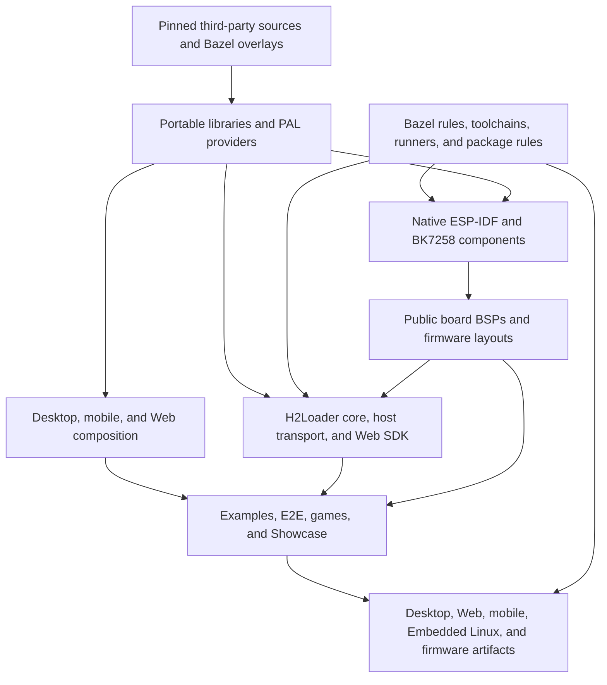

# GizOS

GizOS is a portable firmware and application platform for embedded devices, desktop systems, mobile platforms, and WebAssembly. It provides reusable runtime, platform abstraction, application, board-support, build, packaging, and validation foundations without coupling the public platform to a specific commercial product.

## Status

GizOS is being migrated from the private Firmwares repository without carrying over its Git history. The current public baseline contains the Bazel workspace and CI framework, PAL contracts and core host providers, the portable Runtime and foundational libraries, portable drivers, six public board/target packages, and the first pinned third-party dependencies.

The migration is organized by dependency closure rather than by individual files or drivers. A stage is complete only when all packages in that stage and their public consumers build and test on every applicable CI execution class.

## Migration plan

The arrows in this diagram mean “depends on.” Higher-level applications and artifacts are not migrated until the lower-level closure they consume is present and verified.



### Public boundary

The following source and every target variant that depends on it remain private and are not part of the migration:

- `projects/h106/**`
- `projects/tapdoki/**`
- `boards/h200/**` and `h200_v2` artifact variants
- `boards/tiga_v4_2/**`
- `boards/zero_bk_1_0/**`
- `boards/tapdoki_v2_0/**`
- `boards/lucky_kitty_v1_3/**`
- H106, H200, Tiga, Zero, TapDoki, and Lucky Kitty product assets, guides, tests, launchers, and release metadata

Portable packages shared by public and private products may be migrated, but their public BUILD targets, tests, documentation, and aggregators must not reference private boards, products, assets, repositories, or credentials. BK3633 and JieLi integration are deferred because their maintained consumers are currently private boards; they are not prerequisites for the public execution graph below.

### Progress and dependency closure

| Stage | Scope | Direct prerequisites | Completion gate | State |
| --- | --- | --- | --- | --- |
| 0. Public foundation | Apache-2.0 repository, Bazel workspace, Make entry points, CI framework, remote cache wiring, GitHub App read-only SDK access, PAL contracts, Runtime, foundational libraries, initial providers, drivers, and six board/target packages | None | Linux, macOS, Windows, ESP32-S3, private-dependency check, and required-job aggregation pass | Complete |
| 1. Portable dependency closure | Remaining pinned upstream sources, reusable libraries, and non-composition PAL providers | Stage 0 | Every new upstream is pinned and shallow where applicable; its provider/library tests pass before consumers are enabled | Pending |
| 2. Host platform closure | Complete Desktop composition plus iOS, Android, Web, audio, video, and WebRTC providers | Stage 1 | Full compatible Linux, macOS, and Windows graphs pass; mobile/Web analysis and archive tests pass | Pending |
| 3. Native firmware closure | ESP-IDF 6.x and BK7258 Bazel runners, native components, ccache integration, and firmware ABI checks | Stages 1–2 and private SDK CI access | ESP32-S3, ESP32-P4/C5, and BK7258 compatible graphs build from declared inputs | Pending |
| 4. Public board closure | Complete the existing six board packages and add AMOLED, DevKit, and SZP BSP/layout packages | Stage 3 | Every public board has an analyzable BSP, explicit native-component graph, and at least one maintained build target | Pending |
| 5. H2Loader closure | Portable core, CLI, host transport, Loader app, Web SDK/Batch Loader, package rules, and public-board Loader targets | Stages 1–4 | Native CLI tests, Web archive tests, and Loader/package builds pass for every public maintained board | Pending |
| 6. Public applications and artifacts | Example Apps, reusable E2E Apps, PIXA Games, Showcase, and their public Desktop/Web/mobile/Linux/firmware entries | Stages 2–5 | Each portable App has at least one passing public launcher; all private-board variants are absent | Pending |
| 7. Repository completion | Remaining host tools, policy tests, public guides, API reference, release/catalog tooling, and source-boundary audit | Stages 0–6 | Clean-clone host CI passes; native CI passes with declared SDK access; private-name/path scan, license audit, and full release graph pass | Pending |

There are seven remaining dependency stages. Work inside a stage can be copied together, but the stage is not marked complete until its whole declared closure passes.

The expected delivery is approximately 12 integration checkpoints: two for the portable dependency closure, one for host platforms, two for ESP/BK native firmware, one for public boards, two for H2Loader, three for public applications/artifacts, and one final repository audit. This is a planning estimate, not a substitute for the completion gates above; a checkpoint may be combined when its full graph passes or split when an upstream or SDK class fails independently.

### Stage 1 inventory

Stage 1 establishes the source-level dependencies needed by every later platform and project.

- Add the remaining upstream repositories and overlays: `esp-serial-flasher`, `ffmpeg`, `gizclaw`, `lua`, `lvgl`, `mklittlefs`, `opus`, `pixa`, `pixelroot32`, `portaudio`, `speexdsp`, and `zlib`, including the Firmwares-owned Lua, LVGL, SpeexDSP, and FDK-AAC integration patches that are public-safe.
- Preserve pinned gitlink revisions and `shallow = true` for upstream submodules; vendored amalgamations such as SQLite remain normal tracked source.
- Add the remaining portable libraries: `app_test`, `audio_mixer`, `bundle`, `game_runtime`, `gizclaw`, `h2loader_host`, `haivivi_next_api`, `lua`, `lvgl`, and `pixa`.
- Complete non-composition providers needed downstream, including FFmpeg, Pion, PortAudio, Linux ALSA/FDK-AAC, and Allwinner CedarX integration.
- Keep each upstream overlay independent of repository-owned libraries; PAL or Runtime adaptation stays under `libs/`.

The main dependency chains in this stage are:

```text
zlib -> bundle -> h2loader_host -> H2Loader CLI and package flow
esp-serial-flasher -> h2loader_host -> H2Loader host recovery transport
lua + yyjson -> libs/lua -> Lua examples and E2E
lvgl -> libs/lvgl -> Desktop display, device UI examples, games, and Showcase
opus + audio_mixer + portaudio -> Desktop audio and game/showcase launchers
ffmpeg + mp4_decoder -> Desktop and Embedded Linux video launchers
gizclaw + libsrtp -> GizClaw library/providers -> GizClaw examples and E2E
pixa + pixelroot32 -> libs/pixa and game_runtime -> PIXA Games
mklittlefs + zlib -> H2Loader image and package tooling
```

### Stage 2 inventory

Stage 2 completes reusable host platform composition after the portable dependency closure exists.

- Complete `libs/pal/providers/desktop/` and `desktop/app_support`; these compose SDL3, LVGL, CoreHTTP, CoreMQTT, FFmpeg, PortAudio, SQLite, WolfSSL, H2Peer, H2SCTP, and OS-owned Linux or Darwin providers.
- Add `libs/pal/providers/ios/`, `android/`, and `web/` without moving App ownership into platform providers.
- Add `tools/bazel/desktop_layout` and Web archive rules required by Desktop and Web artifacts.
- Keep Windows on its existing native provider boundary; Windows must not depend on POSIX, Linux, Darwin, or Desktop OS implementations.

### Stages 3 and 4 inventory

The native build layer is migrated before additional firmware launchers.

- Complete public-safe Bazel infrastructure for ESP-IDF 6.x and BK7258: repository locators, runners, native runtime manifests, firmware archive ABI validation, toolchain identity, ccache, release inputs, and runner tests.
- Add shared ESP-IDF 6.x components: PAL core, ADC, ES8311/ES7210 audio, audio decoder, GizClaw, NFC, SIMCom modem, LVGL, Opus, and zlib integration.
- Add shared BK7258 AP/CP components: PAL core, CP transport, audio decoder, GizClaw, NFC, LVGL, Opus, zlib, and common CMake integration.
- Retain and complete the already public board/target packages: `bk7258_v3_202405/bk7258`, `esp32p4_func_ev_board_v1_4/esp32p4`, `esp32p4_func_ev_board_v1_4/esp32c5`, `kickpi_k4b/t113-s3`, `waveshare_esp32p4_wifi6_touch_lcd_4_3/esp32p4`, and `waveshare_esp32s3_a7670e_4g/esp32s3`.
- Add the remaining public development boards: `amoled/esp32s3`, `devkit/esp32s3`, and `szp/esp32s3`.
- Do not copy BK3633/JieLi board entries or runner graph merely to satisfy private TapDoki or Lucky Kitty consumers.

### Stage 5 inventory

H2Loader is migrated as one complete public subsystem rather than as disconnected helpers.

- `projects/h2loader/libs/h2loader`: portable package, image, boot, confirmation, and recovery contracts.
- `libs/h2loader_host`: native host transport and package orchestration.
- `projects/h2loader/apps/cli` and `targets/cc_binary/cli`: portable CLI and native executable.
- `projects/h2loader/apps/loader` plus public ESP-IDF/BK7258 native glue.
- `projects/h2loader/libs/web`, Batch Loader App, and `targets/pkg_tar/batch-loader`.
- `projects/h2loader/tools/bazel`: package, recovery, partition, and public-board artifact rules.
- Loader targets only for AMOLED, BK7258 v3, DevKit, SZP, Waveshare ESP32-P4, and Waveshare ESP32-S3 boards; private product-board variants are omitted.

Public H2Loader BUILD aggregators must be rewritten to remove their current Firmwares-only H106 MFG and private-board edges while preserving the copied portable implementation.

### Stage 6 inventory

Applications are migrated only after their provider, board, and packaging prerequisites are available.

- Migrate public Example Apps for audio, BLE, BLE iKCP, display, logging, Lua, LVGL, modem, MP4, touch, Wi-Fi CSI, crash/confirmation, partial update, Starboy, and tap-reset flows.
- Migrate reusable E2E Apps for GizClaw, H2Loader serial, Libco, Lua Runtime, PAL, and WebRTC performance; omit H106 E2E and all private-board launchers.
- Migrate PIXA reusable libraries, portable game Apps, and Desktop targets. Current Tiga firmware targets remain private and are not copied.
- Migrate Showcase portable App and Desktop target without H106 resources or product wiring.
- Migrate public iOS, Android, Web, Desktop, Embedded Linux, ESP, and BK7258 artifact entries only when their complete source graph is public-safe.

### Stage 7 inventory

- Complete the public Make/scripts surface for build, test, coverage, guides, Web archives, submodule setup, and release operations; exclude product-specific E2E scripts.
- Add public host tools such as LVGL converters, `mklittlefs`, firmware memory analysis, OpenAPI generation, WebRTC test server, and their tests when their dependencies are present.
- Publish architecture, development, usage, board, App, and review guides after removing private product documentation and links.
- Add automated checks that reject private paths/names from source and build graphs outside the documented boundary list, undeclared native inputs, non-shallow public submodules, license gaps, and artifact targets without a public source closure.
- Validate the final repository from a clean clone. Host graphs require no private source repositories; native firmware jobs use the read-only SDK development environment configured for CI until a separately distributable public SDK/toolchain bootstrap is available.

### Validation policy

Every stage uses the same acceptance sequence:

1. Copy implementation from Firmwares at a recorded source revision; do not reimplement it during migration.
2. Remove only private product edges, assets, target variants, and documentation references; record every adaptation in the commit message.
3. Verify gitlink revisions, licenses, Bazel overlays, lockfile changes, and direct dependency labels.
4. Run focused tests for the migrated packages.
5. Run the full compatible Bazel build and test graph for macOS and Linux locally.
6. Run every newly affected native firmware class locally with the shared Firmwares development environment.
7. Push only after local validation, then require all applicable Linux, macOS, Windows, ESP/BK, private-SDK access, policy, and required aggregation jobs to pass.

## Repository layout

```text
.
├── boards/                 # Public physical-board support packages
├── guides/                 # Architecture, development, usage, and review guides
├── libs/                   # Target-independent reusable libraries and PAL providers
├── native_component_src/   # Components compiled by native platform SDKs
├── projects/               # Portable applications and their public artifacts
├── scripts/                # Stable repository command implementations
├── third_party/            # Pinned upstream sources and integration metadata
└── tools/                  # Host-side build, packaging, and support tools
```

Public source packages must not depend on private product repositories, credentials, services, assets, or board definitions. Product-specific applications and hardware integrations remain in their owning repositories and may depend on released GizOS interfaces; GizOS does not depend on them. Native SDK/toolchain access is a separate build-environment dependency and does not permit private product source to enter this repository.

## Build system

GizOS uses Bazel as the source of truth for supported build graphs, tests, tools, and artifacts. Bazel 9.2.0 is selected by `.bazelversion`; the top-level Make targets provide the stable repository command surface.

```sh
make help
make bazel-build BAZEL_CONFIG=linux_x86_64
make bazel-test BAZEL_CONFIG=linux_x86_64
```

The Linux, macOS, and Windows CI jobs analyze and build the complete compatible graph, and run every compatible automatic test. Fork pull requests run without private credentials. Same-repository CI additionally verifies read-only access to the private SDK development environment used by future firmware build classes.

The host-compatible public Bazel graph must pass from a clean clone without private source repositories, credentials, services, product assets, or private board definitions. Native firmware CI obtains SDK and toolchain inputs through the read-only development-environment integration described in the migration plan.

## License

GizOS is licensed under the [Apache License 2.0](LICENSE).
