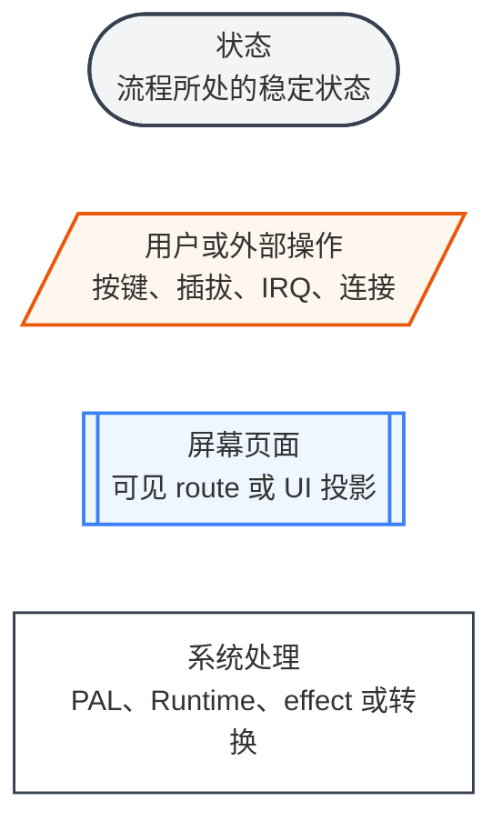
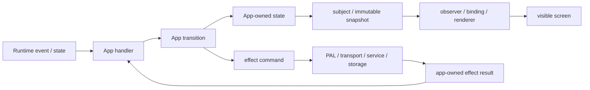

# 产品文档规范

产品逻辑、页面关系、视觉验收和 Product IA 优先在 Figma 中表达。产品 Guide 负责记录实现需要长期维护的工程合同，并链接到对应 Figma file、page 或 frame；不要求在 Markdown 中重复绘制 Figma 已经清楚表达的流程、原型或 IA。

页面型文档按职责组合以下内容：

- **Figma 产品设计**：作为产品逻辑、页面流转、关键状态、视觉验收和 Product IA 的首选载体。
- **工程合同**：说明 ownership、Runtime 输入、App state、effect、平台边界、资源、持久化、失败行为和生命周期。
- **工程验收**：记录无法仅从 Figma 原型判断的 Desktop、目标硬件、线程、资源清理、恢复和集成条件。

流程图、数据投影图、文档内验收原型和静态 Product IA 都是可选的辅助材料。已有 Figma 已覆盖对应信息时可以省略；没有 Figma、需要离线交付或图示能显著降低实现歧义时再补充。

推荐使用以下完整章节顺序：

| 顺序 | 章节 | 推荐说明的内容 |
| --- | --- | --- |
| 1 | 页面或流程合同 | 文档范围、入口、终点、ownership、明确不负责的内容以及关联 Issue |
| 2 | Figma 产品设计 | 对应 file、page 或 frame 的稳定链接，以及本 Guide 覆盖的产品逻辑和视觉范围 |
| 3 | Runtime 输入与数据来源 | 使用的 component id、Runtime event/state、provider、catalog、transport 或持久化数据，以及每种输入的行为 |
| 4 | 数据投影 | App state 到 subject、snapshot 或其它 UI state，再到页面的单向投影，以及 effect result 返回路径；关系复杂时可以补图 |
| 5 | State、Projection、Effect 与生命周期 | 稳定字段、页面草稿、pending、generation、error、异步 effect、初始化、取消、恢复和清理合同 |
| 6 | 视觉验收 | 默认链接 Figma 中的对应页面和关键状态；需要离线预览时可以补充本地 SVG 或截图 |
| 7 | 集成与平台边界 | Portable App、Runtime、H2Loader、PAL、board backend 和 launcher 的职责；不适用时可以省略 |
| 8 | 资源与持久化 | PIXA、Opus、字体、Bundle 路径、preference 或恢复状态；没有额外资源和持久化时明确说明 |
| 9 | 工程验收 | Figma 无法表达的 Desktop、目标硬件、失败路径、线程边界、生命周期和资源清理条件；没有额外条件时可以省略 |

文档只记录已经确认的最终合同。仍需产品或硬件决定的问题放在对应 Issue，不以“待确认”列表留在最终开发文档中。Board 配置、资源清单、wire protocol 和纯后台集成等非页面型配套文档可以使用与其职责匹配的表格、packet diagram 或清单，不强行添加空的页面流程和 SVG。

除统一章节外，以下内容在对应场景中必须单独成节，不能压缩成验收列表中的一句话：

| 场景 | 必须补充的合同 |
| --- | --- |
| 开关机、休眠或硬件唤醒 | power hold、wake reason、wake source、PAL 最终动作、失败后的安全状态和恢复路径 |
| PIXA、Opus 或其它时序资源 | 制作源、Bundle 路径、播放完成条件、并行关系、错误行为和资源释放 |
| H2Loader 或 MFG | image/launcher 边界、持久化状态、普通启动与产测分流、测试阶段、硬件指示和 H2Loader 生命周期 |
| BLE、WiFi、modem、服务或存储 effect | pending、timeout、cancel、retry、reconnect、backpressure、迟到 generation、partial failure 和重入行为 |
| preference 或断电恢复 | key ownership、合法值、写入时机、损坏或缺失时的默认行为 |
| catalog、主题卡或 workspace | 稳定 id、数据来源、排序、enabled 过滤、workspace 解析和禁止从显示文字反推 id 的约束 |

章节是否可以省略按内容是否适用判断。Figma 已经表达的产品逻辑、页面状态、视觉验收和 IA 不在 Markdown 中重复维护；Guide 只补充 Figma 无法准确承载的工程合同。Figma 中尚未覆盖、但实现必须确定的进入、取消、确认、失败与销毁路径，仍需在正文、表格或可选图示中明确。

## 流程图图示规范

流程图是可选材料。产品逻辑优先维护在 Figma；只有需要在 Guide 中补充实现路径或离线图示时才使用 Mermaid。产品子文档中的运行行为图统一使用以下形状和颜色。节点按它在流程中的职责分类，不能因为名称相似而混用；例如 `system/power_off` 是屏幕页面，真正物理断电才是状态。文档目录、文档依赖等关系图不使用这套运行时图例。



- 灰色圆角节点表示状态。
- 橙色斜边节点表示用户操作或来自设备外部的事件。
- 蓝色双边框节点表示屏幕页面或可见 UI 投影。
- 白色矩形节点表示系统处理，不代表页面或稳定状态。

使用流程图时必须覆盖它声明的正常路径、取消或返回路径，以及会改变最终状态的失败路径。按键、插拔、IRQ、连接和 Runtime event 不能直接写在页面节点中伪装成状态；页面 route 也不能用普通系统处理矩形表示。

## 数据投影图规范

数据投影图是可选材料。数据与 ownership 关系简单时直接在工程合同中说明；关系复杂且补图能减少歧义时，图必须从真实数据来源开始，到 UI projection 结束，并明确异步 effect 的结果如何回到 App 单一状态入口。使用 LVGL 的页面遵守 subject、observer 和 binding contract；不使用 LVGL 的诊断屏幕可以使用 app-owned immutable snapshot，但后台 task 仍不能直接绘制屏幕。



- Runtime event 和后台结果必须先回到 App 的单一状态入口，再进入 transition。
- Subject 或 snapshot 只保存、冻结或投影 UI 需要的状态，不作为 event bus，也不表示一次性命令。
- Widget callback 只产生 action；observer、binding 和 renderer 只更新页面，不调用 PAL、存储或网络。
- 后台 task 不操作 LVGL object、subject、framebuffer 或 Display PAL。迟到结果通过 generation、session id 或等价 token 丢弃。
- Guide 必须说明实现所需的长期 UI state、页面局部 state、创建和释放顺序；没有页面局部 state 时明确说明。是否使用数据投影图不改变这项工程合同。

数据投影图是数据与所有权关系图，不套用运行流程图的状态、操作、屏幕颜色图例。

## 验收页面原型规范

视觉验收默认直接引用 Figma 中的 page、section 或 frame，不要求在仓库中再维护一套 SVG。链接需要定位到可审查的具体范围，并让页面、关键状态、文案、焦点、indicator、按钮提示、错误、pending 或诊断字段可以被逐项确认。

需要离线预览、文档站发布或固定快照时，可以使用表格将稳定 route 或 screen state 与本地原型对应：

| 页面 | 可选本地原型 |
| --- | --- |
| `feature/page` | `` |

- Figma 应覆盖实现范围内的页面和关键视觉状态；同一 route 的重要状态可以使用独立 frame 或 variant。
- Figma frame 或可选本地原型使用目标产品的真实可视区域和方向。一个页面适配多种尺寸时，应覆盖适用布局断点并说明各 board 使用的断点；不能用任意画布冒充设备屏幕。
- 字段可能溢出时，在 Figma 或正文中定义缩写、换行、滚动、裁剪或优先级，不能留给实现自行决定。
- 文档 SVG 只用于布局和验收。设备运行时资源仍按资源清单使用 PIXA、Opus、字体、LVGL primitive 或 portable renderer，不能因为文档有 SVG 就把 SVG 打进固件。
- fake 验收终止页必须标明 `fake`，不能被实现者误认为正式业务页面。

## Product IA

Product IA 优先在 Figma 中维护，用于表达产品入口、一级模块、主路径、关键分支、异常状态和跨模块跳转。Guide 提供指向具体 Figma page、section 或 frame 的链接；不要求同时交付仓库内静态 HTML/SVG IA。Figma IA 不维护第二份工程合同，ownership、Runtime 行为、失败处理和生命周期仍由对应 Guide 持有。

仓库内静态 Product IA 是可选的发布形式。已有静态 IA 可以继续维护，不要求为了采用 Figma 立即迁移或删除；新产品只有在需要离线浏览、文档站发布或固定快照时才增加静态 IA。以下合同只适用于选择交付静态 IA 的产品。

### 目录与发布

选择交付的静态 Product IA 在 `guides/apps/index.md` 注册，并使用以下目录：

```text
guides/public/ia/
├── _shared/
│   ├── ia.css
│   └── ia.js
└── <product-app>/
    ├── index.html
    ├── pages/
    │   └── **/*.{svg,png}
    ├── components/
    │   └── **/*.svg
    └── assets/
        └── **/*
```

- `<product-app>` 是稳定的小写 slug。不同 entry、state、资源和 launcher wiring 的 App 必须使用不同 slug，不能因为属于同一 project group 就合并 IA。
- `guides/public/` 中的文件由 VitePress 原样发布；IA 必须使用相对路径引用共享样式、脚本和产品 SVG，不能依赖远程 CDN、字体或网络请求。
- 产品 Guide 自有的页面原型和静态说明图统一放在对应 `guides/public/ia/<product-app>/`：完整页面或关键状态放在 `pages/`，多张原型共同使用的产品内视觉组件放在 `components/`，背景、图标和其它辅助素材放在 `assets/`。
- Guide 使用 `/ia/<product-app>/**` 站点绝对路径，IA HTML 使用相对路径，二者必须引用同一个 canonical file；不能在 `guides/apps/**/images/` 或其它目录保留兼容副本。
- `_shared/` 只保存跨产品 IA 浏览外壳、样式和交互，不能保存产品页面、产品图标或产品私有视觉。
- Markdown 内的 Mermaid 继续由对应 Guide 持有，不为了目录统一而栅格化或复制到 IA。
- Firmware 制作源和运行时资源继续位于 `projects/**/assets/` 等生产 ownership。Guide 可以直接预览生产资源，但不能为了 IA 复制第二份 source of truth。
- 交付静态 IA 时，产品总览 Guide 和 VitePress 产品侧栏提供 IA 入口。由于 IA 是 `public/` 中的独立 HTML，VitePress 内的入口必须渲染 `target="_blank" rel="noopener"`，在新窗口中整页打开，不能让 SPA router 把 `/ia/<product-app>/` 当成 Markdown route；IA 的每个可导航节点必须返回一个有效的 `/apps/**` Guide。
- IA 资源只服务文档，不进入 firmware resource bundle。

### HTML 合同

- 默认视图必须能看见完整一级架构；复杂产品可以按域筛选，但不能用筛选隐藏未完成的产品范围。
- 每张节点卡片使用稳定且唯一的 `data-ia-id`、`data-guide` 和分类 metadata，显示节点类型、名称、route 或状态摘要，并提供独立页面原型与对应 Guide 的键盘可达链接。
- 页面在桌面宽屏、平板和手机宽度下都可浏览，不能依赖固定画布裁切整个 IA。
- JavaScript 只增强筛选、缩放或键盘交互；关闭 JavaScript 后，完整节点与 Guide 链接仍然存在。

### SVG 合同

- Product IA SVG 是结构化页面示意或架构图，不能用产品截图或灰度截图代替。
- 页面型节点使用目标设备真实可视区域、方向和适用布局断点；系统型节点使用统一的节点、连线、状态和图例语义。
- 新 SVG 必须包含 `viewBox`、`<title>` 和 `<desc>`，文本在 100% 缩放下可读，状态不能只靠颜色区分。
- 同一产品统一字体栈、网格、边距、线宽、箭头、标题区和状态标记。所有文档自有视觉都从对应 IA 目录引用；内容完全相同的文件只能保留一个 canonical path。

### 维护与验证

修改静态 Product IA 时运行：

```sh
make guides-build
```

`check:ia` 检查注册入口、HTML/Guide 双向链接、唯一节点 ID、Guide anchor、本地引用、跨产品边界、SVG metadata、远程依赖、重复内容和孤立文件；`build` 继续确认发布产物包含注册 IA 及全部依赖。选择新增静态 Product IA 时必须先建立独立 Guide 与产品边界，再注册 IA，不能提交空白占位页面。只使用 Figma IA 时不需要创建 `guides/public/ia/<product-app>/` 或注册静态入口。
