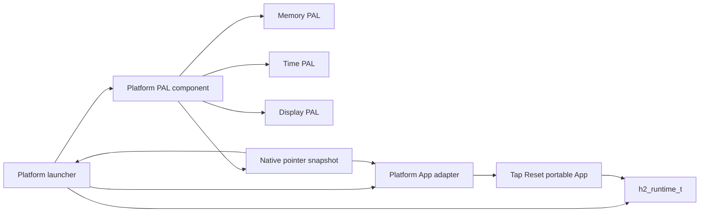

# Examples

Examples 是 target-independent portable App 集合。每个 Example 通过可直接运行和观察的场景展示 Runtime、PAL、target-independent library 与 launcher 的组合方式；一个场景可以有意组合多个能力，不要求拆成彼此正交的测试项。Example 不属于某个平台或产品，可以由 Desktop、Mobile、Web、H2Loader 或其它设备 launcher 消费。是否属于本 group 由 App 的 public Runtime/PAL contract 与 lifecycle ownership 决定，不要求当前已经存在多个 consumer，也不要求每个平台都提供入口。

当前 App：

| App | 可观察合同 |
| --- | --- |
| `audio-system` | Opus playback 与 microphone loopback |
| `ble-broadcaster` | Legacy 与 Extended Advertising lifecycle |
| `ble-observer` | Extended Scanning payload、PHY 与 SID |
| `ble-smoke` | Mixed-width GATT、Advertising、Scan、subscription、indication、reconnect 与 Runtime queue round trip |
| `bleikcp-speed` | Server/Client BLE iKCP throughput baseline |
| `crash-before-confirm` | 由 launcher 注入的 deterministic crash |
| `display` | Raw Display PAL RGB565 color bars |
| `gizclaw-ping-speed` | GizClaw connect、ping 与 speed RPC flow |
| `log` | 单次 Runtime Log `Hello World` 输出 |
| `lua-flappybird` | 一个 compiled Lua Skill 的绘制、触摸、碰撞、计分、重开与 Back 取消 |
| `lvgl-smoke` | Full-frame LVGL rendering 与持续刷新 |
| `modem-smoke` | Modem、SIM、registration、PPP 与 ICMP stages |
| `mp4-player` | MP4 decode、audio output 与 display presentation |
| `partial-update` | package data generation 的 filesystem observation |
| `safe-call` | ESP PSRAM caller 与 Internal safe-call worker validation |
| `starboy` | 程序化双眼、球面注视、主题、眨眼、音频和运动响应 |
| `tap-reset` | 同一个 LVGL counter 的 increment 与 Reset |
| `touch` | Touch PAL 到 LVGL pointer，以及 LVGL widget 到 mapped Runtime Button 的完整链路 |
| `wifi-csi` | CSI metadata、error state 与 bounded I/Q curve |

`ble-smoke` 的 server indication 使用同步 PAL contract：调用提供 timeout，返回值直接表达 peer confirmation、失败、断连或超时；Example 不维护 indication ID，也不等待 completion System Event。

`tap-reset` 不是 H106 手机版，也不定义生产手机或 Web 产品的页面、身份、后台运行或发布合同。其多平台 contract 与 acceptance 记录在本文后续章节；其它 App 的细节由各自 README 以及保留在 H2Loader product guide 中的 image/board 验收文档共同记录。

## Ownership

```text
projects/example/apps/<app>/
├── app/
│   ├── include/                              # stable public App contract
│   ├── src/                                  # portable implementation
│   └── tests/                                # App-local native tests, when present
├── data/                                     # deterministic App data, when present
└── README.md                                 # observable App contract

libs/pal/providers/ios/pal_core/                            # Reusable iOS PAL backend
libs/pal/providers/android/pal_core/                        # Reusable Android PAL backend
libs/pal/providers/web/pal_core/                            # Reusable Web PAL backend
projects/example/libs/mobile/tap-reset/        # Mobile App-specific contract conversion
projects/example/targets/ios_application/tap-reset/       # UIKit launcher
projects/example/targets/android_binary/tap-reset/   # Android launcher
projects/example/libs/mobile/mp4-player/       # Mobile MP4 presentation
projects/example/targets/android_binary/mp4-player/   # Android large MP4 launcher
projects/example/libs/web/tap-reset/          # Web adapter
projects/example/targets/pkg_tar/tap-reset/            # WebAssembly archive entry
projects/example/libs/host_runtime/            # Shared incomplete host Runtime assembly
libs/lvgl/config/single_thread/                # Reusable single-thread LVGL config
projects/example/libs/desktop/tap-reset/      # Desktop adapter + Runtime assembly
projects/example/targets/macos_application/tap-reset/    # macOS/rules_apple entry
```

Portable App 的阻塞入口是 `h2_tap_reset_run(h2_runtime_t *, const h2_tap_reset_config_t *)`。内存、Display 和 Time capability 全部通过 Runtime 使用；App 不 include UIKit、Android JNI、Emscripten 或 launcher private type。

公共 Runtime 暴露 Touch PAL，`touch` Example 通过 `libs/lvgl` adapter 把 raw down/move/up 接入 LVGL pointer indev；App 定义稳定的 Button component，launcher 把它映射到 `PUSH_EDGE` periph，widget 的 down/up 再进入 Runtime 的客观 phased action pipeline。Portable App 不知道 evdev device、controller、board calibration 或实际按键来源，gesture 由 App 判断。现有 `tap-reset` Mobile/Web adapter 仍使用其 stable pointer snapshot config，不把平台 SDK 类型带入 portable App。`should_stop` 是调用方拥有的阻塞入口 lifecycle config。

Desktop 入口直接调用同一个 `h2_tap_reset_run()`，不依赖 mobile adapter，也不复制 App source 或重写页面。共享 Desktop adapter 和 Runtime assembly 放在 `projects/example/libs/desktop/tap-reset/`；macOS 的 native entry、`Info.plist` 和 `rules_apple` bundle rule 放在同级 `macos/`。

Example 不能 include target SDK、board API、launcher private type 或 H2Loader package/image policy，也不能自行确认 H2Loader image。Board 与 platform launcher 决定自己能够组装哪些 Example；没有入口表示该平台不提供对应 Example，不由 portable App 按平台身份分支或把 required behavior 转换成运行时 `SKIP`。H2Loader-managed artifact 位于 `projects/example/targets/h2loader_tar_zlib/<app>/<board>/`，负责 Runtime assembly、App client、confirmation、package identity、board wiring 和 release output，但不改变 Example ownership。`crash-before-confirm` 只执行 launcher 注入的 crash callback，`partial-update` 只观察 Runtime filesystem 中的 package data；H2Loader rollback 和 partial-update 判定属于外部验收流程。

拥有稳定 case registry、机器结果与跨 launcher 验收合同的 runnable test App 属于 [E2E 测试 App](/apps/e2e)，不作为 Example 维护。

`lua-flappybird` 只启动一个隔离 Lua job，没有 Skill 选择器或 native 游戏 UI。
portable App 是 Runtime Event queue 的唯一消费者，保留 Back 并把其他允许事件定向
投递给该 job。Desktop、Browser 和 AMOLED 使用同一 App source 与同一份 ported
Lua bytes；来源 commit、原始脚本/SKILL hash、MIT license 和 API adaptation 记录在
`projects/example/apps/lua-flappybird/data/skills/SOURCE.md`。仓库只保存 migrated Skill，
不重复提交 upstream 原始脚本或 patch fixture。Display、Touch 与 Audio module 直接消费
Runtime 单例 PAL API；只有 Button 等物理外设使用 Runtime component ID。迁移不缩写
gameplay、rendering、collision、scoring、audio、input 或 state machine。

`log` 的阻塞入口是 `h2_log_example_run(h2_runtime_t *)`。它只要求 Runtime Log，写入一次 INFO record，scope 为 `log`，message 为 `Hello World`，然后返回 provider result。Portable App 不初始化 UART、不 drain target buffer、不循环、不 sleep、不分配内存，也不创建 task。当前只有 `tapdoki_v2_0/log` BK3633 full-image launcher；该入口先直接输出 `H2_BK3633_LOG_UART_READY` 证明 `main()` 已到达 UART 初始化点，再循环调用 portable App、drain target buffer，通过现有 TapDoki UART PAL Log provider 在 115200 baud 持续输出 `[I][log] Hello World`。只有重复出现的第二行验证 Runtime Log 链路；两者都不能替代 Libco Smoke 验收。

同一份 portable source 由 `tap_reset_mobile`、`tap_reset_web` 与 `tap_reset_desktop` target 分别编译，绑定 `//libs/lvgl:lvgl_mobile`、`//libs/lvgl:lvgl_web` 或 `//libs/lvgl:lvgl_desktop`。一个 artifact 只能链接一个兼容 LVGL implementation。可编译 variant 属于 first-party library 的 platform family，不属于 Tap Reset，也不属于 third-party overlay；Web variant 使用 single-thread config，并由真实 Bazel Emscripten toolchain 编译。

## Runtime Flow



## Acceptance

Mobile build and run commands are recorded in [Mobile](/apps/mobile); Web commands are recorded in [Web](/apps/web). Acceptance requires:

- iOS: `rules_apple` produces the unsigned Simulator App; `simctl install` and `simctl launch` succeed.
- Android: `rules_android` and `rules_android_ndk` produce a debug-signed APK; `adb install` and Activity launch succeed on an emulator.
- WebAssembly: Bazel `pkg_tar` produces a serve-ready archive whose root contains `index.html`、`index.js` and `index.wasm`; after extraction, the page reaches `Running portable LVGL App in WebAssembly` through an HTTP server.
- macOS: `rules_apple` 的 `macos_application` 直接产生 `.app` bundle；解包后启动成功，并显示同一个 portable LVGL card。
- Every surface renders the portable LVGL card rather than a native UI reimplementation.
- Every surface increments the LVGL counter and resets it to zero.
- Android MP4 Player packages only the 1024×600 A/V sample, decodes its High Profile H.264 and raw AAC-LC streams through MediaCodec, plays S16LE PCM through AAudio, and loops until the Activity stops. The 240×240 startup asset remains firmware-only and has no Android launcher.
- Android runtime acceptance must observe `H2_MP4_PLAYER_AUDIO_READY` and `H2_MP4_PLAYER_READY`; artifact inspection alone does not prove either decode or playback path.

Portable App 的 Mobile/Web/Desktop variants、Mobile App-specific contract conversion、Web adapter 和 Desktop adapter 分别由 Bazel targets `//projects/example/apps/tap-reset/app:tap_reset_mobile`、`//projects/example/apps/tap-reset/app:tap_reset_web`、`//projects/example/apps/tap-reset/app:tap_reset_desktop`、`//projects/example/libs/mobile/tap-reset:app`、`//projects/example/libs/web/tap-reset:tap_reset_web` 与 `//projects/example/libs/desktop/tap-reset:app` 验证。iOS、Android、Web 和 macOS 平台产物都由真实 Bazel platform 或 packaging rules 构建；Web archive contract 见 [Web](/apps/web)。

MP4 Player Mobile adapter 与 Android artifact 分别由 `//projects/example/libs/mobile/mp4-player:app` 和 `//projects/example/targets/android_binary/mp4-player:mp4_player_app` 验证。APK acceptance 必须检查 arm64 native library、package identity、签名、唯一的大视频 asset inventory 和逐字节一致的 packaged media；运行时播放仍需 Emulator 或 physical-device acceptance，不能由 package inspection 代替。
