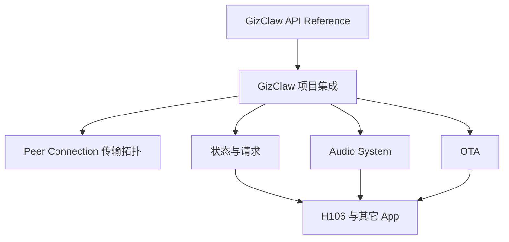

# GizClaw 产品文档

GizClaw 是多个产品 App 共用的连接与服务集成，不属于 H106 私有模块。本组文档定义 App 如何组织 GizClaw 请求状态、如何连接 Runtime Audio System，以及如何把远端 firmware 资源交给 H2Loader 完成 OTA。

## 文档关系

箭头表示下游文档依赖上游合同。API 的函数、参数、返回值和 ownership 以从生产 Public Header 生成的 [GizClaw API Reference](/references/gizclaw) 为准；本组文档只定义跨模块组合方式，不复制函数声明。

## 文档目录

| 文档 | 负责内容 |
| --- | --- |
| [Peer Connection 传输拓扑](/apps/gizclaw/transport) | 上下行 media、packet DataChannel、双向 Agent Event Stream 和动态 RPC/HTTP service stream |
| [状态与请求](/apps/gizclaw/state) | 连接、workspace、request generation、conversation、firmware 和错误状态 |
| [Audio System](/apps/gizclaw/audio) | 录音、提交、流式回复、播放、打断与资源清理 |
| [OTA](/apps/gizclaw/ota) | firmware RPC、下载校验、H2Loader staging、安装与重启 |

## Ownership

- `libs/gizclaw` 封装 GizClaw C SDK 和协议，并拥有可复用的单 client request service：一个 worker、bounded admission、operation cancellation、completion queue 和 caller-thread callback dispatch。它消费注入的 PAL HTTP、WebRTC、crypto、time、log、memory、task、queue 和 sync API。
- App 或 project-owned integration 持有状态、reducer、effect command、重试策略和 UI projection。
- Runtime 提供统一 event loop 与 Audio、filesystem、network 等 API object。
- H2Loader 拥有 package validation、staging、安装、trial boot、确认和 rollback。
- Board 与 launcher 只提供 backend、配置和 component mapping，不定义 GizClaw 产品状态。
- `projects/e2e/apps/gizclaw/app` 拥有可复用的 headless 正确性测试流程；Desktop 或 firmware launcher 只注入 Runtime/PAL、RegistrationToken、endpoint、suite 和测试音频，不复制测试 case。

## 共用规则

- App action 只产生 effect command，不能在 widget callback 或 reducer 中同步执行网络、Audio 或 OTA。
- GizClaw API completion 由 App 单一 main loop 调用 service dispatch 后执行 callback，再更新 app-owned state。它不是 Runtime event；GizClaw worker、Audio worker 和下载 worker 都不能直接更新产品状态或 UI。
- Connection-scoped Peer Event 由拥有 client 的同一个 service worker dispatch；worker callback 只能写入 caller-owned bounded queue 或等价 mailbox，App main loop 消费后才能更新产品状态或 UI。
- LVGL subject 只是 UI projection，不作为 GizClaw request queue、callback channel 或跨线程状态。
- 每类异步操作使用 generation 或等价 request id；取消或离开页面后丢弃迟到结果。
- H106、Desktop 和其它 consumer 复用相同状态语义，页面和按键映射可以不同。
- Peer-addressable resource 使用认证 caller 或 RuntimeProfile scope 下的 immutable
  `name` / `*_name`；Contact/FriendGroup 的 `display_name` 是独立可修改文字。固件不
  拼接 Peer key/token/profile，不暴露或缓存 canonical Admin ID。
- Friend、FriendGroupMember、Workspace/FriendGroup history、Points transaction、
  GameResult、reward grant、source、request 和 idempotency key 是 relationship、
  occurrence 或 ledger record，继续保留 ID。调用方必须按具体类型区分 name 与 ID，
  不能因为字段相似而机械重命名。
- Peer resource create/join 的结果不确定时，先 get 同一个 name，仅在 not-found 时重试
  mutation；不得生成新 name、扫描同 display name 项或删除冲突资源。
