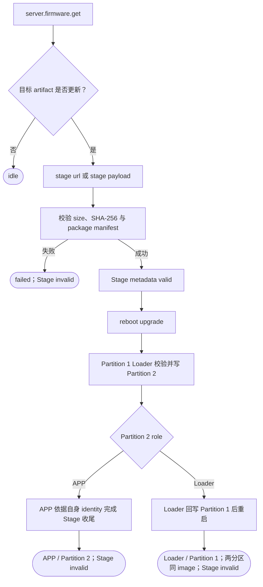

# GizClaw OTA

GizClaw OTA 分为远端 firmware 资源访问和本地 H2Loader 升级两段。GizClaw 负责查询经过授权的 firmware artifact，并把 URL 或 payload 交给 H2Loader Stage；H2Loader 负责校验 package、发布 Stage、按双分区合同升级，并依据运行固件的 identity 完成收尾。App 不直接写 App partition，也不把服务端“有新版本”或 Stage 接收完成当作升级成功。

## 远端 RPC

GizClaw firmware service 定义以下稳定 RPC：

| RPC | 用途 |
| --- | --- |
| `server.firmware.get` | 按 channel 读取当前认证 Peer 对应的 package metadata |

`server.firmware.get` 的 request 只携带 `stable`、`beta`、`develop` 或 `pending`
channel；firmware identity 来自认证 Peer 的服务端绑定，调用方不能传入或拼接另一个
firmware name。Response 直接返回 channel、可选 description、HTTPS URL、SHA-256 和
size。产品 App 必须由明确发布策略选择 channel，不能猜测或遍历 slot。

这是随 GizClaw release tag `v0.1.0` 对应的 Peer schema
`064687878378984ff3553613b4479880d2c58ebc` 一次完成的
clean cutover：GizOS 不保留旧 `firmware_name` 或 artifact path 的兼容 alias，也不根据
字符串内容猜测旧字段。这与 Points/Friend/history wrapper 保留语义化 public ID
并逐字节映射 wire name 的兼容合同无关。旧 Firmware 调用方必须在同一次编译升级中改为显式
channel；未知或 unspecified channel 在发 RPC 前返回 invalid argument，服务端没有为当前
Peer/channel 绑定 package 时返回 not found，缺失 URL、SHA-256 或非法 size 按 format error
失败。服务端内部 resource ID/name 与 artifact storage path 不进入 Peer public API。

下载不是另一个 Peer RPC。调用方必须把返回的 HTTPS URL 交给 PAL HTTP，流式接收 package，
并同时核对 2xx、声明长度、实际接收长度和 SHA-256。URL 可能包含短期授权信息，不写日志、
不长期保存，也不通过 UI 或 telemetry 暴露。

## OTA 流程

`stage url` 由设备通过 PAL HTTP 流式下载；`stage payload` 由 Host 流式发送。两者共用 H2Loader 的 Stage 实现，写入调用方 build/runtime 配置指定的 `/dl` staging，不直接展开 `/data`。只有 package、board、target、role、版本、manifest、长度和 digest 全部验证成功后，Stage metadata 的 `valid` 才能作为 Pref transaction 的最后一步提交。详细 package 与 boot contract 见 [H2Loader API Reference](/references/h2loader) 和 [H2Loader 产品文档](/apps/h2loader/)。

## State 与进度

GizClaw 可以在自己的 OTA subject 中保存 channel、SHA-256、size、generation、检查/下载
phase、completed bytes 和 last error；这些字段不属于 H2Loader 的持久化启动状态。下载 URL
也不长期保存，不持久化 server/admin resource ID、firmware name 或 artifact path。
H2Loader 只持久化 `boot_intent=LOADER|AUTO`、`stage`、`partition_1`、`partition_2` 和
`last_result`；传输和写分区进度是瞬时事件，不保存 install/trial/confirmed/rollback 流程阶段。

| Phase | Owner |
| --- | --- |
| `checking`、`available` | GizClaw firmware RPC integration |
| `downloading`、`staged` | GizClaw OTA subject（可选的产品层状态） |
| Stage、写 Partition 2、Loader 回写 Partition 1 进度 | H2Loader 瞬时事件 |
| `boot_intent`、`stage`、`partition_1`、`partition_2`、`last_result` | H2Loader Pref |

## 指令边界

远端 RPC 只提供 firmware metadata 和授权下载 URL，不直接执行本机安装。App 请求 OTA 时产生 effect command；本机管理端使用 `stage url` 或 `stage payload`，成功后使用 `reboot upgrade`。恢复与角色切换分别使用 `reboot loader` 和 `reboot app`；普通重启不会消费 Stage。H2Loader 的 `status`、`stage` 和 `reboot` command 不作为 GizClaw RPC 名称，也不由页面 callback 直接执行。

重复检查和重复下载必须幂等。取消下载后保留已经确认的当前固件；partial staging 不能被标记为 staged。断电恢复时，H2Loader 只接受完整、校验通过且状态记录一致的 package。

## 安全与失败处理

- Firmware RPC 仍受 GizClaw peer identity 与资源 ACL 控制。
- Artifact metadata、下载内容和 package manifest 必须一致，任一不一致都终止安装。
- Stage 写入失败时 metadata 保持 invalid；写 Partition 2 或 Loader 回写 Partition 1 时，只有完整写入并校验成功才提交对应 metadata 的 valid。
- Partition 1 Loader 始终保留为恢复入口；Partition 2 Loader 回写前先确保异常重启仍选择 Partition 2，再使 Partition 1 metadata invalid，完成后才切回 Partition 1。
- 下载 timeout、断线和 filesystem full 返回可诊断错误；是否 retry 由 App policy 决定。
- 重启前关闭 conversation、Audio 和其它 worker，确保 filesystem flush 完成。

## 验收

- 能按明确 channel 查询 metadata，并通过返回的 HTTPS URL 流式下载 package。
- 下载完成前不会进入 staged，digest 不匹配不会请求 H2Loader 安装。
- App 下载进度与 H2Loader 安装进度具有独立 owner。
- 安装失败不会把不完整 image 标记为 valid；可以通过 `reboot loader` 返回 Partition 1 Loader 诊断或重新 Stage。
- Desktop 可以用 fake filesystem/H2Loader adapter 验证 Pref transaction、写入失败和断电恢复；设备端验证断线、空间不足、重启恢复和 APP/Loader 两类 Stage 收尾。

Desktop E2E 只通过 `h2_gizclaw_client_rpc_call()` 与 pinned generated schema 验证
`develop` channel 的 get，再通过 PAL HTTP 验证 HTTPS 流式下载、精确 metadata、
长度和 SHA-256；payload 保持在测试 sink 中，不写 staging、不触发 H2Loader，也不安装固件。
该测试不为 Firmware response 字段增加第二套 GizOS public wrapper。not-found、错误
channel、非 HTTPS URL、截断和 digest mismatch 等 negative case 由本地确定性测试完成，
避免向共享 E2E 环境注入破坏性请求。
