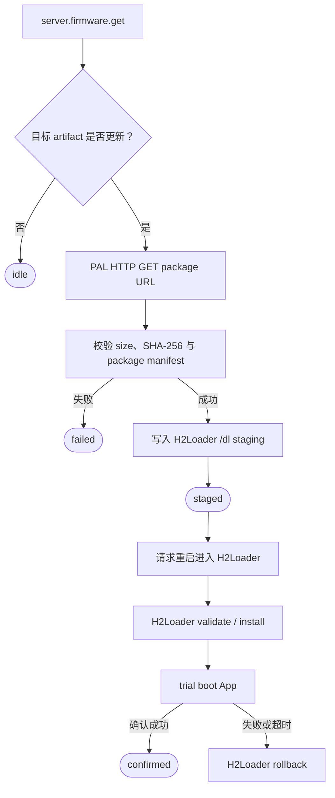

# GizClaw OTA

GizClaw OTA 分为远端 firmware 资源访问和本地 H2Loader 安装两段。GizClaw 负责查询与下载经过授权的 firmware artifact；H2Loader 负责校验 package、写入 staging、安装、trial boot、确认和 rollback。App 不直接写 App partition，也不把服务端“有新版本”当作安装成功。

## 远端 RPC

GizClaw firmware service 定义以下稳定 RPC：

| RPC | 用途 |
| --- | --- |
| `server.firmware.get` | 按 channel 读取当前认证 Peer 对应的 package metadata |

`server.firmware.get` 的 request 只携带 `stable`、`beta`、`develop` 或 `pending`
channel；firmware identity 来自认证 Peer 的服务端绑定，调用方不能传入或拼接另一个
firmware name。Response 直接返回 channel、可选 description、HTTPS URL、SHA-256 和
size。产品 App 必须由明确发布策略选择 channel，不能猜测或遍历 slot。

这是随 GizClaw release tag `v0.1.0` 对应的 Peer schema
`064687878378984ff3553613b4479880d2c58ebc` 一次完成的
clean cutover：GizOS 不保留旧 `firmware_name` 或 artifact path 的兼容 alias，也不根据
字符串内容猜测旧字段。这与 Points/Friend/history wrapper 保留语义化 public ID
并逐字节映射 wire name 的兼容合同无关。旧 Firmware 调用方必须在同一次编译升级中改为显式
channel；未知或 unspecified channel 在发 RPC 前返回 invalid argument，服务端没有为当前
Peer/channel 绑定 package 时返回 not found，缺失 URL、SHA-256 或非法 size 按 format error
失败。服务端内部 resource ID/name 与 artifact storage path 不进入 Peer public API。

下载不是另一个 Peer RPC。调用方必须把返回的 HTTPS URL 交给 PAL HTTP，流式接收 package，
并同时核对 2xx、声明长度、实际接收长度和 SHA-256。URL 可能包含短期授权信息，不写日志、
不长期保存，也不通过 UI 或 telemetry 暴露。

## OTA 流程

下载写入调用方 build/runtime 配置指定的 `/dl` staging，不直接展开 `/data`。H2Loader 安装时验证 board、target、role、版本、manifest 和 digest，再写 App image、安装 `/data` 并展开 PIXA。详细 package 与 boot contract 见 [H2Loader API Reference](/references/h2loader) 和 [H2Loader 产品文档](/apps/h2loader/)。

## State 与进度

Firmware state 至少保存 channel、SHA-256、size、generation、phase、completed bytes 和
last error；这些字段足以在一次下载内判断目标是否变化。下载 URL 不属于持久状态，也不
持久化 server/admin resource ID、firmware name 或 artifact path。下载进度与 H2Loader 安装进度是不同来源：App 下载
阶段可以更新 GizClaw OTA subject；重启后由 H2Loader 自己显示安装进度，不能继续依赖原
App 的 LVGL subject。

| Phase | Owner |
| --- | --- |
| `checking`、`available` | GizClaw firmware RPC integration |
| `downloading`、`staged` | App download worker 与 filesystem |
| `installing`、`trial`、`confirmed`、`rollback` | H2Loader boot/install state |

## 指令边界

远端 RPC 只提供 firmware metadata 和授权下载 URL，不直接执行本机安装。App 请求 OTA 时产生 effect command；下载并校验完成后写入 staged state，再通过受控 reboot 进入 H2Loader。H2Loader 的 `status`、`stage`、`upgrade` 和 `reboot` command 属于 Loader 管理接口，不作为 GizClaw RPC 名称，也不由页面 callback 直接执行。

重复检查和重复下载必须幂等。取消下载后保留已经确认的当前固件；partial staging 不能被标记为 staged。断电恢复时，H2Loader 只接受完整、校验通过且状态记录一致的 package。

## 安全与失败处理

- Firmware RPC 仍受 GizClaw peer identity 与资源 ACL 控制。
- Artifact metadata、下载内容和 package manifest 必须一致，任一不一致都终止安装。
- OTA 期间不能覆盖当前可启动 image；trial 未确认时保留 rollback 路径。
- 下载 timeout、断线和 filesystem full 返回可诊断错误；是否 retry 由 App policy 决定。
- 重启前关闭 conversation、Audio 和其它 worker，确保 filesystem flush 完成。

## 验收

- 能按明确 channel 查询 metadata，并通过返回的 HTTPS URL 流式下载 package。
- 下载完成前不会进入 staged，digest 不匹配不会请求 H2Loader 安装。
- App 下载进度与 H2Loader 安装进度具有独立 owner。
- 安装失败或 trial 未确认能够 rollback 到原可启动版本。
- Desktop 可以用 fake filesystem/H2Loader adapter 验证状态机；设备端验证断线、空间不足、断电恢复和 rollback。

Desktop E2E 只通过 `h2_gizclaw_client_rpc_call()` 与 pinned generated schema 验证
`develop` channel 的 get，再通过 PAL HTTP 验证 HTTPS 流式下载、精确 metadata、
长度和 SHA-256；payload 保持在测试 sink 中，不写 staging、不触发 H2Loader，也不安装固件。
该测试不为 Firmware response 字段增加第二套 GizOS public wrapper。not-found、错误
channel、非 HTTPS URL、截断和 digest mismatch 等 negative case 由本地确定性测试完成，
避免向共享 E2E 环境注入破坏性请求。
