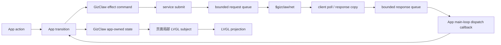

# GizClaw 状态与请求

GizClaw 集成使用 app-owned state 投影调用方能够确认的连接事实和异步请求结果。它不是一个 LVGL subject。当前 GizClaw Public API 没有公开 connection、workspace、conversation 或 OTA state enum，因此产品文档不能把调用方自定义阶段写成 GizClaw SDK 状态。

## 数据流

`h2_gizclaw_service_submit()` 把 typed operation context 交给 library-owned bounded queue。`$gizclaw/net` 唯一持有 client，执行网络 operation 并持续调用 `h2_gizclaw_client_poll()`；它复制 response、stream frame 和 Peer Event 后写入有界 response queue，不直接调用用户 callback。App main loop 调用 `h2_gizclaw_service_poll()`，按接收顺序执行 progress、stream、completion 和 connection event callback。队列达到容量时网络层实施背压，不会无限复制 frame。

## 当前公开状态边界

| Public API | 调用方能够确认的事实 |
| --- | --- |
| `h2_gizclaw_client_init()` | Client object 是否成功创建 |
| `h2_gizclaw_client_connect()` | 本次同步连接调用成功或失败 |
| `h2_gizclaw_client_poll()` | 本次 poll 是否成功、超时或失败 |
| `h2_gizclaw_client_rpc_call()` / `rpc_call_stream()` | 调用任意 protobuf-encoded unary 或 server-streaming RPC，并获得 response/error/data event |
| `h2_gizclaw_rpc_provider_fn` | 在 `poll()` 所在线程处理 Server 主动调用的 `client.info.get`、`client.identifiers.get` 和 `client.tool.invoke` |
| `h2_gizclaw_client_ping_measure()` | Ping RPC 的 server time 与 monotonic round-trip time |
| `h2_gizclaw_client_speedtest_download()` | 实际接收字节数、elapsed time 与下载 bit rate |
| `h2_gizclaw_client_close()` / `deinit()` | 调用方已经请求关闭并释放 client |

Generic RPC API 接收 wire method number 和 protobuf payload，因此 client surface 不需要为每个 generated method 复制一层易漂移 wrapper。Payload message、conversation state、workspace state 和 Audio frame 仍由对应 integration 持有。消费 App 可以保存自己的 request generation、pending、error 和 UI projection，但这些字段必须标记为 App/integration-owned，不能使用 `GizClaw state` 名义暗示 SDK 已提供相同合同。

Server 主动调用 Client 时，C SDK 只负责 request framing、method dispatch、response/error framing 和 channel 生命周期。Provider callback 在 `poll()` 所在线程同步执行，并在返回成功前生成且提交唯一一次 protobuf-encoded response。Request view 只在 callback 期间有效；response 与 error view 只需保持到 callback 返回，integration 不能把这些 borrowed buffer 交给异步任务后再响应。设备信息、硬件 identifiers 与本地 Tool 的真实实现仍由产品 integration 提供。Tiga H106 launcher 当前返回 board/model 和基于 eFuse MAC 的稳定 SN；尚未注册本地 Tool 时，`client.tool.invoke` 明确返回 method-not-found，不能伪造执行成功。

调用方状态通常还需要保存以下稳定数据：

| 字段 | 合同 |
| --- | --- |
| `active_workspace_name` | 保存 Peer-scoped Workspace name，不从显示名、icon 或 canonical ID 反推 |
| `request_generation` | 每次启动、取消或替换异步请求时递增 |
| `last_error` | 记录所属 domain、稳定错误码和可显示摘要 |
| `retry_count` / `retry_deadline` | 只由 effect policy 更新，不由 UI timer 猜测 |
| `firmware_channel` / `firmware_sha256` / `firmware_size` | 标识当前 channel 解析出的 OTA package，下载期间保持不变；不保存 admin firmware name 或短期 URL |

## Request 合同

每个 command 至少携带 operation、generation，以及该 API 要求的 typed resource/record name。Transition 在 command 发出前先写入 pending state；网络 task 完成后把同一 identity/generation、terminal kind 和 result 放入 response queue。只有 main-loop dispatch callback 中的 generation 与当前 state 匹配时才能提交结果。字段必须保留具体语义，例如 `workspace_name`、`history_id` 或 `firmware_channel`，不能混装成通用 `resource_id`。

取消操作先使当前 App request generation 失效，再调用 operation cancel。取消是幂等的；queued、running 或 progress-pending operation 仍由 service 持有，最终恰好产生一次 completion callback。Progress-pending 取消会唤醒 worker，已经排队但尚未执行的 progress callback 不再接触产品资源。连接断开时 service 将受影响 operation 标记为 `SERVICE_CLOSED`，App callback 再根据 typed operation 决定失败或恢复行为，不能把未由 GizClaw API 返回的 connection phase 当作 SDK 事实。

配置 Log PAL 后，service、Conversation 与 Speech request 会输出 compact lifecycle
记录：`request`、`stage`、`identity`、`rc`、`detail`、`frames` 和 `bytes`。这些字段用于
定位 queue、RPC、transport、cancel 和 dispatch 边界，不定义新的产品状态，也不能替代
terminal callback。调用者任务和 `$gizclaw/net` 共享的统计计数使用原子访问；日志不得
为诊断引入跨任务 data race。

## Subject 投影

页面只创建自己需要的 subject，例如 `chat_phase`、`connection_badge` 或 `ota_progress`。长期 GizClaw state 仍由 App 持有；切换页面时销毁页面 observer 和局部 subject，不销毁 client connection。

Subject 更新只发生在 LVGL 所属 main loop。一次性动作，如开始录音、取消下载或重启进入 H2Loader，必须保持 effect command，不能编码为 subject 的瞬时值。

## 生命周期

App 初始化依次建立 client config、service 和 app-owned state，再启动 service。退出时先停止接收新 command，取消 domain operation 和 conversation/OTA effect，调用 service stop 等待 `$gizclaw/net` 退出，再继续 dispatch，直到所有 completion callback 已 drain 并释放 caller operation handle；随后 App deinit service，最后释放 App state。Partial initialization 失败时只清理已经成功创建的资源。

## 验收

- App-owned connection request、workspace request、conversation 和 firmware operation 可以独立表达，不互相覆盖，也不冒充 GizClaw SDK enum。
- 所有 GizClaw callback 都由 App main loop 调用 service dispatch 后执行。
- 页面退出后的迟到 result 因 generation 不匹配而被丢弃。
- Subject 不承担请求队列、event bus、网络回调或 Audio callback。
- Desktop 与设备端使用相同 state、generation 和失败语义。
- 配置 Log PAL 时，请求失败日志包含 identity、stage、result、detail 与 bounded frame/byte 统计，且不改变 callback lifecycle。远端结果日志还包含数值 RPC `method`，`rc` 为映射后的 PAL 结果，`detail` 保留服务端原始状态码。Not Found 使用 INFO / `remote_result`，允许调用方正常进入创建分支；其他远端错误使用 ERROR / `remote_error`。若资源不存在导致业务失败，调用方仍须明确记录该业务操作失败。

Workspace E2E 在现有创建、配置、激活流程之前，分别通过 request 和同步 RPC 验证新名称返回 Not Found。AMOLED 可用 `--define=H2_GIZCLAW_E2E_RPC_ONLY=ON` 构建同一 E2E package，仅运行 RPC suite；默认仍运行 all，且不要与 `H2_GIZCLAW_E2E_DEVICE_ONLY` 同时设置。

Workspace 参数更新统一使用 `h2_gizclaw_*workspace_set_parameters`，对应
`server.workspace.parameters.set`（110）；旧的 `workspace_set_input` 接口已删除。
传入 `h2_gizclaw_workspace_parameters_patch_t`，通过各 `has_*` 字段选择更新
input、conversation initiative 或 agent initiative policy，未指定字段保持不变。
create 会复制 patch；空 patch 或无效的显式值返回 INVALID_ARG。

## 自动系统校时

Service 在 client 连接成功后启动独立的 `$gizclaw/time` 任务，向同一 `server_endpoint` 请求 `GET /server-info`。连接前不请求校时；其他通信不等待 该 HTTP 请求。请求超时为 5 秒，失败后按单调时间等待 30 秒重试，直到成功或 Service 停止。停止取消在途 HTTP 并等待任务退出。Service 是单次连接生命周期：断线进入 terminal，停止后的实例不能再次 start；重连须新建 Service，新实例连接成功后会再次校时，即使系统时间已经有效。已完成校时任务的句柄由 stop 回收；普通网络 poll 不重复校时。校时任务创建失败也按 30 秒重试，不触发连接 terminal。

`h2_gizclaw_service_get_time_sync_status()` 返回 WAITING、RUNNING、RETRY 或 SUCCEEDED，以及最近结果和 HTTP 尝试次数；该状态描述本次校准，不代表时钟 是否有效。失败保留此前有效系统时间。响应必须是合法 JSON，顶层 `server_time` 必须为正整数毫秒时间戳，使用十进制整数字面量，不能是字符串、负数、零、分数或指数形式。

Time PAL 的 `h2_pal_time_get_wall_ms()` 是业务读取时间的公共入口： `get_wall_status().valid == false` 返回 `H2_PAL_TIME_ERR_UNCALIBRATED`，状态查询 或时钟读取错误则保留原错误，失败输出清零。`get_wall_ms()` 成功表示已通过有效性检查；没有额外的有效时间读取方法。超时、重试及耗时始终使用 monotonic API。

时间值始终是 UTC Unix 毫秒，不添加时区偏移。产品显示层负责时区；H106 使用 北京时间 UTC+08:00。未校准时不得把自启动以来的计数显示为当前时间。

ESP32/BK7258 冷启动和重置后的校准状态默认无效；即使 RTC 仍有读数也保守等待 重新校准。保留运行上下文与系统时钟的轻睡眠保持有效；导致程序重新初始化的 深睡眠唤醒按冷启动处理。更换或丢失时钟的 provider 必须清除 valid。桌面/Web provider 可依据宿主有效的系统时钟提供有效 UTC。`set_wall_ms` 是显式外部设置， ESP32/BK7258 标记 USER 来源；它不声称执行过 NTP 协议。

自动测试覆盖连接前无请求、未校准读数、失败后重试、非法响应、校时中通信继续、 校时后 UTC 读数、断开后保留有效时间、重建 Service 后再次校时、成功后跨重试期限的普通轮询不重复校时、设置失败保留旧值及模拟重启失效。 真实硬件的轻睡眠/深睡眠保留行为仍需分别做设备验收。

通过 `runtime->time` 调用 `h2_pal_time_set_wall_ms()` 成功后，Runtime 通过包装既有 Time vtable 的 `set_wall_ms` 自动发布 `H2_RUNTIME_SYSTEM_EVENT_TIME_ADJUSTED`，组件为 `H2_RUNTIME_COMPONENT_SYSTEM_TIME`，payload 为 `h2_runtime_system_event_time_adjusted_t`（请求设置的 UTC `wall_ms`）。GizClaw 和其他应用调用者共享该行为；失败不发事件，读时钟和 sleep 不发事件。事件 envelope 的时间戳仍为单调时间。必须把 Runtime 的 Time PAL 传给 Service；直接调用底层 provider 会绕过 Runtime。事件遵循现有有界队列的溢出丢弃规则，不改变已经成功的设置返回值；消费者收到事件后重读有效时间，并保留周期刷新作为溢出恢复。并发设置的事件是刷新提示，不应将 payload 当作当前时钟快照。
