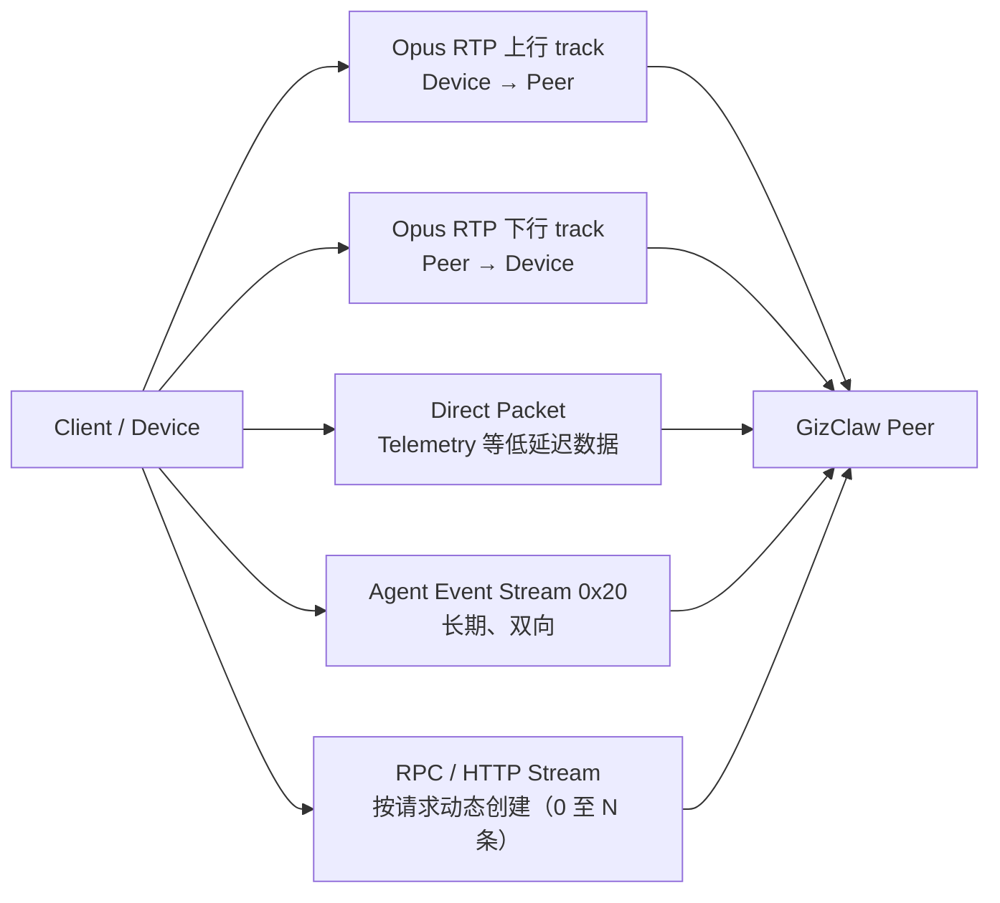

# GizClaw Peer Connection 传输拓扑

一条 GizClaw Peer connection 同时承载 WebRTC media、direct packet、长期 Agent Event Stream 和按请求动态创建的 service stream。因此“当前有几条 stream”没有一个恒定数字。

## Stream 与 channel

| 载荷 | 方向 | 生命周期与数量 | WebRTC 承载 | 用途 |
| --- | --- | --- | --- | --- |
| Opus media 上行 | Client / Device → Server | connection 级别的一条 RTP track | WebRTC audio RTP | 麦克风实时音频。 |
| Opus media 下行 | Server → Client / Device | connection 级别的一条 RTP track | WebRTC audio RTP | Agent 输出经 `MixerOutput` 混音后的播放音频。 |
| Direct packet | 双向 | connection 级别的一条长期 channel | unordered、`maxRetransmits=0` DataChannel | 单字节 protocol 区分 packet。Telemetry `0x40` 是 Client → Server 的高频事件，不是 service stream。Giznet API 把 Opus 暴露为 `ProtocolOpusPacket`，但 WebRTC wire 上的 Opus 使用 RTP track，不写入 packet DataChannel。 |
| Agent Event Stream `0x20` | 双向 | 每条正常 connection 必须有且只有一条；Client 建立并保持到整个 connection 关闭 | reliable、ordered service DataChannel | 上行把 BOS、EOS、text 等 event 推入 Agent input；下行广播 Agent output 的 BOS、EOS、text 和 workspace history update。不承载实时 Opus payload。 |
| Peer / Edge RPC | 双向 | 每次 round trip 动态新建一条，完成或失败后关闭；可并发存在 N 条 | reliable、ordered service DataChannel | Peer RPC `0x00` 或 Edge RPC `0x31`。Unary 和 server-streaming RPC 都在同一条 request-scoped channel 内使用 RPC frame。Server 也可反向打开 Peer RPC 调用 Client provider。 |
| HTTP service | 请求方 → 提供方 | 每次 HTTP round trip 动态打开一条 | reliable、ordered service DataChannel | Peer HTTP `0x01`、OpenAI-compatible `0x02`、Admin HTTP `0x10` 或 Edge HTTP `0x30`。 |

在一个已连接、已打开 Agent Event Stream，且暂无 RPC/HTTP 请求的常见会话中，wire 上有：

- 两个方向的 audio RTP track；
- 一条 packet DataChannel；
- 一条 Agent Event Stream DataChannel。

每个并发 RPC 或 HTTP round trip 再增加一条临时 service DataChannel。
H2 嵌入式 C Client 的双向测速同样在一条 request-owned Peer RPC
DataChannel 上执行，并在调用返回前关闭该 channel。1 MiB 双向测速使用
独立于连接超时的有界写入超时，避免低吞吐链路被连接建立期限提前终止。

H2Peer Desktop 性能 gate 按这个 App 拓扑在同一 PeerConnection 上并发运行三条
request-scoped service DataChannel、长期 Packet/Event DataChannel 和 Opus RTP；它不是
“多个 WebRTC connection 并发”测试。Gate 同轮比较纯数据与满载吞吐，并要求 RTP frame
完整、有序且不出现 late gap。具体命令与指标见 [H2Peer](/zh/developing/h2peer)。

## BOS、EOS 与 transport 终止

Agent Event Stream 中的 BOS/EOS 是按 `stream_id` 划分的业务边界：

- Client 开始一轮输入时上行发送 BOS，结束输入时发送 EOS。
- Server 将 Agent output chunk 中的 BeginOfStream/EndOfStream 转换为下行 BOS/EOS event。
- 业务 EOS 不会关闭 Agent Event Stream DataChannel 或 Peer connection。
- 同一 client 同时只允许一个 conversation 持有逻辑 lease；连续 conversation
  使用 connection 内唯一的 `stream_id`，旧 `stream_id` 的文本和 EOS 不会投影到
  新一轮。
- Event DataChannel EOF 表示整个 Peer connection 已不健康。调用方必须重建完整
  connection 及其四条必需 transport，不能只重新建立 Event 订阅。

RPC stream 的 EOS 是 request-scoped RPC framing 终止标记，与 Agent Event Stream 中的 `type=eos` 不是同一个事件。

## DataChannel 终态 ownership

PAL WebRTC 的 `CLOSED` 和 `ERROR` callback 是 DataChannel ownership 的终止边界。Callback 中的 handle 是 borrowed view，backend 可以在 callback 返回后释放它；GizClaw C SDK 因此必须在返回前撤销所有 matching alias，而不是把地址留给稍后的 request 或 client cleanup。

- Request-scoped Peer/Edge RPC 和 HTTP service 进入终态后，SDK 保留完成本次 request cleanup 所需的 service state，但清空底层 DataChannel alias。Active Peer RPC view 同时失效；completion、failure 或 cancellation 不再调用 provider `channel_close`。
- Connection-scoped Direct Packet 或 Agent Event Stream 进入终态后，client 仍按既有规则变为不可用并 teardown 整条 Peer connection。Teardown 只跳过已经被 backend 消费的 channel handle，不改变其他 connection-owned transport 的关闭顺序。
- Server 反向创建的 inbound Peer RPC 进入终态时，SDK 先清空 owning slot，再释放 request state。重复终态 callback 和随后执行的 client cleanup 都不再找到该 handle。
- 显式 request close 先发生时，SDK 仍恰好调用一次 provider `channel_close`；随后到达的终态 callback 只完成状态收敛。新 channel 即使复用相同地址，也通过当前 owning slot 判断 ownership，不使用历史指针地址抑制 close。

这些规则只约束 handle ownership 和 exactly-once cleanup，不改变 request、Event 或 Peer connection 的现有生命周期，也不改变 RPC framing、service ID、重试和 transport 重建策略。

## Firmware 集成边界

默认 IPv4 网络路径变化是完整 GizClaw client 的生命周期边界，不是 live UDP rebinding。H106 推进 app-owned path epoch 和 connection generation，取消并 stop 旧 GizClaw service；library-owned 单一 worker 随后 close/deinit 自己持有的 client。H106 在可用的新路径上创建新的 service generation，并提交 time sync、client init、connect、registration 和 profile/workspace bootstrap。任何时刻最多一个 client；H2SCTP 不感知 route、Runtime 或 socket owner。

`libs/gizclaw` 的 client 在 connect 后取得唯一 Event access handle，并持有到
disconnect、close 或 teardown；conversation 只借用该 handle 的逻辑 lease，deinit
本轮时不得关闭物理 Event channel。Library 还负责 frame 解码、`stream_id`
过滤、取消与完整 connection 重连边界。配置 `webrtc_media_track` 时，GizClaw 在
offer 前只把 opaque track 绑定给 PAL，codec/RTP 和媒体推进留在 provider；不注册 PAL
Opus callback，也不读取 track 内容。未配置 Track 的固件暂时继续把 PAL raw Opus
callback/send 注册为 C SDK 的 versioned migration adapter。App 继续使用高层
`GZC_PROTOCOL_OPUS_PACKET`，由 C SDK 把 payload 映射到 WebRTC audio RTP；
firmware 不添加私有 header、不直接组 RTP，也不使用 DataChannel fallback。它不
拥有 H106 页面或产品状态。API completion 由 service 放入有界 completion queue；H106 main loop dispatch matching-generation callback，更新 state，再投影到 Audio System 和 LVGL subject。它不是 Runtime event，也不是 worker-thread callback。

实时音频格式、背压、播放 drain 和 cancel 顺序见 [Audio System](/apps/gizclaw/audio)；App-owned state 和 event loop 边界见 [状态与请求](/apps/gizclaw/state)。

## Desktop E2E gate

`projects/e2e/targets/cc_test/gizclaw` 的手动 E2E 在一条
production-selected WebRTC PAL
连接上验证 connection-scoped Direct Packet、Peer Event、Opus RTP，以及 typed unary
和 streaming RPC 使用的 request-scoped DataChannel。测试固定 public E2E endpoint，
使用新 Peer 和 run-prefixed resource，并以 coverage manifest 明确区分 `live`、
`profile-gated`、`primitive`、`sdk-gap`、`Edge-only` 与 `cleanup`；新增公开 method 或
wrapper 未分类时 checker 直接失败。每个 `live` 或 `cleanup` method 还必须映射到测试
实际发出的 wrapper evidence，成功 run 在结束前逐项验证同一进程内的 PASS 记录。
