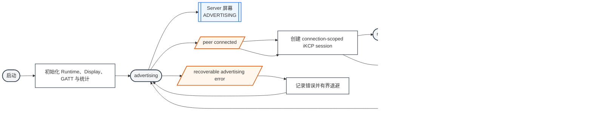
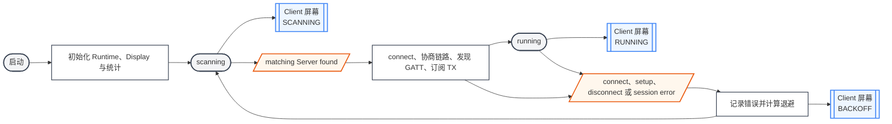
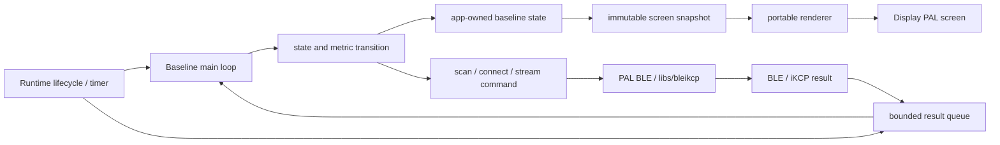
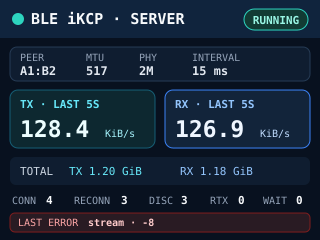
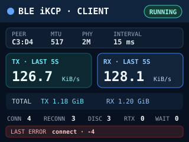
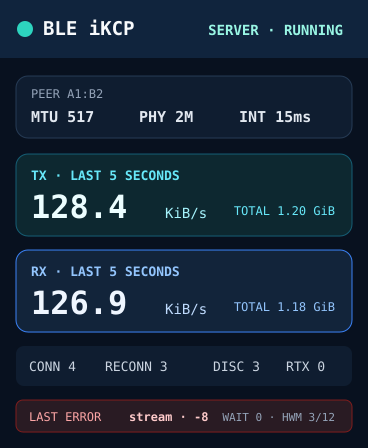
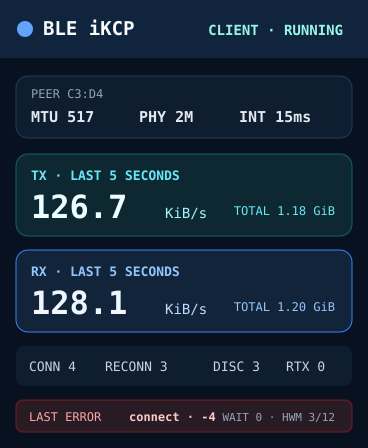

# BLE iKCP Baseline

BLE iKCP Baseline 是共享 Example project group 拥有的设备对设备性能诊断 App。H2Loader 的两台真实设备分别运行 Server 和 Client image，通过 BLE connection 建立 iKCP stream，持续进行全双工传输，并把吞吐、连接质量和自动恢复状态显示在设备屏幕上。

它用于分离设备端 BLE/iKCP 性能与 macOS CoreBluetooth 等 Host backend 的影响。第一版只建立可重复的基线并完整记录数据，不预设最低吞吐门槛；取得稳定的 board pair 数据后，再单独定义 regression threshold。

## 页面与产品合同

产品只有一个 portable App：

```text
projects/example/apps/bleikcp-speed/app/
    portable state、测速协议、统计与屏幕 renderer

projects/example/targets/h2loader_tar_zlib/<image>/<board>/
├── bleikcp-speed-server/
└── bleikcp-speed-client/
```

Server 与 Client launcher 只传入固定 role，并负责 Runtime、BSP、image identity、H2Loader App client 和 BLE service 接线。两个 role 共用同一份 portable state machine，不复制业务实现。

当前产品范围是同时具备 BLE、PSRAM 和屏幕的 H2Loader board：

| Board | Display | Server image | Client image |
| --- | --- | --- | --- |
| `amoled` | 368 × 448 portrait | 必须提供 | 必须提供 |
| `szp` | 320 × 240 landscape | 必须提供 | 必须提供 |
| `bk7258_v3_202405` | 800 × 480 landscape | 必须提供 | 必须提供 |

`devkit` 没有屏幕，不提供 Baseline image；它仍可用于普通 H2Loader BLE command transport 测试。产品覆盖状态统一记录在 [App × Board Matrix](/apps/h2loader/#app-board-matrix)。

App 不保存用户数据、不修改 H2Loader package lifecycle，也不负责 Host 端性能测试。

## 运行流程

### Server



Server 没有 peer 时持续进行 connectable advertising。每次连接都创建新的 iKCP session；断开、stream close 或 protocol error 后必须释放 connection-scoped state 并恢复 advertising。Server 同时只接受一个测速 session，第二个 peer 必须被明确拒绝或等待当前 session 结束。

### Client



Client 扫描测速 service，不依赖固定 BLE address。存在多个候选时选择 RSSI 最强且 advertising data 完整的 Server，当前 session 存续期间不切换 peer。首次连接与每次重连都重新执行 scan、connect、MTU exchange、service discovery、TX subscription 和 `h2_bleikcp_client_open()`。

重试从 `250 ms` 开始，指数退避到最多 `5 s`；扫描发现有效候选后可以立即结束当前退避。只要 App 没有退出，单次连接失败就不能终止 Client。

## Runtime 输入与数据来源

| 输入 | Owner | 用途 |
| --- | --- | --- |
| Runtime lifecycle | App main loop | 启动、退出与资源清理 |
| BLE scan/connection/GATT result | PAL BLE Host adapter | 推进连接状态，记录实际链路参数 |
| iKCP read/write/stat result | `libs/bleikcp` worker | 校验 payload，累计 bytes、retransmit、waitsnd 与 queue high-water |
| 1 秒 timer tick | Runtime time | 关闭当前统计 bucket 并生成最近 5 秒速度 |
| Display dimensions | Display PAL | 选择 portrait 或 landscape 布局 |

BLE、task、time、sync、memory 与 display 都通过 Runtime/PAL 使用。Portable App 不能 include ESP-IDF、BK SDK、BSP private header 或 deprecated 项目代码。

## 数据投影

BLE callback、iKCP worker 和 reconnect worker 只产生有界的 app-owned result，不直接修改 UI。App main loop 是状态的单一 writer；renderer 只读取 immutable snapshot 并调用 Display PAL。



旧 `session_id` 的迟到 result 必须丢弃。页面没有独立草稿、焦点或持久化 state。

## State、统计与生命周期

App state 至少包含：

| 字段 | 语义 |
| --- | --- |
| `state` | `advertising`、`scanning`、`connecting`、`running` 或 `backoff` |
| `peer` | 当前 peer address 的短显示值；未连接时为空 |
| `mtu`、`phy`、`interval_ms` | controller 报告的实际协商值 |
| `tx_5s_kib_s`、`rx_5s_kib_s` | 最近最多 5 秒的 payload 平均速度 |
| `tx_total_bytes`、`rx_total_bytes` | App 本次启动后的累计 payload bytes |
| `session_tx_bytes`、`session_rx_bytes` | 当前 session 的 payload bytes |
| `connect_attempts` | Client 发起或 Server 接受 BLE connection 的次数 |
| `connections` | 成功建立 iKCP session 的次数 |
| `reconnects` | 首次成功后再次建立 session 的次数 |
| `disconnects` | 已观察到的连接断开次数 |
| `retransmits`、`waitsnd` | 当前 session 的 KCP 统计 |
| `input_high_water`、`output_high_water` | 当前 session queue 最高占用 |
| `last_error_stage`、`last_error_code` | 最近一次失败的 stage 和原始错误码 |

最近 5 秒速度使用五个 1 秒 bucket 计算，不能使用启动以来的累计平均。启动或重连不足 5 秒时，分母使用已有 bucket 覆盖的真实时间。UI 每秒刷新一次；采样与绘制不能阻塞 BLE callback 或 iKCP worker。

`last_error_stage` 覆盖 `scan`、`connect`、`mtu`、`gatt`、`stream`、`io`、`verify`、`advertising` 和 `display`。成功重连不清空历史错误，只更新当前 state 和 connection counters。

初始化顺序固定为 result queue、App state、Display、renderer、transport worker。退出时停止产生新 command，关闭 stream 与 BLE subscription，等待 worker 退出，再依次销毁 renderer、Display、queue 和 App state。

## BLE 与 iKCP 协议

测速使用 `libs/bleikcp` 的默认 profile：

- Service `0xFEE0`
- TX `0xFEE1`
- RX `0xFEE2`

Client 连接后请求 preferred ATT MTU `517`、connection interval `15 ms`、LE 2M PHY 和 latency `0`。Controller 可以协商其它值，测量仍继续，但 UI 与日志必须显示实际值，不能显示请求值。Baseline 使用与 H2Loader BLE transport 相同的 window、queue、buffer 和 CWND contract，不维护 board-private 调优参数。

Client 建立 stream 后发送 24-byte versioned request，Server 校验后返回 24-byte response。所有 multi-byte integer 使用 little-endian；未知 version、非零 reserved 字段或非法 payload size 必须拒绝。

```text
Request                              Response
offset size field                    offset size field
0      4    magic = "H2BS"           0      4    magic = "H2BR"
4      1    version = 1              4      1    version = 1
5      1    flags = 0                5      1    result
6      2    reserved = 0             6      2    reserved = 0
8      8    session_id               8      8    session_id
16     4    payload_chunk_bytes      16     4    payload_chunk_bytes
20     4    reserved = 0             20     4    error_code
```

Response 成功后双方立即开始全双工持续传输。Payload 由 `session_id`、direction 与 byte offset 确定性生成，不从 flash 循环读取测试文件。接收方按 offset 校验；mismatch 记录 `verify` error 并结束当前 session。

每个方向使用单调递增的 `uint64_t` counter。Counter 只统计已经由 stream API 成功读取或 flush 确认的 payload，不包含 session header、KCP、ATT 或 advertising overhead。

## 与 H2Loader BLE 共存

Baseline App image 必须继续启动普通 H2Loader BLE command service，支持 `status`、`stats`、`reboot app|loader|upgrade` 和 `coredump`。测速不能改变同一 board 的 H2Loader Service UUID、Service Data identity 或 Host 合成的 `h2l.<board>` 显示名，也不能取代管理 service。

H2Loader command transport 使用自己的 128-bit UUID。Server 将 H2Loader service UUID 与测速 `0xFEE0` 放在同一个 connectable Extended Advertising set；产品 invite beacon 等动态 non-connectable set 不属于本 App。测速与 command service 共享同一个 BLE Host，并注册彼此独立的 GATT service。

如果 controller 不能在测速 connection 存续时继续 connectable advertising，可以暂停 command advertising，但不能注销 command GATT service；session 结束后必须自动恢复 advertising，并重新接受 H2Loader actor 连接。

## 首轮短时基线

2026-07-22 的首轮实机测试用于确认实现可工作并确定后续长时基线的量级。所有组合都使用 ATT MTU `517`、connection interval `15 ms`，每个方向累计 deterministic payload 均超过 1 MiB：

| 组合 | TX 5 秒窗口 | RX 5 秒窗口 | 双向合计 | Queue high-water |
| --- | ---: | ---: | ---: | --- |
| AMOLED Client ↔ SZP Server | `50.2 KiB/s` | `48.2 KiB/s` | `98.4 KiB/s` | input `10`，TX `32768 B`，RX `2928 B` |
| BK Client ↔ SZP Server | `50.6 KiB/s` | `49.0 KiB/s` | `99.6 KiB/s` | input `6`，TX `32768 B`，RX `1952 B` |
| BK Server ↔ SZP Client | `50.3 KiB/s` | `55.6 KiB/s` | `105.9 KiB/s` | input `20`，TX `32768 B`，RX `4392 B` |
| AMOLED Client ↔ BK Server | `51.0 KiB/s` | `56.5 KiB/s` | `107.5 KiB/s` | input `5`，TX `32768 B`，RX `1464 B` |

ESP peer 报告 PHY 2M。BK PAL 当前不能确认 negotiated PHY，因此 BK 屏幕和日志保留 `unknown`，不能用 preferred PHY 冒充实际结果。所有组合均未出现 payload mismatch、queue overflow 或 internal-RAM task fallback。

AMOLED Client ↔ SZP Server 还执行了强制断流恢复。恢复后 Client 报告 `connections=2 reconnects=1 disconnects=1`，重新协商 MTU `517`、PHY 2M 和 `15 ms` interval，并继续传输。

macOS BLE Loader `load` 是 Host 到设备的单向口径，不能与上表的设备间双向合计混用：

| Board | Payload | Elapsed | Payload throughput | MTU | Retransmits |
| --- | ---: | ---: | ---: | ---: | ---: |
| AMOLED | `1,104,087 B` | `31.143 s` | `34.6 KiB/s` | `512` | `0` |
| SZP | `1,705,031 B` | `36.564 s` | `45.5 KiB/s` | `512` | `0` |
| BK7258 | `1,487,465 B` | `34.388 s` | `42.2 KiB/s` | `512` | `0` |

#374 据此使用 `>= 30 KiB/s` 作为三块 board 的 macOS BLE Loader `load` 持续 payload 门槛。该门槛不属于 Baseline App 的 regression threshold。

## 30 分钟长时基线

2026-07-22 使用 PR #379 当前实现完成三块目标 board 两两组合的长时测试。每组稳定会话均超过 30 分钟；下表速度为去掉握手后前 10 个样本的 5 秒 payload 窗口，`total` 是该 App 本次启动累计值。

| 组合 | 端点 | 稳定时长 | TX min / median / P95 / max | RX min / median / P95 / max | 最终 TX / RX total |
| --- | --- | ---: | ---: | ---: | ---: |
| SZP Server ↔ BK Client | SZP Server | `1860 s` | `25.2 / 50.5 / 51.1 / 63.8 KiB/s` | `33.1 / 44.2 / 48.4 / 52.8 KiB/s` | `88,932,352 / 83,693,376 B` |
| SZP Server ↔ BK Client | BK Client | `1859 s` | `25.4 / 38.3 / 51.0 / 63.1 KiB/s` | `33.6 / 47.0 / 54.0 / 65.5 KiB/s` | `90,767,360 / 96,771,952 B` |
| SZP Server ↔ AMOLED Client | SZP Server | `1860 s` | `37.2 / 50.7 / 63.0 / 74.0 KiB/s` | `40.2 / 49.6 / 55.3 / 72.4 KiB/s` | `94,109,696 / 94,618,904 B` |
| SZP Server ↔ AMOLED Client | AMOLED Client | `1852 s` | `37.0 / 50.7 / 62.9 / 76.1 KiB/s` | `34.5 / 49.5 / 55.4 / 65.6 KiB/s` | `94,568,448 / 94,088,656 B` |
| BK Server ↔ AMOLED Client | BK Server | `1852 s` | `48.6 / 62.2 / 63.3 / 75.7 KiB/s` | `35.6 / 43.2 / 48.2 / 55.2 KiB/s` | `114,491,392 / 84,071,160 B` |
| BK Server ↔ AMOLED Client | AMOLED Client | `1859 s` | `25.4 / 38.3 / 51.0 / 63.2 KiB/s` | `48.9 / 59.2 / 64.3 / 68.5 KiB/s` | `82,051,072 / 111,992,480 B` |

| 端点 | connections / reconnects / disconnects | Retransmits | Waitsnd | input / TX / RX high-water | Last error |
| --- | ---: | ---: | ---: | ---: | --- |
| SZP Server，BK Client 组合 | `1 / 0 / 0` | `21,160` | `32` | `23 / 32768 / 7808 B` | `none` |
| BK Client，SZP Server 组合 | `4 / 3 / 3` | `22,085` | `26` | `8 / 32768 / 6888 B` | `io / -10`，稳定窗口前的监控启动断流 |
| SZP Server，AMOLED Client 组合 | `1 / 0 / 0` | `21,919` | `32` | `22 / 32768 / 6832 B` | `none` |
| AMOLED Client，SZP Server 组合 | `1 / 0 / 0` | `21,380` | `32` | `20 / 32768 / 5856 B` | `none` |
| BK Server，AMOLED Client 组合 | `3 / 2 / 2` | `19,661` | `32` | `26 / 32768 / 7808 B` | `io / -10`，稳定窗口前的监控启动断流 |
| AMOLED Client，BK Server 组合 | `1 / 0 / 0` | `15,341` | `32` | `14 / 32768 / 4392 B` | `none` |

BK 两个端点的 connection 与 last-error 是 App 启动累计值，包含开始稳定计时前为打开日志监控产生的连接；稳定窗口内这些计数没有继续增加。三组稳定窗口均未出现 payload mismatch、queue overflow、task allocation fallback 或新的断连。TX/RX total 差异来自发送端 flush 与接收端读取时点以及稳定窗口前的累计数据，不作为 payload 正确性判断；deterministic offset 校验始终通过。

Review 修复后的 `309f9bebf64c` 另以 BK Client ↔ SZP Server 做定向复测。BK package 通过 `send-url` 下载并校验 `1,487,678 B`，启动后 active identity 与 package manifest 一致、Partition 2 metadata valid 且 Stage invalid，首个会话双向 payload 均超过 `2 MiB`。随后让 SZP 返回 Loader 主动断开，BK 恢复扫描且 UART 管理命令仍可用；SZP 重新启动原 Server App 后，BK 自动重连，第二个会话双向 payload 均超过 `3 MiB`，MTU、PHY 与 interval 仍为 `517`、`2M`、`15 ms`，未出现 payload mismatch 或 queue overflow。

## 验收页面原型

屏幕固定显示 role、connection state、实际链路参数、TX/RX 最近 5 秒速度、累计 bytes、连接计数、KCP 状态和保留的 last error。

| Screen state / layout | SVG 原型 |
| --- | --- |
| `server`，320 × 240 landscape |  |
| `client`，320 × 240 landscape |  |
| `server`，368 × 448 portrait |  |
| `client`，368 × 448 portrait |  |

布局映射是固定的：

- SZP 使用原生 320 × 240 landscape。
- AMOLED 使用原生 368 × 448 portrait。
- BK7258 的 800 × 480 屏幕使用 320 × 240 logical landscape layout，以整数 `2×` 缩放为 640 × 480 并水平居中，左右各保留 80 px 黑色安全区。

原型展示 `RUNNING` 的完整字段。`ADVERTISING`、`SCANNING` 和 `BACKOFF` 复用同一页面：state badge 显示当前状态，link 参数显示 `--`，5 秒速度显示 `0`，累计值、计数与 last error 保持不变。数值依次使用 `KiB`、`MiB`、`GiB` 缩写；空间不足时先省略 peer address 高位，不能裁掉 `last_error_stage`，负错误码不能显示成无符号数。

相同字段每秒输出一行结构化日志：

```text
H2_BLEIKCP_SPEED role=client state=running peer=A1B2 mtu=517 phy=2m interval_ms=15 tx_5s_kib_s=128.4 rx_5s_kib_s=126.9 tx_total=1288490188 rx_total=1276112076 connections=4 reconnects=3 disconnects=3 retransmits=0 waitsnd=0 input_hwm=3 output_hwm=12 last_error_stage=connect last_error_code=-4
```

## 集成、Task 与内存边界

BLE iKCP worker、Server handler、Client session worker 和 renderer 的生命周期由 App 持有。所有 BLE/iKCP task stack 必须通过 Runtime 的 PSRAM task allocation 创建，不能 fallback 到 internal RAM。

Result queue、BLE input/output queue、iKCP buffer、统计 bucket 和 screen snapshot 都是固定容量。传输 payload 使用有界 buffer 重复填充，内存占用不能随运行时间或累计传输量增长，也不能通过分配完整的多 MiB payload 完成测速。Queue overflow 必须成为可见错误，不能丢帧后继续报告成功。

## 资源与持久化

App 不需要 PIXA、Opus、Bundle data 或 Preference key。屏幕由 portable renderer 使用字体与 primitive 绘制；文档 SVG 只用于布局验收，不打包进固件。所有 counters 和 last error 都只在本次 App 运行期间保留，重启后归零。

## 验收

三块目标硬件两两组合，各进行至少 30 分钟的全双工持续传输：

- `amoled` ↔ `szp`
- `szp` ↔ `bk7258_v3_202405`
- `amoled` ↔ `bk7258_v3_202405`

每轮保存双方屏幕和结构化日志，并确认：

- 实际 MTU、PHY 与 connection interval 可见。
- 5 秒速度持续更新，累计 bytes 单调递增，双方对应方向一致。
- deterministic payload 没有 mismatch。
- 没有 queue/buffer overflow 或 task allocation fallback。
- 主动重启一端蓝牙、重启一端 App 和制造连接超时后，Server 恢复 advertising，Client 自动重新扫描、连接并建立新 session。
- 每次恢复增加对应的 `connections`、`reconnects` 和 `disconnects`，同时保留最近的 last error。
- session 结束后可重新通过 H2Loader actor 执行 `status`、`stats` 和 `reboot app|loader|upgrade`。

基线报告按 board pair、direction 与持续时间记录 5 秒 TX/RX 速度的 minimum、median、p95、maximum，以及 total bytes、connections、reconnects、disconnects、retransmits、queue high-water 与所有 last error。macOS native CLI 测试使用相同统计口径，但作为 Host backend 对照单独列出，不与设备对设备结果合并。
