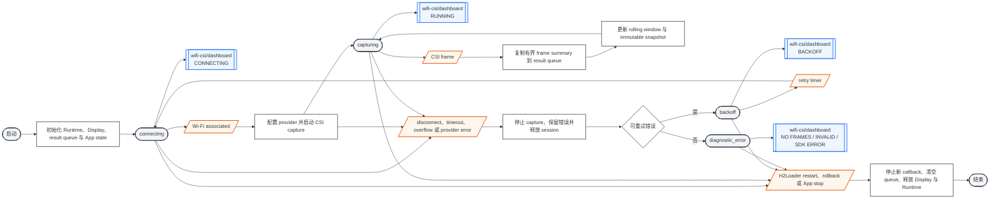
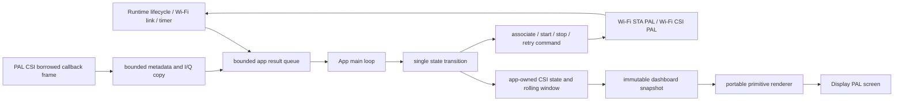
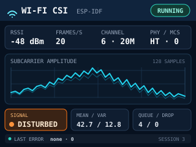
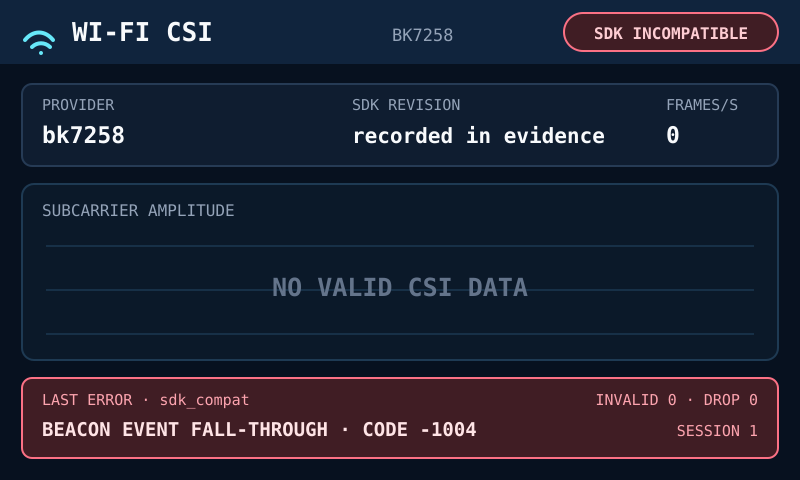

# Wi-Fi CSI Smoke

Wi-Fi CSI Smoke 是共享 Example project group 拥有的无线信道诊断 App。H2Loader image 连接普通 `2.4 GHz` Wi-Fi 路由器后持续采集 Channel State Information（CSI），在屏幕上显示真实链路信息、子载波幅度曲线和环境扰动指标，用于确认人体移动或静止是否会在当前布置下产生可观察的信道变化。

本产品只建立原始信号和诊断可视化基线，不把 `stable` 或 `disturbed` 解释为有人、躺下、睡眠或手势，也不输出医疗结论。识别能力需要在本基线之后另行定义采集、标注、模型和准确率合同。

## 页面与产品合同

- 关联项：Wi-Fi CSI H2Loader App 跟踪任务
- Portable App ownership：`projects/example/apps/wifi-csi/app/`
- 屏幕验收 board：`szp` 使用 `320 × 240 landscape`；`bk7258_v3_202405` 使用 `800 × 480 landscape`
- 屏幕 route：`wifi-csi/dashboard`
- 入口：H2Loader 启动 `wifi-csi` App image。
- 健康终点：H2Loader command service、Runtime、Display、renderer 和诊断状态机可用，App image 已确认；CSI 可以进入 `running`，也可以停在明确的诊断错误状态。
- 退出：H2Loader `restart`、`rollback` 或系统停止 App 时完成对称清理。

`szp` 与 `bk7258_v3_202405` 分别使用 ESP-IDF 和 Armino CSI provider。两块板都提供正常的 `wifi-csi` App image；能读到结构合法数据时显示曲线和统计，无 frame、invalid frame、SDK 不兼容或 provider error 时显示明确错误。Desktop/macOS 绑定 canonical unsupported，测试只允许使用明确标记为 `fake` 的输入验证 portable state 和 renderer。

路由器只提供普通 AP，不安装插件、不运行本产品代码，也不修改固件。测试设备负责通过自身 Wi-Fi radio 和 platform provider 获取 CSI。

## 运行流程

`wifi-csi/dashboard` 是唯一可见页面。连接、采集、退避和错误都投影到同一页面的 state badge、指标与错误栏，不创建临时弹窗。



App 从 `connecting` 开始；关联成功后启动 CSI。断开或瞬时 provider error 先停止当前 capture，再以 `500 ms` 起步指数退避，最大 `5 s`。任一合法 Wi-Fi link event 可以结束当前退避并立即重试。`sdk_incompatible`、持续无 frame 或 invalid frame 保留在 dashboard 供查看，不终止 App，也不无限自动重试。

## Runtime 输入与数据来源

| 输入 | Owner | App 行为 |
| --- | --- | --- |
| Runtime lifecycle | App main loop | 创建、运行和销毁所有 App-owned state 与 worker |
| Wi-Fi link state | Runtime Wi-Fi STA PAL | 推进 `connecting`、`capturing` 和 `backoff` |
| CSI capabilities | Runtime Wi-Fi CSI PAL | 显示真实 provider、PHY format、sample width 与最大 subcarrier count |
| CSI frame | Platform CSI provider callback | 复制固定上限的 metadata 和 I/Q sample，不能保留 SDK pointer |
| `1 s` timer tick | Runtime time | 关闭统计 bucket，生成 frame rate、rolling metrics 和 screen snapshot |
| Display dimensions | Display PAL | `szp` 选择 `320 × 240`；BK7258 V3 202405 选择 `800 × 480` landscape layout |
| H2Loader command | H2Loader App client | 支持 `status`、`stats`、`restart`、`rollback` 和 coredump |

Portable App 只能使用 Runtime/PAL 和 H2Loader public contract，不能 include ESP-IDF、Armino、BSP private header 或 board constant。Platform provider 负责把 SDK metadata 和 sample buffer 规范化为 PAL frame。

## 数据投影

CSI callback 只复制有界数据并写入 queue。App main loop 是 state、统计窗口和错误信息的单一 writer；renderer 只读取 immutable snapshot，不在 callback 或 worker 中操作 Display PAL。



每次 capture 使用单调递增的 `session_id`。旧 session 的迟到 frame、link result 或 timer result 必须丢弃，不能污染新 session 的统计或页面。

## State、Projection、Effect 与生命周期

App state 至少包含：

| 字段 | 语义 |
| --- | --- |
| `state` | `connecting`、`capturing`、`backoff`、`unsupported`、`sdk_incompatible`、`invalid_frame` 或 `provider_error` |
| `provider` | `esp-idf`、`bk7258` 或 `fake`；来自 provider capability，不能由 board 名反推 |
| `session_id` | 当前 capture generation |
| `channel`、`bandwidth_mhz`、`phy`、`mcs` | 最近合法 frame 的真实 radio metadata |
| `rssi_dbm` | 最近合法 frame 的有符号 RSSI |
| `frames_s` | 最近一个完整 `1 s` bucket 的合法 frame 数 |
| `sample_count` | 当前 frame 的复数 sample 数；无 frame 时为 `0` |
| `amplitude_mean`、`amplitude_variance` | 最近 `5 s` 有效 frame 的 rolling 统计 |
| `signal` | `warming`、`stable` 或 `disturbed`，只表示信道变化分数 |
| `queue_high_water`、`dropped_frames`、`invalid_frames` | 本次 App 运行期间的 queue 最高占用以及丢弃、非法 frame 数 |
| `last_error_stage`、`last_error_code` | 最近一次失败 stage 与有符号原始错误码 |

`signal` 在合法统计窗口不足 `3 s` 时固定为 `warming`。窗口满足后，App 使用 portable rolling metric 产生 `stable` 或 `disturbed`；platform provider 不能返回动作、睡眠或人体分类标签。阈值属于诊断 App config，不属于 ESP provider。

Callback queue、sample copy、五个 `1 s` bucket、rolling plot 和 screen snapshot 都使用固定容量。超过单 frame sample 上限时保留居中的连续 subcarrier window，并增加 `truncated_frames` 诊断计数；queue 满时增加 `dropped_frames`，不能阻塞 radio callback，也不能静默覆盖未消费结果。

初始化顺序固定为 result queue、App state、Display、renderer、Wi-Fi association、CSI provider。退出时先禁止发布新 callback，调用 CSI `stop` 并等待不再进入 callback，再停止 timer/worker、清空 queue，最后释放 renderer、Display、App state 和 Runtime。部分初始化失败只逆序释放已经创建的资源。

## Wi-Fi、CSI 与失败恢复

`start` 只在 STA 已关联时发起。关联超时、CSI unsupported、配置失败、首 frame 超时、Wi-Fi disconnect、queue overflow 和 Display error 都记录明确 stage，不使用成功页面掩盖失败。

设备没有已保存的 STA 配置时，dashboard 显示 `NO SAVED WIFI`，不会启动 CSI provider。先在 Loader 中执行 `h2loader wifi connect <ssid> <password>`；Loader 只有在成功取得 IP 后才保存配置，随后启动 App 时由 `wifi_settings` 读取并重新连接。

| Stage | 页面行为 | 恢复 |
| --- | --- | --- |
| `wifi_connect` | badge=`CONNECTING`，radio 字段为 `--` | 有界退避后重新关联 |
| `csi_start` | badge=`BACKOFF`，保留 provider capability | 停止部分 capture 后重试 |
| `first_frame` | badge=`NO FRAMES`，`frames/s=0` | 保留诊断并允许手动或断线后重建 capture session |
| `sdk_compat` | badge=`SDK INCOMPATIBLE`，实时值为 `--` | 不启动不安全的 SDK callback，保留 revision 与 blocker |
| `frame_validation` | 首个合法 frame 前 badge=`INVALID FRAME`，已有合法 frame 时保持当前采集状态并显示 invalid count | 丢弃本 frame，累计 invalid count，不覆盖最近合法曲线 |
| `csi_stream` | 保留最后一帧，曲线降为灰色 | 停止并重建 session |
| `queue_overflow` | badge 保持 `RUNNING`，drop 数变红 | 继续采集并保留错误；持续溢出时降低可见刷新率 |
| `display` | 继续结构化日志 | 不让 renderer failure 停止 capture |
| `unsupported` | badge=`UNSUPPORTED`，不自动重试 | 不支持 CSI 的 target |

普通路由器不需要返回 CSI，也不需要运行 echo 程序。SZP 和 BK 关联到普通 `2.4 GHz` AP，并只接受关联 BSSID 的 frame。App 每 `250 ms` 向当前 gateway 发起一次短超时 ICMP probe，由测试设备主动维持最低链路流量；人体是否移动只应改变 CSI sample，不应决定页面能否持续收到 frame。BK provider 启动前核对当前关联 BSSID，并在 adapter 边界验证 callback 的 BSSID、data type、sample 数和 PHY format；接入新的 Armino SDK revision 前仍需重新审查事件分发和 buffer contract，不能把 App 收到 callback 后的校验当成 SDK 内部内存安全保护。`min_delivery_interval_ms` 只限制 PAL callback 的最小投递间隔，不保证硬件定时产生 frame。Board 验收文档固定 AP、channel、投递间隔和设备摆位，每个平台只和自身 quiet baseline 比较。

BK AVDK v3.1.1 使用 host-capture work mode `0x01`、STA identity 和 NON-HT/HT format mask。该 SDK 的 generated LMAC protocol header 将 bit 0 定义为 host capture，`bk_wifi_csi_info_cb_register()` 控制 CP 到 AP 的 callback 转发。SDK callback 的 `len` 是 sample 数，`data_type=0` 时 `data.buf[]` 保存 packed 13-bit I/Q；BK adapter 将合法 callback 转换为 portable complex sample。

固定 SDK 的 AP event dispatch 会让 beacon channel-change event 继续落入 CSI event 分支，并在进入 App adapter 前按完整 CSI 结构复制短 event payload。`wifi-csi` launcher 因此在 CP 编译时关闭 `CONFIG_WIFI_SCAN_COUNTRY_CODE`，从源头移除该 event；launcher 同时补齐 AVDK v3.1.1 在关闭该选项后仍被 wpa_supplicant 引用的兼容 flag。AP image 还在 vendor event dispatcher 的链接边界截获 beacon channel-change event，调用原有 beacon callback 后立即返回，避免以后重新启用 event source 时再次落入 CSI 分支。AP provider 只有收到 launcher 的 safe-dispatch capability 时才注册 callback，其余组合返回 `H2_PAL_ERR_UNAVAILABLE`。BK adapter 仍在 provider 边界核对 BSSID、data type、sample 数和 PHY format，作为合法 CSI event 的结构校验。首个合法 frame 之前收到非法 frame 时页面显示 `INVALID FRAME`；已有合法 frame 后，非法 frame 只增加 `INVALID` 计数，不能覆盖当前采集状态、最近合法 radio metadata 或最近合法曲线。如果 vendor capture 没有产生合法 callback，dashboard 保持 `NO FRAMES` 或首帧诊断状态。其余没有 CSI backend 的 Runtime owner 绑定 canonical unsupported provider。

BK 的主动 NULL frame / ACK capture 在 STA power save 开启时可能成功返回但不产生 callback。`bk7258_v3_202405` 的 `wifi-csi` CP image 因此直接配置 `CONFIG_WIFI_PS_DISABLE=y`；这是 CSI 专用 launcher 的 SDK 运行条件，不由 portable App 根据芯片型号判断。真机上保留 power save 时 provider 启动成功但没有 frame，运行 `ps close` 后立即出现合法 callback；将同一设置固化进 image 后，首次启动和 App restart 都能自动收到 `len=48`、`data_type=0` 的 NON-HT frame。

## 验收页面原型

页面为同一 route 提供两个真实 landscape layout。

| Screen state / layout | SVG 原型 |
| --- | --- |
| `wifi-csi/dashboard`，SZP 320 × 240 |  |
| `wifi-csi/dashboard`，BK 800 × 480 error state |  |

原型展示 `RUNNING` 和 `disturbed` 的完整字段。其它状态复用同一页面：

- `CONNECTING`：state badge 为黄色，provider 保留，radio 字段和曲线显示 `--`，signal=`WARMING`。
- `BACKOFF`：state badge 为红色，曲线显示最后一帧并降为灰色，错误栏显示 retry 倒计时。
- `UNSUPPORTED`：state badge 为灰色，provider 显示实际 backend，所有实时值为 `--`，错误栏固定为 `csi_start · UNSUPPORTED`。
- `SDK INCOMPATIBLE`、`NO FRAMES`、`INVALID FRAME`、`PROVIDER ERROR`：state badge 为红色，保留 provider、SDK revision、stage、code、length/type 和计数，实时曲线无合法 frame 时显示 `NO VALID CSI DATA`。
- `RUNNING`：每秒刷新数字和曲线；`stable` 使用青绿色，`disturbed` 使用橙色，不能显示 `sleeping`、`lying` 或 `occupied`。

Provider 最多显示 `8` 个等宽字符，超出时使用稳定缩写 `esp-idf`、`bk7258`、`fake`。`frames/s`、sample count 和 drop/invalid counter 使用十进制；超过四位依次使用 `k`、`M` 缩写。负 RSSI 和 error code 保留符号。错误栏优先级最高，不能为了显示完整曲线而裁掉。

相同 snapshot 每秒输出一行结构化日志：

```text
H2_WIFI_CSI provider=esp-idf state=running session=3 channel=6 bandwidth_mhz=20 phy=HT mcs=0 rssi_dbm=-48 frames_s=20 samples=128 amplitude_mean=42.7 amplitude_variance=12.8 signal=disturbed queue_hwm=4 dropped=0 truncated=0 last_error_stage=none last_error_code=0
```

## 集成与平台边界

- `libs/pal` 拥有 Wi-Fi CSI contract 和 canonical unsupported implementation。
- `native_component_src/esp-idf6.x/h2_pal_core` 使用 ESP-IDF CSI API 实现 ESP provider；`szp` launcher 为页面验收入口。
- `native_component_src/bk7258/ap/h2_pal_core` 使用 Armino CSI API 实现 BK provider，只链接进 AP；SDK 或 frame 问题通过 PAL error 和 App dashboard 显示。
- `boards/<board>/<target>` 只负责 provider 实例与 Runtime wiring，不实现统计、阈值或 renderer。
- `projects/example/apps/wifi-csi` 拥有 portable state、rolling metrics、snapshot 和 renderer。
- `projects/example/targets/h2loader_tar_zlib/wifi-csi/<board>` 负责 image identity、SDK config、BSP、Runtime 和 H2Loader App client 组合。
- Desktop/macOS 绑定 unsupported。测试注入的 fake 必须在 provider 和日志中显示为 `fake`。

App image 必须先注册 H2Loader command service。作为诊断 App，SZP 与 BK 在 Runtime、Display、renderer 和诊断状态机可用后确认 image；CSI 成功不是 image confirmation 的前提。成功启动 CSI 后 `10 s` 内没有收到合法 frame 时记录 `first_frame` 并显示 `NO FRAMES`，使设备停留在页面供查看；这不能被记录为 provider 成功。

## 资源与持久化

App 不需要 PIXA、Opus、Bundle data 或 Preference key。屏幕由 portable renderer 使用字体和 Display PAL primitive 绘制；本文档 SVG 只用于布局验收，不打包进固件。

统计、错误和 signal baseline 只属于本次 App 运行，重启后归零。App 不保存 CSI raw frame、MAC 历史、人体数据或识别结果。

## 验收

### 页面验收

在 `szp` 与 `bk7258_v3_202405` 真机上确认：

- 页面分别为原生 `320 × 240` 和 `800 × 480 landscape`，字段、颜色、单位、优先级和错误栏与各自 SVG 一致。
- `CONNECTING`、`RUNNING`、`BACKOFF`、`NO FRAMES`、`INVALID FRAME` 和 provider error 都在同一 dashboard 正确投影。
- 数字和曲线最多每秒刷新一次；radio callback、Wi-Fi worker 和 timer 不直接绘屏。
- 运行中触发 Display error 后，CSI capture 和结构化日志继续工作。

### Provider 真机验收

ESP32-S3 SZP 与 BK7258 V3 202405 分别安装由 H2Loader 管理的 App package，并确认预期 board、target、`active_role=app`、App identity、`state=confirmed`、installed checksum 与 `upgrade_phase=idle`。

设备使用普通 `2.4 GHz` router，并固定 BSSID/channel、PAL 投递间隔以及设备与床/人体相对摆位，依次执行：

1. 空场景静置 `2 min`。
2. 人进入 radio path 并持续移动 `2 min`。
3. 人在固定位置保持静止 `5 min`。
4. 人离开并再次静置 `2 min`。
5. 主动断开并恢复 Wi-Fi，然后停止并重新启动 capture。

保存 SDK/固件 revision、package checksum、screen 或结构化日志、PHY、RSSI、frame rate、sample format/count、rolling mean/variance、signal、queue high-water、drop/truncate/invalid/provider-error 数和全部 last error。fake/Replay 结果不能代替任一真机结果。

### BK 真机验收

BK 必须运行同一个 Smoke App，并进入 `running`、持续收到结构合法 frame。`invalid_frame`、`no_frames`、`sdk_incompatible` 或 `provider_error` 仍需在屏幕和日志中保留 stage、原始 code、SDK revision、复现步骤与 package checksum，但这些错误结果只证明诊断路径可用，不算 CSI 读取成功。

AVDK v3.1.1 验收 image 必须关闭 CP country-code scan event source、启用 AP safe-dispatch capability，并在 CP 配置中关闭 STA power save；不能依赖 App callback 过滤修复 vendor 在 callback 前发生的越界读取。provider 启动后应在首帧超时前收到关联 BSSID 的合法 frame，App restart 后无需手工 `ps close` 仍能恢复 frame stream。

取得结构合法 frame 后，执行与 SZP 相同的场景步骤并确认子载波变化可重复。仅看到曲线变化仍不能证明人体姿态或睡眠状态，也不能替代后续算法验收。

验收只要求 quiet、movement 和 stationary 三段在原始曲线与 rolling metrics 上可观察和可重复，不设人体存在、躺下或睡眠分类准确率。H2Loader `status`、`stats`、`restart`、`rollback` 和 coredump 在 App 运行期间保持可用，capture stop 后不得再收到旧 session callback。
