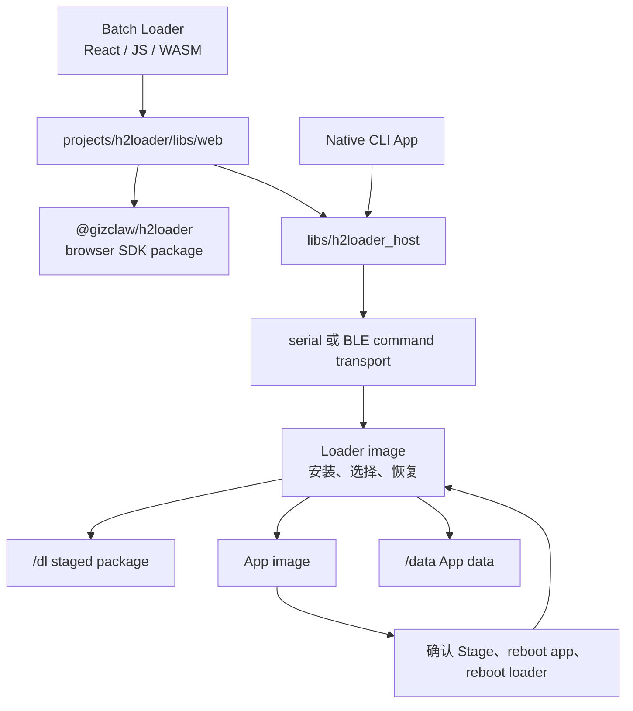
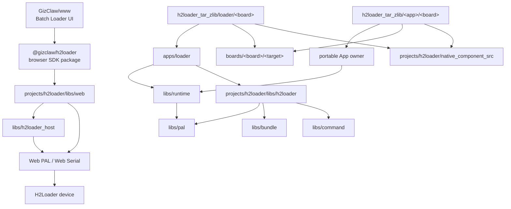

# H2Loader

H2Loader 是 GizOS 的固件管理产品。它由工厂 Batch Loader、repository CLI、portable Host Core，以及设备上的 Loader image、H2Loader-managed App image 和共享生命周期协议组成，用于发现设备、安装与启动 App、确认新版本、回退、更新 Loader 和诊断故障。

本目录是 H2Loader 产品与工程合同的唯一入口。面向使用者的构建、安装和设备恢复步骤仍放在[使用说明](/zh/using/h2loader/)；公开符号见 [API Reference](/references/h2loader)。

## 文档

| 文档 | 内容 |
| --- | --- |
| [项目结构](./project_structure) | H2Loader 各源码目录、代码 ownership 与依赖边界 |
| [Portable Host Core](/zh/developing/h2loader_host) | 可分发 Launcher 的扫描、catalog、managed operation 与 recovery 边界 |
| [固件结构分区与类型](./firmware_types) | Loader 固件、App 固件、指令与分区布局 |
| [更新、启动与回退](./update/) | 更新包总览，以及彼此独立的 App 更新和 Loader self-upgrade |
| [Boards](./boards/) | 各 board 的 Loader/App image、平台配置、运行表现与恢复边界 |
| [BLE iKCP Baseline](./apps/bleikcp_speed/) | 两台设备之间的 BLE iKCP 吞吐和断线恢复基准 |
| [Wi-Fi CSI Smoke](./apps/wifi_csi/) | 在屏幕上显示 Wi-Fi CSI、链路元数据和诊断错误 |

## App Board Matrix

矩阵以 `projects/<owner>/targets/h2loader_tar_zlib/<image>/<board>/` 中当前具备 `:package` 构建入口的 image 为准，不把“存在 entry”误写成“已经完成实机验收”。

- `✓`：当前存在可构建的 Loader 或 App image 入口。
- `△`：入口已完成构建验证，但对应真机验收尚未完成。
- `◇`：产品合同已定义，但入口尚未实现。
- `—`：当前没有该 board 的入口。

| Image / App | [AMOLED](./boards/amoled/) | [BK7258](./boards/bk7258_v3_202405/) | Zero BK 1.0 | [DevKit](./boards/devkit/) | H200 | H200 V2 | [SZP](./boards/szp/) | Tiga V4.2 | Zero ESP V3.0 | [Waveshare A7670E](./boards/waveshare_esp32s3_a7670e_4g/) | [Waveshare P4](./boards/waveshare_esp32p4_wifi6_touch_lcd_4_3/) |
| --- | :---: | :---: | :---: | :---: | :---: | :---: | :---: | :---: | :---: | :---: | :---: |
| H2Loader | ✓ | ✓ | ✓ | ✓ | △ | △ | ✓ | ✓ | △ | ✓ | ✓ |
| Display | ✓ | ✓ | ✓ | — | — | — | ✓ | ✓ | — | — | ✓ |
| LVGL Smoke | — | — | ✓ | — | — | — | — | — | — | — | — |
| Audio System | ✓ | ✓ | ✓ | — | △ | △ | ✓ | ✓ | — | — | ✓ |
| MP4 Player | — | ✓ | — | — | — | — | — | — | — | — | ✓ |
| MP4 Player Small | ✓ | — | ✓ | — | — | — | — | ✓ | — | — | ✓ |
| BLE Broadcaster | — | ✓ | — | ✓ | — | — | ✓ | — | — | ✓ | — |
| BLE Observer | — | ✓ | — | ✓ | — | — | ✓ | — | — | ✓ | — |
| BLE iKCP Baseline Server | ✓ | ✓ | — | — | — | — | ✓ | — | — | — | — |
| BLE iKCP Baseline Client | ✓ | ✓ | — | — | — | — | ✓ | — | — | — | — |
| Wi-Fi CSI Smoke | — | ✓ | — | — | — | — | ✓ | — | — | — | — |
| Modem Smoke | — | — | — | — | — | — | — | — | — | ✓ | — |
| Crash Before Confirm | ✓ | ✓ | — | ✓ | △ | △ | ✓ | ✓ | — | ✓ | ✓ |
| Partial Update | — | — | — | — | — | — | ✓ | — | — | — | — |
| GizClaw Ping Speed | ✓ | — | — | — | — | — | — | — | — | — | — |
| GizClaw E2E | — | — | — | ✓ | — | — | — | — | — | — | — |
| H106 E2E | — | — | △ | — | — | — | — | △ | — | — | — |
| Libco Smoke | — | ✓ | — | ✓ | — | — | — | — | — | — | — |
| PAL Preference | — | — | — | ✓ | — | — | — | ✓ | — | — | — |
| DinoBounce | — | — | — | — | — | — | — | ✓ | — | — | — |
| DinoDive | — | — | — | — | — | — | — | ✓ | — | — | — |
| DinoRun | — | — | — | — | — | — | — | ✓ | — | — | — |
| DinoTetris | — | — | — | — | — | — | — | ✓ | — | — | — |
| Tuxemon | — | — | — | — | — | — | — | ✓ | — | — | — |
| H106 | — | — | — | — | — | — | — | ✓ | — | — | — |
| Safe Call | — | — | — | — | — | — | — | ✓ | — | — | — |

H106 MFG 是 Tiga 与 Zero ESP Loader image 启动前的内置产测流程，不是独立 App image，也不占矩阵行。各 image 的构建、设备表现与实机验收记录放在对应 board 使用页；矩阵只表达产品入口覆盖面。

## 产品组成

### Host

`projects/h2loader/libs/web/` 提供浏览器/Web Serial JS/runtime/WASM SDK source target，`projects/h2loader/targets/npm_package/h2loader/` 将同一组输出发布为公共 `@gizclaw/h2loader` npm package。产品 Batch Loader UI 由 `GizClaw/www` 消费该 package，GizOS 不再维护 React frontend 或 Batch Loader 静态 archive。npm package 不提供 Node.js serial-port runtime。Native CLI 的 portable App 位于 `projects/h2loader/apps/cli/app/`，macOS/Linux/Windows process 与 PAL 组装位于 `projects/h2loader/targets/cc_binary/cli/`。Web SDK 与 CLI 都通过 `libs/h2loader_host/` 执行 authoritative status、typed command、package 校验和 lifecycle verification，彼此不依赖 source。`projects/e2e/targets/pkg_tar/h2loader-serial/` 继续是非生产 Browser Host Serial 验证入口，不属于产品 UI 或发布物。Host 不属于设备固件，也不通过设备 Runtime 使用硬件能力。

### Loader image

Loader image 是固定的管理与恢复入口。它初始化 board 和 Runtime，挂载 H2Loader 存储，注册 command transport，校验并安装 package，选择 App image，并管理 H2Loader self-upgrade。跨平台入口位于 `projects/h2loader/apps/loader/`，board-specific 构建与接线位于 `projects/h2loader/targets/h2loader_tar_zlib/loader/<board>/`。

### App image

App image 是由 H2Loader 安装和启动的目标固件。Launcher 初始化 BSP 与 Runtime，接入 H2Loader App client，并调用 portable App 的阻塞式入口。Reusable Examples 由 `projects/example/` 持有，跨目标测试 App 由 `projects/e2e/` 持有，产品 App 由 H106 等对应 project group 持有；对应的 `targets/h2loader_tar_zlib` 也归同一个真实 App owner。使用 H2Loader 不改变源码或 artifact ownership。

## Firmware Release

推送 `v<version>` tag 时，`.github/workflows/release.yml` 执行 closed DAG：`catalog → ESP32-S3/ESP32-P4 与 BK7258 slices → firmware-bundle → release-bundle → publish`。这里的 tag version 是 immutable release batch identity，不是每个 firmware 的产品版本。每一步只接收上一步声明并校验过的 artifact，最后一个 assembly job 验证完整 firmware index、逐项版本、asset SHA-256 与无额外输入。通过 `workflow_dispatch` 手动运行时，调用方提供 batch version 并选择目标 branch；workflow 执行相同 DAG，但只上传完整 `release-bundle-<version>` Actions artifact，不创建 GitHub Release。新增、删除或移动 launcher 后，Bazel provider catalog、CI matrix 与 release coverage 同源，不能由脚本维护另一份 expected entry 列表。

每个 firmware 在同一个 GitHub Release 中提供：

- `<board>-<image>-<target>.update.tar.zlib`：deploy 与 H2Loader stage 使用的正式安装包。
- `<board>-h2loader-<target>.recovery.h2fb`：Loader entry 的确定性 factory bundle，含 board/target、driver、flash offset 和每个成员 SHA-256。
- `<board>-h2loader-<target>.combined_factory.bin`：ESP Loader entry 从 `0x0` 直接烧录的 ESP-IDF combined image；metadata 使用 `factory-flash`、`.combined_factory.bin` release suffix 与 offset `0` 描述它。

每个最终 firmware 可以通过 `firmware_version(name, value)` 声明自己或一个明确 lockstep 产品组的 SemVer，并把该 label 传给 ESP、BK7258、BK3633 或 JieLi firmware rule 的 `version`。没有显式声明的旧 target 继续使用 `//tools/bazel:firmware_version` compatibility flag。同一 release batch 可以包含多个 firmware version；每个 `:package` target 使用 `<board>-<image>-<target>.firmware.json` 传递 entry、role、board、target、version、release suffix、操作类型与各 release asset SHA-256，package manifest 与 native firmware version 必须相同。`//tools/bazel:firmware_release_bundle` 校验完整 catalog 后聚合为 `firmware-index.json`，其顶层 `version` 是 batch identity，每个 firmware item 的 `version` 是该固件自己的版本；metadata 不再单独发布。`firmware-index.json` 必须完整覆盖全部维护中的 ESP/BK7258 entry；`SHA256SUMS` 覆盖索引和全部 firmware 发布文件。设备安装消费 `update.tar.zlib`，raw recovery 只消费匹配的 `.h2fb`，直接工厂烧录只消费匹配的 `.combined_factory.bin` 并从 offset `0` 开始。Release 不发布 ELF、map 或 diagnostic archive；内部 `:firmware` 的 `DefaultInfo` 仍包含其余直接烧录与调试文件，供对应提交的本地调试、烧录与 coredump/backtrace 分析。任一 firmware、package、version 或 catalog validation 失败时，publish job 不创建部分 Release。

BK3633 的 `:firmware` target 仍由 Bazel/CI 构建和验证，但没有 `FirmwareReleaseInfo`，因此不得出现在 catalog、任何 release slice、`firmware-index.json` 或 GitHub Release。这个 exclusion 由 catalog/release tests 和 final input allowlist 同时 fail closed；不能因为 BK3633 target 可以成功构建就把 graph success 当作可发布证据。

## 依赖与 Ownership

- `projects/h2loader/apps/loader/` 拥有设备端安装、启动决策和 command handler。
- Reusable Examples 位于 `projects/example/apps/`，跨目标测试 App 位于 `projects/e2e/apps/`，portable PIXA game App 位于 `projects/pixa_games/apps/`。
- `projects/h2loader/libs/h2loader/` 保存 package、image identity、确认、回退、return-to-loader 和调试协议。
- `projects/h2loader/native_component_src/` 保存只服务 H2Loader 的 target glue；可跨产品复用的原生 SDK component source 必须提升到顶层 `native_component_src/`，Bazel 平台实现提升到 `libs/pal/providers/`。
- `projects/<owner>/targets/h2loader_tar_zlib/<image>/<board>/` 保存 owner 的薄 image 入口、build config、BSP 选择、Runtime 生命周期与最终 H2Loader package target；H2Loader project 自己只保留 Loader image entry 与共享 package support。
- `projects/h2loader/libs/web/` 保存可复用的浏览器/Web Serial SDK source，`projects/h2loader/targets/npm_package/h2loader/` 保存公共 `@gizclaw/h2loader` manifest 与 Bazel 发布规则，`libs/h2loader_host/` 保存 portable device policy 与 managed lifecycle；产品 Web UI 归 `GizClaw/www`。
- `projects/h2loader/apps/cli/app/` 保存 portable CLI command、参数和输出 policy，并且只消费 Runtime、PAL 与 repository library；`projects/h2loader/targets/cc_binary/cli/` 只保存 native process entry 和 macOS/Linux/Windows PAL provider 组装。
- `projects/h2loader/tools/bazel/` 保存 H2Loader 专用 package、recovery、release metadata writer 和对应 artifact rule；顶层 `tools/bazel/` 只保存全仓通用 firmware rule 与 runner。

Runtime 不是 Common 的直接依赖：portable App 消费 Runtime；H2Loader artifact entry 负责把 Common 所需的 PAL API 与稳定配置传给 Common。

## Command Transport

Loader 与支持管理命令的 App image 复用同一 command registry、Stage 实现与 operation mutex。ESP 和 BK7258 的 managed UART transport 固定为 `460800` baud；ESP sdkconfig 和 BK AP/CP defaults 在固件启动时直接应用该值，Host 未显式传入 `--baud` 时也使用同一默认值。Host 在 open 后、借出 stream 前 deassert DTR/RTS，只有 canonical `UNSUPPORTED` 可继续。两者都通过 IO Stream iKCP 承载完整 command、Stage bytes 与 response。Host 不提供 legacy raw H2Loader command transport，可靠握手失败不得自动 fallback。Native USB Serial/JTAG 不使用 baud；独立的 BootROM recovery driver 和外围设备 UART 也不属于 command transport。

支持 BLE 的 board 由具体 launcher 显式注册 H2Loader GATT service，不使用全局 build option。H2Loader 使用 connectable Extended Advertising，不携带 local name；固定 Service UUID 和 Service Data 是唯一的发现与连接 identity。Service Data 提供 protocol version、active role 和静态实现 capabilities；v1 在 board 名不超过 32 bytes 时内联 UTF-8 board，较长名称使用 v2 FNV-1a 64-bit board fingerprint，Host 必须从本地 board registry 唯一解析，hash 缺失或碰撞时不得连接。Host 根据解析出的 board 合成 `h2l.<board>` 显示名。广播 identity 只用于发现和初筛，连接后的 `stats` 必须交叉校验完整 board、role 和当前动态 capabilities，才是 authoritative identity。Loader 与 App 的 BLE task stack 必须分配在 PSRAM，不能静默退回 internal RAM。

当前 status 固定包含 `device_uid`：由固件读取设备端 BLE public/identity MAC，并编码为 12 位小写十六进制字符串。Service Data、CoreBluetooth/Bleak `backend_id`、主机侧可见的 BLE address、display name 和 board 都只用于发现候选，不能提升为物理身份。Host 首次连接后锁定 status 中的 `device_uid`；每次重启后重新发现、连接并读取 status，只有 UID 完全一致才继续验收终态。

Repository CLI 提供 H2Loader management BLE provider，并与 serial 复用同一 typed command contract 和设备 command registry；`bleikcp-speed` 仍只访问独立 Baseline service。BLE payload `send` 必须在当前 GATT/KCP session 中发送 `stage` command 和 package bytes，并在断开前从同一 connection 验证 staged identity。BLE `send-url` 的 Wi-Fi/STAGE_URL control command、下载 terminal 和 staged status 验证也必须留在同一 connection；设备 payload 仍经 Wi-Fi/HTTP 下载。生命周期命令在首次连接无法取得有效 `device_uid` 时发送前 fail closed；重连后 UID 不同也 fail closed。

串口和 BLE 可以同时等待输入，但共享 operation mutex 串行执行命令。Command line、stage bytes 和 response 始终绑定发起它的 transport；断开的 operation 失败，不转移到另一 transport，也不自动 replay。

## Image 生命周期

H2Loader 的完成条件不是“传输成功”或“reboot accepted”。App 更新必须经过 package 校验、Partition 2 写入和新 App 启动；新 App 以自身固件 identity 提交 Partition 2 metadata，并清理匹配的 Stage。Loader self-update 必须经过 Partition 1 → Partition 2 → Partition 1 回写；最终验收重新连接设备，确认预期 role/version/board/target、active image checksum/size、running/next partition、`boot_intent`、Stage 与 Partition 1/2 metadata。App 终态要求运行 Partition 2 且 Stage invalid；Loader 终态要求运行 Partition 1、`boot_intent=AUTO`、Partition 1/2 valid 且 image checksum 相同、Stage invalid，随后再做 power-cycle 复查。

设备仍能通过 H2Loader command transport 通信时，安装、更新、回退和恢复必须继续使用 H2Loader。只有 H2Loader 已验证无法通信或无法自我恢复时，才能进入对应 board 使用文档定义的底层 recovery。
