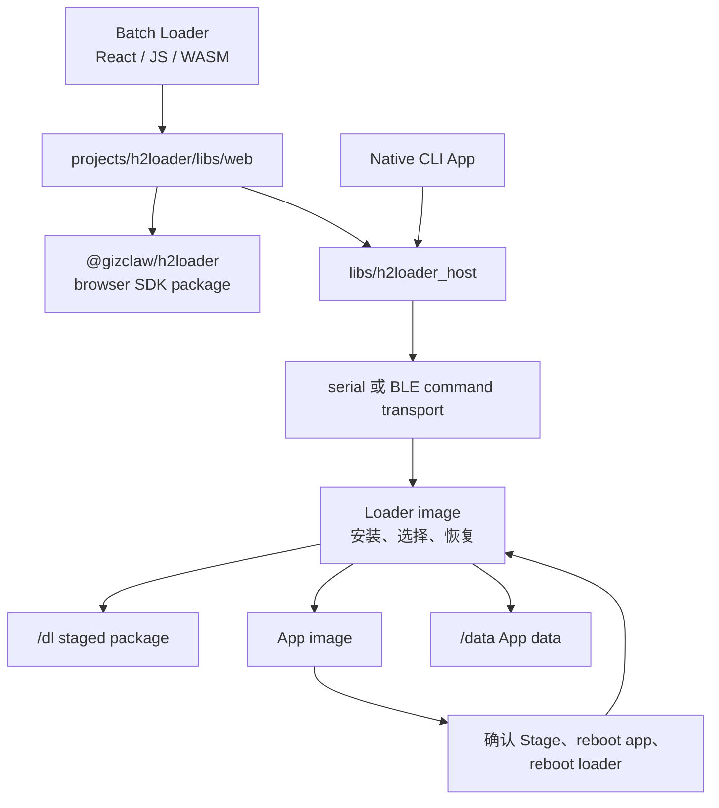
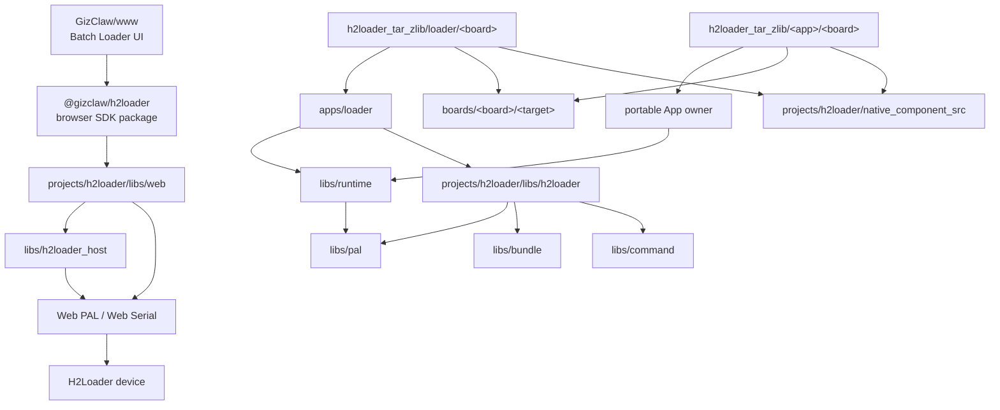

# H2Loader

H2Loader 是 GizOS 的固件管理产品。它由工厂 Batch Loader、repository CLI、portable Host Core，以及设备上的 Loader image、H2Loader-managed App image 和共享生命周期协议组成，用于发现设备、安装与启动 App、确认新版本、回退、更新 Loader 和诊断故障。

本目录是 H2Loader 产品与工程合同的唯一入口。面向使用者的构建、安装和设备恢复步骤仍放在[使用说明](/zh/using/h2loader/)；公开符号见 [API Reference](/references/h2loader)。

## 文档

| 文档 | 内容 |
| --- | --- |
| [项目结构](./project_structure) | H2Loader 各源码目录、代码 ownership 与依赖边界 |
| [Portable Host Core](/zh/developing/h2loader_host) | 可分发 Launcher 的扫描、catalog、managed operation 与 recovery 边界 |
| [npm Release](./npm_release) | Browser SDK tarball、snapshot Release slice 与下游 npm index 合同 |
| [固件结构分区与类型](./firmware_types) | Loader 固件、App 固件、指令与分区布局 |
| [更新、启动与回退](./update/) | 更新包总览，以及彼此独立的 App 更新和 Loader self-upgrade |
| [Boards](./boards/) | 各 board 的 Loader/App image、平台配置、运行表现与恢复边界 |
| [BLE iKCP Baseline](./apps/bleikcp_speed/) | 两台设备之间的 BLE iKCP 吞吐和断线恢复基准 |
| [Wi-Fi CSI Smoke](./apps/wifi_csi/) | 在屏幕上显示 Wi-Fi CSI、链路元数据和诊断错误 |

## App Board Matrix

矩阵以 `projects/<owner>/targets/h2loader_tar_zlib/<image>/<board>/` 中当前具备 `:package` 构建入口的 image 为准，不把“存在 entry”误写成“已经完成实机验收”。

- `✓`：当前存在可构建的 Loader 或 App image 入口。
- `△`：入口已完成构建验证，但对应真机验收尚未完成。
- `◇`：产品合同已定义，但入口尚未实现。
- `—`：当前没有该 board 的入口。

| Image / App | [AMOLED](./boards/amoled/) | [BK7258](./boards/bk7258_v3_202405/) | Zero BK 1.0 | [DevKit](./boards/devkit/) | H200 | H200 V2 | [SZP](./boards/szp/) | Tiga V4.2 | Zero ESP V3.0 | [Waveshare A7670E](./boards/waveshare_esp32s3_a7670e_4g/) | [Waveshare P4](./boards/waveshare_esp32p4_wifi6_touch_lcd_4_3/) |
| --- | :---: | :---: | :---: | :---: | :---: | :---: | :---: | :---: | :---: | :---: | :---: |
| H2Loader | ✓ | ✓ | ✓ | ✓ | △ | △ | ✓ | ✓ | △ | ✓ | ✓ |
| Display | ✓ | ✓ | ✓ | — | — | — | ✓ | ✓ | — | — | ✓ |
| LVGL Smoke | — | — | ✓ | — | — | — | — | — | — | — | — |
| Audio System | ✓ | ✓ | ✓ | — | △ | △ | ✓ | ✓ | — | — | ✓ |
| MP4 Player | — | ✓ | — | — | — | — | — | — | — | — | ✓ |
| MP4 Player Small | ✓ | — | ✓ | — | — | — | — | ✓ | — | — | ✓ |
| BLE Broadcaster | — | ✓ | — | ✓ | — | — | ✓ | — | — | ✓ | — |
| BLE Observer | — | ✓ | — | ✓ | — | — | ✓ | — | — | ✓ | — |
| BLE iKCP Baseline Server | ✓ | ✓ | — | — | — | — | ✓ | — | — | — | — |
| BLE iKCP Baseline Client | ✓ | ✓ | — | — | — | — | ✓ | — | — | — | — |
| Wi-Fi CSI Smoke | — | ✓ | — | — | — | — | ✓ | — | — | — | — |
| Modem Smoke | — | — | — | — | — | — | — | — | — | ✓ | — |
| Crash Before Confirm | ✓ | ✓ | — | ✓ | △ | △ | ✓ | ✓ | — | ✓ | ✓ |
| Partial Update | — | — | — | — | — | — | ✓ | — | — | — | — |
| GizClaw Ping Speed | ✓ | — | — | — | — | — | — | — | — | — | — |
| iperf | ✓ | — | — | — | — | — | — | — | — | — | — |
| WebRTC Performance | ✓ | — | — | ✓ | — | — | — | — | — | — | — |
| GizClaw E2E | [✓](./boards/amoled/gizclaw_ota_e2e) | — | — | ✓ | — | — | — | — | — | — | — |
| H106 E2E | — | — | △ | — | — | — | — | △ | — | — | — |
| Libco Smoke | — | ✓ | — | ✓ | — | — | — | — | — | — | — |
| PAL Preference | — | — | — | ✓ | — | — | — | ✓ | — | — | — |
| DinoBounce | — | — | — | — | — | — | — | ✓ | — | — | — |
| DinoDive | — | — | — | — | — | — | — | ✓ | — | — | — |
| DinoRun | — | — | — | — | — | — | — | ✓ | — | — | — |
| DinoTetris | — | — | — | — | — | — | — | ✓ | — | — | — |
| Tuxemon | — | — | — | — | — | — | — | ✓ | — | — | — |
| H106 | — | — | — | — | — | — | — | ✓ | — | — | — |
| Safe Call | — | — | — | — | — | — | — | ✓ | — | — | — |

H106 MFG 是 Tiga 与 Zero ESP Loader image 启动前的内置产测流程，不是独立 App image，也不占矩阵行。各 image 的构建、设备表现与实机验收记录放在对应 board 使用页；矩阵只表达产品入口覆盖面。

## 产品组成



### Host

`projects/h2loader/libs/web/` 提供浏览器/Web Serial JS/runtime/WASM SDK source target，`projects/h2loader/targets/npm_package/h2loader/` 将同一组输出发布为公共 `@gizclaw/h2loader` npm package。产品 Batch Loader UI 由 `GizClaw/www` 消费该 package，GizOS 不再维护 React frontend 或 Batch Loader 静态 archive。npm package 不提供 Node.js serial-port runtime。Native CLI 的 portable App 位于 `projects/h2loader/apps/cli/app/`，macOS/Linux/Windows process 与 PAL 组装位于 `projects/h2loader/targets/cc_binary/cli/`。Web SDK 与 CLI 都通过 `libs/h2loader_host/` 执行 authoritative status、typed command、package 校验和 lifecycle verification，彼此不依赖 source。`projects/e2e/targets/pkg_tar/h2loader-serial/` 继续是非生产 Browser Host Serial 验证入口，不属于产品 UI 或发布物。Host 不属于设备固件，也不通过设备 Runtime 使用硬件能力。

### Loader image

Loader image 是固定的管理与恢复入口。它初始化 board 和 Runtime，挂载 H2Loader 存储，注册 command transport，校验并安装 package，选择 App image，并管理 H2Loader self-upgrade。跨平台入口位于 `projects/h2loader/apps/loader/`，board-specific 构建与接线位于 `projects/h2loader/targets/h2loader_tar_zlib/loader/<board>/`。

### App image

App image 是由 H2Loader 安装和启动的目标固件。Launcher 初始化 BSP 与 Runtime，接入 H2Loader App client，并调用 portable App 的阻塞式入口。Reusable Examples 由 `projects/example/` 持有，跨目标测试 App 由 `projects/e2e/` 持有，产品 App 由 H106 等对应 project group 持有；对应的 `targets/h2loader_tar_zlib` 也归同一个真实 App owner。使用 H2Loader 不改变源码或 artifact ownership。

## Firmware Release

`.github/workflows/release.yml` 只由 `workflow_dispatch` 触发，不接收 version 输入。`catalog` 从 UTC 时钟生成 `RELEASE_BATCH=YYYYMMDD-HHMMSS` 和 `v<batch>` tag；batch 是发布批次，不是产品版本。DAG 为 `catalog → ESP32-S3/ESP32-P4/BK7258 → firmware-bundle → package → release-bundle → publish`，并行的 `npm-packages` producer 直接汇入最终 `release-bundle`。每一步保留 producer 子目录，拒绝重复 basename、symlink、缺失或额外文件。

发布选择为 opt-in：Bazel 查询 `//projects/...` 中带精确 `firmware-release` tag 的 `h2loader_tar_zlib` rule，并要求它是 Loader 目录中的 canonical `:package`，identity 为 `image=loader`、`role=h2loader`。`projects/e2e`、`projects/example`、H2Loader `e2e-app` 以及 alternate package 均为诊断目标，即使误加发布 tag 也会被校验拒绝。现存 `no-release` 仅保留为诊断标记，发布选择不再读取它。

发布集合已确定为以下三块板，每个现有平台 slice 各一块；三块板的首个正式发布版本均已确认为 `0.1.0`。只有这些 target 标记 `firmware-release`；catalog 必须覆盖全部三项，不能悄悄漏掉不兼容配置。

| `//projects/h2loader/targets/h2loader_tar_zlib/loader/<board>:package` 的 board | Slice | 固件版本 |
| --- | --- | --- |
| `bk7258_v3_202405` | `bk7258` | `0.1.0` |
| `devkit` | `esp32s3` | `0.1.0` |
| `waveshare_esp32p4_wifi6_touch_lcd_4_3` | `esp32p4` | `0.1.0` |

每个 BUILD 声明 `firmware_version(name = "version", value = "0.1.0")`，native firmware 的 `version = ":version"` 经 `FirmwareVersionInfo` 传递到 package。Release 不再注入全局 `//tools/bazel:firmware_version`；该 compatibility flag 仍供没有独立版本的诊断 target 使用。每项固件版本必须是 31 字节以内的 ASCII SemVer，catalog、native metadata 和 package manifest 必须一致，允许同一批次包含不同固件版本。

GitHub Release 当前恰好包含四个资产：

- `firmware-release-v<batch>.zip`
- `gizclaw-h2loader-<package version>.tgz`
- `npm-index.json`
- `SHA256SUMS`：覆盖前述三个文件，不包含自身。

ZIP 内只有 `firmware-release-v<batch>/` 前缀下的文件：

- `loader-<board>.update.tar.zlib`：三个 Loader 的 managed install 包。
- `loader-<board>.recovery.h2fb`：两个 ESP Loader 和 BK7258 Loader 的 recovery bundle。
- `loader-<board>.combined_factory.bin`：两个 ESP Loader 从 offset `0` 直接烧录的 combined image。
- `firmware-index.json`：顶层 `batch` 是 UTC 批次，各 firmware 的 `version` 是独立 SemVer；`release_name` 必须等于 `<image>-<board>`，每个 asset name 必须等于 `release_name + release_suffix`。
- `SHA256SUMS`：覆盖 ZIP 内全部固件资产及 `firmware-index.json`，不包含自身。

原生 package 输出仍采用 `<board>-<image>-<target>` 文件名；`firmware-bundle` 校验原始 metadata、操作类型、SHA-256、size 和完整集合后，按上述发布名复制资产并生成索引。`.firmware.json`、ELF、map 和诊断 archive 不进入 ZIP。AC791N 与 BK3633 不在发布集合中；AC791N 保留普通构建与 CI 路径。

`package` slice 校验固件索引、资产及校验和后，按文件名排序生成 ZIP，使用 `ZIP_DEFLATED`、compression level `9`、batch 时间戳、`create_system = 3` 和 `external_attr = 0o100644 << 16`；输入文件的 mtime、权限、目录和枚举顺序不影响输出。ZIP 时间字段精度为两秒，batch 的奇数秒向下取整为偶数秒，batch 本身保持不变；最终组装逐项校验 ZIP member 时间戳必须与该取整值一致。batch 年份限制为 ZIP 支持的 1980–2107。相同 batch 和相同文件字节产生相同 ZIP。

```sh
make bazel-release RELEASE_SLICE=catalog RELEASE_BATCH=20260920-120000
# 各平台使用同一 catalog 分别构建，并保留 artifact 子目录后组装。
make bazel-release RELEASE_SLICE=firmware-bundle RELEASE_BATCH=20260920-120000 RELEASE_INPUT_DIR=build/release/input
make bazel-release RELEASE_SLICE=package RELEASE_BATCH=20260920-120000 RELEASE_INPUT_DIR=build/release/firmware-bundle
```

最终组装重新验证 ZIP 内部 identity、checksum coverage 和每项资产的 SHA-256/size，同时验证 npm index identity、全部 tarball 和完整顶层集合，再生成顶层 `SHA256SUMS`。工作流要求生成的 tag 和 Release 均不存在，在当前提交创建 tag 与 draft Release，上传资产，重新下载并逐文件 `cmp`，最后公开。非默认分支发布为 prerelease 且不设为 latest；公开前失败时删除 draft（`gh release delete --cleanup-tag`）并清理残留 tag ref，确认两者均已删除；已公开的 Release 不做破坏性回滚。

npm 的资产格式、索引兼容合同与本地组装命令见 [npm Release](./npm_release)。GitHub Packages 的 `h2loader-npm-publish.yml` 保持独立。

## 依赖与 Ownership



- `projects/h2loader/apps/loader/` 拥有设备端安装、启动决策和 command handler。
- Reusable Examples 位于 `projects/example/apps/`，跨目标测试 App 位于 `projects/e2e/apps/`，portable PIXA game App 位于 `projects/pixa_games/apps/`。
- `projects/h2loader/libs/h2loader/` 保存 package、image identity、确认、回退、return-to-loader 和调试协议。
- `projects/h2loader/native_component_src/` 保存只服务 H2Loader 的 target glue；可跨产品复用的原生 SDK component source 必须提升到顶层 `native_component_src/`，Bazel 平台实现提升到 `libs/pal/providers/`。
- `projects/<owner>/targets/h2loader_tar_zlib/<image>/<board>/` 保存 owner 的薄 image 入口、build config、BSP 选择、Runtime 生命周期与最终 H2Loader package target；H2Loader project 自己只保留 Loader image entry 与共享 package support。
- `projects/h2loader/libs/web/` 保存可复用的浏览器/Web Serial SDK source，`projects/h2loader/targets/npm_package/h2loader/` 保存公共 `@gizclaw/h2loader` manifest 与 Bazel 发布规则，`libs/h2loader_host/` 保存 portable device policy 与 managed lifecycle；产品 Web UI 归 `GizClaw/www`。
- `projects/h2loader/apps/cli/app/` 保存 portable CLI command、参数和输出 policy，并且只消费 Runtime、PAL 与 repository library；`projects/h2loader/targets/cc_binary/cli/` 只保存 native process entry 和 macOS/Linux/Windows PAL provider 组装。
- `projects/h2loader/tools/bazel/` 保存 H2Loader 专用 package、recovery、release metadata writer 和对应 artifact rule；顶层 `tools/bazel/` 只保存全仓通用 firmware rule 与 runner。

Runtime 不是 Common 的直接依赖：portable App 消费 Runtime；H2Loader artifact entry 负责把 Common 所需的 PAL API 与稳定配置传给 Common。

## Command Transport

Loader 与支持管理命令的 App image 复用同一 command registry、Stage 实现与 operation mutex。ESP 和 BK7258 的 managed UART transport 固定为 `460800` baud；ESP sdkconfig 和 BK AP/CP defaults 在固件启动时直接应用该值，Host 未显式传入 `--baud` 时也使用同一默认值。Host 在 open 后、借出 stream 前 deassert DTR/RTS，只有 canonical `UNSUPPORTED` 可继续。两者都通过 IO Stream iKCP 承载完整 command、Stage bytes 与 response。Host 不提供 legacy raw H2Loader command transport，可靠握手失败不得自动 fallback。Native USB Serial/JTAG 不使用 baud；独立的 BootROM recovery driver 和外围设备 UART 也不属于 command transport。

支持 BLE 的 board 由具体 launcher 显式注册 H2Loader GATT service，不使用全局 build option。H2Loader 使用 connectable Extended Advertising，不携带 local name；固定 Service UUID 和 Service Data 是唯一的发现与连接 identity。Service Data 提供 protocol version、active role 和静态实现 capabilities；v1 在 board 名不超过 32 bytes 时内联 UTF-8 board，较长名称使用 v2 FNV-1a 64-bit board fingerprint，Host 必须从本地 board registry 唯一解析，hash 缺失或碰撞时不得连接。Host 根据解析出的 board 合成 `h2l.<board>` 显示名。广播 identity 只用于发现和初筛，连接后的 `stats` 必须交叉校验完整 board、role 和当前动态 capabilities，才是 authoritative identity。Loader 与 App 的 BLE task stack 必须分配在 PSRAM，不能静默退回 internal RAM。 ESP image 在 Wi-Fi 执行 scan、connect 或 disconnect 这类会独占 radio 的操作期间自动暂停 App command service 广播，操作结束后恢复；暂停与恢复请求只发布最新的目标状态并唤醒 BLE link task，由该 task 串行应用；发布路径不获取任何 mutex，调用方不阻塞，重叠的 Wi-Fi operation 全部结束后才恢复广播，且不改变 Service Data identity 或已建立的连接。自动共存暂停与调用方显式的 pause/resume 是两个独立的 pause 原因：只要还有任一原因成立，广播保持停止，自动恢复不会覆盖 launcher 通过显式 API 设置的整段 workload 暂停；原因变更与其对应的 stop/start 串行执行，因此并发的显式暂停不会被在途的自动恢复重新打开。

当前 status 固定包含 `device_uid`：由固件读取设备端 BLE public/identity MAC，并编码为 12 位小写十六进制字符串。Service Data、CoreBluetooth/Bleak `backend_id`、主机侧可见的 BLE address、display name 和 board 都只用于发现候选，不能提升为物理身份。Host 首次连接后锁定 status 中的 `device_uid`；每次重启后重新发现、连接并读取 status，只有 UID 完全一致才继续验收终态。

Repository CLI 提供 H2Loader management BLE provider，并与 serial 复用同一 typed command contract 和设备 command registry；`bleikcp-speed` 仍只访问独立 Baseline service。BLE payload `send` 必须在当前 GATT/KCP session 中发送 `stage` command 和 package bytes，并在断开前从同一 connection 验证 staged identity。BLE `send-url` 的 Wi-Fi/STAGE_URL control command、下载 terminal 和 staged status 验证也必须留在同一 connection；设备 payload 仍经 Wi-Fi/HTTP 下载。生命周期命令在首次连接无法取得有效 `device_uid` 时发送前 fail closed；重连后 UID 不同也 fail closed。

串口和 BLE 可以同时等待输入，但共享 operation mutex 串行执行命令。Command line、stage bytes 和 response 始终绑定发起它的 transport；断开的 operation 失败，不转移到另一 transport，也不自动 replay。

BLE command service 的诊断由 composition root 显式借用 Log PAL，与 command response 分离，不直接写 `stdout` 或 `stderr`。日志接口和其 `user` 必须覆盖 service 生命周期，支持并发 task 调用，且不得从日志回调重入 service。诊断为 optional：缺少可用接口时不输出，写入失败不覆盖通信操作的原始返回值。每条记录遵守 PAL message 容量；会话统计拆成带 connection handle 的多条记录，保留所有计数与 high-water 信息，底层日志 provider 决定实际 UART、USB 或其它输出位置。

## Image 生命周期

H2Loader 的完成条件不是“传输成功”或“reboot accepted”。App 更新必须经过 package 校验、Partition 2 写入和新 App 启动；新 App 以自身固件 identity 提交 Partition 2 metadata，并清理匹配的 Stage。Loader self-update 必须经过 Partition 1 → Partition 2 → Partition 1 回写；最终验收重新连接设备，确认预期 role/version/board/target、active image checksum/size、running/next partition、`boot_intent`、Stage 与 Partition 1/2 metadata。App 终态要求运行 Partition 2 且 Stage invalid；Loader 终态要求运行 Partition 1、`boot_intent=AUTO`、Partition 1/2 valid 且 image checksum 相同、Stage invalid，随后再做 power-cycle 复查。

设备仍能通过 H2Loader command transport 通信时，安装、更新、回退和恢复必须继续使用 H2Loader。只有 H2Loader 已验证无法通信或无法自我恢复时，才能进入对应 board 使用文档定义的底层 recovery。
