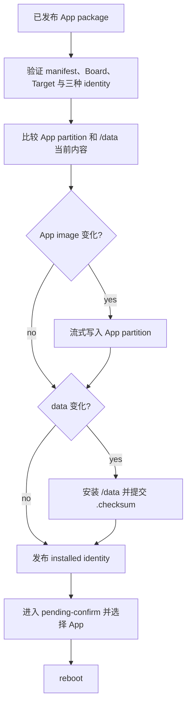
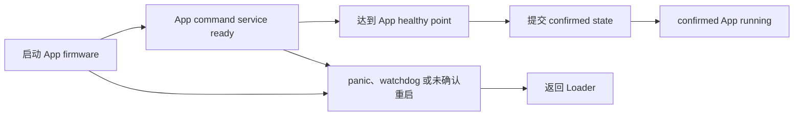

# App 更新

App 更新把 `manifest.role=app` 的 staged package 安装到 App image 与 `/data`，启动新 App，并由 App command-ready/healthy point 完成确认。

## 安装

Loader 在任何 erase/write 前重新计算 raw App digest 与最终 data tree digest，只写发生变化的部分。Format 1 package 始终包含完整 App payload 与完整 data namespace，不生成 app-only 或 data-only package；未变化部分仍需完整解析和校验。

带 MFG Main Task 的 Loader 必须先校验 staged App package 与 MFG gate，再尝试 `CAS(cursor, 22, -1)`。只有 CAS 成功才允许提交 durable install request，并等待 `run_mfg()` 完成真实 MFG Main Task handle 的 `join`；该 join 已包含 Main Task 对全部后台 task 的 join。cursor 不是 `22`、已经进入 `-2` 关机或 package 校验失败时直接返回，不保存 deferred App 更新意图，也不修改 MFG 状态。

Preference 只保存状态，不能代替实际内容比较：

- App image 是否变化，由目标 App partition 的实际 SHA-256 判断。
- Data 是否变化，由 package 最终 data tree digest 与 `/data/.checksum` 判断。
- App 内容变化或 `app_confirmed` 缺失时，新的 installed App 进入 pending-confirm。
- App 未变化且确认标记为真时，data-only/no-op 更新可以保持 confirmed。
- Legacy package 始终执行全量安装。

App 与 data 不提供整体事务回滚。如果 data 已更新而 App write 失败，设备保留失败状态并停在 Loader，不发布新的 installed identity，也不自动启动 App。

App install command 的接受边界先于上述 package 校验和安装。Loader 先清除平台
hold（平台支持时），再在同一个 `h2loader` Preference transaction 中写入
`manual_hold=0`、`INSTALL_REQUESTED`（重试 pending-confirm 时为 `INSTALLING`）和
`boot_intent=APP`，并只 commit 一次。commit 成功后才输出并 flush
`H2_LOADER_REBOOT target=app result=accepted`，随后才调用 MFG
`before_disruptive` 停止和 join worker，再进入安装或启动流程。

产品代码如果还有 cursor、Logic Off 或其他运行时 gate，必须在其状态转换路径调用 `h2_loader_set_command_availability(loader, flags, available)`，主动 set/clear 对应的逐命令 bit。该 API 只原子更新 h2loader 内存状态，不持久化、不执行命令，也不调用 `before_disruptive`。Status 发布 command registration、provider readiness、public lifecycle checks 与 product flags 的交集；执行路径在所需 lock 内、durable accepted boundary 前再次计算同一个 bit。产品不得把只读查询 callback 注入 status path。

任一 setter 或 commit 失败时不输出 accepted，也不开始 MFG teardown，持久化状态仍是
上一个完整 snapshot。accepted callback/flush 失败时已经提交的请求不回滚，但本次不开始
teardown；teardown 失败时 accepted 已经发送，请求仍保留为
`INSTALL_REQUESTED`/`INSTALLING`，下次启动先消费它，再判断新的 MFG gate。因此
accepted 只表示 durable request 已接受，不表示 package 有效、App 已安装或已确认。

## 启动与确认

App firmware 必须先建立 H2Loader App command path，再进入产品业务。产品 App 的确认点必须晚于 required local State、UI/Display、资源和 worker 初始化，否则缺资源或本地初始化失败的 trial image 会被错误确认；它不能依赖网络登录、远程注册或完整业务流程成功，否则普通服务故障会破坏可控回退路径。

App 更新结束时，设备运行目标 App firmware，`active_role=app`，installed image identity 与目标 package 一致，并且 App 状态为 confirmed。传输完成、stage 成功或第一次 App boot 都不表示更新完成。

Host 可以把 `h2loader restart`、`h2loader rollback` 或 `h2loader reboot app` 的 accepted marker 作为 bounded command-dispatch 结果，但必须明确标记为“未验证”，不能称为重启、回退或更新成功。即使 accepted 后的 MFG cleanup 返回错误，durable App request 仍由重试或下次启动恢复。Managed App 安装只有在重新发现同一 authoritative device、重连并验证上述最终状态后才成功。

## 重启与回退

- `h2loader restart` 重启当前 App，不写入 return request，也不改变 staged package 或 installed identity。
- `h2loader rollback` 写入 return request，选择 Loader firmware 并 reboot。
- Panic、watchdog 或 pending-confirm App 再次异常启动时，设备返回 Loader 并保留失败原因。
- Loader 在 manual hold、return request、failure 或必要存储不可用时停留在 command/status mode。

在带有内置 MFG UI 的 Loader 上，`intent=h2loader state=return-requested` 的优先级高于 installed/staged artifact availability。rollback 后即使 confirmed App 仍存在，MFG PASSED/partial Waiting 也必须保持可见；只有后续显式 App `reboot`/install 请求形成 App intent，才允许退出 Waiting 并交接给 Loader 启动流程。staged Loader package 继续留在 Waiting，等待显式 `upgrade`。

设备还能通过 H2Loader command transport 通信时，重新安装、回退和恢复必须继续通过 H2Loader 完成。只有 Loader 已验证无法通信或无法自恢复时，才进入对应 [Board 文档](../boards/)定义的底层 recovery。

Managed Loader/App package 不包含 partition table，也不会创建 ESP `pref` LittleFS。旧布局设备不能直接安装依赖 `pref` 的新固件；首次 layout cutover 必须进入明确授权的 board-matching factory/recovery 流程，保留系统 `nvs`、只擦除新分配的 `pref` range，并同时安装匹配的新 Loader/App generation。确认新 App 后旧 `h2pref` NVS namespace 会被清理，降级到 pre-LittleFS App 不再受支持。
