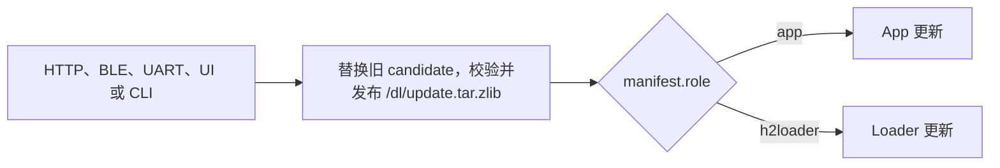
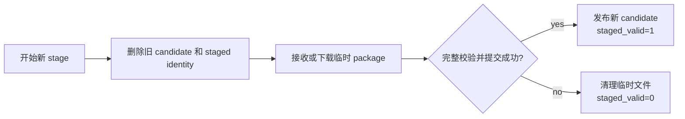

# 更新、启动与回退

H2Loader 分别管理 [App 更新](./app)和 [Loader 更新](./loader)。两条流程共用更新包的传输与 stage 合同，但使用彼此独立的安装、启动和持久化状态。

## 更新入口

更新包可以来自：

- Host UI 或 CLI 通过 UART/BLE command transport 发送。
- Loader 通过 HTTP 下载。
- 其它接入 H2Loader stage API 的 Host transport。

传输方式只负责把完整 package 发布到 `/dl/update.tar.zlib`。Package 发布以后，设备根据 `manifest.role` 进入 App 或 Loader 更新流程。



## 更新包合同

```text
update.tar.zlib
├── manifest
├── checksum
├── data/
└── app/
    └── <target-specific-image>
```

`manifest` 是新格式 archive 的首项，包含 format、role、board、target、version、raw image size 和 raw image SHA-256。无 manifest 的历史 package 只允许进入 legacy App 全量安装流程。

更新流程使用三种不同 identity：

| Identity | 覆盖内容 | 用途 |
| --- | --- | --- |
| staged archive SHA-256 | 完整压缩 package | 传输校验和 staged package identity |
| `manifest.image_sha256` | 解压后的 raw firmware image | 与目标 partition 实际内容比较 |
| 顶层 `checksum` | 最终 `data/` 文件树 | 与 `/data/.checksum` 比较 |

三种 identity 不能互相代替。开始新的 stage 是替换当前 staged candidate 的明确请求：设备在接收新 bytes 前删除旧 candidate 及其 staged identity，不要求 `/dl` 同时容纳两份完整 package。新 package 仍先写入临时文件；只有长度、archive SHA-256 和 namespace 全部通过并提交 staged identity 后，才能发布为新的 `/dl/update.tar.zlib` candidate。

## Stage candidate 生命周期

Stage candidate 与已安装 App 的生命周期彼此独立。成功 stage 只发布新的 package candidate；只有后续显式执行 App 安装或 Loader self-upgrade，才会消费 candidate 并推进对应状态线。



新 stage 的替换、成功或失败都不创建 App rollback，不选择新的 boot target，也不修改 installed identity、App confirmation、manual hold 或已有的 recovery 状态。`staged_valid` 和 staged identity 是 candidate 是否存在的 source of truth，stage 不能通过覆盖 App 生命周期状态来表达 candidate；`install-requested` 和 `installing` 只在后续显式安装操作消费 candidate 时产生。UART、BLE command transport 和 HTTP URL staging 使用同一设备端替换合同，Host 不需要先执行 `stage abort`。

断流、timeout、写入或 sync 失败、长度或 digest 不匹配、package layout 错误、publish 失败以及替换期间重启时，设备清理未发布的新文件并保持 `staged_valid=0`，不会恢复已经明确替换的旧 candidate。`stage abort` 只用于调用方主动取消当前 candidate，不是下一次 stage 的前置步骤。

## 两条状态线

App install/confirm 状态和 Loader self-upgrade 状态分别持久化：

- App 更新维护 installed identity、pending-confirm、confirmed、return request 与 failure。
- Loader 更新维护独立的 `loader_upgrade` record，不修改 App confirmed 状态。

Stage package 不会自动触发更新，也不覆盖已安装 App 的生命周期状态。App package 由 App 安装/重启操作消费；Loader package 只有在显式执行 `h2loader upgrade` 后才开始 self-upgrade。
