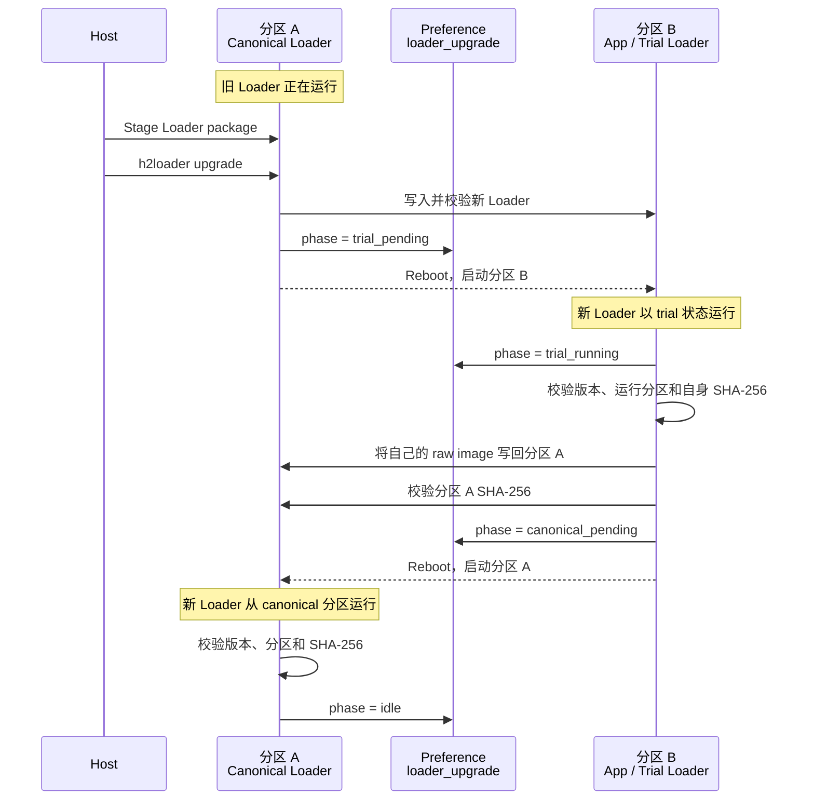

# Loader 更新

Loader 更新把 `manifest.role=h2loader` 的完整 Board-specific Loader firmware 写入临时分区，先以 trial Loader 启动和验证，再写回固定的 canonical Loader 分区。

## 两个分区

H2Loader 没有第三个 Loader 分区。设备使用 [固件结构分区与类型中的分区布局](../firmware_types#分区布局)定义的两个 bootable 区域：A 是固定的 canonical Loader 分区，B 平时是 App 分区，Loader 更新期间临时保存并运行 trial Loader。

Trial Loader 不是第三类固件。它是新 Loader firmware 在更新期间临时运行于 B 分区的状态。更新完成后，B 中的 Loader 不会被识别为 App；下一次 App 安装会覆盖它。

产品可以通过 command availability 动态关闭 Loader self-upgrade。关闭后的 `status`
不显示 upgrade availability，upgrade command 在读取 upgrade record、检查 package、调用
disruptive teardown、写分区或修改持久状态前返回 `H2_PAL_ERR_INVALID_STATE`。该 gate
只增加限制，不绕过 staged package、role、board、target、checksum、partition 或 phase
校验；没有配置 gate 的产品保持默认可用行为。

## 更新流程

正在运行的分区不能作为写入目标：

- 旧 Loader 从 A 运行时，只能把新 Loader 写入 B。
- Trial Loader 从 B 运行时，才能把自己的 raw image 写回 A。
- 回到 A 并验证成功后，才能清除升级状态。

## 升级状态

Loader upgrade 使用 Preference namespace `h2loader` 中独立的 `loader_upgrade` record，与 App install/confirm 状态分开。Phase 包括：

| Phase | 含义 |
| --- | --- |
| `idle` | 当前没有 Loader 更新。 |
| `trial_pending` | 新 Loader 已写入 B，下一步启动 trial。 |
| `trial_running` | Trial Loader 已启动，准备或正在写回 A。 |
| `canonical_pending` | 新 Loader 已写回 A，下一步启动 canonical。 |
| `failed` | 更新失败，保留错误并停在 command/status mode。 |

每次切换 boot partition 前必须先持久化下一 phase。Record 损坏、phase 与 running partition 不一致、image identity 不一致或 SHA-256 校验失败时，不得继续自动切换。

## 写回固定 Loader 分区

Trial Loader 从自己的 running partition 读取恰好 `manifest.image_size` 个 raw bytes，通过有界 buffer 写入 A，并校验最终 SHA-256。Copy-back 不重新解压 `/dl`，Loader package 不安装 data，也不修改 `/data/.checksum`。

ESP 与 BK 的实际 partition 名称、raw image 格式和 boot selection 由对应 [Board 文档](../boards/)定义，但都必须保持“从非目标分区运行，再写目标分区”的规则。

## 更新结果与失败处理

`H2_LOADER_UPGRADE result=OK` 只表示 Loader 已接受升级请求，不表示更新完成。发送该指令的旧 transport session 在收到接受 marker 后结束；Host 必须分别等待 trial 和 canonical 两次 reboot 并重新连接。

`h2loader reboot loader` 使用独立的 reboot 接受边界：先读取 running partition；不在
canonical Loader 时先选择 canonical partition；再持久化
`boot_intent=H2LOADER`；之后才输出并 flush `result=accepted`，再调用 MFG
`before_disruptive` 停止和 join worker，最后 reboot。已经运行在 canonical Loader 时不重复
选择 partition，但仍先提交 boot intent。这个顺序不改变 `h2loader upgrade` 的 trial/copy-back
状态机或接受边界。

partition selection 或 boot-intent commit 失败时不输出 accepted、不 teardown、也不 reboot；
如果 selection 已成功而 intent commit 失败，fail-safe canonical selection 可以保留。accepted
callback/flush、teardown 或 reboot 在 commit 后失败时也不回滚 selection/intent，调用方可以
重试，下一次启动仍按持久化 intent 恢复。`result=accepted` 或 accepted 后明确断连只构成
bounded command-dispatch 结果。Host 可以把它显示为“未验证”并等待用户显式扫描；只有需要
宣称 Loader lifecycle 成功时，才必须重新发现同一 authoritative device、重连并验证 live
role、identity 与 upgrade phase。

Loader 更新结束时必须同时满足：

- 设备运行分区 A 的 canonical Loader。
- Loader version 和 image identity 与目标 package 一致。
- Canonical partition SHA-256 与 manifest 一致。
- `loader_upgrade.phase=idle`。
- H2Loader command transport 已重新可用。

任一步明确失败都进入 `failed` 或 command/status mode，并保留错误、staged Loader package 和可重试能力。设备已经返回 canonical 且 staged Loader package 仍可完整验证时，可以重新执行 `h2loader upgrade`；运行在 trial 时不能把重试当作新的升级起点。
