# 拍学机 Prototyping

拍学机是面向儿童的视觉 AI 伙伴。设备以摄像头作为主要感知入口，通过 GizClaw 与 AI 对话、理解眼前的场景，并根据照片和孩子的想象生成新图片。

当前处于 prototyping 阶段。本页只确定第一版 UI 的视觉方向和首页入口，不定义最终功能、协议或实现结构。

## 产品边界

- 核心体验是“拍摄—理解—对话—创造”，不是传统 OCR 学习机。
- 书本、题目和试卷可以作为视觉对话的输入，但不建设独立的指读、查词、题库匹配或口算批改流程。
- GizClaw 继续提供设备连接、AI 会话和云端服务集成；图片上传、视觉理解和图片生成能力将在后续阶段定义。
- 设备提供独立的对话键和拍照键；触屏不复制这两颗实体键的主要动作。

## 首版视觉方向

- 使用温暖浅色背景、紫蓝主色和珊瑚橙强调色，避免工具型学习软件的冷硬感。
- 首页以单个角色为唯一视觉中心，左上角只显示当前角色名字；不使用功能宫格、底部导航、页面标题、模式名称或操作提示。
- 左右滑动角色切换“魔拍”“聊天”和“梦境”模式；普通角色页不露出相邻角色，也不使用文字解释当前模式。
- 轮播最左侧固定为引导页，集中说明滑动、拍照键和对话键；引导页不代表业务模式。
- 右上角隐藏菜单打开全屏应用页；作品、打电话、安全和设置等入口以三列图标排列，不与儿童的核心体验争夺注意力。
- 首个目标画布为 Waveshare ESP32-P4 的 `480 × 800` 竖屏。

## 首页流程

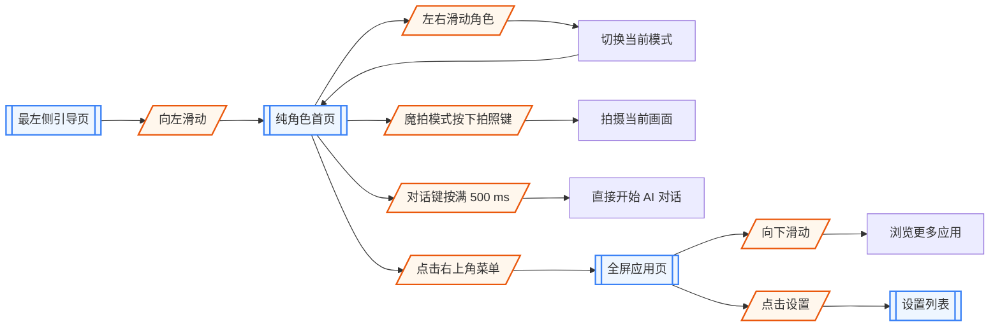

本阶段验收引导页、纯角色首页、应用入口以及各核心应用的首屏信息架构；内容编辑、生成进度、失败恢复和详情页在后续原型中继续补充。

## 内容关系

“作品”是本机创作库，只保存以下三类内容：

- 魔拍就是拍照，不建立独立的普通拍照作品类型。一次拍摄只生成一条魔拍作品；原始画面可以作为该作品的内部来源和探索知识树的现实观察证据，但不在作品列表中重复显示。
- 梦境包括孩子与角色共同生成的图片；对应创作对话仍保存在聊天记录中。
- 音乐包括孩子与 AI 共同创作的歌曲、旋律或声音作品；第三方曲库的播放记录不进入作品。

作品当前以本机存储为唯一来源，不自动同步到云端。聊天记录只在“聊天”中管理，taxonomy、观察记录和世界徽章只在“探索”中管理。“收藏”是孩子主动建立的数字剪贴簿，可以保存对话卡片、页面截图、完整图片或图片裁剪；它不承担完整媒体库职责。

跨应用内容仍保留稳定关联。例如一张公园照片可以关联探索记录、后续聊天和收藏卡片，但聊天或徽章本身不会因此出现在作品列表中。

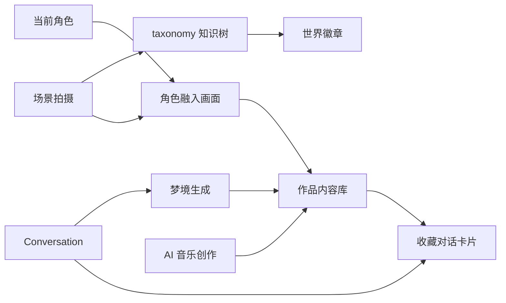

## 核心应用

### 作品

“作品”使用本机存储，首屏只提供“魔拍”“梦境”和“音乐”三个分类。魔拍分类每次拍摄只显示一条最终作品，不把原始画面与角色生成图拆成两条；梦境分类显示生成图片，音乐分类显示 AI 创作的音频作品。聊天摘要、第三方音乐播放记录、世界徽章和知识树节点不进入作品。作品页不显示容量或剩余空间，只突出内容本身；存储信息进入设置或安全管理。当前原型不定义云端备份或多设备同步。

### 魔拍

“魔拍”就是产品中的拍照入口。孩子拍摄真实场景后，系统把当前角色按画面的透视、光线、遮挡和比例生成到场景中，并保存为一条魔拍作品。原始画面属于这条作品的内部来源，不作为第二条作品展示；切换角色只影响之后的生成，不改写已经保存的作品。

### 探索

“探索”不是第二个相机，而是照片形成的收集与知识成长系统。AI 把原始照片归入 taxonomy 知识树，例如“自然—动物—鸟类”或“人类世界—交通工具”。首次发现类别、完成一组观察或补充新物种时可以获得世界徽章；不确定的识别进入待确认，不直接作为知识事实。

### 我的角色

“我的角色”展示已拥有角色和更多可解锁角色。默认伙伴“小拍”免费；其他角色只使用积分解锁，不提供现金购买。角色详情显示名字、声音、性格、当前情绪、亲密度、想象力、探索力和近期共同经历，并允许设置当前角色或默认角色。角色差异影响外观、动画、声音和交流风格，不影响基础 AI 能力。

### 聊天与收藏

“聊天”只用于查看按角色分类的近期聊天记录；长按实体对话键仍是发起新对话的主要入口。记录显示主题、时间、摘要和关联内容，可以恢复上下文继续交流。“收藏”保存孩子主动挑选的内容，界面可以表现为截图或卡片，底层仍记录来源、角色、时间、类型和原内容引用。

### 打电话

“打电话”进入家长预先批准的通讯录，不提供数字拨号盘、号码搜索或陌生号码回拨。孩子端只显示联系人的头像、称呼和呼叫按钮，不显示或编辑电话号码；点击联系人后只能呼叫该联系人的已验证号码。

联系人由家长通过密码进入“安全”后添加、修改或删除，并分别配置“允许孩子拨出”和“允许设备接听”。孩子端通讯录只投影允许拨出的联系人；设备只接听允许呼入的联系人，其他来电直接拦截且不向孩子提供回拨入口。联系人策略变更后立即用于新的呼入和呼出，已经开始的通话不被中途切断。

### 梦境与音乐

“梦境”通过孩子与当前角色的对话生成图片，并把生成图片保存到作品，创作对话继续保存在聊天中。“音乐”同时提供“听音乐”和“AI 创作音乐”：听音乐接入第三方曲库，家长通过手机完成账号授权；AI 创作音乐通过孩子与角色的对话生成歌曲、旋律或声音，并把结果保存到作品。设备只保存第三方服务的受限令牌，不保存账号密码；具体曲库、下载和播放能力服从正式版权及商业接口。

### 应用入口流程

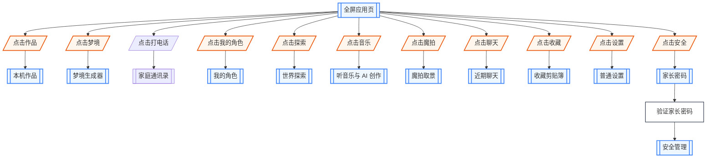

## 实体按键

| 逻辑按键 | 操作 | 当前合同 |
| --- | --- | --- |
| `paixueji.conversation_button` | 按满 `500 ms` | 从当前普通页面直接开始 AI 对话；对话状态覆盖当前模式，但不改变当前角色或模式 |
| `paixueji.shutter_button` | 短按 | 仅在魔拍模式且相机 ready 时拍摄当前画面；其它模式不触发拍照 |

Runtime 负责把 board 按键识别为 down、up 和带时间戳与 click count 的 action event；长按由 App 根据 action 的时间戳或 Button state 判断。Portable App 只消费逻辑 component id，不读取 GPIO 或 board `periph_id`。拍摄进行中、系统更新和关机等不可打断阶段不接受新的对话或拍照动作。

## 应用页与设置

点击首页右上角隐藏菜单后进入全屏应用页，不直接进入设置：

- 应用采用三列网格排列，每行三个图标；图标下只显示简短应用名。
- 页面只纵向滚动，不做横向分页；新增应用继续向下追加。
- 首版入口包括作品、梦境、打电话、我的角色、探索、音乐、魔拍、聊天、收藏、安全、帮助和设置。
- 返回动作回到进入应用页之前的角色和模式，不重置首页轮播位置。

“设置”和“安全”是两个独立入口。设置不要求家长密码，用于音量、亮度、WiFi、熄屏时间、语言、按键反馈、设备信息和系统更新。安全入口要求先验证家长密码，用于通话联系人与呼入呼出白名单、使用时长、内容等级、摄像头与麦克风权限、本机数据与备份策略、第三方账号、积分解锁规则以及数据删除。

设置结构参考 H106，但只保留适合拍学机的项目：

| 分组 | 首版设置项 |
| --- | --- |
| AI 与角色 | 当前角色、默认模式、对话模式、角色声音、图片生成风格 |
| 摄像头与作品 | 拍照提示音、照片确认、作品自动保存、存储空间 |
| 连接 | WiFi、GizClaw 连接状态、网络诊断 |
| 设备 | 音量、屏幕亮度、熄屏时间、语言、按键反馈 |
| 安全入口 | 家长密码；验证后才显示通话联系人、呼入呼出权限、使用时长、内容安全、隐私与图片数据、第三方授权、积分规则 |
| 系统 | 设备信息、系统更新、关机；恢复出厂设置转入安全入口 |

设置列表只负责普通设备选项；安全列表只负责家长策略和危险操作。每个设置页拥有自己的已生效值、草稿、保存、取消和错误状态。两个入口都不是底部导航，也不出现在角色轮播中。

## 首页原型

| 页面 | SVG 原型 |
| --- | --- |
| `paixueji/guide` | 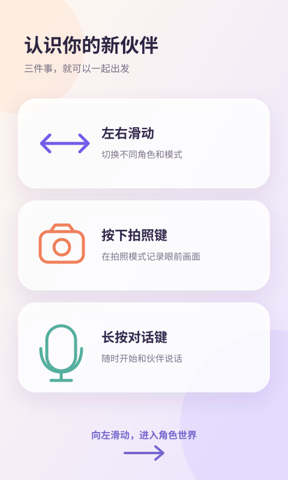 |
| `paixueji/home` | 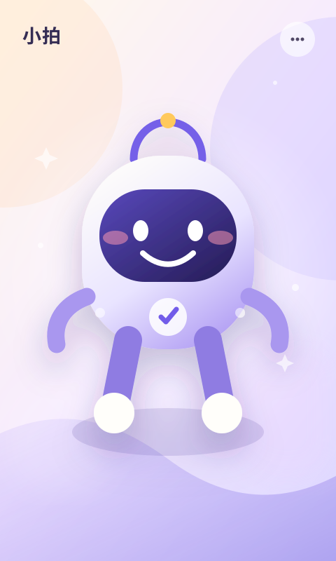 |
| `paixueji/apps` | 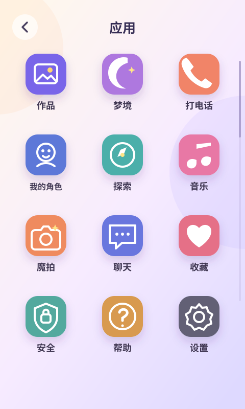 |
| `paixueji/phone` | 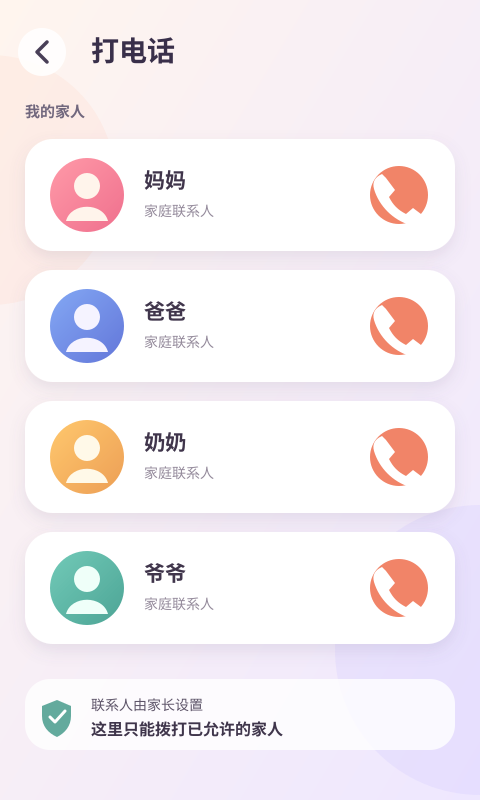 |
| `paixueji/works` | 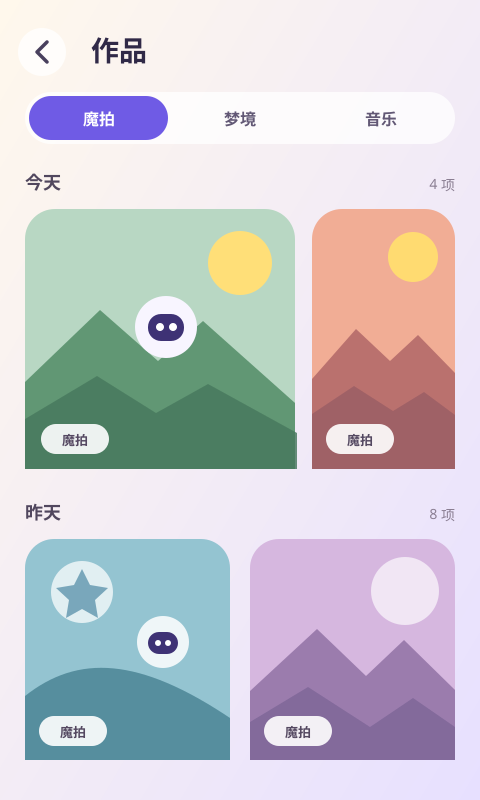 |
| `paixueji/dream` | 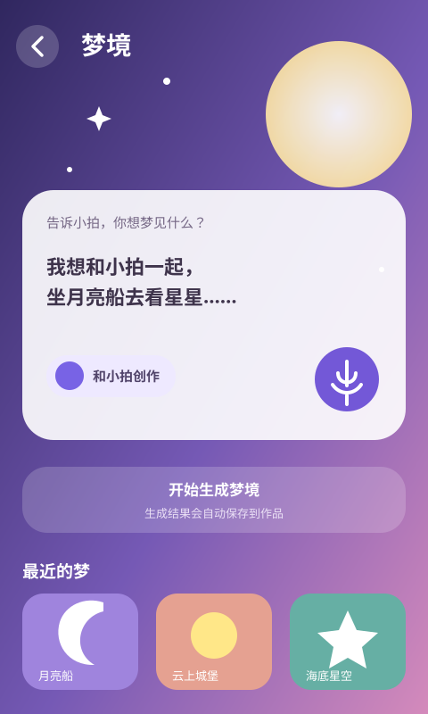 |
| `paixueji/characters` | 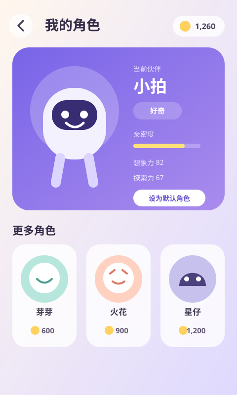 |
| `paixueji/explore` | 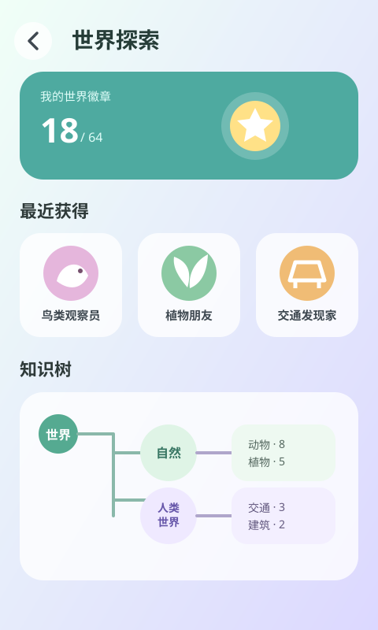 |
| `paixueji/music` | 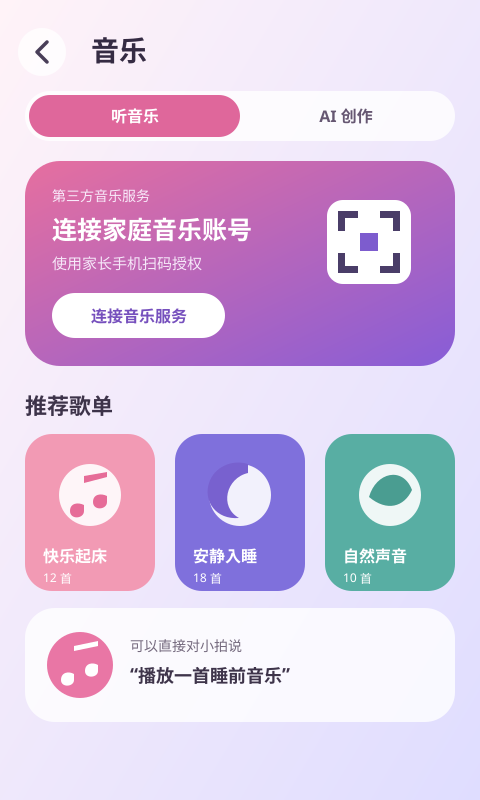 |
| `paixueji/magic-shot` | 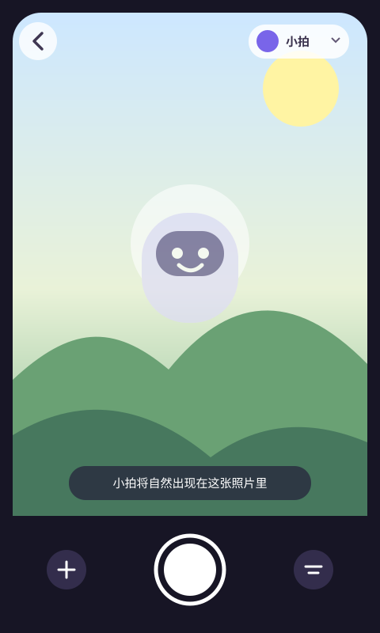 |
| `paixueji/chats` | 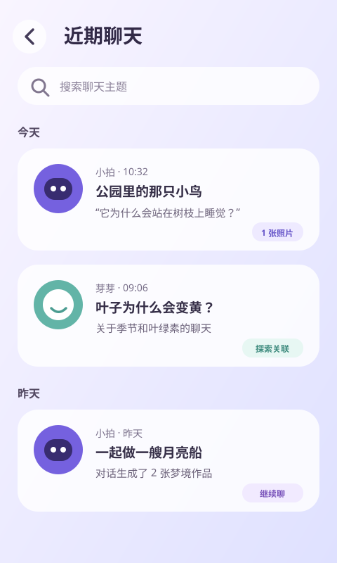 |
| `paixueji/favorites` | 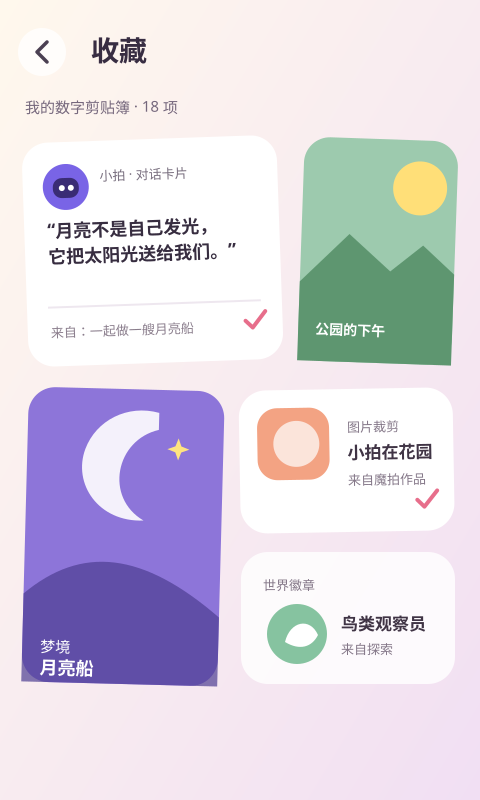 |
| `paixueji/settings` | 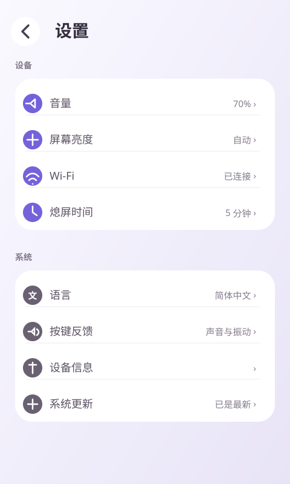 |
| `paixueji/safety-lock` | 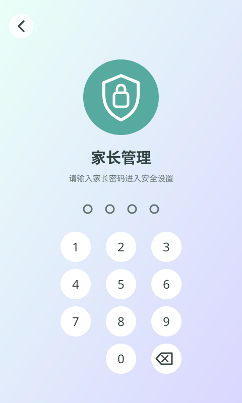 |
| `paixueji/safety` | 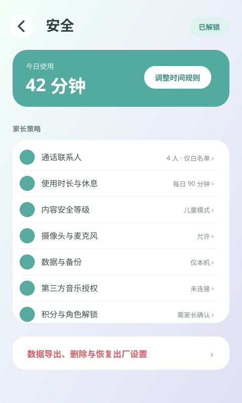 |

`paixueji/guide` 是轮播最左侧唯一允许展示操作说明的页面。`paixueji/home` 展示默认伙伴“小拍”的角色模式，整屏只保留背景、角色、左上角角色名与右上角隐藏菜单；模式含义由角色和后续动效表达，不显示其它文字、按钮或底部导航。`paixueji/apps` 是三列、纵向滚动的全屏应用页，其余原型是从应用页进入的首屏状态。
