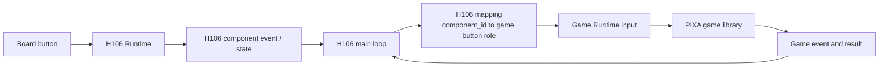

# PIXA Games

PIXA Games 是 reusable game library family。每个 game 是一个独立、target-independent package，放在 `projects/pixa_games/libs/<game>/`，由 H106、Desktop 或其他 project 作为 host 引用。

PIXA Games 包含：

- [Beat Battle](/apps/pixa_games/beat_battle)
- [多边形战斗](/apps/pixa_games/polygon_battle)
- [DinoRun](/apps/pixa_games/dinorun)
- [DinoDive](/apps/pixa_games/dinodive)
- [DinoBounce](/apps/pixa_games/dinobounce)
- [DinoTetris](/apps/pixa_games/dinotetris)
- [Tuxemon](/apps/pixa_games/tuxemon)

## Ownership

`projects/pixa_games/libs` 只是 library family 的容器，不能直接放 public header 或 implementation。每个 game 都是独立 package：

```text
projects/pixa_games/libs/
├── beat_battle/
├── polygon_battle/
├── dinorun/
│   ├── include/
│   ├── src/
│   ├── tests/
│   └── BUILD.bazel
├── dinodive/
├── dinobounce/
├── dinotetris/
└── tuxemon/
```

每个 `projects/pixa_games/libs/<game>` 独立拥有 gameplay state、PixelRoot scene、required button role、game event/result 和环境视觉。PIXA Games family 统一定义 shared Player PIXA contract。Game library 可以依赖仓库级 `libs/game_runtime` 和 `libs/pixa`，不能依赖 H106、具体 project、board、launcher、PAL backend 或芯片 SDK。

Portable game App 位于 `projects/pixa_games/apps/<game>/app/`，负责 Runtime lifecycle、game input role mapping、Display/Audio/Filesystem 接线和阻塞式 entry；App data、asset provenance 与制作输入放在同一个 `projects/pixa_games/apps/<game>/` owner 下。Firmware entry 使用 `projects/pixa_games/libs/cmake/pixa_game.cmake` 把 game library 编译进已有 image component，不创建逐游戏 ESP-IDF 或 BK component。H2Loader entry 位于 `projects/pixa_games/targets/h2loader_tar_zlib/<game>/<board>/`，Desktop executable entry 位于 `projects/pixa_games/targets/cc_binary/<game>/`；两个 target entry 都消费 portable game App，不取得 reusable gameplay ownership。

Project 只引用需要的 game library。例如 H106 Main App 可以同时引用四个 game，Desktop test project 可以只引用其中一个。Game library 不拥有 host route、game menu、pet energy、reward policy 或 Runtime component mapping。

## Game Input

Game 只关心自己需要的 button role 和 gesture。Role 表达 game-local 含义，例如 `left`、`right` 或 `action`；它不是 Runtime `component_id`，也不是 board `periph_id`。

每个 game 子文档列出最小 required button set。Host 必须完整映射这些 role，多余的 host button 不需要传入 game。Game input interface 必须保留该 game 需要的 press、release、click、long press、click count 或 duration 语义，不能把所有输入压成一个无来源的 callback。

Runtime 在每个按下状态的 poll 输出 button down sample 和 action，松开时输出 button up 和最后一个 action。Action 只有 `pressed_at_ms`、`released_at_ms`；按住时释放时间为 0。Host 根据 game role 自行从 action 与事件时间识别首次、持续、释放或 long press；消费 action 的 role 不能再把同一个 sample 的 button down 重复投影为第二次 game action。Button component state 用于初始化或恢复当前快照，不需要由 Host 轮询并重新推断已经存在的 event。

## Host Integration

Host project 运行唯一 main loop，负责 Runtime 和 game library 之间的接线。以 H106 为例：

1. Runtime-owned input task 产生 Runtime event/state；H106 main loop 只消费 event，并在初始化或恢复时读取 component state。
2. H106 根据当前 route 和 game，把 H106 `component_id` 映射成 game button role。
3. H106 通过 Game Runtime input interface 提交 role 和 gesture。
4. H106 使用 monotonic time 驱动 Game Runtime tick。
5. Game Runtime 按顺序交付 input，再执行 PixelRoot scene update 和 render。
6. H106 消费 game event/result，执行 route、energy、reward 或其他产品 effect。

这条路径如下：



H106 集成存在两层不同 mapping：

```text
H106 component_id -> game button role       # H106 App ownership
H106 component_id -> board periph_id        # H106 launcher ownership
```

第一层决定 H106 的哪个逻辑按键驱动当前 game；第二层决定 H106 逻辑组件在当前 board 上连接哪个物理外设。Game library 不拥有任何一层 mapping，也不能 include H106 header。其他 project 引用同一个 game 时提供自己的 mapping，不修改 game implementation。

Host event handler 只做边界转换，不直接实现跳跃、移动、旋转、下落或重新开始等 gameplay。Game library 不读取 Runtime event envelope，不主动读取 PAL button 或 GPIO，也不创建第二套 event loop。

## Text 和 i18n

每个 game config 都借用一个 `h2_game_text_api_t` 和该 game 自己的 localized text catalog。Catalog 保存 semantic label/prompt 的 UTF-8 span；动态 score、distance、floor、level 等数值仍由 game 生成，再与 label 分段排版，不把翻译字符串当作 `printf` format。

H2Loader 和 Desktop host 显式传入 `h2_game_text_builtin_5x7()` 与 repository-owned English catalog，因此不需要外部 font file 并保持当前 5 × 7 视觉。i18n Host 在创建 game 前解析 locale 和 catalog，并注入自己持有的 provider/font。Locale、LVGL/TTF object、glyph cache 和 font lifetime 都属于 Host；PIXA Games 不 include LVGL header、不持有 locale，也不打包中文字体。

更换 locale 时，Host 必须保证借用对象继续有效，或销毁并按新 catalog/provider 重建 game。文本 measure/draw 失败只跳过该 text run，不能改变 gameplay state 或终止 scene。

## PIXA-based PixelRoot Game

每个 game 使用 PixelRoot32 实现 portable scene，使用 `libs/game_runtime` 接入 display、time tick 和 input，使用 `libs/pixa` 读取和绘制贴图。

PIXA 只描述同一个对象在相同 canvas 上的多个动作或状态，不作为一组尺寸无关环境贴图的通用 container。当前 family 由 Host 传入的 PIXA 只有 shared `player.pixa`。PNG、PSD 或 legacy UI 可以作为制作源；game 自己拥有的环境视觉在构建时转换成代码内的 ARGB4444 常量，不能由 scene 在运行时读取外部图片路径。只有旧 UI 本来就是几何绘制的内容，或者 HUD、文字和 debug overlay，才使用 PixelRoot primitive 动态绘制。

### Shared Player PIXA

PIXA Games 共用同一个逻辑 `player.pixa`。Host 为当前角色加载一次 Player PIXA，并把同一个 asset handle 传给需要显示 player 的 game；game 不能各自打包一份角色动画。

当前七个 game 中，四个显示 player，并且只共享 **1 个逻辑 Player PIXA**。Host 按当前角色提供实际 `player.pixa` 路径、加载 asset，并把同一个借用 handle 传给需要 player 的 game；game public config 不接收环境资源路径或 `environment.pixa`。

| Clip | 使用它的 game | Contract |
| --- | --- | --- |
| `run_left` | DinoDive、DinoBounce、Tuxemon | 向左移动的 loop animation。 |
| `run_right` | DinoRun、DinoDive、DinoBounce、Tuxemon | 向右移动的 loop animation。 |
| `jump` | DinoRun | Player 实际离地时开始，保持到再次 landing；当前 legacy source 没有独立 GIF，生成器从 `run_right` frame 生成 non-loop fallback，后续角色可提供专用 clip。 |
| `game_over` | DinoRun、DinoBounce | 进入 game over 后播放的角色 animation；由现有角色的 `dead.gif` 转换。DinoDive 的旧版 game over 使用产品 popup，不切换 player GIF。 |

不同角色可以提供不同的 `player.pixa`，但必须使用相同 clip name，并保留各自的 frame count、frame duration、loop metadata、visible bounds 和 anchor。Game 根据 PIXA metadata 播放，不能假设某个角色固定有几帧。

Beat Battle、多边形战斗和 DinoTetris 不显示 player，因此不接收或验证 `player.pixa`。显示 player 的四个 game 只验证自己使用的 clips；Host 可以在它们之间复用已经打开的同一个 Player PIXA handle。

### Game-owned Environment Visuals

环境视觉属于各 game library，不通过 Host 路径注入，也不聚合成 `environment.pixa`：

| Game | PixelRoot dynamic drawing | Embedded ARGB4444 |
| --- | --- | --- |
| Beat Battle | enemy、cue、判定圈、HP、combo、break meter 和 background | 无必需贴图 |
| 多边形战斗 | player ship、polygon enemy、projectile、pickup、starfield 和 HUD | 无必需贴图 |
| DinoRun | background、ground、charge bar、HUD 和 legacy primitive | block、spike 等 legacy image |
| DinoDive | HUD | legacy `240x240` background、glowing platform UI 和 `40x11` spike |
| DinoBounce | background、paddle、brick、HUD 和 legacy primitive | fireball 等 legacy image |
| DinoTetris | background、board、piece、grid、score 和 preview | 无必需贴图 |
| Tuxemon | player 和 camera viewport | 4bpp tileset、tile layer 和 traversal metadata |

代码内贴图必须由可追溯的源资源或 legacy UI 样式生成，保留尺寸、位置和 alpha，并使用清晰的 game-owned 名称；不能凭视觉印象重画成近似 placeholder。它们不进入 public config，因此 Host 不需要理解其 key、路径或像素格式。

Player clip name 是 Host 与 game 的 asset contract。Game 初始化时必须验证自己使用的 player clip；缺少 clip、frame 无效或 canvas 不兼容时初始化失败，不能静默换成 placeholder。Scene 只持有已经验证的 player asset view，不读取 Host 文件系统。

## Host 与 Game 边界

Game library 拥有：

- Required button role 和 game-facing input semantics。
- Gameplay state、physics、collision、spawn、score 和 difficulty。
- PixelRoot scene、PIXA clip 使用和 render ordering。
- Game event、result 和 reset behavior。

Host project 拥有：

- Runtime lifecycle、event loop 和 component mapping。
- Display、filesystem 和 asset location 的实际接线。
- Route、menu、退出和 game selection。
- Pet energy、XP、reward、persistence 和其他产品 policy。
- Game event/result 到产品 effect 的转换。

Game over、jump、fall、bounce、rotate 或 piece locked 等事实由 game library 输出；是否扣除 energy、增加 XP、返回 H106 game center 或展示产品 popup 由 H106 决定。

## 行为一致性

四个 PixelRoot game 以已有 game 行为为玩法和体验基准，保持 1:1 可观察规则，不借重写改变游戏目标。迁移是使用 PixelRoot entity、physics、scene 和 render system 重新建模，不是把 legacy LVGL timer 和坐标运算逐行翻译到新目录。每个 game 至少保持以下内容一致：

- Required button 及 gesture 对应的 gameplay action。
- 初始状态、game over、reset 和 restart 行为。
- Movement feel、collision rule、spawn 和 difficulty progression；engine tuning 使用跨 target 的时间/距离物理单位。
- Score、distance、level 等计算语义。
- 贴图尺寸、位置、animation 和 layer。
- Game event 及其发生时机。

每个 game 保留自己的 rule 和 constant。只有多个 game 分别具备行为一致性证据后，才能把确认相同的实现提升为共享 library；不能先用统一 abstraction 改写四套玩法，再把结果当作 1:1 实现。

## Lifecycle

Host 按以下顺序使用 game library：

1. 初始化 Runtime，并验证 host component 到 required game button 的完整 mapping。
2. 复用或打开 shared `player.pixa` 并传入当前 game；Beat Battle、多边形战斗和 DinoTetris 不显示 player，因此跳过该步骤。
3. 准备 text provider 和当前 locale 的 game catalog，并保证借用对象覆盖 game 生命周期。
4. 创建 PixelRoot scene 和 Game Runtime。
5. Runtime-owned input task 采集物理输入；host main loop 投影 Runtime event/state、提交 game input 并执行 tick。
6. 停止向 game 提交新输入，取得最终 result。
7. 销毁 Game Runtime 和 scene。
8. 释放 PIXA asset、catalog 和 font/provider 资源。

Game Runtime、scene 和 asset 的生命周期不能超过 host Runtime。Host 退出 game route 或 App entry 返回后，不能再有 task、callback 或 timer 访问这些对象。
