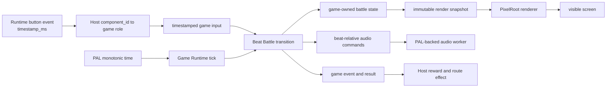
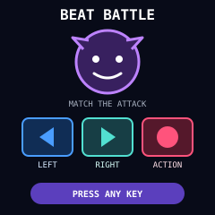
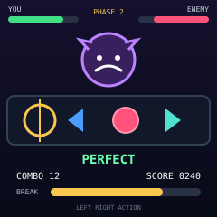
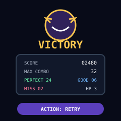

# Beat Battle

Beat Battle 是以节拍作为战斗规则的 PIXA game library。它借用横向节奏轨道、判定圈和连续节拍反馈，但不以播放或复现完整歌曲为目标；敌人的进攻 pattern 决定节奏，玩家通过 `left`、`right` 和 `action` 在目标拍点完成格挡与反击。

通用接入边界见 [PIXA Games](/apps/pixa_games)。

## 游戏合同

Beat Battle ownership 位于 `projects/pixa_games/libs/beat_battle/`。Game library 拥有 beat clock、敌人 pattern、cue 调度、输入判定、玩家与敌人生命值、combo、phase、PixelRoot scene、合成音乐 pattern、音效触发和最终 result。

Host 负责 Runtime event 到 game button role 的映射、route、暂停或退出、产品奖励、持久化和 speaker 生命周期。Beat Battle 不访问 H106 pet、网络、文件系统、board、launcher 或 PAL backend，也不下载在线曲目。

首个版本只提供一场约 60 秒的单敌人战斗。战斗内容由静态 beat pattern 组合产生，不打包 PCM、WAV、Opus 或其它录制音乐，因此曲库容量不是首个版本的玩法边界。

## Required Buttons

| Role | Gesture | Game behavior |
| --- | --- | --- |
| `left` | down | 命中 `guard_left` cue 时完成左侧格挡。 |
| `right` | down | 命中 `guard_right` cue 时完成右侧格挡。 |
| `action` | down | 命中 `strike` cue 时发动反击。 |

三种输入都在 Runtime action 的 `PRESSED` phase 生效。`HOLDING`、`RELEASED`、click 和 long press 不产生额外判定；Host 不能把同一个 poll sample 的 button down 再投影为第二次 action。

输入必须保留 Runtime event 的 monotonic timestamp。Game 使用 event timestamp 与 cue 的目标时间比较，不使用收到输入时的 render frame 时间代替。每个输入最多消费一个 cue；首个版本不生成判定窗口重叠的 cue。

## 战斗流程

玩家进入 Ready 页面后，按任意 required button 开始。Game 使用两个预备小节建立拍速，再进入三阶段战斗。敌人生命值归零时胜利；玩家生命值归零或最终阶段结束时仍未击败敌人则失败。

```mermaid
flowchart LR
    ReadyState(["ready"]) --> ReadyScreen[["Ready 页面"]]
    Start[/"按下 left、right 或 action"/] --> Countdown["播放两个预备小节"]
    ReadyScreen --> Start
    Start --> Countdown
    Countdown --> BattleState(["battle"])
    BattleState --> BattleScreen[["Battle 页面"]]
    Input[/"在目标拍点按键"/] --> Judge["按 timestamp 判定 cue"]
    BattleScreen --> Input
    Judge -->|"battle continues"| BattleState
    Judge -->|"敌人 HP 为 0"| Victory["结算 victory"]
    Judge -->|"玩家 HP 为 0 或时间结束"| Defeat["结算 defeat"]
    Victory --> ResultState(["victory"])
    Defeat --> DefeatState(["defeat"])
    ResultState --> ResultScreen[["Result 页面"]]
    DefeatState --> ResultScreen
    Retry[/"按下 action"/] --> Countdown
    ResultScreen --> Retry

    classDef state fill:#f3f4f6,stroke:#374151,stroke-width:2px
    classDef operation fill:#fff7ed,stroke:#ea580c,stroke-width:2px
    classDef screen fill:#eef6ff,stroke:#3b82f6,stroke-width:2px
    classDef system fill:#ffffff,stroke:#374151,stroke-width:1.5px
    class ReadyState,BattleState,ResultState,DefeatState state
    class Start,Input,Retry operation
    class ReadyScreen,BattleScreen,ResultScreen screen
    class Countdown,Judge,Victory,Defeat system
```

Back、Home 或其它退出操作不属于 required game input。Host 停止提交新输入，销毁 game 并切换自己的 route；Beat Battle 不显示独立退出确认页。

## Beat Clock

Beat clock 是 gameplay、cue movement、判定和合成音乐的唯一时间基准。它从预备小节开始时的 monotonic timestamp 推导当前 bar、beat 和 subdivision，不通过累计 render delta 计算长期位置。Render frame 可以丢帧，但不能使音乐与判定 timeline 漂移。

首个版本使用 4/4 拍和八分音符 subdivision：

| Phase | BPM | Pattern 行为 |
| --- | --- | --- |
| `opening` | 100 | 以单个 cue 和左右交替为主，不使用连续八分音符。 |
| `pressure` | 120 | 加入两连 cue、格挡后反击和跨小节 pattern。 |
| `final` | 140 | 加入四连 cue和休止后的反拍，不生成重叠 cue。 |

Tempo 只在小节边界切换。切换时保持 bar 序号、当前 cue identity 和已经产生的 judgment，不重新开始 audio transport，也不修改已经发布 cue 的目标 timestamp。

## Cue 与判定

每个 cue 包含稳定 id、目标 role、目标 beat position、战斗 effect 和 visual style。首个版本只有三类 cue：

| Cue | Role | Hit effect | Miss effect |
| --- | --- | --- | --- |
| `guard_left` | `left` | 格挡左侧攻击，combo `+1`。 | 玩家 HP `-1`，combo 清零。 |
| `guard_right` | `right` | 格挡右侧攻击，combo `+1`。 | 玩家 HP `-1`，combo 清零。 |
| `strike` | `action` | 对敌人造成伤害，combo `+1`。 | 敌人不受伤，combo 清零。 |

判定使用输入 timestamp 与 cue target timestamp 的绝对差值：

| Judgment | Window | Score multiplier |
| --- | --- | --- |
| `perfect` | `0..60 ms` | `2` |
| `good` | `61..140 ms` | `1` |
| `miss` | 超出 `140 ms`、按错 role 或未输入 | `0` |

`strike` 的基础伤害为 `1`，再乘以 judgment multiplier。`guard_left` 和 `guard_right` 的 `perfect` 不增加额外伤害，但向 break meter 增加 `2`；`good` 增加 `1`。Break meter 达到 `8` 时，下一个 `strike` 额外造成 `4` 点伤害并清空 meter。

在 cue 的 good window 内按错 role 会立即将该 cue 判定为 miss。没有可消费 cue 时的额外输入只中断当前 combo，不扣除玩家 HP，避免按键抖动造成重复伤害。

## Pattern

Pattern 是 target-independent 的静态数据，不是录音时间轴。每个 pattern 使用 beat-relative step 描述 cue role、八分音符 offset 和 effect；game 根据当前 phase 的 BPM 把 beat position 投影为 monotonic target timestamp。

每场战斗从 phase 对应的 pattern pool 中按 deterministic seed 选择 pattern。同一 seed、起始 timestamp 和输入序列必须产生相同的 cue、judgment、HP、combo、break meter、phase 和 result。Pattern 之间至少保留一个四分音符间隔；跨小节 pattern 必须在进入下一次 tempo 切换前结束。

## 数据投影

Beat Battle 不使用 LVGL。Scene state 由 game transition 单一写入，PixelRoot renderer 和 audio schedule 都只读取已经提交的 game state。

Renderer 不修改 battle state。Audio worker 不产生 judgment、不推进 phase，也不回调 scene；audio write 失败只停止声音并输出一次 audio error event，战斗继续使用视觉 beat clock。Host 可以根据该 event 显示静音状态，但不能改变输入窗口。

## 可见状态

### Ready

Ready 页面显示游戏名、三种 cue 与按键的对应关系、敌人和 `PRESS ANY KEY`。开始输入不参与 judgment；输入后进入两个预备小节，判定圈按拍闪烁并显示 `3 2 1 GO`。

### Battle

Battle 页面上半区显示敌人、双方 HP 和 phase。中部是从右向左移动的单轨 cue，固定判定圈位于 `x = 44`；cue 的 target timestamp 到达时，其中心与判定圈中心重合。下半区显示最近 judgment、combo、break meter 和三键提示。

`guard_left` 使用蓝色左箭头，`guard_right` 使用青色右箭头，`strike` 使用红色圆形。颜色不是唯一编码；方向箭头和圆形轮廓必须在单色或低亮度情况下仍可区分。

### Result

Result 页面显示 `VICTORY` 或 `DEFEAT`、score、max combo、perfect/good/miss 数量和 `ACTION: RETRY`。Result 页面不继续推进 beat clock，也不播放新的 battle pattern；已经开始的结束音效播放完成后进入静音。

## 验收页面原型

| 页面 | SVG 原型 |
| --- | --- |
| `beat_battle/ready` |  |
| `beat_battle/battle` |  |
| `beat_battle/result` |  |

三张原型都使用目标 `240 × 240` 可视区域。SVG 只用于文档验收，不进入 game package。

## Visual Assets

Beat Battle 不显示 PIXA Games shared `player.pixa`。Enemy、cue、判定圈、HP、combo、break meter 和背景均由 PixelRoot primitive 绘制；首个版本不接收外部 visual asset 路径，也不打包 game-owned ARGB4444 图片。

Cue 和 HUD 的 geometry、color、layer、hit flash 与 miss shake 属于 Beat Battle library。Host 可以注入 localized text catalog 和 font provider，但不能替换 cue shape 或改变判定圈位置。

## Audio

首个版本的音乐与音效都由 PixelRoot32 audio subsystem 在运行时生成。音乐使用静态 note、instrument、BPM 和 percussion pattern；实际 PCM 由 PAL-backed audio worker 以 `16 kHz` mono S16LE 生成。Game package 不保存 PCM、WAV、Opus 或其它录制音乐。

每个 phase 使用 lead、bass 和 percussion 三个 logical track，并为 cue hit、miss、break 和 result sound 保留 voice capacity。背景音乐不能占满 PixelRoot32 的 8 个 voice；同时发声的持续 music voice 上限为 `4`，其余 voice 供即时战斗反馈使用。

Audio schedule 与 cue 使用同一个 beat clock。Game 必须支持由 Host 提供固定的 output latency compensation；compensation 只改变音频提交时间，不改变 cue target timestamp 或 judgment window。没有经过目标硬件测量时使用 `0 ms`，不能根据 render frame 动态猜测延迟。

## Text 和 i18n

Text catalog 至少包含 `title`、`press_any_key`、`perfect`、`good`、`miss`、`victory`、`defeat`、`score`、`max_combo` 和 `retry`。动态 HP、score、combo 和 judgment count 由 game 生成并与 label 分段绘制，不把 catalog string 当作 `printf` format。

H2Loader 和 Desktop host 使用 repository-owned English catalog 与内置 5 × 7 provider。H106 等 i18n Host 可以注入自己的 catalog 和 font；locale、font 和 glyph cache lifetime 仍由 Host 持有。

## Events and Result

Beat Battle 输出以下 event：

- `battle_started`：预备小节完成并进入首个 battle phase。
- `judgment`：cue 得到 `perfect`、`good` 或 `miss` 判定。
- `phase_changed`：在小节边界进入下一 phase。
- `break_ready`：break meter 首次达到 `8`。
- `battle_ended`：进入 victory 或 defeat result。
- `audio_error`：audio worker 失败并转入静音模式。

Final result 包含 victory、score、max combo、perfect/good/miss count、player remaining HP、enemy remaining HP 和 elapsed battle time。Game library 不直接增加 XP、扣除 pet energy、保存 high score 或切换 route。

Event callback 是同步 observer。Callback 内不能 destroy、reset、发送新 input 或重入当前 game；Host 只记录 event，并在自己的 main loop 中执行产品 effect。

## Lifecycle

Host 启动 speaker并创建 game audio 后，使用 deterministic seed、text provider、localized catalog 和 audio handle 创建 Beat Battle。Host 创建 Game Runtime，提交 timestamped input，并用 monotonic time 驱动 tick。

退出时 Host 先停止提交输入，再取得 final result、销毁 Game Runtime 和 Beat Battle，最后销毁 game audio 并决定是否停止共享 speaker。销毁后不能再有 audio command、event callback 或 render task 访问 game state、pattern 或 text catalog。

Reset 保留当前 deterministic random sequence，不回到创建时的 seed；它清空 HP、score、combo、judgment count 和 active cue，并从新的预备小节 timestamp 开始下一场战斗。

## Acceptance

- Desktop 和目标设备在相同 seed、起始 timestamp 和输入序列下产生相同的 cue、judgment、HP、score、phase 和 result。
- Render tick 被重组或短暂丢帧时，cue target timestamp、judgment 和 music bar position 不漂移。
- `perfect`、`good`、early miss、late miss、wrong-role miss、无输入 miss 和额外输入分别具有边界测试。
- 每次实体按压只有 `PRESSED` phase 产生一次 game input；后续 `HOLDING`、`RELEASED` 或 App gesture 不重复触发 judgment。
- Audio disabled 或 audio write 失败时，完整战斗仍可通过视觉 cue 完成，且只输出一次 `audio_error`。
- Music、cue hit 和 result sound 同时调度时不超过 8 个 voice，command queue overflow 有可观测测试。
- Ready、Battle 和 Result 在 `240 × 240` Desktop 与目标 display 上与验收 SVG 保持布局、shape、颜色和文字层级一致。
- 退出、reset、victory、defeat 和 audio failure 后没有遗留 task、queue、track、callback 或借用资源访问。
