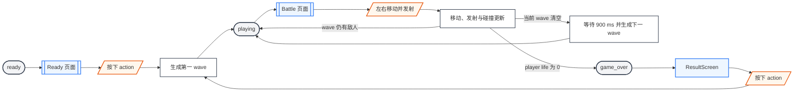
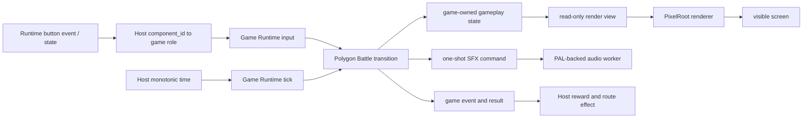
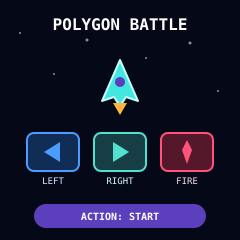
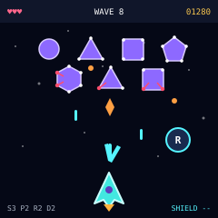
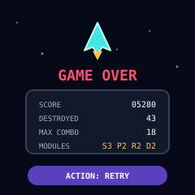

# 多边形战斗

多边形战斗（stable id：`polygon_battle`）是受经典固定画面射击游戏启发的 PIXA game library。玩家在屏幕底部左右移动并向上发射能量弹，击破由圆形和多边形组成的敌人、拾取武器升级和护盾，在无限 wave 中尽可能久地生存。

通用接入边界见 [PIXA Games](/apps/pixa_games)。

## 游戏合同

多边形战斗 ownership 位于 `projects/pixa_games/libs/polygon_battle/`。Game library 拥有 player ship、polygon enemy wave、projectile、collision、weapon module、pickup、shield、life、score、difficulty、PixelRoot scene、合成音效和最终 result。

Host 负责 Runtime event 到 game button role 的映射、route、产品奖励、持久化和 speaker 生命周期。多边形战斗不访问 H106 pet、网络、文件系统、board、launcher 或 PAL backend。

游戏提供无限 polygon wave。前五个 wave 逐步提高敌人数、shooter 数、炮弹速度和射击频率；第五个 wave 达到难度上限，之后继续增加 wave 编号并重复最高难度配置。游戏没有背景音乐，不播放胜利、失败或 wave 切换音乐，也不打包 PCM、WAV、Opus 或语音文件；只有射击、命中、爆炸、拾取和受伤等即时合成音效。

## Required Buttons

| Role | Gesture | Game behavior |
| --- | --- | --- |
| `left` | down / up | Down 开始向左移动，up 结束左移状态。 |
| `right` | down / up | Down 开始向右移动，up 结束右移状态。 |
| `action` | down / up | Down 立即发射并开始按当前射速连续发射，up 停止连续发射。 |

左右键同时按住时 player ship 停止水平移动；释放其中一键后按仍处于 down 状态的另一方向继续移动。Game 直接消费 down/up 状态，不消费 Host 后续生成的 click 或 long press。

Action down 总是尝试立即发射一次。Projectile 已达到 capacity 或武器仍处于 cooldown 时不生成 projectile，也不播放射击音效。Action 保持 down 时由 game clock 按 weapon cadence 发射，不由 Host 重复生成 click。

## 游戏流程

Ready 页面按下 action 后开始第一 wave。每个 wave 清空后保留 `900 ms` 间隔，再生成编号加一的下一 wave。游戏没有最后一关或 clear 状态，只在 player life 归零时进入 game-over result。

Back、Home 或其它退出操作不属于 required game input。Host 停止提交新输入，销毁 game 并切换自己的 route；多边形战斗不显示独立退出确认页。

## Player Ship

Player ship 的 visual bounds 为 `28 × 20 px`，起始中心位于 `(120, 210)`。水平速度为 `150 px/s`，移动范围限制在 visual bounds 不越过 `x = 4..236`。Game 使用 fixed-step movement，render tick 分组不能改变最终位置。

Player 初始有 `3` life，weapon state 为单方向、单次命中、无反弹、每发 `1` 点 damage，且没有 shield。Enemy projectile 或 enemy body 命中时按以下顺序处理：

1. 有 shield 时消耗 shield，不扣 life 或移除 weapon module。
2. 没有 shield 时 life `-1`；已经获得的 weapon module 保留。
3. Player 进入 `1200 ms` invulnerable，期间保持可移动和发射但不再承受碰撞伤害。
4. Life 归零时清除 active projectile 和 pickup，进入 game-over result。

Invulnerable 期间 player ship 以 `100 ms` 周期切换可见性。闪烁只改变 projection，不改变 collision body、input 或 weapon cooldown。

## Weapon Module

Weapon 由四个相互独立、可以同时生效的 module 组成：

| Module | Initial | Upgraded | Contract |
| --- | --- | --- | --- |
| `spread` | `1` direction | `3` directions | 中间 projectile 直线向上，左右各偏转 `15°`。 |
| `pierce` | `1` enemy | `2` enemies | Projectile 命中第二个不同 enemy 并造成 damage 后消失。 |
| `ricochet` | `0` bounce | `2` bounces | Projectile 可以在 side 或 top boundary 反射两次。 |
| `power` | `1` damage | `2` damage | 一次有效命中最多消耗 enemy 的 `2` 点 HP。 |

四个 module 采用组合而不是互斥 weapon type。例如同时拥有全部升级时，一次 fire 生成三枚 projectile，每枚都可以命中最多两个不同 enemy、分别拥有两次 boundary bounce budget，并对每个有效命中的 enemy 造成 `2` 点 damage。

`power` damage 不能超过 enemy remaining HP，也不能把溢出 damage 转移到另一个 enemy。Circle 仍在一次命中后销毁；triangle、square、pentagon 和 hexagon 在 `power = 2` 时分别至少需要 `2`、`2`、`3` 和 `3` 次有效命中。

Weapon cadence 固定为 `220 ms`，player projectile speed 为 `230 px/s`。一次 fire action 无论生成一枚还是三枚 projectile，都只触发一次 `shot` event 和一个 `biu` 音效。

没有 `ricochet` 时，projectile 接触 side 或 top boundary 后立即回收。有 `ricochet` 时，side boundary 反转 horizontal velocity，top boundary 反转 vertical velocity；同一 fixed step 同时接触 side 与 top 的 corner hit 同时反转两个分量，但只消费一次 bounce。两次 bounce 用尽后，下一次 boundary contact 回收 projectile。Bottom boundary 始终回收 projectile，不产生 bounce。

每枚 projectile 对同一个 enemy identity 最多造成一次 damage。`pierce` 未升级时第一次有效命中后回收；升级后第一次有效命中继续飞行，第二个不同 enemy 命中并结算 damage 后回收。Bounce 不清空已经命中的 enemy identity。

Player projectile capacity 为 `48`，覆盖三方向 projectile 在正常 cadence 和两次 bounce 下的最大并发量。一次 fire 所需的全部 slot 不可用时整次 fire 被忽略，不能只生成部分 spread、分配 heap memory、覆盖 active projectile 或延迟补发这次输入。

## Polygon Enemy

敌人在 `y = 38..96` 的 formation 区域生成并左右摆动。每个 wave 同时 active 的敌人不超过 `12`。

敌人的轮廓直接表达 durability：circle 为 `1` 点 HP，多边形 HP 等于角数。没有 `power` 升级时，击破所需的命中次数与角数相同；`power = 2` 时一次有效命中等于基础武器命中两次。

| Shape | HP | Score | Behavior |
| --- | --- | --- | --- |
| `circle` | `1` | `100` | 快速水平摆动，不发射 projectile。 |
| `triangle` | `3` | `240` | 首个具备攻击能力的 shape；周期性向 player 当前位置发射一枚直线 projectile。Projectile 在 fire 时确定 velocity，发射后不追踪 player。 |
| `square` | `4` | `360` | 以阶梯路径移动，每次发射两枚平行 projectile。 |
| `pentagon` | `5` | `500` | 缓慢移动，每次发射三枚扇形 projectile。 |
| `hexagon` | `6` | `700` | 只出现在后两个 wave，交替发射直线与扇形 projectile。 |

每个 polygon vertex 默认使用与轮廓区分的亮色角点。Enemy 每受到 `1` 点 damage，就按顺时针顺序把一个 vertex 标为红色并增加一条朝向中心的短 crack；`power = 2` 的一次有效命中标红两个 vertex，remaining HP 只有 `1` 时只标红最后一个。红色 vertex 数等于已经受到的累计 damage，未变红 vertex 数等于 remaining HP。

非致命 damage projection 只改变角点、crack 和 hit flash，不改变 collision body、movement 或 projectile pattern。最后一个 vertex 标红时 enemy 进入 `destroy_pending`：立即停止 movement 和 fire、禁用 collision，但保留当前 shape `80 ms`，随后提交 destruction、score、drop、event 和 explosion。Circle 没有 vertex；命中时将完整轮廓变红并以相同 `destroy_pending` 规则处理。红色不是唯一 damage 编码，短 crack 必须同步出现，确保低饱和度下仍可识别。

Enemy projectile speed 为 `90..150 px/s`，capacity 为 `32`。Capacity 满时跳过本次 enemy fire，不能阻塞 update 或动态扩容。Wave projectile pattern 必须在 capacity 内设计；跳过行为只作为异常保护，不作为正常难度规则。

## Wave

| Wave | Enemy / shooter | Projectile speed | 单个 shooter 开火间隔 | Formation |
| --- | --- | --- | --- | --- |
| `1` | `6 / 2` | `90 px/s` | `4.0..4.7 s` | 四个 circle 建立移动目标，两个 triangle 稍后引入单发直线 projectile。 |
| `2` | `7 / 5` | `105 px/s` | `3.2..3.8 s` | 保留两个 circle，增加三个 triangle，并首次加入两个 square。 |
| `3` | `8 / 5` | `120 px/s` | `2.5..3.2 s` | 三个 circle、三个 square 与两个 pentagon，开始形成连续火力。 |
| `4` | `9 / 7` | `135 px/s` | `1.9..2.6 s` | Circle、triangle、pentagon 与 hexagon 混合，增加扇形 projectile。 |
| `5+` | `10 / 8` | `150 px/s` | `1.4..2.1 s` | 五种 shape 的混合 formation；保持最高难度并无限生成后续 wave。 |

每波首发还按 formation slot 额外错开，避免多个 shooter 在同一 frame 同时开火。Wave 1 先让玩家适应移动和瞄准，只有两个 triangle 且第一发最早约在 `4.4 s` 后出现；敌人数、shooter 数量、projectile speed 和开火频率随后逐波提高。Wave 5 及以后使用相同难度上限，清空后 wave 编号仍持续增加，永远不会因为清空某一波而结束游戏。

Wave 使用 deterministic seed 选择 formation slot、fire timing、movement phase 和 pickup drop。同一 seed 和 input/tick 序列必须产生相同的 enemy path、projectile、drop、collision、score 和 result。

## Pickup

Enemy 被击破时有 `18%` 概率生成 pickup；同屏 pickup capacity 为 `4`。

| Pickup | Effect |
| --- | --- |
| `spread` | 将 fire pattern 从一个方向升级为三个方向；已经升级时改为 score `+500`。 |
| `pierce` | 将 projectile hit capacity 从一个 enemy 升级为两个不同 enemy；已经升级时改为 score `+500`。 |
| `ricochet` | 将 projectile bounce budget 从 `0` 升级为 `2`；已经升级时改为 score `+500`。 |
| `power` | 将每次有效命中的 damage 从 `1` 升级为 `2`；已经升级时改为 score `+500`。 |
| `shield` | 获得一次碰撞防护；已经有 shield 时改为 score `+300`。 |

Drop type 在 `spread`、`pierce`、`ricochet`、`power` 和 `shield` 之间按 `2:2:2:2:1` 权重选择。Pickup 以 `55 px/s` 向下移动，接触 player ship 时消费，飞出底部时回收。Player invulnerable 期间仍可以拾取。

## Collision 与 Score

Player、enemy、projectile 和 pickup 使用独立 collision layer/mask。Projectile 命中后在同一 fixed step 内提交 damage、score 和 event，再按 `pierce` hit capacity 回收；renderer 不重新推断 collision。

连续击破敌人且 player 未受伤时增加 combo。每 `5` combo 增加 `0.1` score multiplier，最大为 `2.0`；player shield 被消耗或 life 降低时 combo 清零。Wave 间隔不清除 combo。

## 数据投影

多边形战斗不使用 LVGL。Game state 由 input 和 fixed-step transition 单一写入，PixelRoot renderer 只读取已经提交的 render snapshot。

Renderer 不修改 gameplay state。Audio worker 不生成 projectile、damage、drop 或 result，也不回调 scene。Audio queue overflow 或 audio write failure 不能阻塞 gameplay；失败后 game 保持可玩并继续提供全部视觉反馈。

## 可见状态

### Ready

Ready 页面显示游戏名、player ship、左右移动与 action 发射提示，以及 `ACTION: START`。Ready 状态不生成 enemy、projectile、score 或音效；按 action 后重置 ship 到起始位置并进入第一 wave。

### Battle

Battle 页面用深蓝顶栏显示左侧 life、居中 wave 和右侧 score；`spread`、`pierce`、`ricochet`、`power` module 位于底部左侧，shield 位于底部右侧。Enemy formation 占据上半区，player ship 位于底部，pickup 和 projectile 位于 gameplay layer。HUD 不遮挡 player 的有效移动区域。Circle 不得产生 enemy projectile；triangle 是最早出现的 shooter，并只使用单颗直线 projectile。

Enemy 使用紫色实心、浅紫轮廓和白色健康角点；受伤角点与 crack 使用红色。Player projectile 使用青色，enemy projectile 使用橙色；两者同时使用不同 shape，不能只依赖颜色区分。Triangle、square、pentagon 和 hexagon 分别发射圆弹、短条、菱形和长菱形炮弹。Pickup 使用深色实心圆徽章、青色双层轮廓，并以 `S`、`P`、`R`、`D` 或盾形白色符号区分类型。

### Result

Result 页面只显示 `GAME OVER`、score、destroyed enemy count、max combo、四个 weapon module 的最终状态和 `ACTION: RETRY`。进入 Result 后停止所有 movement、spawn 和 projectile update，回收 active audio command 之外的 gameplay object。

Result 页面不播放 defeat music 或 jingle。Player 最后一条 life 消失沿用正常 `player_hit` 音效，随后保持静音。

## 验收页面原型

| 页面 | SVG 原型 |
| --- | --- |
| `polygon_battle/ready` |  |
| `polygon_battle/battle` |  |
| `polygon_battle/result` |  |

三张原型都使用目标 `240 × 240` 可视区域。SVG 只用于文档验收，不进入 game package。

## Visual Assets

多边形战斗不显示 PIXA Games shared `player.pixa`。Player ship、circle、triangle、square、pentagon、hexagon、projectile、pickup、starfield 和 HUD 全部由 PixelRoot primitive 绘制。首个版本不接收外部 visual asset 路径，也不打包 game-owned ARGB4444 图片。

Starfield 使用 visual-only deterministic sequence，最多同时显示 `24` 颗星。它不参与 collision、score 或 gameplay random sequence；关闭 starfield 不改变任何 game result。

## Audio

多边形战斗只有 one-shot synthesized SFX，不创建 MusicPlayer、不调度 background track，也不保存任何录制音频。所有 recipe 使用 integer Hz、ms 和 permille 描述，由 shared game audio worker 生成 `16 kHz` mono S16LE PCM。

| SFX | Recipe intent | Trigger |
| --- | --- | --- |
| `shot` | `1200 Hz` 到 `1800 Hz`、约 `45 ms` 的短 pulse sweep，表现为 `biu`。 | 一次 fire action 实际生成 projectile。 |
| `enemy_hit` | 约 `35 ms` 的低音量 noise tick。 | Projectile 造成 damage 但 enemy 未销毁；一次碰撞只播放一次。 |
| `enemy_destroyed` | 约 `105 ms` 的下降 noise 与 saw，最多使用两个 voice。 | Enemy 被 player projectile 销毁。 |
| `pickup` | `660 Hz` 到 `1320 Hz`、约 `140 ms` 的上升 sine sweep。 | Player 消费 weapon module 或 `shield`。 |
| `shield_hit` | `520 Hz` 到 `180 Hz`、约 `120 ms` 的 triangle sweep。 | Shield 消耗。 |
| `player_hit` | 约 `250 ms` 的下降 noise sweep。 | Player life 降低。 |

`spread` 一次生成三个 projectile 时仍只播放一个 `shot`。Action 保持 down 时，`shot` 频率不超过固定 weapon cadence；射速不会绕过 audio command queue capacity。

SFX priority 从高到低为 `player_hit`、`shield_hit`、`enemy_destroyed`、`pickup`、`enemy_hit`、`shot`。Queue 满时允许丢弃新的 `shot` 或 `enemy_hit`，不能丢弃已经提交的 `player_hit`；任何 backpressure 都不能阻塞 game update。一次爆炸和一次射击同时发生时最多使用 `3` 个 voice，所有同时发声的 SFX 总计不能超过 PixelRoot32 的 `8` 个 voice。

首个版本不提供 master bitcrush、BPM、tempo、music volume 或 background music config。Host 只负责 speaker start/stop 和共享音量策略，不能把音乐文件作为多边形战斗 config 注入。

## Text 和 i18n

Text catalog 至少包含 `title`、`start`、`life`、`score`、`wave`、`spread`、`pierce`、`ricochet`、`power`、`game_over`、`destroyed`、`max_combo` 和 `retry`。动态 life、score、wave、module value 和统计值由 game 生成并与 label 分段绘制，不把 catalog string 当作 `printf` format。

H2Loader 和 Desktop host 使用 repository-owned English catalog 与内置 5 × 7 provider。H106 等 i18n Host 可以注入自己的 catalog 和 font；locale、font 和 glyph cache lifetime 仍由 Host 持有。

## Events and Result

多边形战斗输出以下 event：

- `shot`：一次 fire action 实际生成至少一个 player projectile。
- `enemy_hit`：player projectile 对 enemy 造成 damage；event 包含 enemy identity、shape、applied damage 和 remaining HP。
- `enemy_destroyed`：enemy 被 player projectile 销毁。
- `pickup_collected`：player 消费 weapon module 或 `shield`。
- `player_hit`：shield 被消耗或 player life 降低。
- `wave_started`：wave entry 开始。
- `wave_cleared`：当前 wave 的全部 enemy 被清空。
- `game_over`：player life 归零。
- `audio_error`：audio worker 失败并转入静音模式。

Final result 包含当前 wave、score、destroyed enemy count、max combo、spread direction count、pierce hit capacity、ricochet bounce budget、power damage、remaining life 和 elapsed play time。Game library 不直接增加 XP、扣除 pet energy、保存 high score 或切换 route。

Event callback 是同步 observer。Callback 内不能 destroy、reset、发送新 input 或重入当前 game；Host 只记录 event，并在自己的 main loop 中执行产品 effect。

## Lifecycle

Host 启动 speaker 并创建 game audio 后，使用 deterministic seed、text provider、localized catalog 和 audio handle 创建多边形战斗。Host 创建 Game Runtime，提交 down/up input，并用 monotonic time 驱动 tick。

退出时 Host 先停止提交输入，再取得 final result、销毁 Game Runtime 和多边形战斗，最后销毁 game audio 并决定是否停止共享 speaker。销毁后不能再有 audio command、event callback 或 render task 访问 game state、pool 或 text catalog。

Reset 保留当前 deterministic random sequence，不回到创建时的 seed；它把 weapon module 恢复为单方向、单次命中、无反弹和每发 `1` 点 damage，清空 life、shield、score、combo、wave 和所有 object pool，并返回 Ready 状态。

## Acceptance

- Desktop 和目标设备在相同 seed、tick 和 input 序列下产生相同的 enemy path、projectile、drop、collision、score 和 result。
- Left/right 同时 down、交错 release、action tap、action hold 和 cooldown/capacity 边界分别具有测试。
- `spread` 的单方向、三方向和整次 fire capacity 行为分别具有测试。
- `pierce` 的第一命中、第二个不同 enemy 命中、重复 enemy identity 和最终回收分别具有测试。
- `ricochet` 的 side、top、corner、bottom、bounce budget 和 bounce 后 enemy identity 保留分别具有测试。
- `power` 的 `1`、`2` damage、remaining HP cap 和无溢出转移分别具有测试。
- 四个 module 同时启用时，projectile count、hit capacity、bounce budget、damage 和 object pool capacity 分别具有测试。
- Circle、triangle、square、pentagon 和 hexagon 的 HP 固定为 `1`、`3`、`4`、`5` 和 `6`；基础武器需要相同次数的命中，`power = 2` 时按累计 damage 销毁。
- 每个有效 damage point 只把一个 vertex 标红并增加对应 crack；red vertex、remaining bright vertex、remaining HP、collision body 和 enemy behavior 保持一致。
- Circle 在全部 input/tick 序列下都不生成 enemy projectile；triangle 每次 fire 只生成一枚朝向 player 的直线 projectile。
- 最后一个 polygon vertex 标红或 circle 轮廓变红后保持约 `80 ms` hit flash，再提交 destruction、score、drop 和 event。
- Shield、life、invulnerable、weapon 保留、combo reset 和 game-over ordering 分别具有测试。
- Player projectile、enemy projectile、enemy 和 pickup pool 到达 capacity 时不分配 heap memory、不覆盖 active object，也不阻塞 update。
- Game package 不包含 music track、PCM、WAV、Opus 或语音资源；Ready、Battle、Result 和 wave 间隔均没有背景音乐或 jingle。
- 每次实际 fire 只产生一个 `shot` SFX；多 projectile、queue overflow 和 audio failure 不改变 gameplay state。
- Audio disabled 或 audio write 失败时，完整游戏仍可通过视觉反馈完成，且只输出一次 `audio_error`。
- Ready、Battle 和 Result 在 `240 × 240` Desktop 与目标 display 上与验收 SVG 保持布局、shape、颜色和文字层级一致。
- 退出、reset、clear、game over 和 audio failure 后没有遗留 task、queue、track、callback 或借用资源访问。
