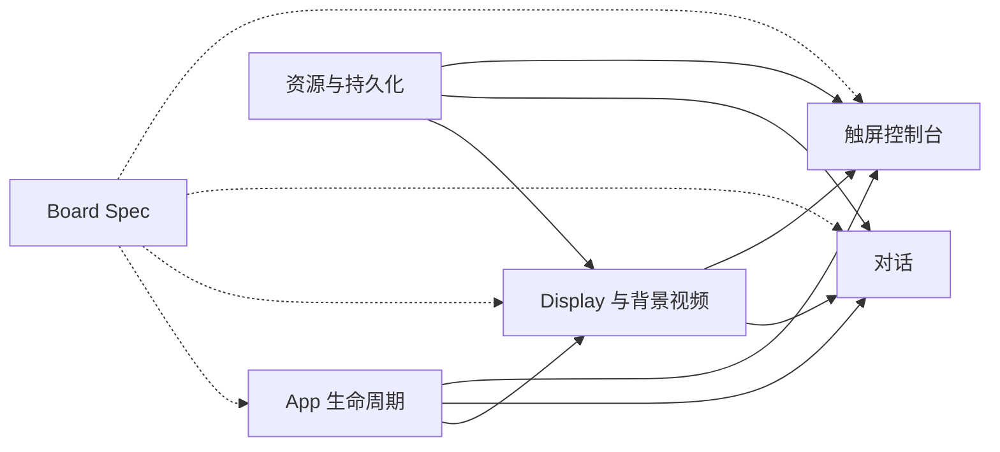

# Showcase 展架程序

Showcase 是仓库顶层独立 portable App，代码 ownership 为 `projects/showcase/apps/showcase/`，不属于 H106 project group。首个目标是 KICKPI K4B Linux 展架设备：背景持续循环播放 SD 卡中的 MP4，用户通过单实体键发起对话或打开本机触屏控制台；对话时在右上角叠加当前角色窗口，控制台用于选择背景音乐视频和对话角色。

控制台是 Showcase 进程内的原生 Linux UI，不是网页，不提供 AP 地址，也不运行 HTTP 管理服务。背景 MP4 在待机、对话和控制台期间持续推进，所有前景界面由同一个 compositor 叠加。

## App

| App | Portable source | Target integration |
| --- | --- | --- |
| Showcase | `projects/showcase/apps/showcase/` | K4B Linux service 与 Desktop `showcase` entry |

Showcase 定义固定逻辑输入 `showcase.action_button`。目标 launcher 负责把产品最终选定的电源键或喇叭键映射为该 component，并提供触摸、Display、audio、storage、network 和 MP4 media service。

## 流程目录

| 顺序 | 文档 | 负责内容 |
| --- | --- | --- |
| 1 | [App 生命周期](/apps/showcase/lifecycle) | Linux service、launcher、Runtime、阻塞式 entry、main loop、shutdown 和 fatal |
| 2 | [Display 与背景视频](/apps/showcase/display) | 1024×600 compositor、循环 MP4、overlay 和唯一 Display ownership |
| 3 | [对话](/apps/showcase/conversation) | 500 ms 长按、录音、GizClaw/chat effect 和右上角角色窗口 |
| 4 | [触屏控制台](/apps/showcase/console) | 5 秒十连击入口、左侧 Tab、名称列表、draft、确定和关闭 |
| 5 | [资源与持久化](/apps/showcase/resources) | SD 卡 MP4 catalog、H106 角色资源导入、preference 和 fallback |
| 6 | [Board Spec](/apps/showcase/board/) | 产品型号的 Linux、屏幕、触摸、按键、SD 卡、音频和 launcher mapping |

## 稳定产品合同

- 背景 visual 始终来自当前 `music_video_id` 对应的 MP4，并循环播放。
- `showcase.action_button` 按住满 500 ms 后进入对话；500 ms 前释放只参与十连击 gesture。
- 5 秒内连续完成 10 次短按打开 `showcase/console/music`，不启动浏览器或网络管理服务。
- 控制台左侧固定显示“选择音乐”和“选择对话角色”两个 Tab，底部显示当前视频和当前角色。
- 对话窗口固定叠加在屏幕右上角；角色来自 Showcase-owned catalog，首批导入 H106 的迪迦和赛罗真实角色图。
- 控制台、对话和保存 effect 都不暂停背景 MP4 timeline。

## Board

当前首个目标为 [KICKPI K4B](/apps/showcase/board/k4b)：运行 Linux，使用 1024×600 横向触屏，并向用户提供一个实体操作键。Board 自带的 reset、烧录或维护键不属于 Showcase 输入。

Showcase 是跨产品型号 App。新产品型号必须新增独立 Board Spec，不能修改 K4B 参数或让 portable App 依赖 K4B private device path。

## 文档关系

下图表达文档 ownership 和依赖，不表示运行时页面状态。

运行行为、Subject、effect、原型和验收以对应专题文档为准；总览不维护第二份详细状态机。
