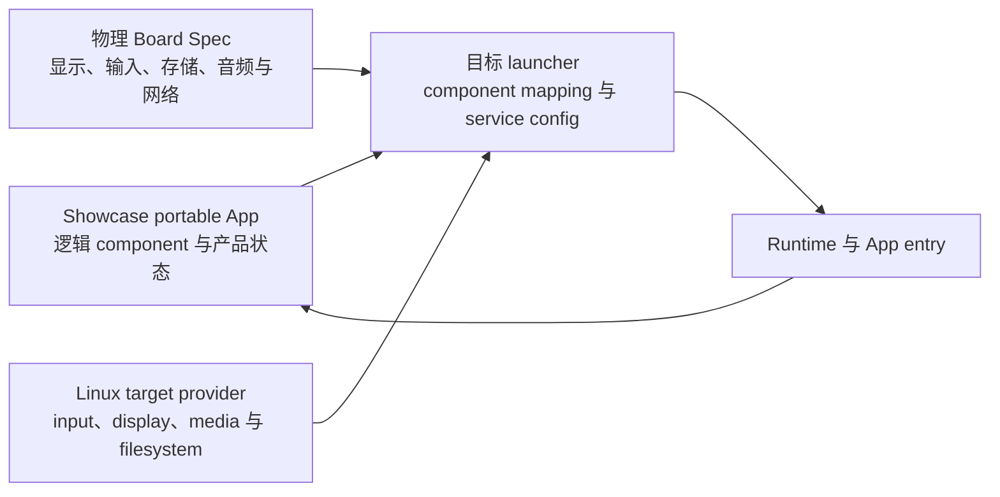

# Showcase Board Spec

Showcase 是跨产品型号 portable App。每个产品装配必须用独立 Board Spec 记录已确认的计算平台、显示、输入、存储、音频、网络、Linux service 和 launcher mapping，不能把首个 K4B 目标的硬件参数写成所有 Showcase 设备的公共保证。

| Board | 操作系统 | 显示 | 用户输入 | 当前范围 |
| --- | --- | --- | --- | --- |
| [KICKPI K4B](/apps/showcase/board/k4b) | Linux | 1024×600 横向触屏 | 一个实体操作键 | 首个 Showcase 产品装配 |

## 配置分层

- Showcase App 只定义稳定逻辑 component 和产品状态，不 include K4B header 或 Linux device handle。
- Board Spec 定义产品装配实际提供的硬件能力，不把板卡可能支持但本机未接入的接口写成必需能力。
- Linux provider 把 button、touch、DRM/framebuffer、ALSA、mount 和 network interface 适配到稳定 target service。
- Launcher 验证必需能力并建立 mapping；缺少屏幕、对话键或媒体目录时启动失败或进入 Board Spec 明确规定的安全状态。
- 新产品型号必须增加自己的 Board Spec，不能修改 K4B 参数来覆盖另一种硬件。

具体硬件参数、映射与验收以对应 Board 子文档为准。
