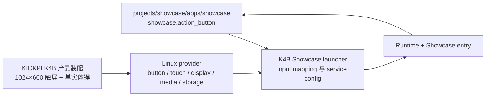

# Showcase Board：KICKPI K4B

本文定义首个 Showcase 产品装配在 KICKPI K4B Linux Board 上的硬件和 launcher 合同。确认范围来自当前实机信息、实物照片和 KICKPI 官方 K4B 资料；未在表中确认的 GPIO、panel interface、audio codec、按键电气极性和 Linux device path 不能由 App 猜测。

## 配置分层

Portable App 只观察逻辑按键、触摸、显示/媒体服务和 filesystem catalog。Linux file descriptor、input event code、touch calibration、DRM connector、framebuffer node、ALSA device 和 mount source 都属于 K4B integration private config。

## 硬件 spec

| 模块 | 已确认 spec | Showcase 用途 | 边界 |
| --- | --- | --- | --- |
| Board | KICKPI K4B，Allwinner T113-S3，双核 Arm Cortex-A7 | 运行 Showcase Linux 用户态程序 | 内存和存储容量随采购型号变化，App 不按容量分支 |
| 操作系统 | Linux；K4B 官方提供 Buildroot 2019.02 和精简 Ubuntu 20.04 支持 | 运行 App、MP4、触屏控制台和开机 service | Showcase 不依赖发行版桌面环境 |
| 屏幕 | 单块 1024×600 横向触屏 | 背景 MP4、右上角对话框和本机控制台 | panel interface 与 Linux display/touch node 不进入 App contract |
| 用户按键 | 一个用户可操作实体键；当前 Linux input identity 为 `sunxi-gpadc0` / `KEY_MODE`（373） | 长按发起对话；5 秒内短按 10 次打开控制台 | RESET、FEL 和维护键不映射给 App；`eventN` 不是稳定标识 |
| SD 卡 | TF/SD 卡作为 MP4 catalog 来源 | 从名称列表选择循环背景视频 | App 只访问 launcher 注入的 catalog root |
| 音频 | 产品装配包含播放与录音硬件 | 播放对话语音并采集按住说话音频 | codec、声道和 ALSA device 由 integration config 决定 |
| 网络 | 当前装配通过 Quectel EC801E-CN USB modem 的 `cdc_ether` data interface `eth1` 接入 Linux 网络 | 提交语音对话并接收角色响应 | Linux image 管理 DHCP/route/DNS；App 不拥有 AT、SIM、APN 或 USB mode switching |

K4B 官方板卡还提供 USB、以太网、扩展 GPIO 和维护按键等能力，但当前 Showcase 流程没有直接消费这些能力，因此不建立 App component。

## Display 与 touch contract

- 逻辑 viewport 固定为 1024×600 横屏，坐标原点位于左上角。
- Touch provider 必须把物理触摸坐标校准并映射到相同逻辑 viewport，支持 down、move 和 up。
- K4B BSP 通过 evdev stable device name `gt9xxnew_ts` 发现 Touch，不绑定易变的 `/dev/input/eventN`；`libs/lvgl` adapter 将 Touch PAL 投影为 LVGL pointer indev。
- 待机 MP4 填满整个 viewport，不叠加任何文字或操作提示；源比例不一致时由 media integration 按发布配置 crop 或 letterbox。
- 对话时背景 MP4 继续推进，角色对话框叠加在右上角。
- 控制台是 Showcase 进程内原生 UI layer，不启动浏览器；打开控制台时背景 MP4 继续推进。
- compositor 是唯一 display present owner；decoder、chat worker 和 storage worker 不能直接 present。
- 启动过程中桌面、shell、鼠标指针和 window decoration 不能出现在产品屏幕上。
- display 或 touch 初始化失败属于启动失败，不能降级为无控制台的假成功状态。

所有设备页面验收 SVG 必须声明 `width="1024" height="600" viewBox="0 0 1024 600"`。

## Button 与 gesture contract

| 逻辑 component | 物理输入 | Linux provider 输出 | App gesture |
| --- | --- | --- | --- |
| `showcase.action_button` | 产品唯一实体操作键 | 去抖后的 down/up event | 按住 500 ms 发起对话；5 秒内连续短按 10 次打开控制台 |

- 500 ms 前 release 只记为一次短按，不开始录音。
- 十连击相邻 release 间隔不超过 500 ms，总时长不超过 5 秒。
- 中途按住达到 500 ms、超时、进入对话或打开控制台都会清空短按计数。
- App 启动时按键已经处于 down，不开始录音；必须先观察 release。
- App 停止、provider 断开或进程失焦时合成 release，防止录音永久保持。
- RESET、FEL、板载维护键或其它电源动作不复用 `showcase.action_button`。实体键外观可以是电源键或喇叭键，launcher 只绑定产品最终选定的那一个用户键。
- K4B BSP 通过 evdev device name `sunxi-gpadc0` 和 `KEY_MODE`（373）发现实体键，再映射为 `action_button` peripheral；Runtime/launcher 负责映射到 `showcase.action_button`。不得把当前枚举出的 `/dev/input/event1` 写进 portable App 或稳定配置。

## Native console contract

- 控制台是与播放器、conversation overlay 同进程的原生触屏 UI。
- 左侧 Tab 顺序固定为“视频”“对话角色”。
- 左侧栏底部固定显示“当前视频”和“当前角色”。
- 右侧内容区提供可滚动名称列表、draft selection 和“确定”，不提供筛选框。
- “视频”只列出当前 SD catalog generation 中有效的 MP4；画面和音轨作为同一个条目切换。
- “选择对话角色”列出 Showcase character catalog 的全部有效角色，只显示名称，不显示角色图或预览。
- Tab 切换、关闭控制台或滚动列表不会保存；点击“确定”才原子提交当前 Tab 的 draft。
- Console layer 打开时继续接收 touch，但暂停实体键 gesture；关闭后必须等待实体键 release 再重新接受 gesture。

## Storage 与 media

- Linux integration 把 SD 卡允许目录挂载为 MP4 catalog root；App 只保存 catalog id 和规范化相对路径。
- SD 卡未挂载、移除或当前视频消失时使用内置 fallback，并允许继续打开控制台查看错误。
- catalog scanner 拒绝符号链接逃逸、设备节点和 catalog root 外路径。
- decoder 必须支持发布包规定的视频编码；codec、bitrate 和容器属于 media package spec，不由 Board Spec 猜测。
- 首版 K4B provider 使用 T113-S3 CedarX 解码 MP4 中的 H.264 track，通过 Video Decoder PAL 返回 CPU-readable YUV420P 或 RGB565 frame；AAC audio track 不由 decoder PAL 处理。
- CedarX `VideoPicture` 在 `acquire_frame` 与 `release_frame` 之间由 decoder session 持有；provider 在返回 CPU plane 前完成 cache coherency，App 不接触 CedarX handle。

## Linux 启动与进程

- 完整 Showcase launcher 只有在 filesystem、display、touch、button、audio 和 network provider 齐备后才能启动产品 service。
- 当前 USB modem 只确认了 kernel 已建立 `eth1` data interface；未出现或未验证 modem control node 时，Modem PAL 仍是 unsupported。Showcase 网络只能依赖 Linux 已配置好的 socket/netif，不直接发 AT command。
- Ubuntu image 使用 `systemd` unit；其它 Linux image 使用等价 service manager contract。
- 当前 `projects/example/targets/cc_binary/mp4-player/kickpi_k4b/` 是 video-only MP4 Player smoke，只验证 portable MP4 demux、pthread Task、CedarX H.264 decoder 与 framebuffer Display；它不是 `projects/showcase/apps/showcase` 的产品入口，不能据此声明 Showcase 已可运行。
- K4B board runtime wiring 位于 `boards/kickpi_k4b/t113-s3/`；通用 pthread/framebuffer provider 位于 `libs/pal/providers/linux/`，CedarX vendor integration 位于 `libs/pal/providers/allwinner-linux/`。
- 官方 Buildroot 2019.02 image 使用 ARM EABI5 hard-float ABI，动态加载器为 `/lib/ld-linux-armhf.so.3`。交付 binary 必须按该 sysroot/ABI link；仅生成 `/lib/ld-linux.so.3` 的 soft-float binary 不可安装。
- Display 与 MP4 Player smoke 都通过 `bazel build --config=kickpi_k4b <exact-label>` 构建；Bazel 按固定 URL 和 SHA-256 获取 Arm GNU 8.2 hard-float compiler/sysroot，不读取 `K4B_TOOLCHAIN_ROOT`、ambient compiler 或 Homebrew prefix。该 cross build 的 execution platform 固定为 Linux x86_64，产物固定为 ARMv7 EABI5 hard-float，并使用 `/lib/ld-linux-armhf.so.3`。
- MP4 Player 通过 `K4B_CEDARX_INCLUDE_DIR` 与 `K4B_CEDARX_LIB_DIR` 消费 `firmwares-devenv` 的 compact CedarX SDK。Bazel 将其映射为 external repository；vendor SDK 不属于公共 compiler/sysroot。
- 设备发现、应用烧录、运行与状态查询由标准 ADB 负责，具体命令见 [K4B 应用烧录](/zh/using/embed_linux/kickpi_k4b)。K4B 必须已经运行 Linux 与 `adbd`，操作系统安装不属于 launcher。
- service 以全屏产品模式启动，不进入桌面 session，不依赖登录用户手动运行。
- service manager 负责异常重启和日志收集；App 负责配置、catalog generation、gesture 和对话恢复状态。
- 正常停止先拒绝新 input，再取消并 join worker，最后释放 media、display、touch、audio 和 mount observation。

## Launcher mapping

| App requirement | K4B integration | 验证时机 |
| --- | --- | --- |
| `showcase.action_button` | 单实体键 Linux input provider | App entry 前验证 down/up 与去抖能力 |
| Touch | 1024×600 calibrated touch provider | App entry 前完成四角和中心点映射验证 |
| Display | 1024×600 fullscreen compositor target | service 启动时验证 mode 与 present |
| MP4 catalog | SD 卡 catalog root | 初次 scan 与每次 mount generation |
| Audio input/output | Linux audio provider | 首次对话前 open；失败时投影可恢复错误 |
| Chat network | Linux network provider | 对话提交前验证，不影响离线背景和控制台 |

具体 GPIO、evdev code、touch device node、DRM node 和 network interface 进入 K4B launcher 私有配置，不进入 `projects/showcase/apps/showcase/` public header。

## 验收

- Linux 开机后无需人工登录，Showcase 自动全屏显示 1024×600 循环 MP4。
- 屏幕无桌面、shell、鼠标指针或窗口边框，触摸四角和中心映射正确。
- 短按不发起对话；按住 500 ms 开始录音，松开只提交一次。
- 5 秒内连续短按 10 次打开原生触屏控制台，不启动浏览器。
- 控制台可通过左侧 Tab 从名称列表选择 MP4 或角色，角色数量超过 viewport 时可滚动，底部显示当前生效值。
- 对话期间背景 MP4 继续推进，角色窗口位于右上角。
- 插入、移除和重新插入 SD 卡时 catalog generation 正确更新，进程不崩溃。
- display、touch、button、audio、SD 卡或聊天网络缺失时符合失败合同，不静默伪装成功。

K4B 芯片和板卡能力参考 [KICKPI K4B 硬件介绍](https://doc.kickpi.cn/Products/Introduction/KICKPI-K4B/)；Showcase 产品装配的 1024×600 触屏和单实体键以实机信息为准。
