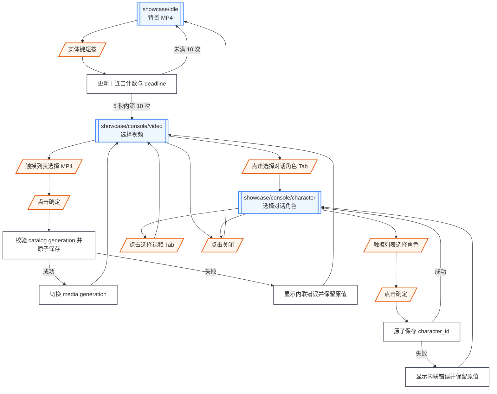
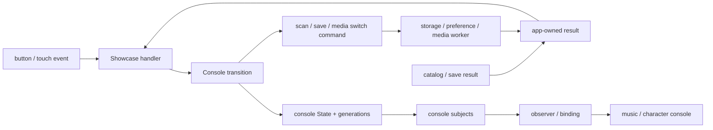
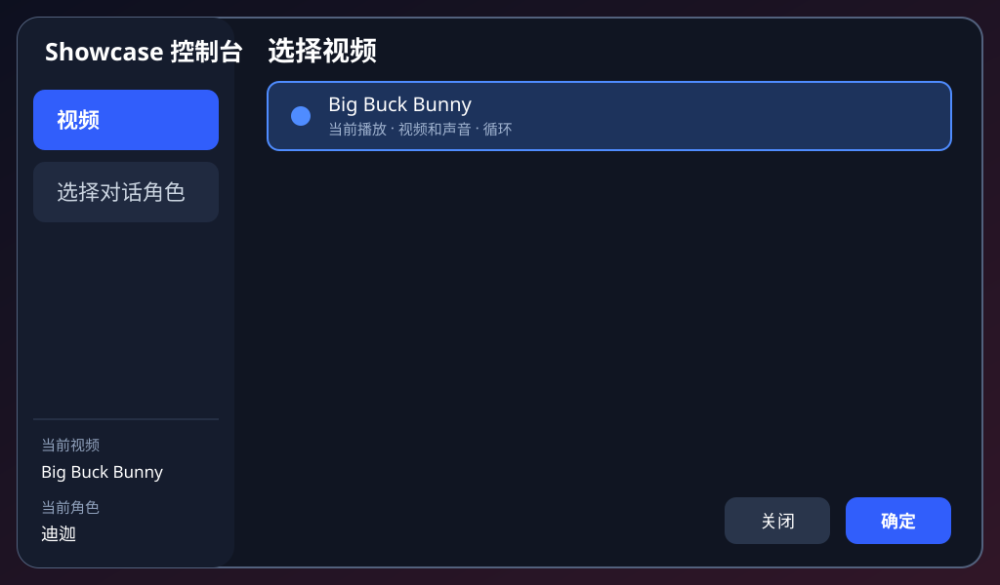
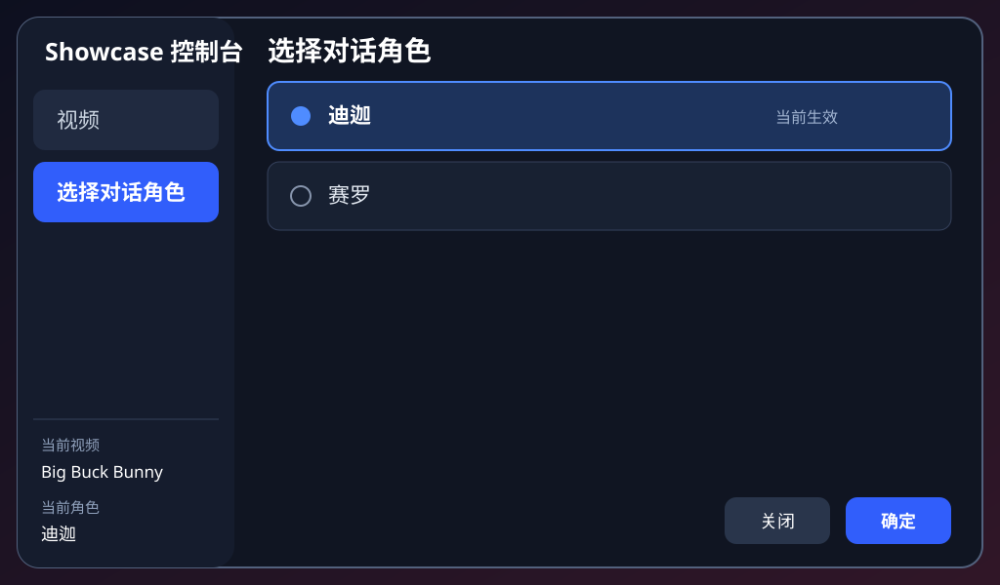

# Showcase 触屏控制台

本文定义单实体键十连击入口和本机原生触屏控制台。控制台与 MP4 播放器运行在同一个 Linux 进程中，不是网页，不建立 AP，也不运行 HTTP service。

## 页面与流程合同

| 项目 | 合同 |
| --- | --- |
| 起点 | `active_overlay=none`，背景 MP4 正在循环 |
| 入口 | 5 秒内完成 10 次短按，相邻 release 间隔不超过 500 ms |
| 页面 | `showcase/console/video` 与 `showcase/console/character` |
| 终点 | 点击关闭返回背景；点击确定保存当前 Tab draft 后留在当前页面 |
| Ownership | Console transition 拥有 Tab、draft、focus、scroll、error 与 save generation |
| Non-goal | 不定义网页、AP、HTTP、远程管理、文件上传或角色编辑 |

控制台只提供两个任务：“选择视频”从 MP4 名称列表选择循环视频及其绑定音轨，“选择对话角色”从角色名称列表选择对话角色。视频和声音是同一个 catalog entry，不能分别选择。两个页面都不提供筛选框；条目超过可视区域时使用纵向滚动列表。

## 流程图

Tab 切换和关闭不提交 draft。保存失败不创建独立 route，只更新当前页面的内联 error subject。

## Runtime 输入与数据来源

| 输入 | 数据来源 | 行为 |
| --- | --- | --- |
| `showcase.action_button` down/up | Linux button provider | 500 ms 前 release 计为一次短按；控制台打开后暂停 gesture |
| Touch down/move/up | 1024×600 touch provider | 命中 Tab、列表项、滚动、确定和关闭 |
| MP4 catalog | SD card scanner result | 提供稳定 `video_id`、显示名称和绑定音轨 |
| Character catalog | Showcase asset manifest | 提供稳定 `character_id` 与显示名称；角色图不投影到控制台 |
| Save result | Preference worker | 带 save generation 返回 main loop |

控制台打开后必须等待实体键 release，关闭后才重新接受 gesture，避免第十次短按的残留 down 状态触发对话。

## Subject 架构图

## State、Subject、Effect 与生命周期

| State / Subject | 生命周期 | 用途 |
| --- | --- | --- |
| `console.tab` | Console overlay 创建至关闭 | `video` 或 `character` |
| `console.video_draft_id` | Console overlay 创建至确认/关闭 | 尚未提交的视频与音轨选择 |
| `console.character_draft_id` | Console overlay 创建至确认/关闭 | 尚未提交的角色选择 |
| `console.items` | 当前 Tab projection | 按 catalog 顺序显示的名称列表、focus 与 scroll offset |
| `console.error` | 当前 save generation | catalog 变化、校验或写入错误 |
| `showcase.current_video_name` | App 生命周期 | 左侧栏底部当前视频 |
| `showcase.current_character_name` | App 生命周期 | 左侧栏底部当前角色 |

打开控制台时从已生效 id 初始化 draft；切换 Tab 保留两个 draft 和各自的 scroll offset；关闭时丢弃未确认 draft。点击确定先验证稳定 id 和 catalog generation，再原子写 preference；成功后才更新已生效 State。

## 验收页面原型

| 页面 | SVG 原型 |
| --- | --- |
| `showcase/idle` |  |
| `showcase/console/video` |  |
| `showcase/console/character` |  |

两页共用固定左侧栏。Tab 顺序为“视频”“对话角色”；底部始终显示当前视频和当前角色，而不是 draft。右侧只显示可滚动的真实 catalog 名称列表；角色列表不显示头像、角色图或其它预览。确认只提交当前 Tab，关闭丢弃 draft；视频切换失败时恢复原视频和声音并显示内联错误。

## 集成与平台边界

- Gesture recognizer 只决定打开 console，不直接创建 UI object。
- Touch provider 只提供 calibrated coordinate event，不解释 Tab 或按钮。
- Console renderer 只投影 State，不能直接写 preference 或切换 decoder。
- Preference、catalog 和 media worker 只返回带 generation 的 result。
- Compositor 在持续 MP4 上合成 console layer。

## 资源与持久化

MP4 catalog、角色 catalog、preference key、fallback 和素材 ownership 见[资源与持久化](/apps/showcase/resources)。Focus、scroll、draft、error 和十连击计数不持久化。

## 验收

- 5 秒内第 10 次短按打开原生控制台；超时、长按或不足 10 次不打开。
- 控制台不启动浏览器、AP 或 HTTP service。
- 两个 Tab 可触摸切换，右侧分别显示 MP4 名称列表和角色名称列表，不显示筛选框。
- 角色列表不显示图片预览，并可滚动容纳超过当前 viewport 的角色数量。
- 左侧栏底部始终显示已生效视频与角色。
- Tab 切换和关闭不提交 draft；点击确定只提交当前 Tab。
- MP4 保存成功后立即切换 media generation，背景不闪黑。
- 角色保存成功后下一轮对话使用新角色。
- Catalog 变化或写入失败保留旧配置并显示内联错误。
- 控制台打开期间背景 MP4 持续推进。
