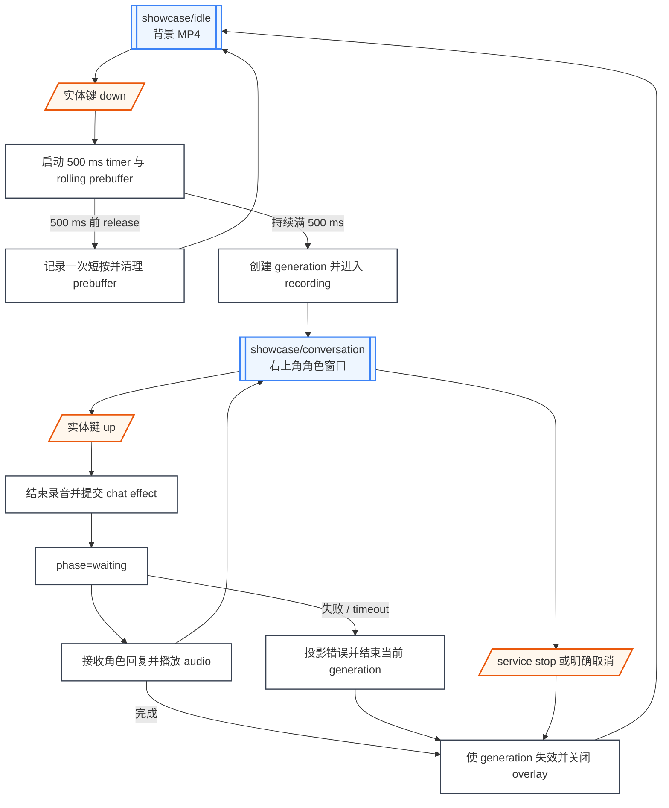
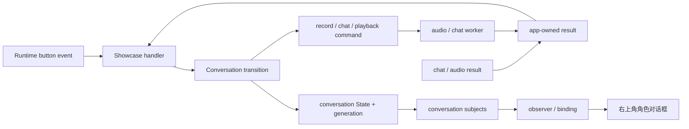
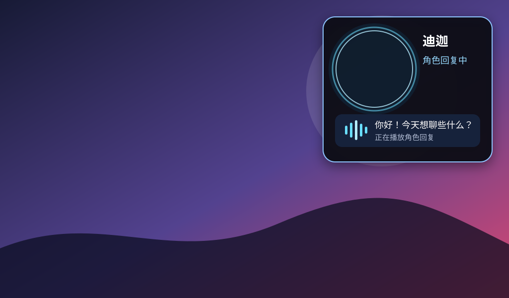

# Showcase 对话

本文定义 `showcase.action_button` 长按、录音、chat/audio effect 和右上角角色对话框。十连击控制台入口见[触屏控制台](/apps/showcase/console)，背景合成见 [Display 与背景视频](/apps/showcase/display)。

## 页面与流程合同

| 项目 | 合同 |
| --- | --- |
| 起点 | `showcase/idle`，`active_overlay=none` |
| 入口 | 实体键 down 持续满 500 ms |
| 页面 | `showcase/conversation`，背景 MP4 上的右上角 overlay |
| 终点 | 回复完成、取消或可恢复失败后关闭 overlay，背景继续播放 |
| Ownership | Conversation transition 拥有 generation、phase、录音和角色投影 |
| Non-goal | 不定义 audio codec、chat wire protocol、角色模型实现或视频音轨混音 |

500 ms 前 release 是短按，只交给 gesture recognizer，不启动对话。长按成立时使用按下后的 rolling prebuffer，避免丢失阈值前的开头语音。

## 流程图

等待或播放回复期间不接受新的十连击。下一轮长按先使旧 conversation generation 失效，再创建新一轮。

## Runtime 输入与数据来源

| 输入 | 数据来源 | 行为 |
| --- | --- | --- |
| `showcase.action_button` down/up | Linux button provider | 驱动 hold timer、recording 与 submit |
| `character_id` | Showcase preference | 选择右上角角色图、名称和 chat/voice binding |
| Audio input | Linux audio provider | 提供 rolling prebuffer 和持续录音帧 |
| Chat result | GizClaw/chat worker | 带 conversation generation 返回 main loop |
| Audio output result | Linux audio provider | 更新 playing/completed/error phase |

## GizClaw RuntimeProfile

Showcase 使用独立的 `RuntimeProfile/showcase`，不能复用 H106 的 RuntimeProfile、RegistrationToken 或 Peer identity。Profile 只暴露 `assistants/showcase-chat`，并把 `realtime`、`asr` 和 `doubao-assistant` alias 绑定到 Showcase 对话所需资源。

设备首次连接后必须通过 `server.register` 提交绑定到 `RuntimeProfile/showcase` 的 RegistrationToken，并校验响应中的 `runtime_profile_name=showcase`；不匹配时连接失败，不能回退到 H106 或 `default` profile。后续启动对话时使用 `assistants/showcase-chat`，角色选择只改变 Showcase 自己保存的角色与 voice binding，不改变 Peer 的 RuntimeProfile。

Desktop launcher 从进程环境读取 `H2_SHOWCASE_GIZCLAW_ENDPOINT`、`H2_SHOWCASE_GIZCLAW_PRIVATE_KEY` 和 `H2_SHOWCASE_GIZCLAW_REGISTRATION_TOKEN`。Private key 与 raw token 不写入 layout、日志或可提交文件；三项都未提供时保留离线视觉演示，部分提供则启动失败。

## Subject 架构图

## State、Subject、Effect 与生命周期

| State / Subject | 生命周期 | 用途 |
| --- | --- | --- |
| `conversation_generation` | 每轮长按成功后递增 | 丢弃迟到 chat/audio result |
| `conversation.phase` | overlay 创建至关闭 | `recording`、`waiting`、`playing` 或 `error` |
| `conversation.character` | overlay 创建至关闭 | 当前角色图、名称和 voice binding |
| `conversation.prompt` | overlay 创建至关闭 | 用户提示、角色回复或错误文案 |

Audio/chat worker 不操作 Subject 或 UI。取消顺序为：递增 generation、停止采集、取消 chat、停止播放、关闭 overlay、释放局部 subject。

## 对话中效果

`conversation.phase=playing` 时，右上角角色图显示青色呼吸光环，回复区显示循环变化的五段播放波形，使用户无需读取文字即可识别角色正在回复。光环与波形由 Conversation renderer 根据 `playing` phase 驱动，不读取音频 buffer，也不由 audio worker 直接更新 UI。

- 进入 `playing` 后立即显示光环和波形，动画按 1 秒周期循环。
- Audio output 返回 completed、error，或 conversation generation 失效时，立即停止动画并关闭或更新 overlay。
- 背景 MP4 在整个效果期间继续推进；页面不显示待机状态的文字或操作提示。
- 迟到的 playback result 必须先校验 conversation generation，不能重新启动已经结束的效果。

## 验收页面原型

| 页面 | SVG 原型 |
| --- | --- |
| `showcase/idle` |  |
| `showcase/conversation`，`phase=playing` |  |

对话框使用当前 `character_id` 对应的真实角色图；原型以从 H106 导入的迪迦素材展示 `playing` 效果，选择其它角色时保持相同右上角窗口尺寸、光环、波形和层级。

## 集成与平台边界

- Showcase transition 拥有 gesture、phase、generation 和 effect command。
- Button provider 只产生 down/up，不判断长按或十连击。
- Audio provider 负责录音与回复播放；chat worker 负责请求和响应。
- GizClaw connection worker 拥有 connect、`server.register`、profile 校验和 poll；Showcase main loop 只消费 worker result。
- Conversation renderer 只投影 State，不启动 worker。
- Compositor 合成背景与对话框，见 [Display 与背景视频](/apps/showcase/display)。

## 资源与持久化

角色 catalog、`character_id`、从 H106 导入的角色图和 voice binding 见[资源与持久化](/apps/showcase/resources)。Conversation phase、录音和 rolling prebuffer 不持久化；进程重启后回到 idle。

## 验收

- 500 ms 前 release 不启动或提交对话。
- 按住满 500 ms 后进入 recording，并包含 rolling prebuffer 的开头语音。
- 松开只提交一次当前 generation。
- 对话框固定在右上角，背景 MP4 不暂停。
- `playing` phase 显示角色呼吸光环和播放波形，播放结束或失败后不残留动画。
- 迟到 chat/audio result 不能重新打开已经关闭的 overlay。
- Audio 或 network unavailable 时投影可恢复错误，背景和控制台继续运行。
- 每个角色使用各自稳定 id、从 H106 导入的真实角色图与 voice binding。
