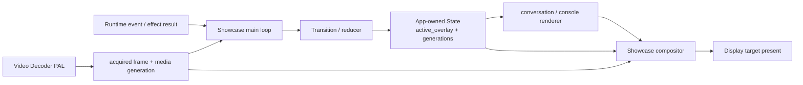

# Showcase Display 与背景视频

本文定义 Showcase 的 1024×600 Display ownership、循环 MP4、conversation/console overlay 和 compositor 生命周期。页面交互分别见[对话](/apps/showcase/conversation)和[触屏控制台](/apps/showcase/console)。

## 核心合同

Showcase 始终维护一个背景 video layer，并最多显示一个前景 overlay。App-owned `active_overlay` 是前景选择的唯一状态：

| `active_overlay` | 背景 layer | 前景 layer |
| --- | --- | --- |
| `none` | 当前 MP4 或 fallback | 无 |
| `conversation` | 当前 MP4 或 fallback | 右上角角色对话框 |
| `console` | 当前 MP4 或 fallback | 全屏半透明触屏控制台 |

MP4 decoder、chat worker、storage worker、Touch callback 和 widget callback 都不能直接 present。Showcase compositor 是唯一 Display present owner。

`active_overlay=none` 的 `showcase/idle` 只显示全屏 MP4 或 fallback，不叠加标题、状态文字或操作提示。



## MP4 playback

- `video_id` 唯一选择当前背景 MP4 及其绑定音轨，文件名和显示文字不能反推 id。
- Decoder 按 monotonic time 推进 timeline，并在结尾无缝回到首帧。
- 带音轨媒体必须通过 Audio PAL 播放与视频同源、同时长的 PCM timeline；视频与声音都在结尾循环，控制台和对话 overlay 不停止背景声音。
- 对话、控制台、列表选择、保存和 chat/audio effect 不暂停 video timeline。
- 切换 MP4 时分配新的 `media_generation`；新视频首帧 ready 前继续显示旧视频。
- 旧 generation frame 直接丢弃，不能让旧视频在切换完成后重新出现。
- 当前文件消失、无法解码或 SD 卡卸载时切换内置 fallback，并保留可观察错误。

## Compositor 顺序

每个 present frame 使用固定顺序：

```text
current MP4 frame or fallback
-> optional dim layer
-> conversation or console overlay
-> compositor present
```

Conversation overlay 只占右上角。Console overlay 覆盖完整 viewport，但保留半透明背景，使持续播放状态可见。两个 overlay 不能同时显示。

## Main loop 与渲染

```mermaid
sequenceDiagram
    participant Loop as Showcase main loop
    participant Decoder as MP4 decoder
    participant Overlay as Overlay renderer
    participant Compositor as Compositor
    participant Display as Display target

    Loop->>Decoder: acquire_frame(timeout)
    Decoder-->>Loop: frame handle
    alt generation matches
        Loop->>Decoder: frame_get_info(handle)
        Decoder-->>Loop: writable video planes + synchronized PCM
        Loop->>Overlay: render(active_overlay, subjects)
        Loop->>Compositor: compose(frame, overlay)
        Compositor->>Display: present(final frame)
        Loop->>Decoder: release_frame(handle)
    else stale frame
        Loop->>Decoder: release_frame(handle)
    end
```

Transition、Subject 发布和 overlay render 完成后才允许 compose；不能提交中间 State。

## Buffer ownership

| Buffer / object | Owner | 生命周期 |
| --- | --- | --- |
| MP4 compressed input | Decoder worker | 当前 media generation |
| Decoder session | Media service | 当前 media generation；stop 后 close |
| Acquired video frame | Decoder session | main loop 在 compose 或丢弃后立即 `release_frame` |
| Conversation objects | Conversation renderer | `active_overlay=conversation` |
| Console objects | Console renderer | `active_overlay=console` |
| Final 1024×600 frame | Compositor | 一次 present 周期 |

Frame plane 通过 Video Decoder PAL 暴露为 CPU-readable borrowed buffer，不能跨 `release_frame` 保存 pointer。具体硬件 plane、DRM buffer、framebuffer node、cache flush 和 RGB565 normalization 属于 Linux target component，不进入 portable App contract。Compositor 需要长期保留旧视频首帧时，必须复制到自己 owned 的 frame，而不能占用 decoder frame。

## 页面切换与清理

- Overlay 关闭时先递增 page generation，再解除 observer、删除 object 并释放局部 subject。
- 旧 animation、touch callback、save result 或 chat result 必须验证 overlay generation。
- MP4 layer 不因 overlay 切换重建；只有 `video_id` 改变、decoder error 或 service stop 才切换 media generation。
- Service stop 先拒绝新 overlay action，再停止 decoder，最后释放 compositor 和 Display target。

## 验收

- 待机、对话和控制台期间 MP4 timeline 连续推进。
- 任意稳定 State 下最多一个前景 overlay 可见。
- 对话框固定在右上角；控制台覆盖完整 viewport 且背景仍可见。
- 切换 MP4 时旧视频保持到新首帧 ready，不闪黑屏。
- 迟到 frame、animation 和 overlay result 不能恢复旧画面。
- Display present 只来自 compositor；worker 和 widget callback 不直接 present。
- 所有设备原型和 target viewport 都是 1024×600。
