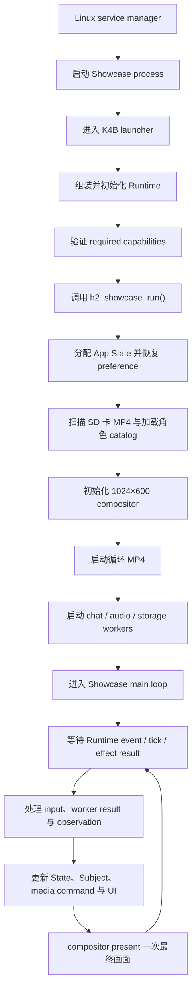

# Showcase App 生命周期

本文定义 Showcase 从 Linux service 启动、进入 portable App main loop、处理可恢复错误、执行受控停止以及处理 fatal 的完整生命周期。显示合成见 [Display 与背景视频](/apps/showcase/display)，页面流程分别见[对话](/apps/showcase/conversation)和[触屏控制台](/apps/showcase/console)。

## 程序流程

Linux service 启动目标 launcher。Launcher 组装 Runtime 与 K4B provider，验证 required capabilities 后调用阻塞式 Showcase entry；App 初始化 State、compositor、MP4 和后台 worker，最后进入 main loop。



Service manager 只拥有进程启动、异常重启和日志接入。Launcher 只组装 target integration。Showcase main loop 拥有业务 State、gesture、page effect、Subject 和 overlay lifecycle。

## Required capabilities

Launcher 在调用 App entry 前验证：

| Capability | 要求 | 缺失行为 |
| --- | --- | --- |
| `showcase.action_button` | 去抖后的 down/up event | 阻止产品 UI 启动 |
| Touch | 1024×600 calibrated down/move/up | 阻止产品 UI 启动 |
| Display | 1024×600 fullscreen compositor target | 阻止产品 UI 启动 |
| Filesystem | preference 与 SD catalog root | preference 损坏使用 fallback；catalog root 缺失进入无媒体错误状态 |
| Media | 通过 Runtime Video Decoder PAL 执行 MP4 open/start/acquire/release/loop/stop/close | 无可用 MP4 时播放内置 fallback；decoder 不可初始化时启动失败 |
| Audio input/output | 录音与回复播放 | 背景与控制台可运行；对话入口投影 unavailable |
| Network/chat | 对话请求与响应 | 背景与控制台可运行；对话失败可恢复 |

Display、Touch、Button 与 media decoder 是产品可操作性的 required capability；Audio 与 network/chat 可以在主 UI 中投影 unavailable，不能导致无界面退出。

## Main loop 合同

生产目标的 `h2_showcase_run()` 是阻塞式 business entry，在 service stop 或不可恢复 fatal 前不返回。普通运行结果必须在 main loop 内收敛：

- Runtime input 只产生 action，transition 更新 App-owned State。
- 后台 worker 只返回带 generation 的 result，不操作 Subject、UI object 或 Display。
- 每轮先处理所有输入与 result，使 State 收敛，再发布 Subject 和 media command。
- compositor 每轮最多 present 一次完整的 background + overlay 画面。
- timeout、disconnect、单次 decode、storage、audio 或 chat 错误不能结束 main loop。
- Linux `SIGTERM` 或等价 service stop 转换为 cooperative stop request，不从 signal handler 直接销毁资源。

Desktop/test 可以通过 stable `should_stop` callback 请求同一受控停止流程。生产 launcher 不以普通 App page action结束 main loop。

## Main loop 流程

下图参照 H106 main loop 的分类方式，描述普通结果、可恢复错误、受控停止、fatal 和 service restart。普通业务结果始终回到下一轮 wait；只有 cleanup 完成或 platform abort 才结束当前进程执行流。

```mermaid
flowchart TD
    Boot["Showcase process 启动"] --> Init["初始化 Runtime、State、compositor 与 workers"]
    Init --> Loop["Showcase main loop"]
    Loop --> Input["等待 event / tick / effect result"]
    Input --> Classify["结果分类"]

    Classify -->|"成功"| State["更新 App-owned State"]
    Classify -->|"瞬时 observation 错误"| Stale["保留最后有效值并退避重试"]
    Classify -->|"页面 effect 错误"| PageError["更新 overlay error 并允许重试"]
    Classify -->|"可降级 capability 错误"| Degraded["标记 unavailable 并保持背景/控制台"]
    State --> Render["发布 Subject、推进 MP4、合成 overlay"]
    Stale --> Render
    PageError --> Render
    Degraded --> Render
    Render --> Present["compositor present"]
    Present --> Loop

    Classify -->|"service stop"| StopInput["拒绝新 gesture 与 touch action"]
    StopInput --> Cancel["取消并 join chat / catalog workers"]
    Cancel --> MediaStop["停止 decoder 与 audio"]
    MediaStop --> UIDeinit["释放 overlay、compositor 与 Runtime"]
    UIDeinit --> Exit(["进程正常退出"])

    Classify -->|"不可恢复 fatal"| FatalRecord["best-effort 写入 fatal record"]
    FatalRecord --> Abort["调用 target fatal callback"]
    Abort --> Crash(["platform abort / coredump"])
    Crash --> Restart["service manager 有限退避重启"]
    Restart --> Boot

    Loop -.->|"无 stop request 意外返回"| ContractFatal["main loop contract violation"]
    ContractFatal --> FatalRecord
```



Service restart 不伪装成 Runtime event。Service manager 必须配置有限退避，避免不可恢复启动错误形成无间隔重启风暴。

## 每轮执行顺序

```text
Runtime input / effect result / tick
-> update device facts and generations
-> gesture recognizer
-> transition / reducer
-> enqueue media, storage, audio or chat effects
-> publish long-lived and overlay-local subjects
-> advance MP4 frame
-> render conversation or console layer
-> compositor present exactly once
```

Transition 执行到一半时不能 present。迟到 frame、chat result、catalog result、save result 和 timer callback 必须先验证 generation。

## 错误分类

| 类别 | 示例 | 行为 |
| --- | --- | --- |
| 瞬时 observation 错误 | 单次 mount、time 或设备 observation 失败 | 保留最后有效值、更新 freshness、退避重试 |
| 页面 effect 错误 | 保存配置、切换 MP4 或聊天失败 | 写入对应 overlay error，允许重试或取消 |
| 可降级 capability 错误 | chat network 或 audio 暂时 unavailable | 禁用对话入口，背景与控制台继续运行 |
| App invariant 破坏 | Display owner 丢失、required input 永久消失、State ownership 无法维持 | 写 fatal record 并 platform abort |
| 平台异常 | process crash、watchdog、heap corruption | 由平台保存 coredump，service manager 有限重启 |

同一个底层 I/O 错误必须按它破坏的 contract 分类，不能只根据 errno 决定 fatal。

## Stop、fatal 与可观察性

受控停止顺序固定为：拒绝新输入、使所有 generation 失效、取消并 join worker、release 当前 acquired video frame、stop/close decoder、停止 audio、释放 overlay/compositor、deinit Runtime、返回 launcher。任何 cleanup timeout 都记录具体 stage；如果已无法保证线程和 Display ownership，则升级为 fatal。Decoder frame 未 release 时不能调用 stop 或 close。

诊断状态至少提供：

| 字段 | 含义 |
| --- | --- |
| `business_state` | `initializing`、`running`、`stopping`、`stopped` 或 `fatal` |
| `active_overlay` | `none`、`conversation` 或 `console` |
| `media_generation` | 当前循环 MP4 generation |
| `catalog_generation` | 当前 SD catalog generation |
| `conversation_generation` | 当前对话 generation |
| `last_error_stage` / `last_error_rc` | 最近错误的稳定 stage 和结果 |
| `error_count` | 当前进程累计可恢复错误数 |
| `consecutive_fatal_starts` | 同一发布版本连续 fatal 启动次数 |

日志不是错误状态的唯一存储。达到有限 fatal 阈值后 service 必须保持 failed 并等待运维处理，不能无限重启。

## 验收

- Linux service 无需人工登录即可进入 Showcase main loop。
- Main loop 每轮先收敛 State，再执行一次 compositor present。
- Media、chat、audio、storage worker 不操作 Subject、UI 或 Display。
- 单次 SD、audio 或 chat 错误不会结束 main loop。
- Audio/network unavailable 时背景 MP4 和控制台仍可使用，对话明确显示 unavailable。
- `SIGTERM` 走完整 cooperative cleanup，不在 signal handler 销毁对象。
- service stop 后所有 worker 已 join，decoder、audio、overlay、compositor 和 Runtime 均已释放。
- 无 stop request 的 App entry 返回按 fatal 处理。
- Fatal 记录发生 stage，platform coredump 可定位崩溃，service manager 使用有限退避重启。
- Desktop/test 使用相同 main loop、generation、stop 和 cleanup contract。
