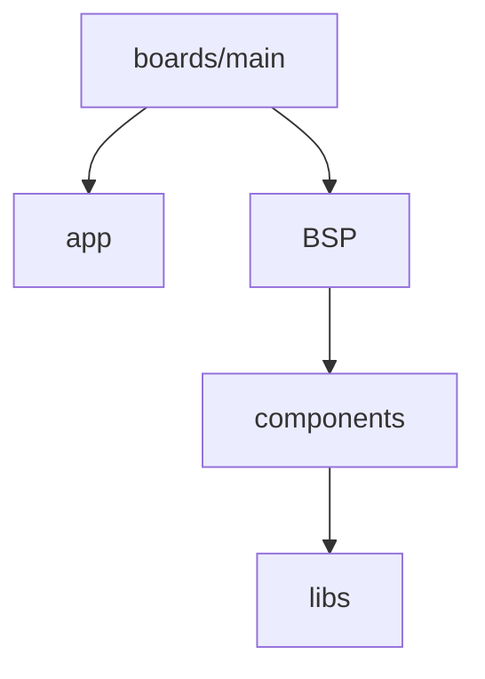

# Markdown

本规则适用于开发指引、审查指引、README、issue 文档、workflow note 和手写 API 说明。Markdown 需要在源码中易于审查，并在 GitHub 与 VitePress 中稳定渲染。

## 文档边界

- 开发指引描述合并后的最终 ownership、目录结构、contract 和行为。
- 代码与最终设计之间的差异、迁移步骤和未解决问题只记录在问题清单中，不写进开发指引。
- API declaration 和字段说明以生产 Public Header 中的 Doxygen 为 source of truth；Markdown 只解释定位、组合、流程和使用边界。
- 不复制另一份会随代码漂移的函数清单、struct declaration 或 enum 定义。
- 文档只陈述已经确定的 contract，不用猜测补齐未知设计。

## 段落和换行

- 普通段落不按 80 列硬换行，每个自然段保持连续。
- 不因为修改相邻内容而重排无关段落。
- Exact command、path、URL、symbol 和 protocol token 保持完整。
- 一个段落只表达一个主题；内容过长时拆成小节或列表。

## 标题

- 使用 ATX heading：`#`、`##`、`###`。
- 页面只有一个一级标题。
- 标题层级连续，不为了字号跳级。
- 标题简短、稳定，使用仓库术语，不使用装饰性句子。
- 标题避免重复，否则 VitePress anchor 会冲突，目录链接也无法准确定位。

## 列表

- 无序列表使用 `-`。
- 只有顺序确实影响执行时才使用 numbered list。
- 同一列表中的项目使用平行句式，每个 bullet 表达一个明确规则。
- 嵌套超过两层时优先拆成新的 section。
- Checklist 使用 `- [ ]` 和 `- [x]`；勾选表示解决方案已经确定，不表示代码一定已经完成。

## Code 和路径

- Path、filename、command、flag、symbol、config key 和 exact token 使用 inline code。
- Fenced code block 必须注明语言。
- Directory tree、literal output 和非语言结构使用 `text`。
- Shell command 使用 `sh`，并保持可以直接复制执行。
- 不把 opening fence、内容和 closing fence 写在同一行。

## Link

- 仓库内 Markdown 优先使用相对链接。
- VitePress 页面导航使用站点绝对路径，例如 `/zh/developing/runtime`。
- 外部链接指向稳定、直接的目标页面，不链接搜索结果。
- Link text 使用目标名称；路径本身重要时直接显示 exact path。
- 修改文件名或 heading 后运行完整文档构建，检查 dead link 和 anchor。

## Diagram

当依赖、组合、流程、状态或协议布局用文字难以快速理解时使用 Mermaid：

- 依赖关系使用 `flowchart TD`，箭头表示“依赖”时在正文中明确说明。
- 初始化、事件和数据路径按执行方向排列，不在一个图中混合多种箭头语义。
- Wire header 和 bit layout 使用 `packet-beta`。
- Node label 包含 `/`、括号、空格或标点时使用引号。
- 图前说明它表达的关系，图后补充不能从图中看出的 ownership、条件或异常路径。
- 图保持单一目的；复杂信息拆成多个图，不使用 subgraph 代替正文定义。

示例：



## Table

- 只有并列字段或对比关系比列表更清楚时才使用 table。
- Cell 保持简短，长段落移到 table 下方说明。
- Exact offset、size、default 和 owner 适合 table；复杂流程不适合 table。
- Bit-level packet 优先使用 Mermaid packet diagram，正文说明 byte order 和可变长度部分。

## 语言

- 中文页面以中文说明为主，保留源码中的英文 term、API symbol 和 path。
- 同一个概念保持同一拼写，例如 `Runtime`、`H2Loader`、`PAL`、`BSP`、`component_id` 和 `periph_id`。
- 不在同一条规则中反复切换同义中文和英文。
- 用户可见说明避免内部工作流术语；developer contract 可以保留精确工程术语。

## Generated 内容

- Doxygen、command output、protocol trace 和 generator output 不手工改写。
- Generated API 页面由生产 Public Header 重新生成，不复制到手写页面维护。
- 代码块中的生成结果保持原格式，并在正文注明生成命令和输入来源。
- 不提交 cache、临时 preview output 或 machine-local path。

## 验证

在 `guides/` 目录运行：

```sh
make guides-build
```

构建必须通过 Doxygen generation、VitePress render、Mermaid processing、local search 和 dead-link check。最后运行 `git diff --check`，并在浏览器中检查新增 diagram、sidebar 层级和 anchor 定位。
