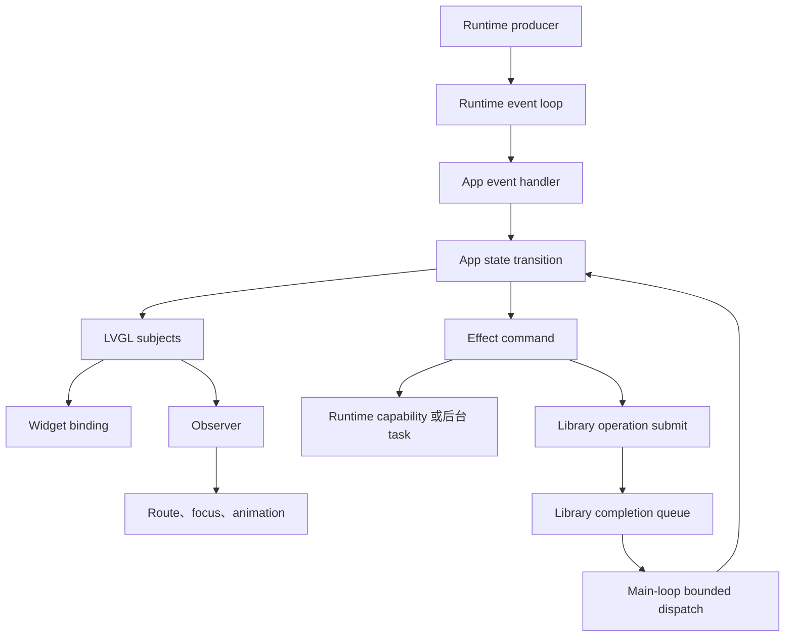

# 使用 LVGL 开发固件

LVGL app 使用 subject 表达 app observable state，并通过 observer 和 widget binding 把状态投影到 UI。App handler 消费 Runtime system/component event，执行 state transition 并修改 subject。需要复用 button gesture/state schema 的 widget 映射到 `PUSH_EDGE` Button periph；它不是通用 UI action、timer 或 completion producer。

App 直接使用 LVGL C API 创建 screen 和 component，并在手写代码中完成 subject binding、observer 与 widget lifecycle。LVGL XML Project、Editor CLI 和生成代码不是 app 的构建依赖。

`libs/lvgl` 的集成边界见 [LVGL](/zh/developing/lvgl)，Runtime 的 event/state contract 见 [Runtime](/zh/developing/runtime)。

## 状态与事件流

LVGL subject 是 app 可观察状态的 source of truth。Widget 不保存另一份业务状态；需要执行的异步工作使用显式 effect command。Runtime system/component fact 通过 Runtime event 回到 transition；library API completion 使用 library 自己的 caller-thread dispatch callback，由唯一 App main loop 有界 dispatch 后同步调用 transition。两者不能混成第二条 Runtime event producer，也不能调用 private Runtime producer。



这条路径有两个方向：

- 输入方向由 App handler 消费 Runtime system/component event，再将事件转换成 app action 并修改 subject。
- 输出方向由 binding 更新 widget，由 observer 执行同步 UI effect，由显式 command 启动异步业务 effect；command 是否需要有界 queue 由具体 App 的并发与 backpressure contract 决定。

Observer 不是第二条业务 reducer。Observer 不能绕过 App handler 修改不属于自己的业务 subject，也不能形成 subject A 修改 subject B、subject B 再修改 subject A 的循环。

## Subject 分类

App 根据可见范围和 ownership 组织 subject：

| 类型 | 作用域 | 示例 |
| --- | --- | --- |
| Global subject | 跨 screen 或由 app router 共享 | 当前 route、网络状态、音量、语言 |
| Screen subject | 单个 route 或 feature flow | 当前焦点、输入草稿、请求状态、错误提示 |
| Component prop | 创建 component 时由 owner 传入 | 文本、选中值、可见性、进度 |
| App-private state | 不进入 LVGL subject | Runtime handle、完整列表、raw id、payload buffer、command queue |

Subject 只保存 observer 和 widget 真正需要观察的值。完整联系人列表、网络响应、音频 buffer 或后台 job handle 由 app-private state 持有；UI 可以使用选中索引、可见字符串、状态 enum 或 app-owned immutable snapshot pointer 作为投影。

需要保持一致的相关状态优先使用一个 enum subject。例如 Wi-Fi 流程使用 `off`、`scanning`、`connecting`、`connected` 和 `error`，避免多个 bool subject 组合出非法状态。一个 app action 必须修改多个 subject 时，widget binding 可以在下一次 LVGL render 前依次收到同步更新；依赖完整组合状态的业务操作不能订阅其中一个中间 subject，而应由 transition 在全部 mutation 完成后产生显式 effect command。

## Runtime Event Projection

Runtime event loop 向 App handler 交付事件。App handler 根据 `component + component_id + kind` 转换为 app action，再修改 subject：

```text
H2_RUNTIME_SYSTEM_EVENT_WIFI_STA_CONNECTED
→ app network action
→ wifi_state = connected
→ wifi_on = 1
→ status bar binding 更新
```

```text
H2_RUNTIME_COMPONENT_EVENT_BUTTON_ACTION
→ app input action
→ 当前 route 的 reducer 解释按键语义
→ menu focus 或 requested route subject 更新
→ router observer 执行页面切换
```

硬件 event 不能直接调用某个 screen callback。相同的 Runtime button event 在不同 route 下可以表示不同 app action，其语义由 app state transition 决定，而不是由 Runtime 或 widget 决定。

App 启动或页面进入时可以读取 Runtime state 建立 subject 初始值。Event 用于保留顺序和业务事实，state 用于取得最新快照；不能假设只订阅 event 就一定得到初始化前已经发生的状态变化。

## Observer 能做什么

Subject 更新会同步通知 observer。Observer 适合执行有界、非阻塞、可以由当前状态重复推导的操作：

- 根据 requested route 创建或加载 screen。
- 更新 focus group、overlay 和 animation。
- 把稳定状态转换成一个轻量 effect command 并立即返回。
- 维护只属于 LVGL adapter 的 widget lifecycle。

Observer 不负责：

- 直接执行网络、存储、扫描、解码或其他可能阻塞的工作。
- 把一次性 command 伪装成普通状态变化。
- 直接修改 Runtime state、调用 BSP 或依赖芯片 SDK。
- 在后台 task 或 PAL callback 中操作 widget 或 subject。

连续两次相同操作不能只靠 `lv_subject_set_*()` 触发，因为值未变化时不会再次通知 observer。例如两次播放提示音、两次刷新和两次发送消息必须表示为两个 app action 或 effect command。

## 线程边界

LVGL 不是 thread-safe。`lv_subject_set_*()` 会同步执行 observer callback，callback 又可能更新 widget，因此 subject mutation 与其他 LVGL API 一样属于 LVGL/app 线程。

后台 task 只执行耗时工作，不能直接调用 `lv_subject_set_*()`、创建或删除 widget。Library worker 只把 completion 放入自己的有界队列；唯一 App main loop 在处理 Runtime input 后以固定上限 dispatch callback，callback 同步执行 transition，最后在同一轮发布 Subject 并更新 LVGL。Callback 不能在 worker、submit、cancel 或 PAL/provider callback 中内联执行，也不能调用 private Runtime producer API。

如果 target 配置了 LVGL OS lock，lock 只用于保护必要的 LVGL API 调用，不改变 app 的状态 ownership。业务状态仍然只有 LVGL/app 线程上的 App handler 一个 writer，不能用 mutex 合法化多个 task 并发修改 subject。

## UI Input

普通 LVGL widget callback 直接把 UI input 转换成 app action，不能调用 private Runtime producer API：

```text
LV_EVENT_CLICKED
→ SavePressed
→ reducer: save_status = saving
→ effect command: save settings
→ storage task
→ SaveSucceeded 或 SaveFailed
→ reducer 更新 save_status
→ subject binding 更新 UI
```

需要让一个 LVGL widget 表现为 Runtime button 时，App 定义稳定的 Button `component_id`，launcher 把它映射到 `PUSH_EDGE` single-button periph，App 再调用 `h2_lvgl_button_bind()`。Adapter 通过 Runtime mapping 解析并验证这个 periph，只把 `LV_EVENT_PRESSED` 投影为 `DOWN`，把 `LV_EVENT_RELEASED`、`LV_EVENT_PRESS_LOST` 或 pressed 状态下的 delete 投影为 `UP`；带 phase、时间和 click count 的客观 `ACTION` 仍由 Runtime 生成，click、long press 等 gesture 由 App 判断。Adapter 对每个 `(runtime, periph_id)` 只允许一个 live binding；第二个 producer 或重复 bind 尚未删除的 binding 返回 `H2_PAL_ERR_BUSY`，不会安装 callback。`LV_EVENT_DELETE` 在必要时先投影 `UP`，再释放 producer ownership，使同一 periph 可以绑定新 widget。Runtime private writer boundary 负责串行化 widget edge、input task 和 Test Control；LVGL callback 仍只在唯一 LVGL thread 执行。

不是每个 widget action 都应该伪装成 button。Save、route change、text edit 等 screen-local action 仍由 widget callback 直接进入 App transition；widget callback 可以读取创建它时传入的 component prop 和当前 route-local subject，但不能直接决定跨页面业务状态。

## 生命周期

LVGL app 按以下顺序管理 subject 和 observer：

1. 初始化 LVGL display/input adapter 和 app-private state。
2. 初始化所有长期 subject 及其 string backing buffer。
3. 注册 app observer，再创建绑定这些 subject 的 screen 和 component。
4. 读取初始 Runtime state并更新 subject。
5. 在 LVGL 线程消费 Runtime event loop，并处理 subject mutation 和 `lv_timer_handler()`。
6. 停止新的 effect command，等待或取消后台工作。
7. 删除 screen/component，使 widget-owned observer 自动解除绑定。
8. 移除 app-owned observer，deinit subject，再释放 backing buffer 和 LVGL adapter。

Subject 必须在所有 observer 和 widget 解除绑定前保持有效。String subject 使用的 current/previous buffer 也必须覆盖 subject 的完整生命周期。

## H106 App

H106 使用这套模型组织系统状态、route、screen-local flow 和 component prop：

- App handler 消费 Runtime system/component event；只有 mapped `PUSH_EDGE` Button periph 通过 public producer 进入 objective Button action pipeline，其他 UI input、timer 和 completion 不调用 private Runtime producer。H106 Main App 的 PIXA completion 在同一 main loop 同步产生，audio worker 只发布 atomic result，再由该 main loop poll 并 transition。
- H106 transition 把 event 转换成 network、input、power、audio 或 feature state。
- Global 和 screen subject 保存 UI 可观察状态。
- 手写 LVGL screen/component 只通过 binding 和 prop 消费 subject。
- Router observer 处理 route 和 UI effect；业务 transition 仍只有 App handler/main loop 一个 writer，异步工作通过 effect command 执行。

H106 app-specific subject 名称和 route enum 属于 H106 app，不提升为 `libs/lvgl` contract。其他 LVGL app 可以复用同一事件流和 ownership 规则，但定义自己的 subject schema。
