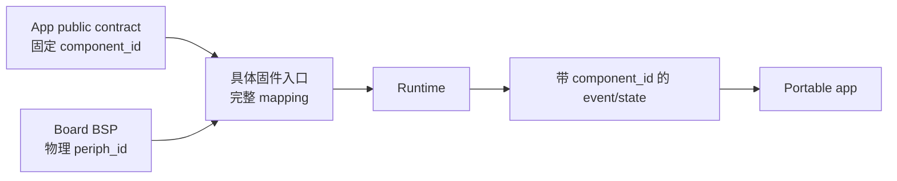
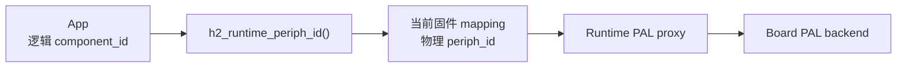
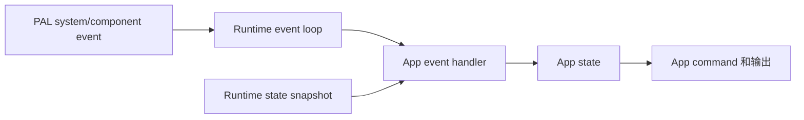
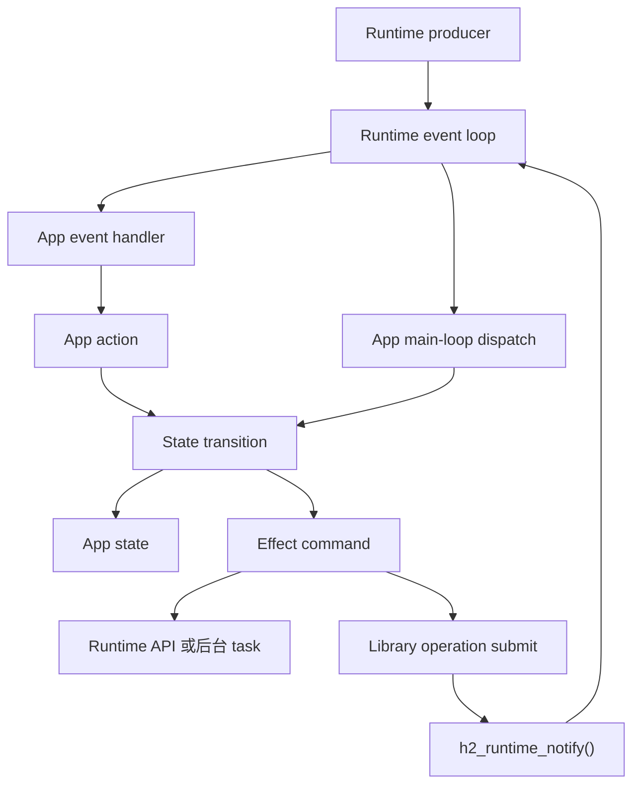

# 使用 Runtime 开发固件

Runtime 把 app 固定的逻辑组件 contract 映射到当前固件的物理外设，并用统一的 Runtime event 和 Runtime state 向 app 表达这些组件。App 只依赖自己的 `component_id`、`h2_runtime_t`、Runtime Public API 和其他跨平台 library，不接触 BSP、board-private type、芯片 SDK 或物理 `periph_id` 定义。

Runtime 的完整 contract 见 [Runtime](/zh/developing/runtime)，Public API 见 [Runtime API Reference](/references/runtime)。本文只说明 app 开发流程。

## 建立 Portable App

独立 app 放在 `projects/<app>/app/`；project group 中的 app 放在 `projects/<group>/apps/<app>/app/`。App public header 定义稳定的阻塞式入口、返回值、固定的逻辑组件 ID 和必要的 app-level config，private state 和 task 留在 `src/`。

```text
app/
├── include/                              # App public API
└── src/                                  # App private implementation
```

App entry 必须接收已经初始化完成的 `h2_runtime_t *`，并可以额外接收 app 自己定义的 stable public config：

```c
int h2_example_run(
    h2_runtime_t *runtime,
    const h2_example_config_t *config);
```

`boards/main` 负责初始化和释放 Runtime。App entry 返回前拥有当前执行流；它通过 Runtime event loop 处理事件，也可以创建自己的后台 task，但必须在返回前停止并清理这些 task。App 不再创建第二套 event loop。

## 定义固定的逻辑组件

同一个 app 需要的逻辑组件是固定 contract，不随 board 改变。例如一个游戏 app 需要上、下、左、右四个方向键，它的 public header 必须定义四个稳定且不同的 `component_id`：

```c
typedef enum h2_game_component_id {
    H2_GAME_COMPONENT_BUTTON_UP = 1,
    H2_GAME_COMPONENT_BUTTON_DOWN,
    H2_GAME_COMPONENT_BUTTON_LEFT,
    H2_GAME_COMPONENT_BUTTON_RIGHT,
} h2_game_component_id_t;
```

这些 ID 表示 app 业务角色，不表示 GPIO、ADC channel、button index 或其他物理编号。App 的 reducer 和 state machine 只使用 `H2_GAME_COMPONENT_BUTTON_UP` 之类的逻辑 ID。

逻辑组件不能因为某块 board 缺少对应物理外设而在运行时消失。一个固件入口无法映射 app 要求的任一组件时，该 board/image 就不满足 app contract，必须在固件组装或初始化阶段失败，不能启动一个缺少输入的降级 app。

## 在固件入口映射物理外设

具体固件入口同时知道 app contract 和 board BSP，因此由它提供完整的 `component_id -> periph_id` mapping：

```text
H2_GAME_COMPONENT_BUTTON_UP       -> BOARD_PERIPH_BUTTON_UP
H2_GAME_COMPONENT_BUTTON_DOWN     -> BOARD_PERIPH_BUTTON_DOWN
H2_GAME_COMPONENT_BUTTON_LEFT     -> BOARD_PERIPH_BUTTON_LEFT
H2_GAME_COMPONENT_BUTTON_RIGHT    -> BOARD_PERIPH_BUTTON_RIGHT
```

不同 board 可以使用不同 GPIO、不同 button device 或不同 `periph_id`，但必须提供相同的四个 app-facing `component_id`。固件入口负责保证 mapping 覆盖 app 的全部 required component；Runtime 初始化只校验 mapper 实际列出的 mapping，不知道 app 的 required component 集合。

### 接入 Component Mapper

固件入口使用 `h2_runtime_component_mapper_t` 把 app 要求的 `component_id` 映射到当前 board 的 `periph_id`，并将 mapper 写入 `h2_runtime_config_t.component_mapper`：

```c
h2_runtime_config_t runtime_config;
h2_runtime_t *runtime = NULL;

h2_pal_result_t rc = board_runtime_config(&runtime_config);
if (rc != H2_PAL_OK) {
    return rc;
}

runtime_config.component_mapper = &game_component_mapper;
rc = h2_runtime_init(&runtime_config, &runtime);
if (rc != H2_PAL_OK) {
    return rc;
}

/* Input acquisition is caller-owned; NULL selects every Runtime default. */
rc = h2_runtime_input_start(runtime, NULL);
if (rc != H2_PAL_OK) {
    h2_runtime_deinit(runtime);
    return rc;
}

rc = h2_game_run(runtime, &game_config);
h2_runtime_deinit(runtime);
return rc;
```

Mapper 的结构、operation 和 Runtime 初始化行为见 [Component Mapper](../runtime.md#component-mapper)。Runtime 初始化后，入口必须对 app public header 列出的每个 required `component_id` 调用 `h2_runtime_periph_id()`；任一查询失败时释放 Runtime 并终止启动，全部成功后才能调用 app entry。App 不实现或持有 mapper。



App 不 include board header，不保存固定 `periph_id`，也不按 PAL 枚举顺序猜测哪个物理按键是“上”。Runtime 中的 PAL proxy API object 是 operation 的调用接口，不是 app 逻辑组件 contract，也不能用“某个 API object 存在”代替 required component mapping。

## 消费逻辑组件

Runtime event 使用稳定的 `component_id` 标识事件来自哪个逻辑组件。游戏 app 收到 button event 后按逻辑 ID 解释输入，不需要知道当前 board 的物理接线：

```c
if (event->kind == H2_RUNTIME_COMPONENT_EVENT_BUTTON_ACTION &&
    event->payload_size == sizeof(h2_runtime_button_action_event_t)) {
    const h2_runtime_button_action_event_t *action = event->payload;
    if (!h2_runtime_button_action_is_released(action)) {
        return;
    }
    switch (event->component_id) {
    case H2_GAME_COMPONENT_BUTTON_UP:
        h2_game_dispatch_move(game, H2_GAME_DIRECTION_UP);
        break;
    case H2_GAME_COMPONENT_BUTTON_DOWN:
        h2_game_dispatch_move(game, H2_GAME_DIRECTION_DOWN);
        break;
    case H2_GAME_COMPONENT_BUTTON_LEFT:
        h2_game_dispatch_move(game, H2_GAME_DIRECTION_LEFT);
        break;
    case H2_GAME_COMPONENT_BUTTON_RIGHT:
        h2_game_dispatch_move(game, H2_GAME_DIRECTION_RIGHT);
        break;
    default:
        break;
    }
}
```

Runtime component state 同样使用 `component_id` 读取某个逻辑组件的最新快照。App 的 event handler、state 和 public method 都使用逻辑 `component_id`，不向业务代码传递物理 `periph_id`。

Button、NFC 和 IMU 输入由 Runtime-owned private task 读取并转换为 Runtime event/state。Runtime 初始化先同步发布首帧快照，再启动 task；target 在 Runtime composition 中配置 cadence 和 task policy。Portable App 不调用 input poll、不创建 input task，也不接触 target scheduler。

阻塞式 portable App entry 应通过 `h2_runtime_wait_notify()` 等到 Runtime wake 或自己的绝对 deadline，而不是在 App source 中调用 target scheduler、libco wait/yield 或固定短 sleep。Target 可以用 OS thread、RTOS task 或 cooperative provider 实现同一个同步 Runtime/PAL contract；该差异不能进入 App public API。

每次到达 Button poll deadline，按下状态都会产生一个 `H2_RUNTIME_COMPONENT_EVENT_BUTTON_DOWN` sample 和一个 `H2_RUNTIME_COMPONENT_EVENT_BUTTON_ACTION`；松开时产生 `BUTTON_UP` 和最后一个 action。Action 只携带 `pressed_at_ms`、`released_at_ms`：按住时释放时间为 0，松开时释放时间等于事件时间。Runtime 不使用单独的 100 ms action cadence，也不定义 phase、short press、long press 或 click count。App 用事件时间等于按下时间识别首次 sample，用零释放时间识别持续按住，用非零释放时间识别松开，并自行计算长按、双击等策略；不能把同一 sample 的 `BUTTON_DOWN` 与 action 重复投影成两次操作。App 消费这些 event/state，不再主动调用 PAL Button API 读取同一个按键。GPIO、ADC 或其它物理输入的 debounce 由对应 component/provider 完成；Runtime 和虚拟、触摸等 App-level Button 不统一增加物理 debounce。

## 通过 Component ID 调用 API

固件入口在 Runtime 初始化前完成 mapping。App 主动调用某个基于物理外设的 API 时，先使用 `h2_runtime_periph_id()` 把逻辑 `component_id` 解析为当前 board 的 `periph_id`，再把 `periph_id` 传给 Runtime 中对应的 PAL proxy。

下面只展示调用顺序，省略 Runtime 初始化和业务参数：

```c
int main(void) {
    /* runtime 已初始化；component_id 来自 app contract。 */
    h2_pal_periph_id_t periph_id;
    h2_pal_result_t rc = h2_runtime_periph_id(
        runtime,
        component_id,
        &periph_id);
    if (rc == H2_PAL_OK) {
        rc = h2_pal_switch_set(runtime->switch_api, periph_id, state);
    }

    return rc;
}
```

`periph_id` 只是在 PAL operation 调用前解析出的局部变量。App 不能把它保存到 app state、持久化配置或跨平台 public API，也不能绕过 `h2_runtime_periph_id()` 使用 board BSP 的物理 ID。



对于 app contract 中的 required component，`h2_runtime_periph_id()` 返回 `H2_PAL_ERR_NOT_FOUND` 表示固件入口没有提供完整 mapping，属于 firmware wiring 错误，不能当成可选能力缺失后继续运行。

## 处理 Event 和 State

Runtime event 是按发生顺序交付的事实；Runtime state 是 Runtime 当前保存的最新快照。App 使用 event 驱动状态转换和一次性业务流程，使用 state 初始化页面或恢复可能被合并的当前状态。



App 为每次 `poll` 或 `wait` 提供自己的 payload buffer。Event 出队后不引用 Runtime queue 或 PAL callback 的内部内存：

```c
uint8_t payload[H2_RUNTIME_EVENT_PAYLOAD_MAX];
h2_runtime_event_t event = {
    .payload = payload,
    .payload_capacity = sizeof(payload),
};

while (!app.should_exit) {
    h2_pal_result_t rc = h2_runtime_wait_notify(runtime, 1000);
    if (rc != H2_PAL_OK && rc != H2_PAL_ERR_TIMEOUT) {
        h2_example_handle_runtime_error(&app, rc);
        continue;
    }
    while (h2_runtime_poll_event(runtime, &event) == H2_PAL_OK) {
        h2_example_handle_runtime_event(&app, &event);
    }
    h2_example_drain_library_dispatch(&app);
}
```

`h2_runtime_wait_notify()` 是 loop 里唯一的阻塞点。Runtime producer 和 Library 的 `h2_runtime_notify()` 给出的 wake 合并成一次返回；返回后先把 event queue 完全拉空，再 drain Library 的 dispatch queue。不能每次只取一个 event：wake 按入队给出并合并，只拉了一半的 queue 里剩下的 event 没有对应的 pending wake。

Event 的具体类型由 `component + component_id + kind` 共同确定。App 只解释 Runtime-owned event schema，不重新消费 PAL system event，也不依赖 PAL callback payload。

Runtime event queue 是有界队列。App event handler 不能在处理事件时执行无界或长时间阻塞的工作，否则会阻塞 Runtime event loop，并提高 queue overflow 和输入延迟风险。网络、存储、音频处理或其他耗时工作应离开 event handler 执行。

## 接入 Runtime Event Loop

Runtime system/component event 由 Runtime 自己的 producer 产生。App handler 把这些 Runtime event 转换成 app-owned action、更新 app state 并产生 effect。App 和 Library 自己的 completion 不能伪装成 Runtime system/component fact，也不能通过 private `h2_runtime_emit_event()` 接入；它们使用 public custom event 接口：

```c
const h106_job_completion_event_t completion = { job_id, generation, result };
const h2_runtime_custom_event_t event = {
    .id = H106_EVENT_JOB_COMPLETED,
    .payload = &completion,
    .payload_size = sizeof(completion),
};
/* 任意后台 Task 都可以调用；立即唤醒 main loop 的 wait_notify */
h2_pal_result_t rc = h2_runtime_post_custom_event(runtime, &event);
```

`main_loop` 因此只等待 Runtime queue，不需要为了发现 completion 而定时轮询：

```c
if (event.kind == H2_RUNTIME_EVENT_CUSTOM) {
    const h2_runtime_custom_event_payload_t *custom = event.payload;

    switch (custom->id) {
    case H106_EVENT_JOB_COMPLETED:
        /* 按 job_id 找到 Job、校验 generation、join task、执行 completion */
        break;
    }
}
```

Custom event 只携带值（例如 `job_id + generation + result`），不携带 Job 指针、callback 或 Task handle：即使页面已经退出、Job 已被取消或 completion 迟到，main loop 也只会查表失败，不会解引用已释放的对象。Payload 由 Runtime 复制，上限见 `h2_runtime_custom_event_payload_capacity()`；queue 满时投递返回 `H2_PAL_ERR_FULL`，由投递方决定重试还是丢弃。

Library worker 只执行阻塞工作并投递 completion，不能直接修改 App state。Library 也可以继续使用自己的有界 completion queue 加 caller-thread dispatch API，此时用 `h2_runtime_notify()` 叫醒 main loop（不投递 custom event，不占 event queue，重复调用合并）；main loop 在每次 wake 之后 drain 该 dispatch API，callback 在 main-loop thread 执行 transition，随后完成同一轮 State、Subject 和 UI 投影。



Runtime event 表达的业务状态只由 App handler 修改。一次性 effect 不能只依赖“某个 state 值发生变化”来表达。连续两次相同请求仍然是两个 command；使用显式 action 才能保留次数、顺序、取消和失败语义。

## 生命周期

App 按以下顺序管理自己的资源：

1. 验证 Runtime 和 app config。
2. 初始化 app-private state 和必要的 library。
3. 读取 Runtime 初始化时已经发布的 input state，建立 app state 快照。
4. 阻塞式 entry 使用 `h2_runtime_wait_notify()` 等待 Runtime wake 或 app-owned deadline，然后 poll event queue。
5. 由 App handler 按序消费 Runtime system/component event；不要调用 private Runtime producer API。
6. 停止接收新 command，取消或等待进行中的工作。
7. 停止并 join App 自己创建的业务 worker task；对 library-owned service 先 stop/join，再由 main loop drain completion callback，最后 deinit。
8. 释放 app-owned resource。
9. 从 app entry 返回，由 `boards/main` 释放 Runtime。

App task、timer、callback 和 subscription 的生命周期不能超过 Runtime。App 也不能在 entry 返回后继续持有 `h2_runtime_t *` 或其中的 proxy API object。

## 可测试的 Production Loop Step

需要接入 [App Test](../app_test.md) 的 App，应把一次 loop iteration 提取为
production internal function，并让正式 blocking loop 和 Host adapter 调用同一
函数：

```c
h2_pal_result_t example_loop_step(
    example_state_t *state,
    uint32_t timeout_ms) {
  h2_runtime_event_t event = {
      .payload = state->event_payload,
      .payload_capacity = sizeof(state->event_payload),
  };

  h2_pal_result_t rc = h2_runtime_wait_notify(state->runtime, timeout_ms);
  if (rc == H2_PAL_ERR_TIMEOUT) {
    rc = H2_PAL_OK;
  }
  while (rc == H2_PAL_OK &&
         h2_runtime_poll_event(state->runtime, &event) == H2_PAL_OK) {
    rc = example_dispatch_runtime_event(state, &event);
  }
  if (rc == H2_PAL_OK) {
    rc = example_tick(state);
  }
  if (rc == H2_PAL_OK) {
    example_subjects_publish(state);
  }
  return rc;
}

static h2_pal_result_t example_loop(example_state_t *state) {
  while (!state->stop_requested) {
    h2_pal_result_t rc = example_loop_step(state, 1000u);
    if (rc != H2_PAL_OK) {
      return rc;
    }
  }
  return H2_PAL_OK;
}
```

示例只展示 seam；实际 App 仍需保留自己的 bounded drain、时间、error
classification 和 cleanup。

App Test adapter 的 `run_step(void *user, uint32_t timeout_ms)` 只能调用这个
production step。它不能接收 test event/state，不能直接调用 handler 或 domain
`apply_result()`，也不能手工 publish subject 来完成 scenario。Runtime input
由 driver 通过 Runtime-owned test control 注入后，再由本函数正常消费。
