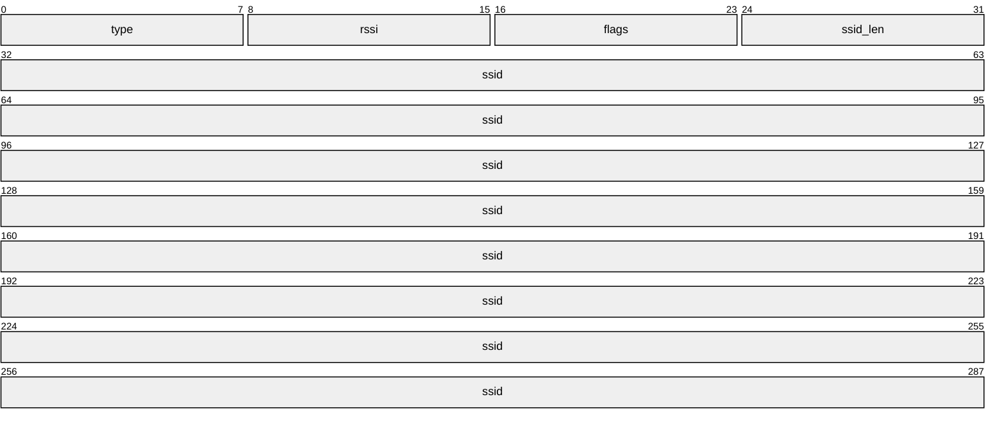
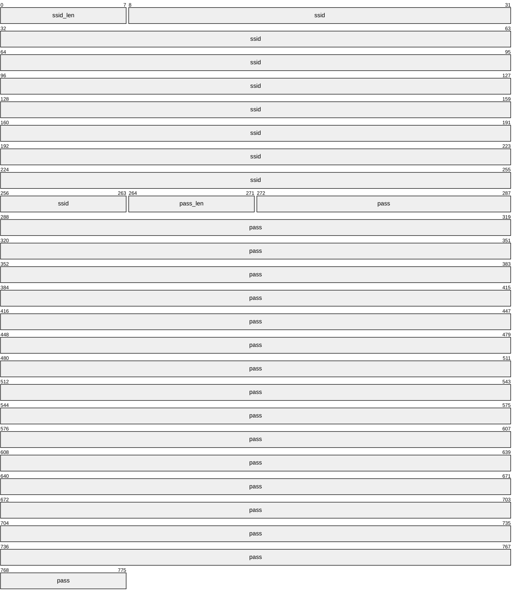

# BLE Wi-Fi Config

`libs/ble_wifi_config` 提供设备尚未联网时使用的 BLE 配网服务：手机 App 通过 BLE 扫描周边 AP，并把 Wi-Fi 凭据下发给设备。Library 只依赖 PAL，不依赖 `libs/bleikcp`，也不依赖 GizClaw RPC —— 配网发生在联网之前，这条路径必须尽量薄。

## API Reference

[API Reference](/references/ble_wifi_config)

`libs/ble_wifi_config/include` 中的头文件是本 library 的 contract source of truth；线格式的完整定义在 `h2_ble_wifi_config_protocol.h` 的 Doxygen 注释中。

## 边界

BLE Wi-Fi Config 负责：

- 注册配网 GATT profile，并解析 command 与凭据帧。
- 在 worker task 上执行 Wi-Fi scan 与 connect，并把结果编码成 notification。
- 每发现一个 AP 立刻推送一条 notification，不攒批。
- 在连接结束后推送一条配网结果，并区分密码错、找不到 AP、DHCP 失败和超时。

调用方负责：

- 启动 BLE Host 和 Wi-Fi station backend。
- 决定何时打开配网窗口（未配网，或按键触发），以及何时关闭。
- 保存配网成功后的凭据，或通过 `connect` callback 自行接管连接与保存。

**配网窗口本身就是授权**：本 library 不做鉴权、不做加密，凭据以明文写入 PROV characteristic。因此调用方必须只在需要配网时开广播，并在配网结束后立即 `h2_ble_wifi_config_close()`。

## GATT Profile

默认 profile：

| Characteristic | UUID | 属性 | 用途 |
| --- | --- | --- | --- |
| Service | `0000a100-0000-1000-8000-00805f9b34fb` | - | 配网服务 |
| CMD | `0000a101-0000-1000-8000-00805f9b34fb` | Write | 1 字节 opcode |
| SCAN | `0000a102-0000-1000-8000-00805f9b34fb` | Notify | 每条一个 AP |
| PROV | `0000a103-0000-1000-8000-00805f9b34fb` | Write + Notify | 写凭据，回配网结果 |

四个 UUID 都可以通过 `h2_ble_wifi_config_config_t` 覆盖，长度支持 2、4 或 16 字节；零长度选择上表中的默认值。默认 UUID 与仓库中已有的 BLE 服务（`libs/bleikcp` 的 `0xfee0`、H2Loader 的 128-bit 管理服务）不冲突。

凭据帧最长 97 字节，因此协商后的 ATT MTU 必须至少为 100；App 侧请求 247。MTU 不足时 library 上报 `H2_BLE_WIFI_CONFIG_EVENT_MTU_TOO_SMALL`，并且不会自行增加分片层 —— 协议前提是每条 notify 只装一个 AP、每次 write 只装一组凭据，都在单个 chunk 内。

## 线格式

所有字段小端，当前所有字段都是单字节。下面的 packet diagram 按最大长度画出可变字段，实际帧长由前面的长度字节决定。

SCAN notification：



`type` 为 `0x01` 表示一个 AP，`0x02` 表示扫描结束，`0x03` 表示扫描错误；`0x02` 和 `0x03` 帧只有 1 字节，后面不带任何字段。`rssi` 是补码 dBm，`-45` 编码为 `0xd3`。`flags` bit0 为 1 表示加密，其余位保留置 0；`security` 为 `H2_PAL_WIFI_SECURITY_OPEN` 时置 0，其余安全类型（包括 `UNKNOWN`）都置 1。`ssid_len` 取值 1..32，`ssid` 是不带结尾 NUL 的 UTF-8，因此 AP 帧最长 36 字节。隐藏网络（`ssid_len == 0`）和超过 32 字节的 SSID 不上报，只计入 `aps_dropped`。

PROV write：



`ssid_len` 取值 1..32，`pass_len` 取值 0..63，开放网络写 0；`pass_len` 的实际偏移是 `1 + ssid_len`。帧长必须与声明的字段完全一致，多余尾字节会被拒绝，因此最长帧为 97 字节。

PROV 结果 notification：


`status` 为 `0x00` 表示成功，非 0 表示失败。`reason` 取值 `0x00` 无、`0x01` 密码错、`0x02` 找不到该 AP、`0x03` DHCP 失败、`0x04` 连接超时、`0xff` 未知错误。畸形的凭据帧被同时以两种方式回应：ATT write 本身以解码结果失败（`H2_PAL_ERR_FORMAT`），worker task 随后仍推送一条 `{0x01, 0xff}` 结果帧，因此 App 不会停在等待页；该回执同样只投递给发起写入的那个连接。

## 失败原因判定

`reason` 必须能区分 0x01 密码错和 0x02 找不到 AP，因此默认实现分两步：

1. 连接前先按 SSID 做一次定向 scan。扫不到该 AP 直接返回 0x02，不发起连接；scan 本身失败时按“存在”处理，避免坏掉的 scan 伪装成缺失网络。这一步可以通过 `skip_ap_verification_before_connect` 关掉，代价是丢失可靠的 0x02。
2. 连接返回后读 station status。已关联但没有地址判为 0x03；否则按 `disconnect_reason` 映射，默认表覆盖 IEEE 802.11 与 ESP-IDF 的 reason code（`15`、`202`、`204` 等判为密码错，`200`、`201` 判为找不到 AP），其余在 `H2_PAL_ERR_TIMEOUT` 时判为 0x04，最后兜底 0xff。

`disconnect_reason` 是 backend 透传值，编号不同的平台通过 `map_reason` callback 提供自己的映射，不要修改默认表。

`connect` callback 非 NULL 时完全接管上述流程。它在 worker task 上同步执行，一次只有一个调用，返回即代表本次尝试结束；library 不做取消也不施加超时，`connect_timeout_ms` 与 `skip_ap_verification_before_connect` 都不适用，callback 必须自己限定耗时（`close()` 会等待进行中的尝试返回）。凭据只在调用期间借出，保存由 callback 负责。`out_reason` 预置为 `H2_BLE_WIFI_CONFIG_REASON_NONE`，失败时由 callback 写入要上报的 reason，未写入则上报 `0xff`；返回值本身不发给对端，只有 `out_reason` 会。

## 任务模型与并发

Scan 和 connect 都在 library 自己的 worker task 上执行，因此彼此串行。GATT write callback 只做校验和入队，不阻塞 BLE Host：重复写 `0x01` 在扫描排队或进行中是 no-op；PROV 在上一组凭据还没处理完时返回 `H2_PAL_ERR_BUSY`。`on_event` 只在 worker task 上调用，且不持有 library 的锁。

Library 同时只跟随一个 peripheral connection：先到的连接被采纳，携带其它 connection handle 的写入返回 `H2_PAL_ERR_INVALID_STATE`，直到该连接结束。

Wi-Fi 工作的生命周期长于发起它的那次 ATT write，因此每条 notification 都绑定发起它的连接：service 为每次采纳的连接递增 generation，扫描帧、配网结果和畸形帧回执都携带 `(conn_handle, generation)`。连接结束后即使 controller 复用同一个 handle，新 peer 也不会收到上一个 peer 的 AP 列表或配网结果。发起方在 Wi-Fi 工作期间断开时连接尝试仍然完成（设备照常联网），只是结果不再投递。

身份校验与发送在同一个临界区内完成：如果先解锁再调用 `h2_pal_ble_notify()`，一次「断开 + 复用同一 handle 重连」可以插在两者之间，已经通过校验的帧就会落到新 peer 上。代价是 GATT write callback 和 BLE system event 可能被阻塞一次 notification 的时长，因此要求 BLE Host 不在 `h2_pal_ble_notify()` 内部于同一 task 上回调这些 handler；现有 provider 都不会这样做。

Notification 只在对端已订阅对应 characteristic 时发送。SCAN 未订阅时写 `0x01` 直接返回 `H2_PAL_ERR_INVALID_STATE`，不会白跑一次扫描。

## 与其他 BLE 服务共存

`h2_pal_ble_register_gatt_services()` 注册的是整份 schema，一个 Host 只能有一个 owner。需要和 H2Loader 等其他服务共存时，调用方设置 `gatt_service_registered_by_caller`，用 `h2_ble_wifi_config_gatt_service()` 取回 borrowed declaration，和自己的 service 一起注册；此时 `close()` 也不会调用 unregister。

Host 借用 schema、callback context 和 handle 存储直到 unregister 成功，因此 `close()` 在 unregister 失败时返回该错误并保留整个 instance，不释放内存，调用方可以重试 `close()`。

Wi-Fi 与 BLE 共用射频，扫描和连接期间广播会同时拖慢两边，这与 `h2loader/ble` 在 Wi-Fi 活动期间暂停 loader 广播的处理一致。本 library 默认在 scan/connect 前停掉**自己**通过 `h2_ble_wifi_config_start_advertising()` 开启的广播，结束后按原参数恢复；它不会动别人的广播。已建立的连接不受影响，所以配网会话本身不会被打断。需要保持广播时设置 `keep_advertising_during_wifi`。

ESP target 上另有一层 `h2_esp_platform_wifi_set_activity_observer()`，由 ESP app-command 组件安装并暂停 H2Loader 的广播。那是 ESP-private 机制，portable library 不能使用；两层互不冲突，各自只暂停自己拥有的广播集合。

## 构建与测试

```sh
bazel test //libs/ble_wifi_config:all
```

`ble_wifi_config_protocol_test` 覆盖编解码边界（`ssid_len` 1/32、`pass_len` 0/63、截断、尾随字节、越界长度）并对凭据解码做全长度、全填充模式的遍历；`ble_wifi_config_service_test` 用 fake PAL 覆盖扫描逐条上报、扫描幂等、四种失败 reason、畸形帧回执、广播暂停、unregister 失败后的可重试 `close()`，扫描期间断连并复用同一 handle 重连时不串台，以及重连事件无法插进一次发送的中间。
