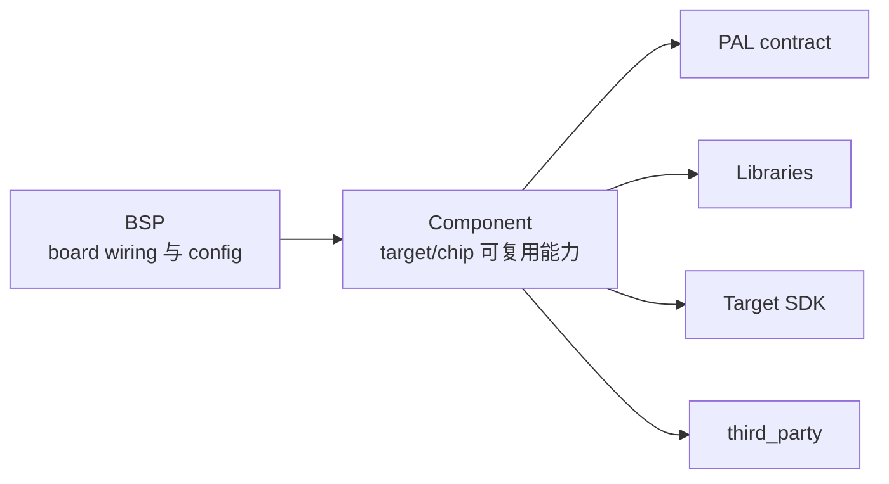

# Components

`native_component_src/` 保存由原生 SDK build system 编译的 SDK family 或 target 组件源码。Component 把 SDK、芯片外设、跨平台 library 或 third-party integration 组装成 BSP 可以直接消费和配置的能力。由 Bazel 直接编译的平台 PAL backend 和 host integration 属于 `libs/pal/providers/`。

Component 不描述某一块物理 board。GPIO、bus、address、channel、外设实例和其他 board wiring 由 BSP 提供，并通过 component config 传入组件。

## 依赖关系



BSP 选择当前 board 需要的组件，并提供板级配置。Component 可以依赖 PAL contract、跨平台 Libraries、target SDK 和 third-party 上游代码，但不能反向依赖某个具体 BSP、app 或固件入口。

## 目录结构

稳定目录按 SDK compatibility line 或执行单元组织：

```text
native_component_src/
├── esp-idf6.x/            # ESP-IDF 6.x family components
├── bk7258/
    ├── ap/                # BK7258 AP components
    └── cp/                # BK7258 CP components
├── bk3633/                # BK3633 SDK runtime 与 PAL backend
└── jieli/
    └── br23/              # JieLi AC695N PAL core provider
```

ESP32-S3、ESP32-P4 和 ESP32-C5 共用 ESP-IDF 6.x component root。Chip 差异通过 `IDF_TARGET`、target-specific source selection 或 component config 表达，不按 chip 复制一整套 component tree。

Multi-chip 或 multi-core target 必须明确区分代码运行在哪一个执行单元上。BK7258 的 AP 和 CP 因为拥有不同的 SDK 能力、启动流程和依赖，所以分别放在 `native_component_src/bk7258/ap/` 与 `native_component_src/bk7258/cp/`。

杰理 (JieLi) 各系列 SDK 由 `jieli_firmware` external rule 按 `target`（`br23` = AC695N、`wl82` = AC791N）驱动，共用一条工具链 repository；`native_component_src/jieli/br23/h2_pal_core/` 保存 AC695N 的 PAL core provider，接入方式见 [JieLi Components](./components/jieli)。

Bazel 直接编译的平台实现位于 `libs/pal/providers/{linux,darwin,posix,allwinner-linux,desktop,ios,android,web}/`。这些目录仍使用下方平台专题文档，但不属于顶层 `native_component_src/` source tree。

平台文档：

- [Desktop Components](./components/desktop)
- [Linux Components](./components/linux)
- [Darwin Components](./components/darwin)
- [POSIX Components](./components/posix)
- [Windows Components](./components/windows)
- [Mobile Platform Components](./components/mobile_platforms)
- [Allwinner Linux Components](./components/allwinner_linux)
- [ESP-IDF 6.x Components](./components/esp_idf6_x)
- [BK7258 Components](./components/bk7258)
- [BK3633 Components](./components/bk3633)
- [JieLi Components](./components/jieli)

## 组件类型

### PAL backend

PAL backend 实现 `libs/pal/include` 定义的 contract，并向 BSP 提供已初始化的 PAL API 或 object。

PAL backend roots 包括：

- `libs/pal/providers/linux/pal_core`
- `libs/pal/providers/linux/serial_host`
- `libs/pal/providers/darwin/pal_core`
- `libs/pal/providers/linux/alsa_audio`
- `libs/pal/providers/linux/fdk_aac_decoder`
- `libs/pal/providers/allwinner-linux/cedarx_video_decoder`
- `libs/pal/providers/desktop/pal_core`（只提供跨平台 Desktop provider，不拥有 OS backend）
- `libs/pal/providers/ios/pal_core`
- `libs/pal/providers/android/pal_core`
- `libs/pal/providers/web/pal_core`
- `native_component_src/esp-idf6.x/h2_pal_core`
- `native_component_src/bk7258/ap/h2_pal_core`
- `native_component_src/bk7258/cp/h2_pal_core`
- `native_component_src/jieli/br23/h2_pal_core`

负责运行完整 runtime 的 target 如果不支持某项 PAL 能力，仍应提供 contract 要求的 API object，并使用明确的 unsupported、dummy 或 fake implementation；不能让调用方依赖缺失 symbol 判断能力。不运行 runtime 的辅助 chip 或 core 不要求提供完整 PAL 和 runtime config。

### 硬件能力组件

硬件能力组件封装芯片 SDK 和具体器件 driver，对外提供 BSP 可以初始化和取得的组件能力。例如：

- `h2_es8311_audio_system` 和 `h2_es8311_es7210_audio_system` 组装 codec、I2S、audio mixer 和 audio PAL object。
- `h2_nfc_fm175xx` 把 portable FM175xx driver 接到 target I2C 或 SPI API，并提供 NFC PAL API。
- `h2_motion_qmi8658` 和 `h2_quectel_modem` 把 portable driver 接入 target build，供 BSP 继续配置和组装。

Component 定义 config 的形状；BSP 负责填写当前物理 board 的 GPIO、I2C address、bus handle、channel 和其他 wiring 值。

### Library build adapter

跨平台实现仍然属于 `libs/<library>`，其 package 只定义普通 Bazel library，不声明 firmware component identity。每个最终 firmware entry 用唯一一个本地 `firmware_lib_component` target 列出当前 image 选择的全部 Bazel libraries；firmware runner 在 action-local staging tree 中生成单个 `h2_firmware_lib` 原生组件，并把完整 archive closure 放进同一个 rescan link group。仓库不能为 `h2_audio_mixer`、`h2_bleikcp`、`h2_runtime` 等 library 创建只转发 public include 和 `.a` 的 `native_component_src` 目录。

只有确实需要独立 SDK dependency、Kconfig、registration identity 或 native glue 时才保留 native adapter；它可以导入 Bazel archive，但不能重新编译 library source 或生成第二份 archive。需要直接包含 SDK header、读取 SDK config 或实现 SDK lifecycle 的源码仍属于 `native_component_src/<platform-or-sdk>/`，不能借 adapter 移入 `libs`。

### Third-party port

Third-party port 负责把上游代码接入当前 target 的 compiler、OS 或 SDK，例如 `lvgl_port`、`opus_port` 和 `zlib`。GizOS 对 app 暴露的跨平台 contract 仍应位于 `libs`；port 只处理 target integration。能够通过 PAL capability 注入完成的平台适配应直接留在 portable library 中，不另设 target port component。

### Target runtime glue

只在某个 target 上成立、并且可由多个 project 复用的启动与运行时适配可以作为顶层 component，例如 BK CP transport。它们可以组合 target SDK 与仓库共享逻辑，但不能拥有具体 board 的 image 配置或 app 业务。

只服务某个 project group、并由原生 SDK 构建的 target glue 属于 `projects/<group>/native_component_src/<platform-or-target>/`。例如 H2Loader 的 ESP runtime glue 和 BK AP adapter 放在 `projects/h2loader/native_component_src/`，不进入顶层 `native_component_src/`；由 Bazel 直接编译的 project-local reusable code 则属于 `projects/<group>/libs/`。

## Public Interface

需要由 BSP 或固件入口调用的 component interface 放在组件自己的 `include/` 中。典型接口由三部分组成：

1. Component config：描述初始化需要的 target object 和 board wiring 参数。
2. Component state：保存 SDK handle、driver state 和组件生命周期状态。
3. Init 和 capability accessor：初始化组件，并返回 PAL API、PAL object 或其他组件能力。

例如 ESP FM175xx component 保留 I2C initializer，并提供独立的 SPI initializer。BSP 选择 transport，传入 `periph_id`、bus、address 或 CS/SCK/MOSI/MISO/NPD 等 wiring 后取得 `h2_pal_nfc_api_t`。SPI component 拥有其 device、专用 bus 和 NPD lifecycle；portable driver 不感知 transport。Component 不决定这个 NFC 外设对应哪个 app `component_id`；该 mapping 属于 `boards/main`。

Component 内部实现和只供同一组件使用的 header 不属于 Public Interface，不应通过 public include path 暴露。

## Component、Library 与 BSP

三者的边界是：

```text
Library
  -> 定义跨平台 API 和 portable implementation

Component
  -> 接入 target SDK、chip peripheral 或 third-party port
  -> 把 Library 或 driver 封装成 target 可用能力

BSP
  -> 选择当前 board 使用的 Component
  -> 提供 GPIO、bus、address、channel 和 board defaults
  -> 组装当前 board 的 runtime config
```

可跨 board 复用的 target/chip 实现属于 Component。只对一块物理 board 成立的 wiring 和默认值属于 BSP。可以脱离 target SDK 编译和测试的逻辑属于 Library。

## 禁止的依赖

Component 不应该：

- 依赖 `projects/<app>` 或定义 app 业务流程。
- 依赖某个具体 `boards/<board>`。
- 拥有 app `component_id` 到 board `periph_id` 的 mapping。
- 固化某块 board 的 GPIO、I2C address、partition table 或 image policy。
- 复制 `libs` 中已有的公共 API 和 portable implementation。
- 把 target SDK 类型暴露为 app-facing API。
