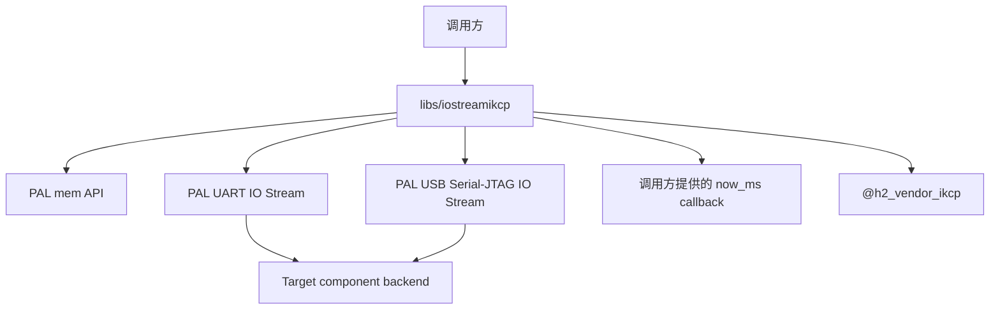
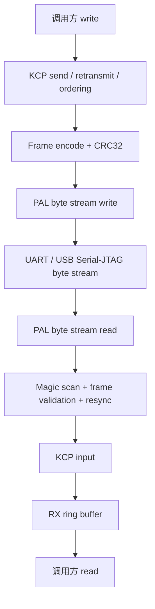
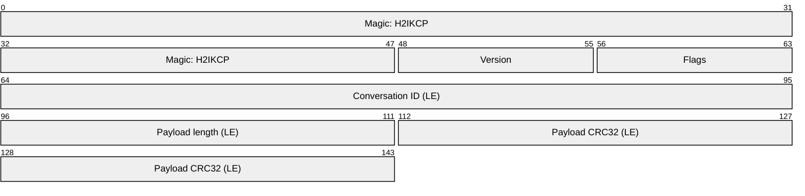

# IO Stream iKCP

`libs/iostreamikcp` 在 UART 或 USB Serial-JTAG byte stream 上提供可靠、有序的双向传输。底层通道可以同时承载日志和协议数据；IO Stream iKCP 使用可识别的 frame、CRC32 和流式重同步提取 iKCP payload，再由 iKCP 处理重传、顺序和发送窗口。

[API Reference](/references/iostreamikcp)

## 依赖关系

IO Stream iKCP 是跨平台 library。它依赖 PAL 提供内存与底层 byte I/O contract，并复用 `@h2_vendor_ikcp` 的协议实现，不直接依赖 board、target SDK 或操作系统 task。



调用方可以使用 library 提供的 UART 或 USB Serial-JTAG adapter 生成 `h2_iostreamikcp_io_t`，也可以实现同样的 `read`、`write` 和 `flush` callback 接入其他 portable byte stream。

## 边界

IO Stream iKCP 负责：

- 将 iKCP datagram 编码为带 magic、版本、conversation ID、长度和 CRC32 的 frame。
- 从可能夹杂日志或损坏字节的输入流中识别 frame，并在格式错误或 CRC 错误后重新同步。
- 使用 iKCP 处理重传、乱序恢复和发送窗口。
- 将收到的 KCP message 转换为连续 byte stream，并缓存在内部 RX ring buffer 中。
- 统计收发字节、frame、被跳过的日志字节、输入错误、CRC 错误、RX high-water mark 和 KCP pending segment。

调用方负责：

- 初始化并配置 UART、USB Serial-JTAG 或其他底层 byte stream backend。
- 创建、持有和销毁 IO Stream iKCP instance。
- 周期性驱动输入读取和 KCP 时钟更新。
- 保证同一个 instance 的调用顺序和并发安全。
- 定义连接建立、会话重建、超时恢复和上层 application protocol。

IO Stream iKCP 不负责 UART pin、USB 初始化、console 路由、日志输出策略、内部 worker task 或 board wiring。

## 数据路径



发送方向先由 KCP 生成 datagram，再编码为 IO Stream iKCP frame。接收方向先过滤日志和无效输入，只把 conversation ID 匹配且校验通过的 payload 交给 KCP。

## Frame 格式

每个 frame 使用固定的 18-byte header，header 后紧跟 KCP payload：



Header 的 bit range 从 frame 起始位置计算。Flags 只允许以下三个完整值：

- `0x00`：data frame，payload 是一个完整 KCP datagram。
- `0x01`：`SESSION_OPEN`。
- `0x02`：`SESSION_ACK`。

Control flag 不能组合。Control payload 固定为 4-byte little-endian conversation ID mirror，并必须等于 header 中的 conversation ID；未知 flag、错误长度或 mirror 不匹配的 frame 都不能建立 session。18-byte header 后的 payload 最大为 `1024` bytes，CRC32 继续只校验 payload。

Filter 可以跨多次输入保留不完整 frame；遇到普通日志、错误版本、非法长度或 CRC 错误时丢弃非法 candidate 并继续寻找下一个 magic，不要求底层 read 与 frame 边界对齐。已识别但校验失败的二进制 frame 不作为平台日志输出，也不能重新分类为普通日志。

可选 `on_log` sink 只接收已确认不属于 frame candidate 的原始 byte slice。Slice 借用 filter 的输入 buffer，只在同步 callback 返回前有效；library 不跨 callback 保存 sink 或 slice 的所有权。每个交付给 sink 的 byte 只计入 `log_bytes` 一次，frame header、payload 和 malformed candidate 的 byte 都不计入日志。Callback 返回的错误（包括调用方用来表示取消的 `H2_PAL_EXIT`）由当前 `input()` 或 `poll()` 原样返回，不继续交付后续日志，也不把剩余输入重新解释为 frame 或日志。

Standalone filter callback 中的 frame 和 payload 借用 filter 内部 buffer，只在 callback 返回前有效。由外层 session owner 解码物理 stream 时，使用 `h2_iostreamikcp_input_frame()` 把匹配 conversation ID 的 data frame 注入 KCP；control frame 不能进入该 API。

## Session

Host 每次 probe、connect 或 reconnect 都生成新的非零 conversation ID，发送 `SESSION_OPEN`，并只在收到匹配的 `SESSION_ACK` 后发送 data。设备只接受 open，Host 只接受 ack；role 不匹配的 control frame 不改变 active session。

一个物理 endpoint 同时只有一个 standalone filter、active KCP stream 和 command executor。新的合法 open 先让当前同步 command I/O 返回 closed；handler 完成清理后，owner 关闭旧 stream、重置 command parser、创建新 stream，最后发送 ack。Stream 不能在 filter callback 栈内释放。

## Config

创建 stream 时需要提供 `h2_iostreamikcp_config_t`：

- `io`：底层 byte stream 的 `user + read/write/flush callback`。
- `allocator`：stream、RX buffer 和临时接收 buffer 使用的 `h2_pal_mem_api_t`；为空时使用 C allocator。
- `now_ms` 和 `time_user`：`flush` 驱动 KCP 时使用的单调毫秒时钟。
- `conv`：双方一致的 KCP conversation ID；`0` 使用默认值。
- `mtu`：KCP payload MTU；`0` 使用 `352`，有效范围为 `64` 到 `1024` bytes。
- `receive_window`：本端可接收的 KCP segment 数；`0` 使用 `64`。UART backend 应按驱动 RX buffer 容量缩小窗口，避免可靠层突发量超过物理层缓存。

H2Loader 的 ESP32-S3 与 BK7258 UART adapter 使用 20-segment receive window。Physical poll 每次最多读取 `512` bytes，并把阻塞等待限制为 `10` ms；每次 poll 后调用 KCP update。KCP 自身 interval 同样为 `10` ms，CWND 保持开启；Host 写入按 KCP MSS 分块，使每个 message 对应一个 KCP segment。

BK7258 上 CP 是 UART0 的唯一 RX owner，AP 持有 IO Stream iKCP instance。CP→AP 方向保持原始输入 byte order；AP→CP 方向用 target-private、SLIP-framed begin/data/end transaction 在 mailbox 限制内分片，CP 完整重组后暂停 shell TX、同步写出一个完整 encoded frame，再恢复 shell TX。CP 等 physical UART TX 完成后，通过独立 mailbox channel 返回 transaction sequence ACK；AP 的底层 write 只有收到匹配 ACK 才成功。该 envelope 与 completion ACK 都不是 H2IKCP wire format，不能进入 PAL public contract，也不能由 Host 感知。
- `rx_buffer_size`：内部 byte-stream RX ring 大小；`0` 使用 `4096`，且不能小于 MTU。
- `write_timeout_ms`：底层 byte stream 写入每个 frame 时使用的 timeout。
- `on_log` 和 `log_user`：可选的同步 borrowed log sink；调用方必须保证 callback 和 user 在 stream 关闭前有效，callback 不能保留输入 slice。

Open 只创建 portable stream state，不初始化或取得底层 PAL backend 的所有权。Close 释放 KCP state 和 library 自己分配的 buffer，不销毁调用方传入的 PAL API object。

## 驱动模型

IO Stream iKCP 不创建 worker 或 task，调用方必须在自己的 event loop 或 task 中驱动它：

1. 调用 `poll(timeout_ms)` 从底层 byte stream 读取数据并送入 frame filter，或者把已读数据传给 `input()`。
2. 使用单调毫秒时间周期性调用 `update(now_ms)`，驱动 KCP timer、重传和接收数据搬运。
3. 调用 `read()` 消费 RX ring 中的数据，并调用 `write()` 发送 byte stream。
4. 根据 event loop 的退出条件调用 `close()`。

`read()` 是非阻塞接口，没有可读数据时返回 `H2_PAL_ERR_WOULD_BLOCK`。`poll()` 保留底层 timeout 和 would-block 语义；底层成功但没有返回数据时，结果为 `H2_PAL_ERR_TIMEOUT`。Filter 或 log sink 的 callback 错误优先结束当前调用并原样返回；已经完成的 frame、日志和 byte counter 不回滚，尚未交付的输入不会伪装成成功消费。

`write()` 会按 MTU 分段送入 KCP 并触发本地 flush。写入成功表示数据已经进入本地发送路径，不表示 peer 已经确认。`flush()` 负责刷新 KCP output 和底层 byte stream，同样不等待远端 ACK；调用方可以通过 stats 中的 `waitsnd` 判断仍在等待发送或确认的 KCP segment 数量。

单次 `update()` 或 `flush()` 最多对底层 transport 发起一次失败写入。KCP 会为发送窗口中剩余的每个 segment 继续调用 output，因此第一次写入失败被记录后，本次调用内的后续 output 直接失败返回，不再重复消耗 `write_timeout_ms`；错误在调用返回值中原样上报，下一次 `update()`、`flush()` 或 `write()` 重新开始记录。

## PAL Adapter

Library 提供两个直接 adapter：

- UART adapter 消费 `h2_pal_uart_io_stream_api_t`。
- USB Serial-JTAG adapter 消费 `h2_pal_usb_jtag_io_stream_api_t`。

Adapter 只把对应 PAL API 转换为 library 的 `h2_iostreamikcp_io_t`，不会创建 backend、改变设备配置或取得 API object 的所有权。两个 endpoint 必须使用相同的 frame contract、conversation ID 和 KCP 配置。

## 构建与测试

```sh
bazel test //libs/iostreamikcp:all
```

`tests/` 需要覆盖日志前缀和日志夹杂、同步 log sink 的 borrowed lifetime、callback 错误/取消与精确 byte accounting、跨 read 的不完整 frame、伪 magic、malformed candidate 不进入日志、连续 frame、CRC 错误后的重同步、conversation ID 过滤、双端 round trip、RX backpressure、底层 write/flush timeout，以及 poll 的 timeout 和 would-block 语义。
