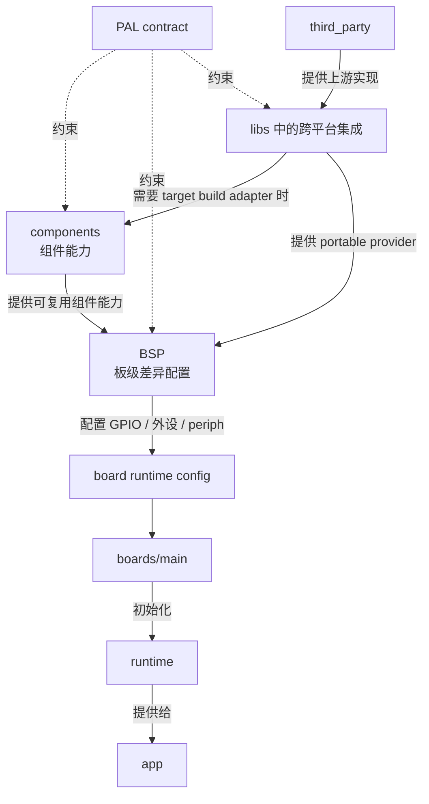

# Platform Abstraction Layer

Platform Abstraction Layer（PAL）定义 GizOS 使用的平台抽象能力。PAL 把芯片 SDK、操作系统和具体硬件实现隔离在跨平台代码之外，使 `libs`、runtime 和 app 可以使用稳定的 C contract。

## API Reference

[API Reference](/references/pal)

`libs/pal/include` 中实际参与项目构建的头文件是 PAL 的生产 Public API contract。

PAL 包定义 contract，并提供一组可选的 canonical unsupported API object：

```text
libs/pal/include/
├── h2_pal.h                    # 全量 PAL aggregate header
└── h2/pal/
    ├── core/                   # 公共类型与错误码
    ├── os/                     # 操作系统基础能力
    ├── net/                    # 网络与传输能力
    ├── application/            # 应用协议能力
    ├── hal/                    # 硬件抽象能力
    └── h2_pal_unsupported.h    # canonical unsupported API accessor
libs/pal/src/unsupported/       # 每个 capability 一个 canonical unsupported translation unit
└── <capability>.c
```

这些目录只对同一个 `libs/pal` package 中的 public header 做职责分组，不拆分
Bazel package、target、Runtime surface 或 provider ownership。

`src/unsupported/` 是 `libs/pal` 中允许存在的唯一通用 backend source。真实平台实现、dummy backend 和 fake backend 不属于 PAL contract 包。

`//libs/pal:pal` 是 header-only contract target；只消费 PAL 类型、vtable 或真实
provider 的 target 只依赖它。直接调用 `h2_pal_unsupported_*_api()` 的 target 显式
依赖 `//libs/pal:unsupported`。后者按 capability 拆成独立 translation unit，使静态
链接器只抽取真正引用的 unsupported API object，不使用 `alwayslink` 或 whole-archive。

ESP-IDF、BK7258 和 BK3633 由 Bazel 使用对应 firmware toolchain 将
`//libs/pal:unsupported` 编译成独立 `.a`，再交给 native SDK 完成最终链接；PAL
public include 通过它对 `//libs/pal:pal` 的依赖传播。Native CMake/Make 只能注册或
链接该 archive，不能再次枚举 `src/unsupported/*.c`，也不能把 source 复制进平台
PAL component。

PAL contract 不能依赖 ESP-IDF、Armino、FreeRTOS、desktop platform、具体 board header 或其他 target-private API。

## 关系

PAL 有两条实现来源。第一条是平台或芯片实现：`components` 将 SDK 和芯片能力封装为可复用组件。第二条是 third-party 跨平台集成：`third_party` 提供上游代码，`libs/pal/providers/<integration>` 完成跨平台 provider。Portable provider 已有完整 lifecycle 和 API accessor 时，BSP 直接注入 target component 提供的底层能力并组装 provider；只有 target build adapter 或额外的可复用 target policy 确实存在时才增加 component，不能创建只转发 library init/deinit/api 和 ready 状态的 wrapper。BSP 仍只负责当前物理 board 的差异配置、wiring 和 capability assembly，例如 GPIO、总线、外设实例和 `periph_id`。



PAL 不负责 app component 与 board periph 的映射。BSP 定义 board 的 `periph_id`，app 定义 `component_id`，两者的映射由 `boards/main` 提供。

Browser 的 reusable provider 位于 `libs/pal/providers/web/pal_core`，只暴露真实实现的 Memory、Log、Time、Timer、Task、Queue、Sync、Pref、Display、Touch 与 Host Serial accessor。Pref 使用当前 HTTPS origin 的 `localStorage` 保存 namespace-scoped typed entry；private mode、storage policy 或 quota 使存储不可用时，`open` 必须返回 `UNAVAILABLE`，不能伪装成可持久化内存。一个 live platform state 持有单线程 libco executor；Browser event、Promise 与 timeout callback 只记录完成，后续 bounded pump 才能恢复 task，不能 callback 内重入 scheduler。Artifact entry 而不是 provider 负责构造完整 Runtime：真实 accessor 填入已实现字段，其余字段逐项绑定 matching canonical unsupported API object。Host Serial 不在 Runtime 中，由 launcher单独注入 portable consumer。

## PAL 分类

PAL 按能力职责分为以下几类。

### Core 公共定义

公共定义提供所有 PAL 共用的基础类型和错误码，本身不表示某项能力。

```text
h2/pal/core/h2_pal_types.h
h2/pal/core/h2_pal_errors.h
```

### OS 操作系统抽象

操作系统抽象为跨平台代码提供内存、日志、时间、并发、同步、存储和系统事件等基础运行能力。它隔离 allocator、RTOS primitive、文件系统和持久化存储的差异。

```text
h2/pal/os/h2_pal_crypto.h
h2/pal/os/h2_pal_disk.h
h2/pal/os/h2_pal_firmware_info.h
h2/pal/os/h2_pal_fs.h
h2/pal/os/h2_pal_json.h
h2/pal/os/h2_pal_log.h
h2/pal/os/h2_pal_mem.h
h2/pal/os/h2_pal_pref.h
h2/pal/os/h2_pal_queue.h
h2/pal/os/h2_pal_serial_host.h
h2/pal/os/h2_pal_sync.h
h2/pal/os/h2_pal_system_event.h
h2/pal/os/h2_pal_task.h
h2/pal/os/h2_pal_time.h
h2/pal/os/h2_pal_timer.h
```

`h2_pal_mem.h` 定义内存分配能力，属于操作系统抽象，不是公共基础类型。它使用 `h2_pal_mem_api_t = user + const h2_pal_mem_vtable_t *`，并通过 `h2_pal_mem_alloc()`、`h2_pal_mem_realloc()` 和 `h2_pal_mem_free()` wrapper 使用。`h2_pal_firmware_info.h` 读取编译进当前运行固件的版本；ESP provider 使用 ESP-IDF app description，BK provider 使用 build wiring 注入的版本字符串，portable app 不直接读取 SDK metadata 或 build variable。`h2_pal_system_event.h` 抽象平台系统事件来源，runtime 再把需要暴露给 app 的事件投影为 runtime event/state。

Time PAL 的真实 provider 必须同时提供 `get_monotonic_ms` 和 `get_monotonic_us`。两者读取同一个不受 wall-clock 校时影响的单调时间域；`get_monotonic_us` 使用微秒单位，但硬件实际分辨率可以粗于一微秒。Canonical unsupported provider 仍提供完整 operation 并返回 `H2_PAL_ERR_UNSUPPORTED`，真实 provider 不能通过 `monotonic_ms * 1000` 伪造微秒时钟。

`h2_pal_json.h` 定义严格、bounded 的 JSON document/value contract。yyjson provider
位于 `libs/pal/providers/yyjson`，通过 Memory PAL 注入 allocator；provider 选择属于
composition owner，不自动进入 Runtime。完整的 strict parse、opaque handle ownership、
mutation、serialize、限制与生命周期见 [JSON](./json.md)。
Object iteration 通过 `object_size + object_entry` 暴露 provider-specific 顺序的
borrowed key/value；它用于在不依赖 provider 类型的情况下保留动态 JSON object，
不把顺序提升为 wire contract。

`h2_pal_sync.h` 的 condition 必须与同一 API 创建的 non-recursive mutex 配合。调用 `h2_pal_cond_wait()` 前，调用方必须已经持有 mutex；backend 在进入等待时原子释放 mutex，并在正常唤醒、timeout 或其他普通 error return 前重新取得同一个 mutex。调用方因此总是按“wait 返回时仍持锁”更新 waiter counter、predicate 和 failure state。无法保证该语义的 backend 必须在 condition create 时返回 `H2_PAL_ERR_UNSUPPORTED`，不能提供会在 error path 丢失 mutex ownership 的 partial implementation。

`h2_pal_crypto.h` 固定了跨 backend 的密码能力和 wire format。X25519 的
private/public/shared value 都是 RFC 7748 的 32-byte little-endian bytes；
provider 在副本上 clamp private scalar、mask remote public high bit，并拒绝
all-zero shared secret。P-256 private scalar 使用 32-byte big-endian，public
key 使用 33-byte SEC1 compressed point，ECDSA signature 使用 64-byte raw
`r || s`。HKDF-SHA256 接收 byte-span salt/info；AES-CTR 接受 16/24/32-byte
key、16-byte big-endian counter，并只允许 exact alias。AEAD 只包含
AES-128-GCM、AES-256-GCM 和 ChaCha20-Poly1305，固定 12-byte nonce 与
16-byte tag；plaintext 是 consumer policy，不是 Crypto PAL algorithm。MD5
和 HMAC-SHA1 只用于 TURN/STUN/SRTP compatibility，不能用于新协议设计。

`libs/pal/providers/wolfssl` 是 `@h2_vendor_wolfssl` 的唯一 stable-tree integration
boundary。裁剪 variant 完整实现 Crypto PAL；完整 variant 额外实现 DTLS PAL，
并统一管理 WolfSSL allocator、entropy、全局 init/deinit 和 live session。
ESP-IDF 与 BK7258 provider 使用 public PSA/MbedTLS surface 实现同一完整 vtable，
不能通过 private header 或本地复制算法补洞。

`h2_pal_dtls.h` 以 whole datagram 为 I/O 边界。Session copy config，生成
临时 ECDSA identity，并用 peer certificate DER 的 raw SHA-256 fingerprint
认证远端；只协商 `SRTP_AES128_CM_SHA1_80`，exporter 固定为
`EXTRACTOR-dtls_srtp`，并固定输出 60-byte client/server key 与 salt block。
Provider 必须先把每个 outbound datagram 复制进有界队列
再调用 send callback；pending output 存在时新的 plaintext write 返回
`H2_PAL_ERR_WOULD_BLOCK`。首次 handshake call 固定 hard deadline，后续
retransmission 由 caller 根据 absolute `next_deadline_ms` 驱动，provider 不创建
task、timer 或 thread。

BK3633 的 Preference provider 使用 BSP 提供的 declarative mapping，把 portable namespace/key 映射到 application-owned NVDS tag。Provider 初始化会拒绝重复 namespace/key、重复 tag、空名称、未知类型、非法最大长度以及 application range 外的 tag；未知 key 不会动态取得 tag。`BLOB` 保存原始 bytes，`STRING` 保存不含 NUL terminator 的 UTF-8 bytes，读取时使用调用方的 Memory PAL 分配并追加 terminator；`U32` 和 `I32` 使用四字节 little-endian，`BOOL` 使用单字节 `0` 或 `1`。NVDS 写入立即持久化，因此 `commit` 是成功 no-op，不承诺 multi-key transaction atomicity。

ESP Preference 使用私有的 256 KiB `pref` LittleFS，不使用系统 NVS 保存新值。每个 key 是独立的 CRC record；set 通过同目录临时文件、sync、close 和 atomic rename 立即持久化，remove 立即 unlink，`commit` 因此是成功 no-op。这个合同只保证单 key replacement，不承诺多 key transaction atomicity。Provider 对 committed record bytes 施加 128 KiB logical budget；删除和替换产生的 LittleFS block 由 filesystem 正常回收，`NO_SPACE` 不触发 format 或清空 live data。

BK3633 的 Disk provider 只暴露 BSP 声明的 raw Flash partition，portable caller 使用 partition-relative offset，不能传入 absolute address。Provider 对 partition ID、权限、整数 overflow、边界、erase alignment、write alignment、zero-length operation 和 buffer 做完整校验；firmware、Stack、factory identity、calibration、NVDS 和未声明区域不进入可见 partition inventory。

### Net 网络与传输能力

网络与传输抽象提供 network interface、socket、DTLS 和 SCTP 等跨平台能力。它们使用操作系统抽象和硬件网络能力，但不暴露 radio 或芯片 SDK。

```text
h2/pal/net/h2_pal_dtls.h
h2/pal/net/h2_pal_net.h
h2/pal/net/h2_pal_netif.h
h2/pal/net/h2_pal_sctp.h
```

`h2_pal_netif.h` 抽象操作系统或平台管理的 network interface；它描述接口状态和配置，不负责具体网络通信协议。

### Application 应用协议能力

应用协议抽象提供直接面向 portable application 与 library 的 HTTP、MQTT 和 WebRTC contract。

```text
h2/pal/application/h2_pal_http.h
h2/pal/application/h2_pal_mqtt.h
h2/pal/application/h2_pal_webrtc.h
```

Net 与 Application PAL 中既有平台 backend，也有 third-party 跨平台 backend。例如
`libs/pal/providers/corehttp` 使用固定的 coreHTTP/llhttp 实现 `h2_pal_http.h`，并通过 Net PAL
取得 DNS、TCP、TLS 与 close；`libs/pal/providers/coremqtt` 使用 `@h2_vendor_coremqtt` 实现
`h2_pal_mqtt.h`，`libs/pal/providers/h2peer` 通过注入 DTLS、SRTP、SCTP、Net、Crypto、Time 和
Memory capability 实现 `h2_pal_webrtc.h`。HTTP provider 不直接依赖平台 TLS
library，也不为 HTTP 新增平台专用 HTTP 方法。

Portable provider 和 firmware library 的诊断必须从 composition root 显式借用
`h2_pal_log_api_t`，并在 backend 生命周期内保持 API object 与 `user` 有效。Library
不能直接写 `stdout`、`stderr` 或依赖 libc/newlib standard-stream global state；没有
Log capability 时应明确拒绝构造，或者对 contract 明确标记为 optional 的诊断执行
no-op，不能暗中选择标准流作为 fallback。

Net PAL 的 asynchronous resolver public contract 是：

```c
typedef struct h2_pal_net_resolver h2_pal_net_resolver_t;

h2_pal_result_t (*resolve_start)(
    void *user,
    const char *host,
    h2_pal_net_resolver_t **out_resolver);
h2_pal_result_t (*resolve_poll)(
    void *user,
    h2_pal_net_resolver_t *resolver,
    h2_pal_net_addr_t *out_addr,
    uint32_t timeout_ms);
void (*resolve_close)(void *user, h2_pal_net_resolver_t *resolver);
```

Backend 在 start 返回前复制 NUL-terminated `host`，成功时返回非空、caller-owned、
pending handle；invalid input 返回 `H2_PAL_ERR_INVALID_ARG`，容量已满返回
`H2_PAL_ERR_NO_SPACE`，其他 allocation/start failure 返回确定的 PAL error 且不返回
handle。Caller 不能并发 poll/close 同一 handle。poll 的 `timeout_ms == 0` 是
non-blocking probe；`H2_PAL_ERR_TIMEOUT` 与 `H2_PAL_ERR_WOULD_BLOCK` 保留 pending
状态且不修改 `out_addr`，`H2_PAL_OK` 才使 `out_addr` 有效，其他结果终止 lookup 且
不要求 `out_addr` 有效。Caller 在成功、失败、request timeout 或取消后恰好 close
一次；close 立即使 handle 对 caller 失效且不能等待仍在执行的平台 DNS 调用。Backend
必须限制 outstanding resolver 数量；caller close 后仍在执行的平台 lookup 转为
backend-owned，完成后自行释放全部资源并归还名额。这个 contract 让 portable
consumer 把 DNS 纳入自己的总 deadline，并在每次 bounded poll 之间检查取消信号；
既有同步 `resolve_addr` 继续服务不需要 deadline-aware lookup 的 consumer。

Net PAL 的 `tcp_connect` 是可跨 poll 继续的 bounded connect operation：`H2_PAL_ERR_TIMEOUT` 或 `H2_PAL_ERR_WOULD_BLOCK` 保留同一个 socket 和进行中的 connection attempt，caller 使用相同 remote address 再次调用；`H2_PAL_OK` 才表示连接完成，其他 error 终止本次 attempt。`tcp_send_timeout` 是 raw TCP 的 bounded send operation，不改变既有 `tcp_send` consumer。正返回值是本次已提交的 byte 数，可以小于请求长度；调用方保留并重试余下 bytes。`timeout_ms == 0` 且没有 progress 返回 `H2_PAL_ERR_WOULD_BLOCK`，正 timeout 到期且没有 progress 返回 `H2_PAL_ERR_TIMEOUT`。Orderly close 或 reset 返回 `H2_PAL_ERR_CLOSED`，其他 socket failure 返回 `H2_PAL_ERR_IO`；error return 不消费 bytes，单次调用不能阻塞超过给定 timeout。Desktop、ESP-IDF 6.x 与 BK7258 backend 都提供相同 raw TCP client contract；`tls_wrap` 后的同一 opaque socket 由 Net backend 路由到平台 TLS context。HTTPS 默认使用 `REQUIRED` 验证；缺少可用 platform trust 与显式 root CA 时必须 fail closed，不能自动切换为 `VERIFY_NONE`。

SCTP PAL 以 association 为 opaque handle，通过同步 `emit_packet` callback 交付完整
SCTP packet，并由调用方把收到的完整 packet 送回 provider。所有 timer 都由调用方提供的
absolute monotonic milliseconds 驱动；provider 不创建 socket、线程或 task。Consumer 可以用 `association_is_writable` 查询 association 是否同时具备发送缓存、peer receive window、congestion window 和 packet emit 能力；false 表示应先推进输入、ACK 或 timer，不能把它当成某个 stream 的 open 状态。`libs/pal/providers/h2sctp`
是这份 contract 的 portable provider，只借用 Memory PAL 和 Crypto PAL，不依赖
usrsctp、POSIX、lwIP 或 target SDK。DTLS transport、provider 选择和生命周期组装属于
consumer，而不是 PAL 或 H2SCTP。

WebRTC signaling 可以在创建 peer 后、开始 offer 前通过 `h2_pal_webrtc_peer_add_ice_server()` 逐个注入服务端发现的 STUN/TURN 配置。URL 必填，username 和 credential 可以为空；这些 string view 只在同步调用期间借用，backend 必须复制需要跨调用保存的内容。开始 offer 后再次添加 ICE server 返回 `H2_PAL_ERR_INVALID_STATE`。

WebRTC DataChannel handle 由 backend 拥有。`h2_pal_webrtc_channel_close()` 消费 handle，调用返回后 caller 不能再访问；`CLOSED` 和 `ERROR` callback 中的 channel/info 只在同步 callback 期间提供终态 borrowed view。Backend 必须在 terminal callback 返回后释放 handle、label 和其他 channel-owned storage。自动 stream ID 分配必须有界；暂时没有可复用 entry 时返回 `H2_PAL_ERR_NO_SPACE`，不能让固定宽度计数器 wrap 后碰撞 live channel。已经提交到 wire 的 stream ID 只有在底层协议确认本地和 peer 两个方向都 reset 后才能重新分配。

WebRTC media 的默认边界是 provider-owned opaque track。调用方在 offer 前通过
`h2_pal_webrtc_peer_set_media_track()` 绑定由同一个 provider 创建的
`h2_pal_webrtc_track_t`；公共 header 只前置声明该类型，各平台在自己的实现中定义
布局、来源和生命周期。Track 不能跨 provider 使用，也不能同时绑定到两个 live peer。
采集、播放、codec、RTP progression 和 media event dispatch 都在 provider 的
`peer_poll()` 或 native event loop 内完成，portable App 和 GizClaw 不读写 codec packet。

既有 WebRTC media raw Opus contract 暂时作为固件迁移兼容面保留。Backend 在
`on_opus_frame` 中交付一个完整、无私有前缀的 Opus packet；payload 只在同步 callback
期间借用。`h2_pal_webrtc_peer_send_opus()` 接收相同格式并负责交给底层 audio RTP
track，调用方不组装 RTP，也不能退回 DataChannel。成功返回表示 backend 已同步消费
输入；`H2_PAL_ERR_WOULD_BLOCK` 表示整帧未消费，调用方必须保留同一帧重试。单包长度
必须在 `1..H2_PAL_WEBRTC_OPUS_MAX_PACKET_SIZE` 内。Unsupported backend 仍提供显式
`H2_PAL_ERR_UNSUPPORTED` 实现，不能静默丢帧。新 consumer 不得用这条兼容面绕过
opaque track。

WebRTC receive 同时提供 callback compatibility 和显式 pull mode。既有 `h2_pal_webrtc_peer_create()` 保持 callback 语义不变；需要拉取接收时必须调用 `h2_pal_webrtc_peer_create_pull()` 并选择 DataChannel、Opus 或两者。DataChannel pull 调用方按 channel handle 使用 `h2_pal_webrtc_channel_receive()`，每个 channel 由一个 caller task 独占 receive；Opus pull 使用 `h2_pal_webrtc_peer_receive_opus()`。同一种 payload 不能同时由 callback 和 pull API 竞争消费，所选 pull 类型对应的 callback 必须为 NULL。Pull receive 成功时返回一个完整 message 或 packet；timeout 不消费，buffer 太小时返回 `H2_PAL_ERR_NO_SPACE`、通过 `out_len` 报告所需长度并保留同一项供重试。Caller 不能并发 receive/close 同一 handle。不实现新增入口的旧 provider 返回 `H2_PAL_ERR_UNSUPPORTED`。

HTTP request 可以通过 `cancel_cb + cancel_user` 提供 cooperative cancellation。Backend 必须在开始请求、传输进度和 body callback 边界检查取消信号，并以 `H2_PAL_ERR_CLOSED` 结束；调用方仍然拥有 request 与 callback context，直到同步 `request()` 返回。不能把取消实现为 detached worker，也不能在返回后继续访问 request。底层 transport 无法在阻塞 I/O 中间检查 callback 时，上层必须同时提供有限 I/O timeout，保证 cancel-to-return latency 有明确上界。

HTTP response header 通过 request 的 `response_header_cb + response_header_user`
同步交付。Name/value 是 callback 期间有效的 borrowed byte span，不依赖 NUL；backend
必须去除协议行结尾和 header value 两侧 OWS，但保留字段内容。Callback 返回非
`H2_PAL_OK` 时 backend 中止当前请求并透传该结果。Retry 可以重新交付 header，调用方
必须按一次完整 attempt 处理，不得在 `request()` 返回后保存 callback context。

### HAL 硬件能力抽象

硬件能力抽象表示 board 实际提供的 radio、modem、显示、音频、输入、传感器和执行器。Wi-Fi、BLE 和 modem 属于硬件能力；它们负责具体硬件或 radio 的控制，不等同于 `netif` 或上层网络通信协议。平台或芯片级实现位于 `components`，BSP 再根据物理 board 的 wiring 选择并配置具体实例。

```text
h2/pal/hal/h2_pal_audio.h
h2/pal/hal/h2_pal_audio_decoder.h
h2/pal/hal/h2_pal_ble.h
h2/pal/hal/h2_pal_button.h
h2/pal/hal/h2_pal_buzzer.h
h2/pal/hal/h2_pal_display.h
h2/pal/hal/h2_pal_gpio_irq.h
h2/pal/hal/h2_pal_imu.h
h2/pal/hal/h2_pal_input.h
h2/pal/hal/h2_pal_led.h
h2/pal/hal/h2_pal_modem.h
h2/pal/hal/h2_pal_nfc.h
h2/pal/hal/h2_pal_periph.h
h2/pal/hal/h2_pal_power.h
h2/pal/hal/h2_pal_pwm_switch.h
h2/pal/hal/h2_pal_switch.h
h2/pal/hal/h2_pal_touch.h
h2/pal/hal/h2_pal_uart_io_stream.h
h2/pal/hal/h2_pal_usb_jtag_io_stream.h
h2/pal/hal/h2_pal_video_decoder.h
h2/pal/hal/h2_pal_wifi.h
h2/pal/hal/h2_pal_wifi_csi.h
h2/pal/hal/h2_pal_wifi_settings.h
```

`h2_pal_periph.h` 描述 board 实际存在的硬件及其 `periph_id`。具体 GPIO、bus、address、channel 和 wiring 由 BSP 配置。

Single-button periph payload 同时声明输入交付模式。`POLL_STATE` 表示 Runtime 通过 Button PAL 读取稳定的 pressed/released 状态；`PUSH_EDGE` 表示拥有该 periph 的 adapter 主动向 Runtime 推送 raw down/up edge，Runtime 不再调用 Button PAL read。未提供 payload 的既有 single-button periph 按 `POLL_STATE` 处理。交付模式是 periph 能力，不是 App component 类型；launcher 仍通过 component mapping 把相同的 App Button component 映射到不同来源。

### Touch

`h2_pal_touch_api_t` 描述一个已经校准到逻辑 viewport 的 single-pointer Touch source。Provider 通过 `open -> get_info -> poll_event -> close` 交付 raw `DOWN`、`MOVE`、`UP` edge；`poll_event` 没有新 edge 时返回 `H2_PAL_ERR_WOULD_BLOCK`。坐标变换、axis inversion、Linux evdev identity 和 controller protocol 属于 component/BSP，不能进入 portable App。Multi-touch contact lifecycle 不属于 V1 contract，provider 不能把多个 contact 混成同一个不稳定 pointer stream。

Touch PAL 不识别 click、long press、swipe 或其它 gesture，也不把屏幕区域映射成业务按键。LVGL adapter 消费 Touch PAL 形成 pointer indev；widget 需要复用 Runtime button gesture 时，launcher 把 App Button component 映射到 `PUSH_EDGE` periph，adapter 再把 widget 的 raw pressed/released edge 写入同一 button recognizer。

### NFC reader 与卡模拟

`h2_pal_nfc.h` 中已有的 `h2_pal_nfc_api_t` 只描述 reader scan/read。卡模拟是独立的 `h2_pal_nfc_card_emulation_api_t`，不能通过扩展 reader vtable 或让 FM175xx 假装支持卡模拟来接入。两个 API 可以引用同一个 `periph_id`，表示同一物理前端的不同角色；`h2_pal_periph` 清单中仍只登记一个 `NFC_READER` 条目。

卡模拟 session 使用 `open -> set_content -> start -> poll -> stop -> close` 生命周期。Managed mode 当前定义只读 Type 2 profile，provider 同步复制 managed content；active 期间更新的 revision 必须在下一次 activation 原子生效。Raw mode 只按值复制 callback 和 `user` pointer，`user` 指向的对象在对应 content 处于 current 或 staged 状态期间由调用方保持有效；active 期间 staged replacement 生效前，旧 content 的 `user` 也继续保持有效，session close 后所有 borrow 才结束。Callback 输入只在调用期间借用。Frame 使用 bit length 表示非整字节帧，最后一个字节未使用的低位必须为零；provider 不支持非整字节帧时必须通过 capability 明确报告，并拒绝 partial request 与 callback 返回的 partial response。Capabilities 同时明确 CRC、parity、activation ownership 和 response deadline，调用方不能重复处理 provider 已拥有的 framing。

同一物理 RF frontend 的 reader 和卡模拟互斥。角色冲突返回 `H2_PAL_ERR_BUSY`，卡处于 active exchange 时 `stop` 也返回 `BUSY`，不得中断正在进行的交换。Runtime 并列暴露 `nfc` 与 `nfc_card_emulation`；不支持卡模拟的 board 必须绑定 canonical unsupported object。

### Buzzer

`h2_pal_buzzer_api_t` 表示单个物理蜂鸣器的连续频率与逻辑音量能力，使用统一的 `user + const vtable` contract。`get_info()` 返回可验证的频率范围和音量支持；`start()` 只替换当前连续音调，不接收时长、音符或 melody；`stop()` 幂等并保证硬件静音。音符表、持续时间、播放序列、优先级和产品提示音都属于 App，不能下沉到 PAL、Runtime、target component 或 Board。

`volume_percent` 的稳定语义是 `0..100`，其中 `0` 必须静音。Provider 负责隐藏 PWM 极性和双通道等物理实现。没有真实 Buzzer 的 Runtime owner 显式绑定 canonical unsupported API；Runtime 不把缺失的 `NULL` binding 自动替换成 unsupported。

### Video Decoder

`h2_pal_video_decoder.h` 只抽象压缩视频解码，不包含文件、容器、音频播放、A/V sync 或视频编码。V1 接收配置后的 H.264 Annex-B access unit；`configure` 的 codec config 和 `submit_packet` 的压缩数据只在同步调用期间借用，成功返回后调用方可以立即复用输入内存。

Decoder session 由 `open` 创建并由 `close` 销毁。一个 session 同时最多持有一个 acquired frame；`frame_get_info` 返回的 plane 是 CPU 可读 borrowed buffer，只在对应 `release_frame` 前有效。输出 plane 来自调用方在 `open` 时提供的 `frame_allocator`，由 session 持有并复用，调用方不释放。调用方必须先 release frame，才能 reset 或 close。显式 EOS 后先 drain delayed frame，最后返回 `H2_PAL_EXIT`；seek 和 loop 是容器层策略。

PAL 保证返回 allocator-backed、CPU 可读的 linear plane，使 portable compositor 不需要处理 CedarX、DRM、DMA-BUF 或 FFmpeg private handle。硬件 decoder 可以保留 SDK-owned surface，但 provider 必须在 acquire 前复制或转换到 PAL output allocation。是否转换成 RGB565，以及 cache coherency 处理属于 target component。

`h2_pal_audio_decoder.h` 使用相同生命周期解码 raw AAC-LC access unit，并返回 allocator-backed、interleaved S16LE PCM。Audio Decoder PAL 与 Audio PAL 分离：前者只解码压缩数据，后者负责设备播放、track 和 volume。

Native audio backend 创建的 microphone 与 mixer worker 使用 `h2_pal_audio_task_names.h` 中 header-only 的 `H2_PAL_AUDIO_MIC_TASK_NAME_VALUE`（`$audio/mic`）和 `H2_PAL_AUDIO_MIX_TASK_NAME_VALUE`（`$audio/mix`）。这些宏只统一跨 ESP-IDF 与 BK7258 的 diagnostic name，不增加 PAL storage、backend 或 link dependency；`//libs/pal:pal` 继续保持 header-only。

不具备视频解码能力的 Runtime owner 仍绑定完整的 canonical unsupported API。当前 BK7258 和 ESP target 都不因编码能力或 display 能力推导出 H.264 decoder；只有经过 provider 实现和验证的 target 才绑定真实 decoder。

### BLE Host

BLE 使用一个 Host PAL API：

```c
const h2_pal_ble_host_api_t *ble_host;
```

BLE host vtable 统一提供：

- Host start 和 stop。
- 设置 primary advertising data 和 legacy scan-response data，启动和停止 advertising。
- 启动和停止 scan。
- 注册和注销 GATT service。
- 发送 notification 和 indication。
- 建立、断开和更新 connection。
- 交换 MTU，设置和读取 PHY。
- GATT discover、read、write 和 subscribe。

Peripheral、central、GATT server 和 GATT client 是 BLE connection 或 operation 的角色，不是彼此排斥的 PAL capability。同一个 BLE host 可以同时 advertising 和 scan，也可以同时提供 GATT server 与 GATT client operation，因此不能按 role 拆成两个 API object。

`h2_pal_ble_host_api_t` 遵循统一的 `user + vtable` contract，由 BSP 初始化后放入 runtime config。不支持 BLE 的 board 使用 PAL 包提供的 canonical unsupported BLE host API；某个平台不支持个别 operation 时，该 operation 的完整 vtable entry 返回 unsupported，不能留为 NULL。

`h2_pal_ble_indicate()` 是唯一的 GATT server indication operation。调用方提供明确 timeout；`H2_PAL_OK` 只表示 peer 已确认，提交失败、协议拒绝、断连、Host stop 或 timeout 直接作为该调用的最终结果返回。`timeout_ms == 0` 只有在无需等待即可完成时才能成功，否则必须在发送前返回 `H2_PAL_ERR_WOULD_BLOCK`。Provider 可以只允许一个未完成 indication，并以 `H2_PAL_ERR_BUSY` 拒绝冲突调用；SDK sequence、generation 和迟到 completion 都是 provider private state，不能通过 indication ID 或 System Event 泄漏。Notification 仍只报告提交结果。

当前 BK3633、ESP-IDF 6.x NimBLE 和 BK7258 AP EtherMind backend 等待各自 stack 的 peer confirmation。无法可靠观察 confirmation 的 BK7258 legacy BLE stack、Desktop simulator 和 CoreBluetooth backend 在发送前返回 `H2_PAL_ERR_UNSUPPORTED`，不得把普通“已发出”回调伪装为确认。

Advertising contract 同时覆盖 legacy 和 Bluetooth 5 Extended Advertising。`H2_PAL_BLE_ADV_TYPE_LEGACY` 保持为零值，使旧的零初始化调用继续选择 legacy；Extended Advertising 的 primary/secondary PHY、SID、duration 和 maximum advertising-event count 都使用平台无关字段。Advertising data 在 `set_adv_data` 时由 backend 复制并暂存，调用方随后可以释放或修改输入 buffer；`start_advertising` 再把暂存数据提交给当前 advertising set。PAL 不暴露 ESP、BK 或其他 SDK 的 advertising enum，也不根据 target 分支。某个 backend 无法提供 Extended Advertising 时返回 `H2_PAL_ERR_UNSUPPORTED`，不能静默降级为 legacy。Periodic Advertising 不属于这组 contract。

需要并行发布多个逻辑广播时，调用方通过 `h2_pal_ble_adv_set_create()` 获得 opaque set handle，再对该 handle 独立执行 `set_data`、`start`、`stop` 和 `destroy`。每个 set 复制自己的 params 和 advertising data；运行中更新只改变目标 set，不停止其它 set。Handle-scoped advertising lifecycle event 的 payload 必须携带 originating set。Host stop 会清理所有 live set；controller 不支持第二个 set、Extended Advertising 或 connectable Extended Advertising 时返回明确错误，不能覆盖 default set 或静默降级。旧的无 handle API 继续操作 backend-owned default set。

Legacy connectable set 可以通过 `h2_pal_ble_adv_set_set_scan_response_data()` 独立配置 scan response。Backend 在同步返回前复制输入，scan response 不自动包含 primary advertising 才需要的 Flags AD structure，且 legacy 编码结果必须满足 31-byte 上限。不实现该可选 operation 的 provider 返回 `H2_PAL_ERR_UNSUPPORTED`；当前 contract 不把它解释为 scannable Extended Advertising，也不能把 scan-response 内容静默合并进 primary advertising data。当前只有 BK3633 provider 实现该 operation；ESP-IDF 6.x、BK7258 AP、Desktop、Darwin CoreBluetooth 和 iOS CoreBluetooth provider 显式返回 unsupported。

`service_data_uuid` 显式选择标准 16-bit、32-bit 或 128-bit Service Data AD type，payload 本身不重复包含 UUID。省略它时保留旧的 raw 16-bit Service Data 输入格式。

Scanning contract 同时覆盖 legacy 和 Bluetooth 5 Extended Scanning。`H2_PAL_BLE_SCAN_TYPE_LEGACY` 保持为零值；`phy_mask` 的零值继续选择 LE 1M。Legacy Scanning 只允许 LE 1M，Extended Scanning 可以选择 LE 1M、LE Coded 或同时选择两者。Scan result 使用平台无关字段报告 legacy/extended 类型、primary/secondary PHY、SID、data status、TX power 和当前 report 的原始 advertising data；backend 不能把 incomplete 或 truncated report 描述成 complete。`raw_data` 和解析后的 name、UUID、manufacturer data、service data 都是 callback 期间有效的 borrowed buffer，调用方需要跨 report 保留或重组 fragment 时必须复制。某个 backend 无法执行 Extended Scanning 时返回 `H2_PAL_ERR_UNSUPPORTED`，不能静默发起 legacy scan。Periodic Advertising synchronization 不属于这组 contract。

### Host Serial

`h2_pal_serial_host.h` 描述电脑端的串口发现和 session 生命周期，不替代已经存在的 `h2_pal_uart_io_stream_api_t`。一次 `scan` 返回调用方拥有的 immutable snapshot；每个 entry 包含 opaque `port_id`、当前 endpoint、可选 display name、USB VID/PID/serial 和 DTR/RTS capability。可选字段只有在 `valid_fields` 对应 bit 存在时才有效，backend 不能伪造缺失的 USB metadata。Endpoint 和 USB identity 只用于展示和安全选择，不是 authoritative board identity。

`open` 使用 snapshot 中取得的 `port_id` 和明确 UART config 创建 opaque session。普通 open 不能编码 ESP/BK download-mode policy、主动切换 DTR/RTS、发送 reset 或清空输入。Session 通过 `h2_pal_serial_host_session_stream()` 借出原有 UART I/O view；read/write 使用调用方给出的 bounded timeout，允许通过 `out_read`/`out_written` 报告 partial progress；Host Serial flush 只等待已经提交的 host output，并以 `H2_PAL_SERIAL_HOST_FLUSH_TIMEOUT_MS` 为固定上界。Control line 必须通过显式 set/get operation 操作；endpoint 不支持时返回 `H2_PAL_ERR_UNSUPPORTED`。

不同 session 可以并发使用。同一 session 的 operation 由 backend 串行化；`close` 等待已经开始的 bounded I/O 返回，然后释放 endpoint 并把调用方 handle 置空。调用方必须在 close 开始后阻止新的 operation，并同步对 handle 本身的访问。重复关闭 NULL handle 是成功 no-op。物理拔出使当前或下一次 I/O 返回稳定的 closed/unavailable error；重新插入需要重新 scan/open，旧 session 不会自动绑定新 endpoint。

Host Serial PAL 不解析 H2Loader response、不推断 board、不合并 BLE identity，也不决定 managed install 或 raw recovery policy。Linux provider 归 `libs/pal/providers/linux/serial_host`，Darwin provider 归 `libs/pal/providers/darwin/pal_core`；两者只通过 private `libs/pal/providers/posix/serial_host` 共享 termios/session lifecycle。Windows provider 归 `libs/pal/providers/windows/serial_host`。各 provider 都实现同一 contract，不向 public header 泄漏 file descriptor、termios、IOKit、udev 或 Win32 handle。

## Contract 形态

### Netif 快照与默认路径事件

`h2_pal_netif_api_t` 是同步、只读的接口快照能力。`list` 不保留 callback，
`find` 返回可供后续查询使用的具体 NAME 或 ID，DEFAULT 只在调用时解析当前
IPv4 默认接口。读取接口状态不得启动 Wi-Fi、建立 PPP、修改 route priority
或创建 socket。

默认 IPv4 接口发生已提交的变化时，平台通过既有 System Event 发布
`H2_PAL_SYSTEM_EVENT_TYPE_NETIF_DEFAULT_CHANGED`。payload 的有效一侧必须是
具体 NAME/ID；无默认路由的一侧必须完全清零。平台私有 monitor 在 System
Event init 时只建立 baseline，不发布初始事件；相同 route notification 必须
去重。异步 `post()` 必须在返回前复制 borrowed payload。

PAL 不提供独立 NetMon API，也不拥有路由选择、UDP socket 或重连策略。Desktop
和 Linux target 监听操作系统 route notification；ESP-IDF 与 BK7258 AP 在各自
Wi-Fi/PPP route owner 完成变更后 reconcile。

PAL 使用显式 API object 表达能力。每个 `xxx_api_t` 由 `user + vtable` 组成：`user` 指向实现状态，所有 operation 都定义在对应的 `xxx_vtable_t` 中。

```c
typedef struct h2_pal_example_vtable {
    h2_pal_result_t (*operation)(void *user, ...);
} h2_pal_example_vtable_t;

typedef struct h2_pal_example_api {
    void *user;
    const h2_pal_example_vtable_t *vtable;
} h2_pal_example_api_t;
```

`xxx_vtable_t` 中的每一个 public operation 都必须在同一个 Public Header 中提供一个对应的 `static inline h2_pal_xxx_*()` wrapper。Wrapper 负责检查 API object、vtable、operation pointer 和 public argument，再调用 `api->vtable->operation(api->user, ...)`。

App、Runtime、Library、Component 和 BSP consumer 都只调用 public wrapper，不直接解引用 `api->vtable`。Backend 只负责实现 operation 并组装 vtable；Runtime proxy 在转发到底层 PAL backend 时也调用对应 public wrapper。Public operation 与 wrapper 必须一一对应，不允许只在 vtable 中增加 operation 而不增加 wrapper。

PAL contract 必须满足：

- 不依赖隐藏的 global singleton。
- 不暴露芯片 SDK、RTOS 或 board-private 类型。
- `xxx_api_t` 只保存 `user` 和 `vtable`，不直接平铺 operation function pointer。
- 调用方显式持有 API object 或 config。
- Unsupported capability 返回明确的 PAL 或 domain-specific error。
- API object 引用的实现状态在使用期间保持有效。

所有 PAL API 都使用相同的 `user + vtable` 形态。Capability-specific handle 可以作为 operation 的输入或输出，但不能替代 API object 的统一结构。

## 实现归属

PAL contract 与实现分开存放。依赖 SDK 或芯片的 backend 通过 `components` 形成可复用组件能力；完整的 portable provider 由 `libs/pal/providers/<integration>` 拥有。BSP 提供物理 board 差异，并通过这些 public capability 完成 Runtime assembly。

### Windows OS provider

Windows x86_64 的 OS PAL owner 是 `//libs/pal/providers/windows/pal_core:pal_core`。
它使用 opaque platform context 统一管理 Win32、BCrypt、Winsock 和 IP Helper lifecycle，
且不能依赖 POSIX、Linux、Darwin 或 Desktop implementation。Filesystem 只在复制的
mount 中解析 strict UTF-8 path；Net 以 generation token 隐藏 socket/TLS state，TLS
原位升级并保持同一 token；Netif/System Event 对外只发布稳定 PAL ref 和 committed
default-route change。

Windows composition 显式用 Windows Memory 与 entropy 初始化完整 wolfSSL，再创建
CoreHTTP/CoreMQTT consumer。Teardown 按 consumer、wolfSSL、Windows platform 排序；
platform destroy 对 consumer-owned live object fail closed，并在 `WSACleanup()` 前排空
resolver、timer 和 event backend work。共同 host E2E 只使用临时 mount、loopback peer 与
仓库测试证书，不能据此声明公共 trust、真实 route transition、Desktop UI 或产品分发通过。

### 平台/芯片组件与 Board 配置

```text
libs/pal/include/                   # 单一 PAL package 的分层 public contract
├── h2_pal.h
└── h2/pal/{core,os,net,application,hal}/
libs/pal/src/unsupported/           # one capability per canonical unsupported source
native_component_src/<platform-or-chip>/     # 原生 SDK 编译的平台或芯片级 backend
boards/<board>/<chip-or-target>/   # board-specific 实现和组装
```

这条路线用于依赖芯片 SDK 或操作系统的能力。`components` 封装 SDK 和芯片能力，对外提供可复用组件；BSP 负责为当前 board 提供 GPIO、bus、address、channel、外设实例和其他 wiring 配置。

### Third-party 跨平台集成

```text
third_party/<upstream>/             # 上游第三方代码
libs/pal/providers/<integration>/   # PAL adapter 和跨平台集成
firmware entry 的 firmware_lib_component       # 选择全部 PAL/library archives
native_component_src/<platform-or-sdk>/<component>/    # SDK-coupled 实现
boards/<board>/<chip-or-target>/             # 注入 target 能力并组装 provider
```

这条路线用于 Crypto、MQTT、WebRTC 等本身可以跨 target 复用的协议或软件能力。`libs/pal/providers/<integration>` 依赖 PAL、config 或 callback 提供的底层能力，例如 net、time、log、mem 和 entropy，并把 third-party API 封装成稳定 PAL contract。只负责导入 Bazel archive 的构建适配统一位于 `libs/pal/providers/<sdk-family>`；直接包含 SDK header、读取 SDK config 或实现 SDK lifecycle 的源码才属于 `native_component_src/<platform-or-sdk>`。不需要这两类适配时，BSP 直接使用 provider public lifecycle 和 accessor。

例如：

- `@h2_vendor_coremqtt` 提供上游 MQTT 实现，`libs/pal/providers/coremqtt` 实现 `h2_pal_mqtt_api_t`，`native_component_src/bk7258/ap/h2_coremqtt` 只负责把 Bazel archive 导入 Armino。
- `libs/pal/providers/h2peer` 提供 portable WebRTC 实现并消费注入的 PAL/provider capability；target composition owner 负责创建 capability、H2Peer owner 和最终 `h2_pal_webrtc_api_t` view。
- `@h2_vendor_wolfssl` 提供上游密码实现，`libs/pal/providers/wolfssl` 已经拥有完整 Crypto PAL lifecycle 和 accessor；BK3633 component 只提供 hardware entropy callback，TapDoki BSP 直接注入并组装 provider，不增加 wolfCrypt forwarding component。

Third-party 跨平台集成不能直接依赖具体 board header 或芯片 SDK。需要平台能力时，通过已有 PAL contract、config 或 callback 显式注入。BSP 不直接包含 third-party source 或 private header，只消费 component 与 library 的 public capability 并提供 board-specific 配置。

跨 backend 的外部兼容性测试也必须遵守相同边界：测试从 platform production
accessor 取得 `h2_pal_webrtc_api_t`，并只断言连接、RPC、media、错误和生命周期等
PAL 可观察行为。测试不能 include backend header、读取 backend-private state，或用
测试 factory 绕过 production selection。

### PAL 包目录限制

`libs/pal` 只允许 contract header 和 `src/unsupported/<capability>.c`。每个 source
只为一个 PAL capability 提供完整的 `user + vtable` API object，所有 operation 返回
该 contract 对应的 unsupported 或 unavailable result。Operation 返回失败时，调用方
不能读取 contract 未明确保证有效的 out parameter。`//libs/pal:pal` 保持 header-only，
`//libs/pal:unsupported` 聚合这些独立 object 供需要 canonical unsupported accessor 的
consumer 选择性链接。

除这个 canonical unsupported backend 外，`libs/pal` 中不能包含：

- 其他 `.c`、`.cc` 或 `.cpp` 实现。
- 真实 backend、dummy backend 或 fake backend。
- 芯片 SDK adapter 或 board adapter。
- Runtime storage 或 global proxy。
- Command dispatcher、业务状态机或 app 逻辑。

辅助 chip/core 可以只实现自身职责需要的 PAL 或 service API。只有拥有 app runtime 生命周期的 BSP 才需要提供包含 PAL capability 的 runtime init config。

## Periph 与 Component

`periph_id` 和 `component_id` 属于不同层：

- `periph_id` 由 BSP 定义，用于标识当前 board 上的实际外设。
- `component_id` 由 app 定义，用于标识跨 board 保持稳定的 app-facing component。
- BSP 通过 periph API 提供外设 inventory。
- `boards/main` 提供 `component_id` 到 `periph_id` 的映射。
- Runtime 消费 mapping，不根据 periph 枚举顺序生成稳定的 `component_id`。

## Capability 完整性

负责运行 runtime 的 board/chip 子系统必须实现完整的 PAL API surface，并在 runtime config 中提供全部 PAL API object。Runtime 和 app 不能根据某个 capability pointer 是否为 `NULL` 判断 board 是否支持该能力。

如果物理 board 没有某类硬件，BSP 仍然必须提供对应 PAL API object。API object、vtable 和 contract 要求的 operation 都必须存在；vtable 可以使用 dummy、fake 或 unsupported backend，而不是让 API object 或 operation 缺失。

如果物理 board 已知具备某项能力，但 target provider 尚未接线，BSP 或 target component 必须提供完整的 target-specific API object；operation 返回 `H2_PAL_ERR_UNAVAILABLE`，且失败时不能改写 output。该 adapter 不进入 `libs/pal`，也不能把临时未接线状态误写成 canonical unsupported。

替代 backend 的语义是：

- Unsupported backend：用于生产环境中确实不支持的硬件能力，优先使用 `libs/pal/src/unsupported/<capability>.c` 提供的统一实现；operation 返回稳定的 `H2_PAL_ERR_UNSUPPORTED`、`H2_PAL_ERR_UNAVAILABLE` 或 capability-specific result。
- Target-specific unavailable adapter：用于 board 已知具备能力、但 production provider 尚未接线的临时状态；由对应 component 或 BSP 提供完整 API object，operation 返回 `H2_PAL_ERR_UNAVAILABLE`。它不宣称 capability 可用，也不能代替已经确认不支持时的 unsupported backend。
- Dummy backend：用于 contract 明确允许 no-op 的能力；不能用成功返回值掩盖本应报告 unsupported 的功能。
- Fake backend：用于 desktop、simulator、test 或显式的虚拟设备场景，提供可控的模拟行为和状态。

Target-specific unavailable adapter、dummy 和 fake backend 放在 `libs/pal` 之外，由 `components`、BSP、simulator 或 test code 提供。通用 unsupported backend 由 PAL 包统一提供；只有 contract 无法使用通用实现时，才在对应 component 或 BSP 中提供 capability-specific unsupported adapter。

如果完整 PAL surface 无法完成初始化，BSP runtime config 构建应该失败，`boards/main` 不应使用 partial config 初始化 runtime。Capability 需要显式 `open/close` 或其他生命周期时，API object 仍然存在，由对应 operation 管理状态和错误。

不运行 runtime 的辅助 chip/core 不需要实现完整 PAL，也不需要提供 runtime config。它只实现自身固件职责需要的 board/component API，并由 runtime owner 通过 IPC、transport 或 service API 使用。

具体错误应使用 `h2_pal_result_t` 或对应 capability 定义的 domain-specific result，不使用平台 SDK 错误码作为跨平台 contract。

## 新增 PAL

新增 PAL capability 时按以下顺序开发：

1. 确认它描述的是跨平台能力，而不是某个 SDK 或 board 的实现细节。
2. 按职责在 `libs/pal/include/h2/pal/<layer>/` 中定义 public C contract；只有全量 aggregate header 保留在 `libs/pal/include/h2_pal.h`。
3. 明确 API object、状态 ownership、生命周期、unsupported 和错误语义。
4. 在 `libs/pal/src/unsupported/<capability>.c` 中补充该 contract 的 canonical unsupported API object 和完整 vtable，并把该 source 加入 `//libs/pal:unsupported`。
5. 在 `components` 中提供至少一个真实组件实现；third-party 路线先在 `libs/pal/providers/<integration>` 中完成跨平台集成，再由 component 封装。
6. 由 BSP 提供 board-specific 配置，并将真实、target-specific unavailable、dummy、fake 或 unsupported component capability 放入 runtime init config。
7. 如果 app 需要使用该能力，将它接入 runtime public surface。
8. 验证正常路径、unsupported、初始化失败和生命周期边界。
