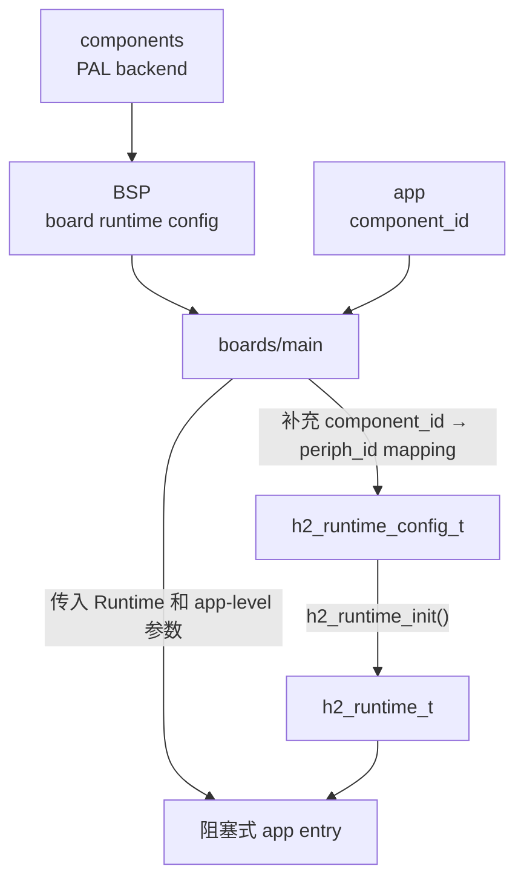
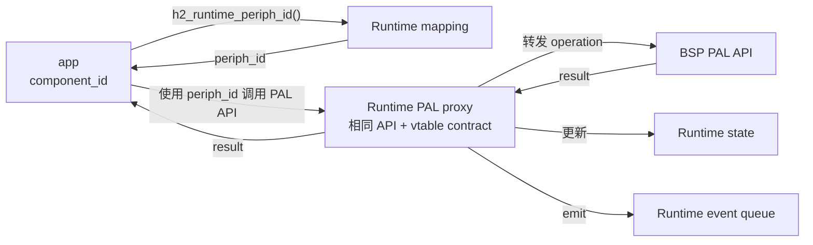
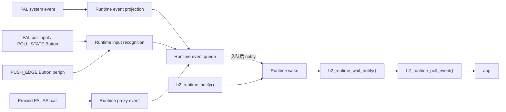

# Runtime

Runtime 是提供给 app 使用的跨平台运行时。它聚合当前 board 可用的 PAL API，并在 PAL 之上提供 component mapping、runtime event、runtime state 和 input processing 等 app-facing 能力。

App 只依赖 `h2_runtime_t` 和 Runtime public API，不需要知道具体 board、BSP、芯片 SDK 或 PAL backend。

Runtime Public API 见 [API Reference](/references/runtime)。

## 初始化与接线

运行 Runtime 的 BSP 提供 board runtime config，`boards/main` 提供 app `component_id` 到 board `periph_id` 的 mapping。`boards/main` 组合完整的 `h2_runtime_config_t`、调用 `h2_runtime_init()`，再把初始化完成的 `h2_runtime_t *` 作为必需参数传给阻塞式 app entry。App entry 还可以接收该 app public contract 定义的 config 或其他 app-level 参数。

App 只消费 runtime，不接触 runtime init config，也不负责 runtime init/deinit。



Runtime 的生命周期属于 `boards/main`：

1. BSP 完成 board 和 PAL backend 初始化。
2. `boards/main` 取得 board runtime config，并补充当前 app 的 mapping。
3. `boards/main` 调用 `h2_runtime_init()`。
4. `boards/main` 校验 required component，再调用 `h2_runtime_input_start()` 启动 input acquisition。
5. `boards/main` 将 runtime instance 和 app public contract 要求的其他参数传给 app entry。
6. App 返回后，`boards/main` 调用 `h2_runtime_deinit()`，再执行平台退出、等待或重启策略。

`h2_runtime_init()` 组装 Runtime 自身：component mapping、event queue、system event
subscription、private allocation，以及 input 侧全部一次性的部分——input writer
mutex、state publication 和 input source table。这三样都由不可变的 component mapping
与 board periph inventory 推导而来，因此只建一次，跨越之后每一次 poller 开关都保持有效。
Mapping 里没有任何 input component 时三样都不创建，Sync、Periph 和 Time 也不会被用到，
headless 与 capability-only image 因此仍可在绑定 unsupported provider 的板子上初始化。

`h2_runtime_init()` 不启动 poller，也不接收 poll config；采集由 launcher 通过
`h2_runtime_input_start()` 显式开启，详见
[Input Writer 与只读 Snapshot](#input-writer-与只读-snapshot)。需要 Button、NFC、IMU
或 sensor 的 image 必须调用它，否则不产生任何 input event。

Runtime 只拥有自己创建的 state。`h2_runtime_init()` 失败时，Runtime 先释放已经创建的
queue、subscription、mapping 和 allocation，再返回错误码；它不回调 caller，也不释放
config 中 borrowed 的 provider、filesystem 或 network state。这些 borrowed dependency
始终由创建它们的 launcher 负责：成功路径先调用 `h2_runtime_deinit()` 再释放 BSP/provider，
失败路径由 launcher 在 `h2_runtime_init()` 返回错误后自行调用对应 board 的
runtime deinit（例如 `h2_esp_board_runtime_deinit()` 或
`h2_bk7258_board_runtime_deinit()`）。失败后立即 abort、reboot 到 Loader 或让 image
永久停机的 launcher 不需要额外 teardown。

Board 可以在 `h2_runtime_config_t` 中按 image 的实际规模选择三项初始化期
容量：`input_source_capacity`、`component_mapping_capacity` 和
`event_payload_capacity`。前两项为 `0` 时分别使用 `32`，payload 为 `0` 时使用
固定 public upper bound `H2_RUNTIME_EVENT_PAYLOAD_MAX`（640 B）。非零 payload
容量必须不小于当前 target ABI 下最大的 Runtime system-event schema，且不能超过
640 B；非法容量或布局溢出在订阅 event、创建 task 之前返回
`H2_PAL_ERR_INVALID_ARG`。

Runtime 使用 Memory PAL 为 private state、mapping、input source、pending input
event 和三个 state snapshot slot 创建一个对齐的 allocation。Event queue item 只保存
metadata header 加当前 instance 选择的 payload 容量；这不会改变 App receive
contract，`poll/wait` 仍要求 caller 提供至少 640 B 的 buffer，并在 buffer 不足时
保持队首事件不出队。Runtime 只为 mapper 实际列出的 entry 调用 Periph PAL
`get()`，不复制完整 Board periph inventory；只有实际接受的 mapping 或 mapped
input source 超出所选容量时才返回 `H2_PAL_ERR_NO_SPACE`。

## Component Mapper

Runtime 通过 `h2_runtime_config_t.component_mapper` 接收 `boards/main` 提供的 mapper API。Mapper 使用与 PAL 相同的 `user + vtable` 形态：

```c
typedef struct h2_runtime_component_mapper_vtable {
    h2_pal_result_t (*list)(
        void *user,
        h2_runtime_component_t component_filter,
        h2_runtime_component_mapping_cb_t cb,
        void *cb_user);
    h2_pal_result_t (*get_periph_id)(
        void *user,
        h2_runtime_component_id_t component_id,
        h2_pal_periph_id_t *out_periph_id);
} h2_runtime_component_mapper_vtable_t;

typedef struct h2_runtime_component_mapper {
    void *user;
    const h2_runtime_component_mapper_vtable_t *vtable;
} h2_runtime_component_mapper_t;
```

每个 `boards/main` 在自己的 config header 中定义 mapping entries、mapper context、vtable 和 API object。App public header 提供稳定 `component_id`，BSP public header 提供当前 board 的 `periph_id`；入口同时 include 两边的 header，构造 mapper 后交给 Runtime。Mapper 只需要在 `h2_runtime_init()` 调用期间有效。Display、Touch 和 Audio System 已经是 `h2_runtime_t` 上的单例 PAL capability，不注册 component ID，也不进入 component mapper；App 或 Lua module 直接使用对应 API object。

App public contract 定义固定的 required component 集合。每个运行该 app 的 `boards/main` 必须注册全部 required `component_id`；缺少任一 mapping 表示该 board/image 不满足 app contract。Runtime 初始化只校验 mapper 实际列出的 entries，不持有 required component 集合。因此 launcher 必须在初始化后、调用 app entry 前，对每个 required ID 调用 `h2_runtime_component_get()` 校验 kind，并调用 `h2_runtime_periph_id()` 校验物理映射。任一必需查询失败都必须释放 Runtime 并终止启动。单例 PAL capability 的可用性由其 API contract 校验，不为通过 component 检查而发明 ID。

只有 app 定义了需要映射到物理 periph 的 component 时，`boards/main` 才需要提供 mapper。App contract 没有这类 `component_id` 时，完整 config 可以把 `component_mapper` 设为 `NULL`；Runtime 将建立空的 internal map。`NULL` mapper 不能用于省略 required component，入口也不能为了填充 config 而发明 app contract 中不存在的 component ID。

`h2_runtime_init()` 消费 mapper 提供的 mapping entries。每个 entry 必须包含非零 `periph_id`，并通过 PAL periph API 的 `get()` 查询实际外设、校验 component/periph 类型。所有 entry 都缓存 `{component_id, kind, periph_id}`；重复 component ID 或重复 periph ID 使初始化返回 `H2_PAL_ERR_INVALID_ARG`。Board 中未被 mapper 引用的外设不会产生 Runtime 临时 inventory 或占用 mapping capacity。

Runtime-owned input acquisition、Runtime event/state 的 component identity、`h2_runtime_component_get()` 和 `h2_runtime_periph_id()` 都使用 internal map。`h2_runtime_component_get()` 返回公开的 `{component_id, kind}`；`h2_runtime_periph_id()` 对未知 ID 返回 `H2_PAL_ERR_NOT_FOUND`。初始化完成后 Runtime 不再依赖 mapper object，也不按 PAL periph 枚举顺序生成 app component ID。没有进入 mapper 的 board periph 不成为 app-visible component。

`BATTERY` 和 `TEMPERATURE_SENSOR` mapping 会成为 Runtime state-only input source；
Runtime 分别按 500 ms 和 1000 ms 默认 cadence 读取并发布只读 snapshot，不产生
event。`PWM_SWITCH`、`LED_STRIP` 等输出 component 仍只进入 internal map，不由
Runtime input task 自动操作。

## Runtime Identity

Runtime public contract 包含只读的 `board`、`target` 和 `chip` identity。负责运行 Runtime 的 BSP 在 runtime config 中提供这些字符串，`h2_runtime_init()` 将它们复制到 Runtime instance；字符串存储至少在 Runtime 生命周期内保持有效。

App 可以通过 Runtime 读取设备身份，但不因此依赖具体 board header 或芯片 SDK。H2Loader 等跨平台 app 使用这些字段生成设备和固件状态；identity 的来源和具体值仍由 BSP 与固件 launcher 决定。当前运行固件的版本则通过 `runtime->firmware_info` 和 `h2_pal_firmware_info_get_current()` 读取；该值必须由平台 provider 从固件内 metadata 返回，不能由 portable app 根据 Git checkout 或 package manifest 推导。

## Memory API

Runtime config 和 Runtime instance 使用 `const h2_pal_mem_api_t *mem` 表达内存能力。App 和 Library 通过 `h2_pal_mem_alloc()`、`h2_pal_mem_realloc()` 和 `h2_pal_mem_free()` wrapper 使用 `runtime->mem`，不使用 `h2_allocator_t`、`context` 或 `h2_allocator_*()`。

`mem` 与其他 PAL capability 一样由 BSP 初始化、由 Runtime proxy 后提供给 app。Allocation 返回的内存由调用方按对应 API contract 释放；Runtime 和 BSP 不因为暴露 mem API 而取得 Library 或 app allocation 的 ownership。

## PAL API Proxy

Runtime 不把 BSP 提供的原始 PAL API object pointer 直接交给 app。初始化时，Runtime 为每项 PAL capability 创建自己持有的 API object；app 只通过 runtime 中的 API object 调用 PAL capability。

Runtime 在 `h2_runtime_t` 中暴露的 `runtime->xxx_api` 都是与 PAL contract 同形的 proxy API object。App 仍然使用 PAL Public Header 提供的 `static inline h2_pal_xxx_*()` wrapper，把 `runtime->xxx_api` 作为第一个参数传入：

```c
h2_pal_result_t result = h2_pal_switch_set(
    runtime->switch_api,
    periph_id,
    state);
```

App 不直接调用 `runtime->xxx_api->vtable->operation(...)`，也不自己传递 `api->user`。PAL wrapper 负责检查 API object、vtable、operation pointer 和 public argument，然后在内部调用 `api->vtable->operation(api->user, ...)`。

包括 Wi-Fi STA/AP、Wi-Fi settings、BLE host、modem、display、video decoder、audio decoder 和 audio 在内的 capability 都由 BSP 初始化为 `xxx_api_t` API object，再放入 runtime config。它们不是 Runtime 持有的 state handle；对应运行状态由 backend 的 `api->user` 和 Runtime state 分别管理。

`runtime->video_decoder` 和 `runtime->audio_decoder` 是透明 PAL proxy。Runtime 复制 API object，不取得 decoder session 或 acquired frame 的 ownership，也不改变 frame 的 acquire/release contract。没有对应 decoder 的 board 必须在 config 中绑定 canonical unsupported API，不能传入 `NULL` 或省略 vtable operation。

`runtime->buzzer` 同样是透明 PAL proxy。Runtime 把 `h2_runtime_config_t.buzzer` 的 API object 按值复制到 private storage，再暴露稳定的 App-facing pointer；它不取得物理 provider、tone 或 PWM channel 的 ownership，也不实现 melody sequencing。Buzzer 是 complete capability surface 的必选 binding：真实支持它的 Board 绑定 provider，其余 Runtime owner 显式绑定 `h2_pal_unsupported_buzzer_api()`，传入 `NULL` 会使 Runtime 初始化失败。

BLE 使用一个 `ble_host` API。Runtime 提供对应的 BLE host proxy；同一个 host 可以同时执行 advertising 和 scan，也可以同时提供 GATT server 与 GATT client 能力，不按 peripheral/central role 拆成两个 API。

Runtime API object 与底层 PAL 使用相同的 API object 和 vtable contract，不改变 PAL operation 的参数、返回值或 `periph_id` 语义。没有定义 Runtime state/event 行为的 operation 使用透明绑定，保留底层 `user + vtable`；只有 contract 明确定义了 Runtime 行为的 operation 才使用 forwarding vtable，并在调用过程中加入：

1. 调用底层 PAL operation。
2. 根据调用参数和执行结果更新 Runtime state。
3. 在需要通知 app 时 emit Runtime event。
4. 将 PAL operation 的结果返回给调用方。

App 定义和持有稳定的 `component_id`。调用某个基于物理外设的 PAL operation 前，app 使用 `h2_runtime_periph_id()` 将 `component_id` 解析为当前 board 的 `periph_id`，再把该 `periph_id` 传给 Runtime PAL proxy：

```c
h2_pal_periph_id_t periph_id;
h2_pal_result_t rc = h2_runtime_periph_id(runtime, component_id, &periph_id);
if (rc != H2_PAL_OK) {
    return rc;
}

return h2_pal_switch_set(runtime->switch_api, periph_id, state);
```

因此 mapping 与 proxy 是两个连续但不同的职责：

- `h2_runtime_periph_id()` 负责 `component_id → periph_id`。
- PAL proxy 接收 `periph_id`，调用底层 PAL API，并处理 Runtime state 和 Runtime event。



这样，app 主动发起的硬件操作和 Runtime 对外提供的 state/event 保持在同一个调用路径中。例如某个 operation 成功、失败或改变 capability 状态时，proxy 可以同步保存新的 Runtime state，并按该 capability 的 Runtime event contract 产生事件。

底层 PAL API 仍由 BSP 提供并持有真实 backend；Runtime 持有 app-facing API object。存在 forwarding contract 时，该 object 负责调用转发以及 Runtime state/event 处理。App 不应绕过 Runtime 直接持有或调用底层 BSP PAL API，否则相应 Runtime state 和 event 无法保持一致。

## Runtime Event Loop

Runtime 使用一个有界 FIFO event queue 按序向 app 交付 Runtime event。Queue 在 `h2_runtime_init()` 时创建，容量由 `h2_runtime_config_t.event_queue_capacity` 指定；值为 `0` 时使用 `H2_RUNTIME_DEFAULT_EVENT_QUEUE_CAPACITY`。



Runtime event loop 的 producer 包括：

- PAL system event 经 Runtime 投影后产生的事件。
- Runtime-owned input acquisition 和 recognition 产生的事件。
- App/LVGL adapter 按 mapped `PUSH_EDGE` Button periph 注入的 raw down/up edge。
- 部分 proxied PAL API call 在调用过程中产生的事件。

Button App contract 只定义稳定的 `component_id`；launcher 的 component mapping 决定它连接哪个 Button periph。Single-button periph payload 用 `POLL_STATE` 或 `PUSH_EDGE` 描述交付模式：前者由 Runtime 调用 Button PAL 读取稳定状态，后者由拥有该 periph 的 adapter 调用 `h2_runtime_button_push_edge()` 投递 `DOWN`/`UP`。Push edge 先进入 bounded Runtime queue，再由 Input Poller 统一更新 Button state、snapshot 和 event queue；adapter 不直接写 Poller state，也不需要 input writer mutex。Poller 本身、显式 `poll_once`/sensor-only poll 和 test-control session 的 open/close 由 Runtime 私有的 input writer mutex 串行化，因此 test-control 切换 source 集合时不会与一次 poll 交错；snapshot 总是先于对应事件发布，reader 把全部 retired slot 都 pin 住时事件会延后到下一次成功发布之后。两种模式共用同一个 objective action pipeline，并发布相同的 button state 与 `BUTTON_DOWN`、`BUTTON_UP`、`BUTTON_ACTION`，所以 App 不知道来源是物理采样还是 UI widget。Runtime 不分类 short press、long press 等 gesture；App 只根据 action 的按下、释放和当前事件时间决定产品语义。Push API 接受 mapped `periph_id` 而不是 component ID，也不是通用 event 注入入口；unknown、unmapped、非 Button 或非 `PUSH_EDGE` periph 必须 fail closed，queue 满时返回 backpressure error。具体 adapter 还必须强制同一 Runtime/periph 只有一个 live producer。UI timer 没有 public producer；App 或 Library 自己的 completion 使用 `h2_runtime_post_custom_event()` 投递 custom event（见 Custom Event），具体 capability 也可以定义自己的 completion system event，例如 BLE server indication completion。App 不能 include private header 或调用 private `h2_runtime_emit_event()` 写入未定义的来源。

不是每个 proxied API call 都必须 emit event。只有该 operation 的 Runtime contract 定义了需要通知 app 的状态变化、执行结果或业务事实时，proxy 才向 queue 写入对应事件。

Runtime producer 先把 event metadata 和 payload 复制到 queue item 中。App 读取事件时，需要提供自己的 payload buffer；Runtime 从 queue 取出 event 后，再把 payload 复制到 app buffer。因此：

- Producer 的原始 payload 在入队返回后即可释放或复用。
- App 拥有传给 `poll/wait` 的 buffer。
- Event 出队后不引用 PAL callback 或 Runtime queue 内部内存。
- App buffer 容量必须至少为 `H2_RUNTIME_EVENT_PAYLOAD_MAX`；容量不足时返回 `H2_PAL_ERR_TRUNCATED`，且不会消费队首事件。

```c
uint8_t payload[H2_RUNTIME_EVENT_PAYLOAD_MAX];
h2_runtime_event_t event = {
    .payload = payload,
    .payload_capacity = sizeof(payload),
};

h2_pal_result_t rc = h2_runtime_wait_event(runtime, &event, 1000);
```

Main loop 只阻塞在一个地方：`h2_runtime_wait_notify()`。它等待的是一个二值的 wake，不是 event queue。每个 Runtime producer 在成功入队后给出这个 wake，Library 自己的 dispatch queue 用 `h2_runtime_notify()` 给出同一个 wake；两次 wait 之间不论来了多少个 wake 都只返回一次 `H2_PAL_OK`，loop 正在运行时到达的 wake 保留到下一次 wait。返回后 App 用 `h2_runtime_poll_event()` 把 queue 拉空，再 drain Library 的 dispatch queue，然后再次 wait：

```c
h2_pal_result_t rc = h2_runtime_wait_notify(runtime, 1000);
while (h2_runtime_poll_event(runtime, &event) == H2_PAL_OK) {
    handle(&event);
}
drain_library_dispatch_queues();
```

`h2_runtime_poll_event()` 不等待。`h2_runtime_wait_event()` 是 `wait_notify` 加一次 `poll_event` 的便捷包装：queue 里有 event 就返回它；被一个没有对应 event 的 wake 叫醒时（Library 的 `notify`，或者更早的 poll 已经拉空 queue）在 timeout 之前就以 `H2_PAL_ERR_TIMEOUT` 返回，调用方不能把 `TIMEOUT` 当作时间流逝的依据。Event queue 满时丢弃新事件并增加 internal dropped-event counter，不阻塞 producer，也不给出 wake；该 counter 是 Runtime private state，不属于 Public API。

## Event Type

所有事件都使用同一个 `h2_runtime_event_t` envelope：

```c
typedef struct h2_runtime_event {
    h2_runtime_event_kind_t kind;
    h2_runtime_component_t component;
    h2_runtime_component_id_t component_id;
    h2_runtime_sequence_t sequence;
    h2_runtime_timestamp_ms_t timestamp_ms;
    void *payload;
    size_t payload_capacity;
    size_t payload_size;
} h2_runtime_event_t;
```

事件类型由 `component + component_id + kind` 共同确定。`kind` 使用统一的 `h2_runtime_event_kind_t` enum，不使用无类型约束的整数：

- `component` 表示事件属于哪类 Runtime component。
- `component_id` 标识 app 定义的具体 component instance；component event 必须携带非零 id。
- `kind` 是具体事件类型。System Event 使用 `H2_RUNTIME_SYSTEM_EVENT_*`，Component Event 使用 `H2_RUNTIME_COMPONENT_EVENT_*`。
- `sequence` 是 Runtime 生成的事件序号。
- `timestamp_ms` 使用 Runtime monotonic time。
- `payload` 和 `payload_size` 表示该 kind 对应的 Runtime-owned payload schema。

### System Event

BLE server indication 是同步 final-result operation，不通过 System Event
投影 completion。Runtime 只投影 connect/disconnect、scan report、订阅变化、GATT
access 等无法作为调用返回值表达的 unsolicited fact；它不保存 indication ID，也不
推断或伪造 peer confirmation。

Netif provider 的 `NETIF_DEFAULT_CHANGED` 投影为
`H2_RUNTIME_COMPONENT_SYSTEM_NETIF` /
`H2_RUNTIME_SYSTEM_EVENT_NETIF_DEFAULT_CHANGED`。Runtime 定义并复制自己的
previous/current schema，只暴露 kind、NAME/ID 有效位和两侧有效位，不把 PAL
struct 直接泄漏给 App。事件 sequence 和 monotonic timestamp 由 Runtime 在
投影时生成；provider timestamp 不作为 App event timestamp。

Runtime 停止 System Event 时先让 provider deinit 并 join/drain 私有 monitor，
再完成订阅清理，因此返回后不能再有 route worker callback 进入 Runtime。

System event 来源于 PAL system event。Runtime 在初始化时订阅支持的 PAL event，将 PAL event type、payload 和平台枚举转换为 Runtime 自有的 schema，再写入统一 queue。

System event callback 直接把每种 PAL payload 投影到 queued event 的对应
Runtime schema union member，再调用 private enqueue helper。实现不能先写入无类型
byte storage 后再转换为 struct，也不能为同一事件额外创建第二个最大 payload
对象；这样既保证 union member 的类型、对齐和 strict-aliasing contract，也避免在
callback 栈上重复保留最大 payload storage。Public emit API 及 App 读取 contract
不受该 private enqueue path 影响。

System component family 包括：

```text
H2_RUNTIME_COMPONENT_SYSTEM_GPIO_IRQ
H2_RUNTIME_COMPONENT_SYSTEM_WIFI
H2_RUNTIME_COMPONENT_SYSTEM_BLE
H2_RUNTIME_COMPONENT_SYSTEM_MODEM
```

它们的 `kind` 使用统一 `h2_runtime_event_kind_t` 中的 `H2_RUNTIME_SYSTEM_EVENT_*` 值，payload 使用 `h2_runtime_system_event_*_t`。App 消费的是 Runtime-owned event type，不直接依赖 `h2_pal_system_event_t`，也不需要再次调用转换函数。

```text
PAL system-event callback
→ Runtime 映射 component、kind 和 payload
→ 复制进入 Runtime event queue
→ h2_runtime_poll_event() / h2_runtime_wait_event()
→ App 根据 component 和 kind 解释 payload
```

### Component Event

Component event 表示某个 app-facing component 产生的事件。它既可以来自 Runtime polling 和 recognition，也可以由 PAL proxy 在 app 调用 capability 的过程中产生，因此不只表示输入事件。

Component family 包括：

```text
H2_RUNTIME_COMPONENT_BUTTON
H2_RUNTIME_COMPONENT_NFC_READER
H2_RUNTIME_COMPONENT_IMU
```

它们的 `kind` 使用统一 `h2_runtime_event_kind_t` 中的 `H2_RUNTIME_COMPONENT_EVENT_*` 值。每次到达 Button source 的 poll deadline，按下状态都会产生一个 `H2_RUNTIME_COMPONENT_EVENT_BUTTON_DOWN` sample 和一个 `H2_RUNTIME_COMPONENT_EVENT_BUTTON_ACTION`；松开时先产生 `BUTTON_UP`，再产生最后一个 `BUTTON_ACTION`。Action payload 只有 `pressed_at_ms` 和 `released_at_ms`：按住期间后者为 0，松开那次等于该 action 的事件时间。Action cadence 就是该 source 的 poll cadence，默认 20 ms，没有额外的 100 ms timer。App 可以用 `event.timestamp_ms == pressed_at_ms` 识别首次 sample，用 `released_at_ms == 0` 识别仍在按住，用非零释放时间识别松开，并自行计算时长、长按或连续点击。Button state snapshot 只保存当前 pressed 状态及其时间，不保存 gesture 或点击分类。某个 proxied PAL API call 也可以按对应 component contract emit component event。

Component event 必须携带 app-facing `component_id`，使同一 app 在不同 board 上可以用稳定 identity 消费事件。

### Custom Event

Custom event 是 App 或 Library 自己拥有的事件，用 `h2_runtime_post_custom_event()` 投递，`kind` 固定为 `H2_RUNTIME_EVENT_CUSTOM`，`component` 固定为 `H2_RUNTIME_COMPONENT_APP`。它使后台 Task 在完成工作后可以直接唤醒消费 Runtime queue 的 main loop，而不必额外轮询 completion 状态。

```c
typedef struct h106_job_completion_event {
    uint32_t job_id;
    uint32_t generation;
    h2_pal_result_t result;
} h106_job_completion_event_t;

#define H106_EVENT_JOB_COMPLETED H2_RUNTIME_CUSTOM_EVENT_ID(H106_EVENT_OWNER, 1u)

const h106_job_completion_event_t completion = { job_id, generation, result };
const h2_runtime_custom_event_t event = {
    .id = H106_EVENT_JOB_COMPLETED,
    .payload = &completion,
    .payload_size = sizeof(completion),
};
h2_pal_result_t rc = h2_runtime_post_custom_event(runtime, &event);
```

只需要叫醒 main loop、不需要携带 payload 的 Library（例如持有自己有界 dispatch queue 的 `h2_gizclaw_service_t`）不投递 custom event，而是调用 `h2_runtime_notify()`：它不占 event queue 的位置，不会因为 queue 满而失败，重复调用合并成一次 wake；main loop 在每次 wake 之后 drain 该 Library 的 dispatch queue。

消费端仍然只使用 `h2_runtime_poll_event()` 和 `h2_runtime_wait_notify()` / `h2_runtime_wait_event()`：

```c
if (event.kind == H2_RUNTIME_EVENT_CUSTOM) {
    const h2_runtime_custom_event_payload_t *custom = event.payload;

    switch (custom->id) {
    case H106_EVENT_JOB_COMPLETED:
        /* 在 main loop 中 dispatch completion */
        break;
    }
}
```

契约：

- 投递可以来自任意 Task，并且立即唤醒正在 `h2_runtime_wait_event()` 中等待的消费者。
- Runtime 把 payload 复制进 queue，调用方返回后可以立即复用自己的缓冲区。
- Payload 上限是 `h2_runtime_custom_event_payload_capacity()`（默认 `H2_RUNTIME_CUSTOM_EVENT_PAYLOAD_MAX`，随 `event_payload_capacity` 收缩）；超限返回 `H2_PAL_ERR_TRUNCATED`。
- `h2_runtime_post_custom_event()` 不阻塞；`h2_runtime_post_custom_event_timeout()` 接受有限超时，`H2_PAL_QUEUE_WAIT_FOREVER` 被拒绝。
- Queue 满时返回 `H2_PAL_ERR_FULL`（或有限超时下的 `H2_PAL_ERR_TIMEOUT`），不会像 Runtime 自己的 producer 那样静默丢弃。
- Custom event 之间保持 FIFO，并与已入队的 system/component event 共享同一顺序。
- Runtime 不解释 `id` 和 payload；建议用 `H2_RUNTIME_CUSTOM_EVENT_ID(owner, event)` 携带 owner namespace 以避免不同 Library/App 的 ID 冲突。
- Payload 只携带值。不要投递裸 callback、Task handle 或生命周期不明确的临时指针；投递 `job_id + generation + result` 这类身份信息，由消费端在 main loop 中解析对象，这样页面退出、Job 被取消或迟到的 completion 都不会解引用已释放的对象。
- `h2_runtime_deinit()` 先关闭 event queue，再无期限等待所有已进入的投递返回，然后才销毁 queue。该等待一定结束：一次投递只在一次 queue send 期间占用名额，而 send 的超时是有限的。调用方仍然负责保证 deinit 开始之后不再发起新的投递。

## Component State

Runtime 为 app-facing component 保存组件状态。状态可以由 PAL proxy 调用更新，也可以由 polling、recognition 或 PAL system event processing 更新。

App 通过 `h2_runtime_component_state_*()` 读取指定 component 的状态副本。组件状态使用 `component_id` 标识 app component，不向 app 暴露底层 backend 的内部状态对象。

```text
Proxied PAL API call ─┐
Input recognition ───┼─→ update component state
PAL event processing ┘

app → h2_runtime_component_state_*() → component state copy
```

Component event 和 component state 表达不同的信息：event 是按发生顺序进入 queue 的事实通知，state 是 Runtime 当前保存的最新组件状态。App 可以通过 event 驱动业务流程，也可以读取 state 获取当前快照。

### Input Writer 与只读 Snapshot

Runtime 拥有 input task，但 poller 的开关属于 launcher：`h2_runtime_input_start()` 和 `h2_runtime_input_stop()` 是 `h2_runtime_input.h` 中一对公开、对称、可重复的 API。**它们只开关 poller，不碰 component state。** `h2_runtime_init()` 不启动 poller，也不接收 poll config；launcher 在校验 required component 之后显式调用 `start`，并可以在 Runtime 保持初始化的前提下随时 `stop`、之后再 `start`（例如充电态的逻辑关机在设备仍然供电时停止采集，再恢复）。

`start` 做三件事：按传入的 `h2_runtime_input_poll_config_t` 选定 cadence 与 task policy（`NULL` 表示全部使用 Runtime 默认值）、强制采一帧并发布 snapshot、启动 private input task（有 mapped NFC reader 时再启动 NFC task）。source table 已在 init 建好，`start` 不重复发现。`stop` 只做一件事：请求停止并 join 这两个 task。每个 source 使用自己的 deadline；默认 Button 20 ms、Battery 500 ms、Temperature 1000 ms；board-specific cadence 由对应 BSP 通过自己的 poll config accessor 提供，不进入 App config。

state 与 poller 无关：从 `h2_runtime_init()` 到 `h2_runtime_deinit()` 全程可读。poller 停止期间 `h2_runtime_component_state_*()` 继续返回最后一次成功发布的 snapshot，配套的 `updated_at_ms` 说明它有多旧，`result` 说明那次读取的结果。Runtime 不在 stop 时把 state 清零：零是合法读数，`percent_x100 = 0` 与真的没电、`pressed = false` 与真的没按下无法区分，清零等于用假数据覆盖真数据。reader 需要判断新鲜度时使用 `updated_at_ms`。

同理，`start` 不重置 Button action 状态，`stop` 也不丢弃已经入队但尚未消费的 push edge——它们都属于 state，不属于 poller。poller 关闭期间松开按键时 Runtime 看不到那个边沿，恢复后的第一帧会补发 `BUTTON_UP` 与 released `BUTTON_ACTION`，而 `pressed_at_ms` 仍是关闭之前那次按下的时间戳，因此调用方算出的按压时长会横跨整个关闭区间。需要忽略恢复后的第一个 action 时由调用方自行判断。

Battery 与 Temperature 通过 `h2_runtime_component_state_battery()` 和 `h2_runtime_component_state_temperature()` 返回最近一次完成的读数及 PAL result。`PUSH_EDGE` Button 不调用 Button PAL read；拥有 mapped periph 的 LVGL adapter 调用 `h2_runtime_button_push_edge()` 写入 raw edge，Runtime input task 继续按 Button poll cadence 发布 action。

每个 mapped input component 只允许一种 delivery mode：`POLL_STATE` 由 Runtime input task 读取，`PUSH_EDGE` 由该 component 唯一的 push producer 经 bounded queue 投递；两者都由 Input Poller 在 Runtime 私有的 input writer mutex 下更新 working state。拥有 `PUSH_EDGE` producer 的 target 必须先停止 producer，再调用 `h2_runtime_input_stop()` 或 `h2_runtime_deinit()`；Runtime 随后请求 input task 与 NFC task 停止并 join。input writer mutex、state publication 和 source table 由 `h2_runtime_deinit()` 释放，不由 `stop` 释放。source 发现失败属于配置错误，由 `h2_runtime_init()` 报告；首帧采集或 task 启动失败让 `start` 失败并把 poller 留在停止状态，init 期建立的那三样不受影响，launcher 可以在原因消除后重试 `start`。物理采集的 debounce 仍属于提供读数的 component/provider；Runtime 只识别已经稳定的 PAL reading，不按 board 或 GPIO 类型加入 debounce。

Lifecycle 的合法调用如下，其余情况一律 fail closed：

| 调用 | 条件 | 结果 |
| --- | --- | --- |
| `start` | 已停止，没有 mapped input source | `H2_PAL_OK`，不创建 task |
| `start` | 已停止，有 mapped input source | 采一帧并启动 task |
| `start` | poller 已在运行，或 start/stop 进行中 | `H2_PAL_ERR_INVALID_STATE` |
| `start` | 已 latch worker fault | `H2_PAL_ERR_INVALID_STATE` |
| `start` | Test Control session 打开期间 | `H2_PAL_ERR_INVALID_STATE` |
| `stop` | 已停止 | `H2_PAL_OK`（幂等） |
| `stop` | poller 正在运行或已 fault | 停止并 join task，返回 latch 的 worker result |
| `stop` | start/stop 进行中 | `H2_PAL_ERR_INVALID_STATE` |

`stop` 在 Test Control session 打开期间是允许的：它只停 task，不碰 session 拥有的
source table 与 publication。`start` 则必须拒绝，否则 poller 会和 test source table
竞争。两者刻意不对称。

后台采集失败会保存 worker result、把 input phase 置为 faulted，并关闭 Runtime event queue，使阻塞的 App consumer 被唤醒。Queue close 是终态：PAL queue contract 没有 reopen，重启采集只会得到一个仍在采样却无法投递事件的 Runtime。因此 worker result 同时作为 fault latch，fault 之后 `stop` 返回该 result 并报告失败原因，随后的 `start` 返回 `H2_PAL_ERR_INVALID_STATE`；唯一的恢复路径是 `h2_runtime_deinit()` 后重新 `h2_runtime_init()`。

Test Control session 在打开期间独占 source table。它在 open 时作废 production source table，并在 close 之后留待下一次采集惰性重新发现，因此 close 之后的第一次 `start` 或 poll 会重建 production source。这是 init 之外唯一一次重新发现的路径。

### State Publication

App 读取的 component state 来自 `h2_runtime_state.c` 拥有的 state publication，它与产生 state 的 writer 分离：Input Poller 只是第一个 writer，今后由 proxied API 或其他 Runtime 路径修改的 component/system state 走同一条发布路径，不再各自维护 snapshot。Runtime 保存三个固定 snapshot slot；writer 与 reader 之间不使用 mutex 或 condition：

- writer 在自己的 working state 上完成 PAL I/O、recognition 和 state update；只有 public state 发生有效变化时才标记 dirty。
- 发布时 writer 选择一个非 active 且 reader count 为零的 slot，由 writer 提供的 fill 回调复制完整 working state，然后用 release store 原子切换 active index。
- Getter 用 acquire load 读取 active index，增加该 slot 的 reader count，再复查 active index；复查成功后读取 immutable snapshot，完成后减少 reader count。Getter 不等待 writer，也不取得任何 snapshot mutex。
- 如果两个非 active slot 都仍被 reader 持有，发布延后到 writer 的下一个周期，不阻塞 writer，也不覆盖 reader 正在读取的数据。
- 产生 event 的 state 变化总是先发布 snapshot 再 enqueue event；全部 retired slot 都被 pin 住时 event 一并延后，保证 App dequeue 到的 event 不领先于 component-state API。
- 不产生 event 的 state 变化（sensor 读数、按住不放时的 `updated_at_ms`）按发布节拍合并：默认 `H2_RUNTIME_STATE_PUBLISH_INTERVAL_MS`（40 ms），由 target 在 `h2_runtime_config_t.state.publish_interval_ms` 覆盖（它属于 init config 而不是 `h2_runtime_input_poll_config_t`：它不是 poll interval，只限制无事件状态对 reader 可见的最大延迟）。
- 每次 input start 的首帧与 Test Control 的显式 publish 不等待节拍，立即发布完整 snapshot。

Input task 的一次 tick 按各 source deadline 处理到期的 mapped input。相同 radio group 只执行一次 PAL read，再把结果投影到各 child。没有 public state update 时不 copy、不 switch；该路径在 source discovery 完成后不做 per-tick allocation。

Event payload 表达发生时的历史事实，snapshot 表达最近一次完成的 publication。Queue full 或 timeout 继续使用 drop-newest policy；已经更新的 working state 与后续 publication 不回滚。

State getter 返回 caller-owned copy，不承诺反映仍在进行的 input tick。Slow PAL operation 期间 reader 得到 previous completed publication；`updated_at_ms` 表达对应 source 最近完成的更新时间。每次 start 的 successful first pass 发布完整 snapshot；state 保留到下一次发布、Test Control 切换或 Runtime deinit，`h2_runtime_input_stop()` 不清除它。已经排队的 event 独立于当前 snapshot，consumer 使用 event payload 解释历史事件。

存在 mapped input component 时，Sync 与 Periph provider 不完整会让 `h2_runtime_init()` 失败；Task 与 Time provider 不完整则让 `h2_runtime_input_start()` 失败。没有 mapped input component 时这四个 provider 都不被 input 路径使用。State reader 可以与唯一 writer 并发；publication 路径不创建 condition，也不存在由 reader 引起的 writer wait。

## Test Control

`libs/runtime/include/h2_runtime_test.h` 提供 Host 和后续 device-agent 共用的
Runtime-owned test control。它只注入 Runtime 已经识别的 public event 和
component state：

```c
h2_runtime_test_control_t *control = NULL;
h2_pal_result_t rc =
    h2_runtime_test_control_open(runtime, &control);
if (rc == H2_PAL_OK) {
    rc = h2_runtime_test_button_action(
        control, button_component_id, 100u, 140u);
}
h2_runtime_test_control_close(control);
```

打开 control 时，Runtime 在 private writer boundary 暂停 input task，清空已经排队的
production input event、尚未消费的 push edge 和 source cache，并建立独占的 test
input writer session。Control 打开期间 test source table 是权威的：Runtime input
task 与 sensor-only poll 都不重新发现物理 source，也不读取由 Test Control 接管的
Button、NFC 和 IMU；Battery 与 Temperature 仍可通过
`h2_runtime_test_poll_sensors()` 刷新真实 state-only snapshot。关闭 control 后保留
空的只读 snapshot；下一次 input tick 重新发现物理 source，期间遗留的 unknown push
edge 被丢弃而不是让 input worker fault。

Control 使用本节定义的 production event queue、component mapping、sequence、
snapshot publication 和 drop/wakeup 行为，不建立 test-only shadow state。它校验
`kind + component + component_id + payload`，并在 component event 入队前发布
对应 state snapshot；malformed 或 unknown input 不会部分修改 Runtime。

Control 不属于普通 App public entry。App Test driver 持有它，并在注入完成后
只调用 App 的无 input production loop step。App 不能包含 test control、接收
test bytes 或绕过 Runtime 直接处理 input。完整接线见
[App Test](./app_test.md)。

## Lua event bridge

Lua Host 不消费 `h2_runtime_poll_event()` 或 `h2_runtime_wait_event()`。App 始终是
Runtime Event queue 的唯一消费者，并把允许脚本观察的复制事件与显式 `job_id`
交给 `h2_lua_dispatch_runtime_event()`。完整合同见 [Lua Runtime](./lua)。
