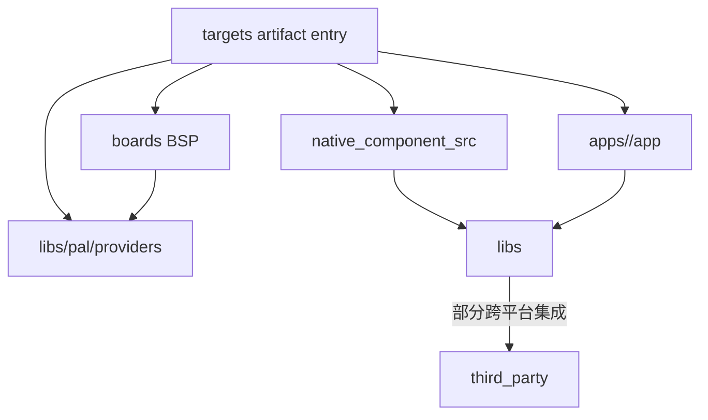
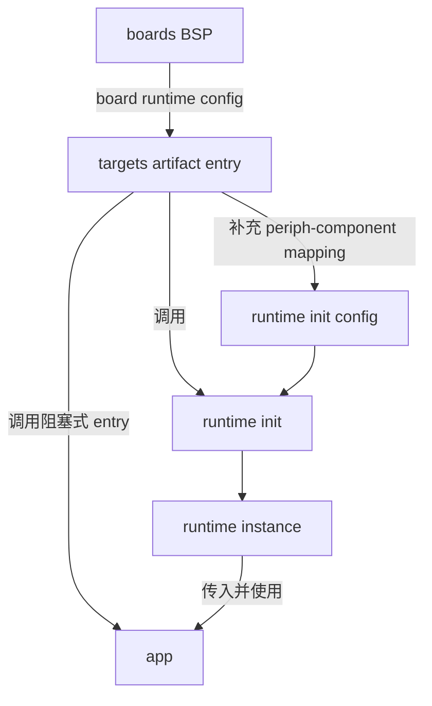

# 开发指引

## GizOS

GizOS 提供跨平台、跨 board 的固件开发代码和基础框架。它通过 app、library、native component source、board、BSP 和 target entry 之间的清晰边界，让同一套 app 代码可以适配不同的 board。

GizOS 还提供通用的固件管理和切换系统 H2Loader。H2Loader 使用统一的 loader image 和 app image 格式，负责 app 固件的安装、启动、切换、回退和调试，使跨平台 app 可以通过一致的流程运行在不同 board 上。

## 开发应用

- [使用 Runtime 开发固件](/zh/developing/app/runtime)：定义 app 固定的逻辑组件，并在固件入口映射 board 的物理外设。
- [使用 LVGL 开发固件](/zh/developing/app/lvgl)：直接使用 LVGL C API 和 subject 组织 app observable state、UI binding 和异步 effect。
- [H2Loader 项目结构](/apps/h2loader/project_structure)：源码目录、ownership 与依赖边界。
- [H2Loader 固件种类](/apps/h2loader/firmware_types)：Loader firmware、App firmware 与构建入口。
- [H2Loader 更新、启动与回退](/apps/h2loader/update/)：更新包总览、App 更新与 Loader self-upgrade。

## 核心概念

GizOS 项目由几个核心概念组成：`app` 表达跨平台业务逻辑；`targets` 保存 app 在具体 artifact 或 board 上的最终编译和组装入口；BSP 提供物理 board 的差异配置和 wiring；`native_component_src` 保存由原生 SDK build system 编译的 component source；`libs` 提供 Bazel library、PAL contract、runtime、平台实现和 third-party 跨平台集成；`third_party` 保存外部引入的上游代码。

可由 Bazel 直接编译的平台实现归 `libs/pal/providers`；必须读取最终 SDK config 或由原生 SDK build system 编译的源码归 `native_component_src`。Third-party 路线先由 `libs` 完成跨平台集成，再由这两类 owner 按实际编译边界接入目标平台。BSP 提供当前物理 board 的 GPIO、bus、address、channel、外设实例和 `periph_id` 等 wiring，最终 artifact 的 `targets` entry 同时知道具体 App 和具体 board，负责完整 Runtime 组装与生命周期。

App 基于跨平台 C 代码、`libs` 和 Runtime 实现业务逻辑。它通过 Runtime 操作显示、按键、音频、存储等硬件能力，并消费统一的 event 和 state，不直接依赖芯片 SDK、board wiring 或具体外设实现。这样，同一套 App 代码只需要由不同 `targets` entry 选择对应 BSP、平台实现和映射，就可以运行在不同平台和硬件上。

一组共同维护的 app 可以组成 project group。Project group 使用 `apps/` 保存各个 portable app，使用具名 `libs/<library>/` 保存组内 Bazel library，使用 `native_component_src/<platform-or-target>/` 保存组内专用且由原生 SDK 编译的 component source，并使用 `targets/<artifact-rule>/<app>[/<variant>]` 保存最终产物入口。Project root 不再使用 `components/` 作为 ownership root。H2Loader 就是一个 project group：Loader 固件、被 H2Loader 管理的 app、共用 library、H2Loader 专用 native component source 和具体 image entry 都组织在 `projects/h2loader/` 下。每个 H2Loader image 在 `targets/h2loader_tar_zlib/<image>/<board>/` 提供最终 `:package` target。

## 依赖关系

GizOS 的依赖方向从最终产物逐层指向可复用代码。`targets` entry 同时依赖 App、BSP、所需 Bazel library 与原生 component graph，并拥有当前 image 的 archive registration；BSP 只表达物理 board wiring 和外设组合；`libs/pal/providers` 提供 Bazel 平台实现，`native_component_src` 只提供原生 SDK source、Kconfig 与 registration lifecycle；部分 integration library 依赖 `third_party` 上游代码；App 只依赖跨平台的 `libs` 和 Runtime contract。反向依赖会把具体 board、芯片 SDK 或最终产物入口带入可复用层，破坏 App 和 library 的跨平台边界。



依赖关系是：

- `targets` entry 依赖 App、BSP、`libs/pal/providers` 与所需 `native_component_src` graph。
- `native_component_src` 可以依赖 `libs` 产生的 archive 或 public contract。
- App 只依赖跨平台 `libs` 和 Runtime contract。
- 部分 `libs` 依赖 `third_party` 完成跨平台集成。

## Runtime 组合关系

最终 `targets` entry 与运行 App Runtime 的 BSP 共同提供 Runtime init config。BSP 向 entry 提供 board runtime config，entry 补充 periph-component mapping、调用 `h2_runtime_init()`，再调用 `h2_runtime_input_start()` 启动 input acquisition，最后把获得的 Runtime instance 传给阻塞式 App entry。App 只消费 Runtime，不接触 init config，也不负责 Runtime init/deinit 或 input lifecycle。



组合关系是：

- BSP 向最终 artifact entry 提供 board runtime config。
- `targets` entry 补充 periph-component mapping，调用 `h2_runtime_init()`，再调用 `h2_runtime_input_start()`。
- `targets` entry 把 Runtime instance 传给阻塞式 App entry。
- App 只消费 runtime，并通过 runtime 实现业务逻辑。

## 定义

- [app](#definition-app)：跨平台业务代码，通过阻塞式入口消费 runtime。
- [targets](#definition-targets)：具体 App 与 artifact/board 的最终入口，负责构建配置、Runtime 组装和生命周期。
- [BSP](#definition-bsp)：提供物理 board 的 wiring、外设配置和 Runtime config。
- [native_component_src](#definition-native-component-src)：保存由原生 SDK build system 编译的 component source。
- [libs](#definition-libs)：提供跨平台库、PAL contract、runtime 和 third-party integration。
    - [PAL](#definition-pal)：定义跨平台能力 contract，不包含平台实现。
    - [runtime](#definition-runtime)：聚合 BSP capability 和 mapping，作为 app 的跨平台运行时。
- [third-party](#definition-thirdparty)：保存外部上游代码，由 libs 负责跨平台集成。

### app {#definition-app}

App 是跨平台的应用业务代码。它可以依赖 `libs` 中的跨平台库，定义 app-facing component 及其 `component_id`，通过 runtime 调用 API，并消费 component event 和 state。

App 提供一个阻塞式入口，由最终 artifact entry 传入已经初始化完成的 `h2_runtime_t *`。入口函数使用 `<app>_run` 命名，必须接收 Runtime，也可以接收该 App 自己定义的 stable public config 或其他 app-level 参数：

```c
int h2_example_run(h2_runtime_t *runtime, const h2_example_config_t *config);
```

返回 `0` 表示 App 正常结束，返回非 `0` 表示 App 失败。最终 artifact entry 根据返回值执行退出、重启或错误处理，然后释放 Runtime。

阻塞式入口表示 app 在返回前拥有当前执行流，不采用由 launcher 反复调用的 `init/tick/deinit` contract；它不要求所有 app 永久运行。长期运行的 app 持续等待退出条件，smoke app 可以同步完成验证后直接返回。

App 内部可以创建 task 承载复杂或并发的业务逻辑，主执行流负责等待退出条件。App 返回前必须停止并清理自己创建的 task；App entry 返回后，最终 artifact entry 才能释放 Runtime。

正式 app、smoke app 和 test app 都必须接收 Runtime。它们可以通过自己的 stable public config 接收 app-specific option、portable callback 或其他 app-level 参数；参数数量和类型由各 app public contract 决定，不要求所有 app 使用同一 config shape。BSP object、board-private type、SDK object 和原始 PAL backend 不能进入 app public entry。

App 必须提供稳定的 public API 供最终 artifact entry 调用。Public API 定义 App entry、返回值、config 和必要的 app-level 类型，不暴露 BSP config、board-private type、SDK object、原始 PAL backend、App 内部 task、状态对象或实现细节。Artifact entry 只依赖 App public header，不直接引用 App 的 private header 或源文件内部符号。

代码目录：

```text
projects/<app>/app/                       # 独立 app
projects/<group>/apps/<app>/app/          # project group 中的 app
  include/                                 # app public API
  src/                                     # app private implementation
```

例如 H2Loader project group 中的 app 位于 `projects/h2loader/apps/<app>/app/`，H2Loader Common 位于 `projects/h2loader/libs/h2loader/`。其他 project group 内多个 app 共用、但不适合提升为仓库级 `libs` 的代码，也按 `projects/<group>/libs/<library>/` 组织；只服务该 group、由原生 SDK 构建的 component source 放在 `projects/<group>/native_component_src/<platform-or-target>/<component>/`。

### targets {#definition-targets}

`targets/<artifact-rule>/<app>[/<variant>]` 表示某个 App 的最终产物入口。Firmware variant 可以同时知道具体 App 与 board，提供 `sdkconfig` 等构建配置；host/mobile variant 则拥有对应 lifecycle、package metadata 和 Runtime assembly。入口负责取得 BSP Runtime config、提供 periph-component mapping 并初始化 Runtime；入口代码必须保持薄，不承载可复用业务逻辑。

最终 artifact entry 负责完整的 App 启动和退出生命周期：

1. 完成 SDK 和平台要求的最小启动流程。
2. 从 BSP 获取 board runtime config。
3. 根据具体 app 和 board 提供 periph-component mapping。
4. 组合完整的 runtime init config，调用 `h2_runtime_init()`，并在校验 component 之后调用 `h2_runtime_input_start()`。
5. 将初始化完成的 `h2_runtime_t *` 和 app public contract 要求的其他参数传给阻塞式 app entry。
6. 等待 app entry 返回，处理退出或失败结果。
7. 调用 `h2_runtime_deinit()`，再执行平台要求的退出、重启或错误处理。

Artifact entry 只拥有具体产物的构建配置、SDK/platform startup、App/BSP wiring 和生命周期编排。可以跨 board、artifact 或 App 复用的逻辑必须放在 App、BSP、`libs` 或 `native_component_src` 的正确 owner 中。

Project group 中的固件入口目录：

```text
projects/<group>/targets/<artifact-rule>/<app>[/<variant>]/
```

例如 H2Loader 的 Loader image main 位于 `projects/h2loader/targets/h2loader_tar_zlib/loader/<board>/`，由 H2Loader 安装的 App image main 位于真实 App owner 的 `projects/<owner>/targets/h2loader_tar_zlib/<app>/<board>/`。

ESP app 的入口代码位于 `main/`，固件项目目录包含 `CMakeLists.txt` 和 `sdkconfig.defaults`。BK app 按 AP/CP 分别使用 `ap/` 和 `cp/` 入口，并在同一个 app 固件项目目录中提供 project config、partition 和其他构建配置。

### bsp {#definition-bsp}

BSP 是物理 board 的板级支持代码。它消费所需 PAL/platform contract，并负责当前 board 的 GPIO、bus、address、channel、外设实例、`periph_id` 和其他 wiring 差异配置。只有负责运行 App Runtime 的 chip 或 target BSP 才需要通过 periph API 描述 Runtime 可见的外设，并提供包含 board 能力的 Runtime config；辅助 chip/core 的 BSP 不需要提供 Runtime config。

BSP 必须提供稳定的 public API 供对应 artifact entry 调用。负责运行 App Runtime 的 BSP 对外提供由 `libs/runtime` 定义的 Runtime init config 结构，并负责填充当前 board 的 PAL capability、periph、board、target、chip 和 mem API 等配置；artifact entry 获取这份 config 后，再补充 App 与 board 相关的 periph-component mapping。辅助 chip/core 的 BSP 只暴露其职责所需的板级 API，不应为了目录对称而提供无法使用的 Runtime config。

BSP public API 可以具有类似下面的形态：

```c
h2_pal_result_t board_runtime_config(h2_runtime_config_t *out_config);
```

Config 中引用的 PAL object 和其他资源必须至少在 Runtime 生命周期内保持有效。GPIO wiring、驱动实例、SDK object 和其他实现细节保留在 BSP 内部；artifact entry 只依赖 BSP public header，不直接引用 BSP private header 或内部符号。

BSP 需要在物理 board 下面继续按 chip 或 target 拆分，因为同一个 board 可能包含多个 chip，或者一个 chip 内包含多个独立运行的核心。每个 chip 或核心都有自己的 SDK、启动入口、外设归属和板级适配代码，因此需要分别维护对应的板级支持；这些代码仍然归属于同一个物理 board 根目录。是否提供 runtime config 由该 chip/core 的运行角色决定，不要求所有 chip/core 对称提供 runtime。

例如：

- BK7258 board 包含 AP 和 CP 两个独立运行的核心。AP 负责运行 app runtime，因此 AP BSP 提供 runtime config；CP 无法运行 runtime，只提供 CP 职责所需的板级支持和服务。
- ESP32-P4 开发板同时包含 ESP32-P4 和 ESP32-C5 两个 MCU。两者分别维护各自需要的板级支持，但必须由 board 设计明确哪个 MCU 是 runtime owner，不能默认两个 MCU 都提供 runtime config。

代码目录：

```text
boards/<board>/<chip-or-target>/
  include/    # BSP public API
  src/        # BSP private implementation
```

### native_component_src {#definition-native-component-src}

`native_component_src` 保存必须由 ESP-IDF、BK7258、BK3633 等原生 SDK build system 编译的源码，以及把 Bazel archive 注册到原生 SDK graph 的薄 adapter。它不是 Bazel library root；能由 Bazel toolchain 直接编译的平台实现属于 `libs/pal/providers`。

代码目录：

```text
native_component_src/<platform-or-chip>/
```

### libs {#definition-libs}

Libs 是由 Bazel C/C++ graph 管理的具名可复用库。顶层 `libs/<library>` 提供 target-independent contract 与实现，`libs/pal/providers/<platform-or-sdk>` 提供由 Bazel 直接编译的平台实现或 build adapter；它们不包含 board wiring、最终 SDK config 或具体 artifact entry 逻辑。部分 library 负责集成 `third_party` 上游代码并实现 PAL contract，例如 MQTT 和 WebRTC。

代码目录：

```text
libs/<library>/
```

#### pal {#definition-pal}

PAL 是 Platform Abstraction Layer，定义 GizOS 的平台抽象接口。`libs/pal` 只定义跨平台 contract，不包含具体平台、芯片或 board 的实现；Bazel 平台实现位于 `libs/pal/providers`，原生 SDK source implementation 位于 `native_component_src`，board wiring 位于 BSP。

代码目录：

```text
libs/pal/
```

#### runtime {#definition-runtime}

Runtime 是 App 的跨平台运行时，也是 App 使用不同 board 能力的统一入口。`libs/runtime` 聚合 BSP 提供的 Runtime config 和最终 artifact entry 提供的 periph-component mapping，初始化并向 App 提供 Runtime instance。App 通过这个 instance 使用板级能力，并消费 Runtime event 和 state。

代码目录：

```text
libs/runtime/
```

### thirdparty {#definition-thirdparty}

Third-party 是外部引入的上游代码或依赖。这里保留上游来源、版本和本地修改边界，不用于定义 GizOS 自己的 App、native component 或 library contract。跨平台 third-party 能力先由 `libs` 集成，不由 App、BSP 或最终 artifact entry 直接依赖。

代码目录：

```text
third_party/
```

## 目录结构

完整的目录结构和 ownership 规则见 [目录结构](developing/repo_layout.md)。
