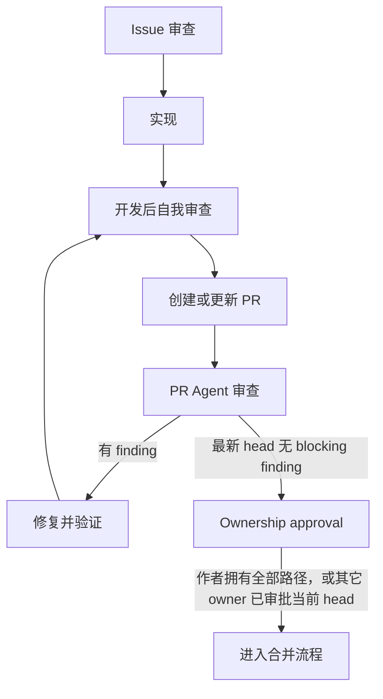

# 审查指引

GizOS 的审查分为三类，分别覆盖实现前、开发完成后和 Pull Request 阶段。三类审查使用同一套仓库 ownership、开发指引和代码风格，但审查对象、是否修复代码以及完成条件不同。

三类审查共用一份[审查项目](./review_items.md)。执行任何审查前，都需要根据审查对象找到适用文档，并逐条检查其中的项目。

## 审查类型

| 审查 | 时机 | 对象 | 主要结果 |
| --- | --- | --- | --- |
| [Issue 审查](./issue_review.md) | 编写 issue 或开始实现前 | GitHub issue | 规范 title、Issue Type、结构和关系，并确认目标、边界、ownership、验收和验证已足够明确 |
| [开发后自我审查](./self_review.md) | 开发完成后、提交 PR 前 | 本地 diff 或 branch | 循环 review、修复和验证，直到 fresh review 没有新的 negative finding |
| [PR Agent 审查](./pr_agent_review.md) | PR 创建或 head 更新后 | GitHub PR 的最新 head | 独立审查者留下可执行 finding；ownership gate 校验作者或审批者是否覆盖改动路径 |

## 工作流

Issue 编写和审查使用同一套 title、Issue Type、正文结构和 relationship contract；审查结果决定工作是否已具备实现条件。自我审查由开发者负责发现并修复问题。PR Agent 审查保持独立，只报告问题；修复后必须重新执行自我审查，并让 Agent 基于新的 PR head 再审查。

`Ownership approval` 是 merge eligibility Check，不提交 GitHub `APPROVE` review。PR 作者直接拥有所有改动路径时不需要伪造 self-approval；存在其它 owner 的路径时，每个路径必须由匹配的非作者 owner 审批当前 head。这个 gate 不替代 Agent review、build/test CI、review thread resolution 或其它 required check。

## 共同基线

所有审查都使用[审查项目](./review_items.md)作为共同基线：

- Issue 审查检查 issue 是否把这些项目定义清楚。
- 自我审查检查实际实现并直接修复发现的问题。
- PR Agent 审查独立检查最新 PR head，并留下有证据的 finding。

审查项目必须逐条检查；不适用的项目需要说明原因，不能直接忽略整组内容。
